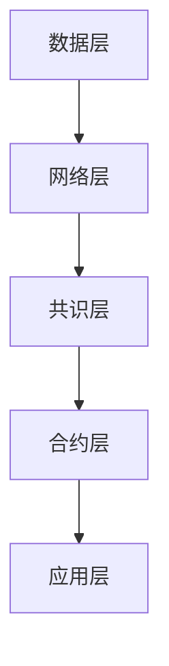
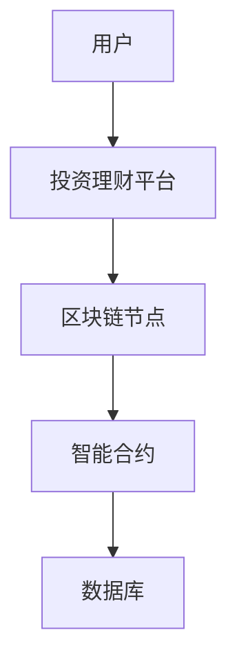

                 


# 区块链在投资理财中的应用与挑战

## 关键词：区块链、投资理财、智能合约、分布式账本、共识机制、去中心化金融（DeFi）

## 摘要：  
区块链技术作为一种分布式账本技术，正在逐步改变传统的投资理财方式。本文将深入探讨区块链在投资理财中的应用场景，包括股权投资、债券投资和基金投资，并分析其技术实现和挑战。通过结合实际案例，本文将展示区块链如何提升投资理财的透明度、安全性和效率，同时探讨其在实际应用中面临的挑战及解决方案。  

---

# 第一部分：区块链在投资理财中的背景与概念

## 第1章：区块链的基本概念

### 1.1 区块链的定义与特点  
区块链是一种分布式账本技术，通过去中心化的方式记录交易信息，并通过密码学确保数据的安全性和不可篡改性。其核心特点包括：  
1. **去中心化**：数据不由单一机构控制，而是分布在网络的多个节点上。  
2. **不可篡改性**：通过加密算法和共识机制，确保数据无法被篡改。  
3. **透明性**：所有交易记录公开透明，可追溯。  
4. **智能合约**：通过预定义的自动化程序执行交易和协议。  

### 1.2 投资理财的基本概念  
投资理财是指通过投资金融资产（如股票、债券、基金等）来实现财富增值的过程。传统投资理财依赖于中介机构（如银行、证券公司等），存在信息不对称、交易成本高、透明度低等问题。  

### 1.3 区块链如何改变投资理财模式  
区块链技术的应用可以解决传统投资理财中的痛点，例如：  
1. **降低交易成本**：通过去中心化平台，减少中介环节，降低交易费用。  
2. **提高透明度**：所有交易记录公开透明，投资者可以实时追踪资金流向。  
3. **增强安全性**：通过区块链技术，确保投资资金的安全性和交易的可追溯性。  

---

## 第2章：区块链的核心技术与原理  

### 2.1 分布式账本技术  
分布式账本是区块链的核心组成部分，所有交易记录在多个节点上，确保数据的冗余性和可靠性。  

#### 分布式账本的特点  
- **去中心化**：数据不由单一机构控制，避免单点故障。  
- **一致性**：所有节点上的数据保持一致。  
- **可扩展性**：通过技术优化，可以支持大规模交易。  

#### 区块链账本的结构  
区块链账本由多个区块组成，每个区块包含一定数量的交易记录，并通过哈希指针连接，形成一条链式结构。  

### 2.2 共识机制  
共识机制是区块链的核心技术之一，用于确保所有节点达成一致。  

#### 主流共识机制对比  
| 共识机制 | 特点 | 优缺点 |  
|----------|------|---------|  
| PoW（工作量证明） | 通过计算哈希函数确定记账权 | 安全性高，但能耗高 |  
| PoS（权益证明） | 根据持币数量分配记账权 | 能耗低，但存在“富者越富”风险 |  
| DPoS（ delegated证明） | 通过投票选举记账节点 | 效率高，但存在中心化风险 |  

#### 共识机制对投资理财的影响  
- 提高交易确认速度，降低延迟。  
- 降低交易成本，优化投资流程。  

### 2.3 智能合约  
智能合约是区块链上的自动化程序，用于自动执行协议。  

#### 智能合约的工作原理  
1. **部署**：智能合约部署在区块链上，成为不可篡改的程序。  
2. **触发条件**：当满足特定条件时，智能合约自动执行。  
3. **执行操作**：根据合约逻辑，自动完成资金划转、收益分配等操作。  

#### 智能合约在投资理财中的应用  
- **自动分配收益**：智能合约可以自动将投资收益分配给投资者。  
- **自动执行交易**：当达到特定条件时，智能合约可以自动执行买卖操作。  

---

## 第3章：区块链在投资理财中的应用场景  

### 3.1 股权投资  
区块链技术可以实现股权的透明化和去中心化管理。  

#### 应用案例  
- **股权融资平台**：投资者通过区块链平台购买公司股权，记录在区块链上，确保股权的透明性和不可篡改性。  
- **股权转让**：通过智能合约自动执行股权转让流程，确保交易的安全性和效率。  

### 3.2 债券投资  
区块链技术可以优化债券发行和交易流程。  

#### 应用案例  
- **债券发行**：通过区块链平台发行债券，记录在区块链上，确保债券的真实性和可追溯性。  
- **债券交易**：投资者可以在区块链上直接交易债券，降低交易成本和时间。  

### 3.3 基金投资  
区块链技术可以提升基金募集和管理的透明度。  

#### 应用案例  
- **基金募集**：通过区块链平台募集基金，记录投资者信息和投资金额，确保数据的真实性和透明性。  
- **基金分配**：通过智能合约自动分配投资收益，确保收益的公平性和透明性。  

---

## 第4章：区块链在投资理财中的技术实现  

### 4.1 区块链技术架构  
区块链技术架构包括以下几个部分：  
1. **数据层**：包括区块结构、交易记录等。  
2. **网络层**：包括节点通信、数据传输等。  
3. **共识层**：包括共识机制、交易确认等。  
4. **合约层**：包括智能合约的编写、部署和执行。  
5. **应用层**：包括投资理财平台的用户界面、交易流程等。  

#### 系统架构图（Mermaid）  


### 4.2 智能合约开发  
智能合约开发是区块链技术在投资理财中的关键环节。  

#### 智能合约开发流程  
1. **需求分析**：明确智能合约的功能需求。  
2. **编写代码**：使用Solidity等编程语言编写智能合约代码。  
3. **测试与调试**：在测试环境中测试智能合约的功能，并进行调试。  
4. **部署与运行**：将智能合约部署到区块链上，供投资者使用。  

#### 智能合约示例（Solidity代码）  
```solidity
// 投资收益分配合约
contract Investment {
    address payable[] public investors;
    
    function invest(uint amount) public payable {
        investors.push(msg.sender);
        // 将投资金额记录在区块链上
    }
    
    function distribute(uint amount) public {
        // 自动分配收益
        for (uint i = 0; i < investors.length; i++) {
            investors[i].transfer(amount * 1 / investors.length);
        }
    }
}
```

### 4.3 投资理财平台的系统设计  
投资理财平台的系统设计包括功能模块设计、系统架构设计、接口设计和交互设计。  

#### 功能模块设计  
- **用户模块**：包括用户注册、登录、个人信息管理等功能。  
- **投资模块**：包括投资产品展示、投资申请、投资记录查询等功能。  
- **收益模块**：包括收益计算、收益分配、收益提现等功能。  

#### 系统架构设计（Mermaid）  


---

## 第5章：区块链在投资理财中的挑战与解决方案  

### 5.1 技术挑战  
区块链技术在投资理财中的应用面临以下挑战：  
1. **性能瓶颈**：区块链的交易速度较慢，难以支持大规模投资理财交易。  
2. **安全性问题**：智能合约可能存在漏洞，导致资金损失。  
3. **监管合规性**：区块链投资理财平台需要符合金融监管要求。  

#### 解决方案  
1. **性能优化**：通过侧链、状态通道等技术提升交易速度。  
2. **安全性提升**：加强智能合约的审计和测试，减少漏洞。  
3. **合规性优化**：与监管机构合作，确保平台符合金融法规。  

### 5.2 未来展望  
随着技术的发展，区块链在投资理财中的应用前景广阔。未来，区块链技术将进一步优化投资理财的流程，降低交易成本，提升透明度和安全性。  

---

## 作者：AI天才研究院 & 禅与计算机程序设计艺术  

---

以上是《区块链在投资理财中的应用与挑战》的技术博客文章的详细内容，涵盖了区块链技术的基本概念、在投资理财中的应用场景、技术实现以及面临的挑战与解决方案。通过本文，读者可以全面了解区块链技术如何改变投资理财行业，并为未来的投资理财提供了新的思路和方向。

