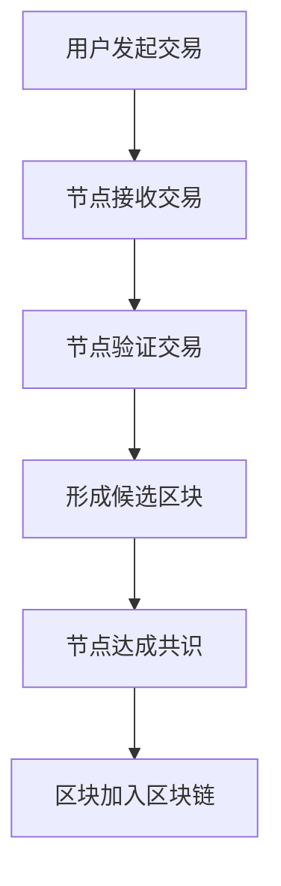
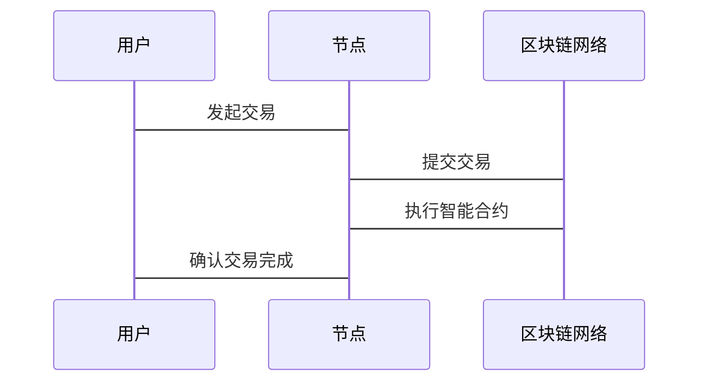

                 


# 区块链在跨境支付中的应用与挑战

> 关键词：区块链技术、跨境支付、去中心化、支付效率、支付安全、智能合约、监管合规

> 摘要：区块链技术作为一种颠覆性创新，正在逐步改变传统金融领域的运作方式。本文将深入探讨区块链在跨境支付中的应用与挑战，从技术原理、应用场景、实际案例、监管合规等多个维度进行详细分析，揭示区块链技术如何解决传统跨境支付中的痛点，并展望其未来发展趋势。

---

# 目录大纲

## 第一部分: 区块链与跨境支付的背景与基础

### 第1章: 区块链与跨境支付的背景介绍

#### 1.1 跨境支付的现状与问题

- 1.1.1 跨境支付的传统模式
  - 银行间清算系统（如SWIFT）
  - 支付流程中的多层中间机构
  - 费用高昂、效率低下的问题
- 1.1.2 跨境支付的主要问题
  - 跨境交易的延迟与复杂性
  - 中间机构的高成本
  - 账户验证与身份认证的复杂性
  - 数据不透明与信任问题
- 1.1.3 区块链技术如何解决这些问题
  - 通过去中心化实现端到端的透明支付
  - 降低交易成本与时间
  - 提高跨境支付的安全性与效率

#### 1.2 区块链的基本概念

- 1.2.1 区块链的定义与核心要素
  - 分布式账本：数据存储在多个节点，无单点故障
  - 共识机制：确保所有节点达成一致的交易记录
  - 加密技术：确保交易的安全性与隐私性
  - 智能合约：自动化执行的合同条款
- 1.2.2 区块链的分类与特点
  - 公有链、联盟链、私有链的对比
  - 区块链的可扩展性、去中心化程度、安全性对比
- 1.2.3 区块链的核心技术原理
  - 分布式账本的存储方式
  - 共识机制的实现方式（如PoW、PoS、BFT等）
  - 加密算法（如哈希函数）的原理

#### 1.3 区块链在金融领域的应用前景

- 1.3.1 区块链在金融领域的应用场景
  - 跨境支付与清算
  - 证券交易与结算
  - 供应链金融
- 1.3.2 区块链技术对金融行业的潜在影响
  - 提高效率，降低成本
  - 增强透明度与信任
  - 创新金融服务模式
- 1.3.3 跨境支付在区块链技术中的重要性
  - 区块链技术的核心应用场景之一
  - 跨境支付的痛点与区块链技术的天然契合

---

## 第2章: 区块链技术原理与核心概念

### 2.1 区块链的核心技术原理

#### 2.1.1 分布式账本

- 分布式账本的结构与存储方式
  - 每个节点都有一份完整的账本副本
  - 数据一致性通过共识机制实现
- 分布式账本的优势
  - 高可用性
  - 数据一致性
  - 抗单点故障

#### 2.1.2 共识机制

- 共识机制的种类与特点
  - 工作量证明（PoW）
  - 权益证明（PoS）
  - 肉币证明（BFT）
- 共识机制的核心作用
  - 确保所有节点达成一致的交易记录
  - 防止双重支付和恶意攻击

#### 2.1.3 加密技术

- 加密算法的作用
  - 数据完整性验证
  - 身份认证与权限管理
- 哈希函数的作用
  - 生成交易的唯一标识
  - 确保数据的不可篡改性

#### 2.1.4 智能合约

- 智能合约的定义与特点
  - 自动化执行的合同条款
  - 基于区块链的可编程性
- 智能合约的应用场景
  - 跨境支付的自动清算
  - 自动化金融衍生品的结算

### 2.2 区块链的核心概念与联系

#### 2.2.1 实体关系图（ER图）

```mermaid
erDiagram
    actor 用户 {
        string 用户ID
        string 账户余额
    }
    actor 节点 {
        string 节点ID
        string 交易记录
    }
    actor 区块链网络 {
        string 区块高度
        string 交易哈希
    }
    用户 --> 区块链网络 : 发起交易
    节点 --> 区块链网络 : 验证交易
```

#### 2.2.2 核心概念的联系与对比

| 概念 | 描述 | 作用 |
|------|------|------|
| 分布式账本 | 数据存储在多个节点，无单点故障 | 确保数据一致性与高可用性 |
| 共识机制 | 确保所有节点达成一致的交易记录 | 防止双重支付与恶意攻击 |
| 加密技术 | 确保数据安全与隐私 | 数据完整性与身份认证 |
| 智能合约 | 自动化执行的合同条款 | 实现业务逻辑的自动化 |

### 2.3 区块链技术的核心算法原理

#### 2.3.1 共识算法



#### 2.3.2 哈希函数

$$
H(x) = \text{哈希函数} \rightarrow \text{输出固定长度的哈希值}
$$

#### 2.3.3 智能合约的执行流程



---

## 第3章: 区块链在跨境支付中的应用

### 3.1 跨境支付的流程优化

#### 3.1.1 跨境支付的传统流程

```mermaid
graph TD
    用户 --> 银行: 发起支付请求
    银行 --> 中间银行: 转账
    中间银行 --> 收款银行: 收款
    收款银行 --> 用户: 确认收款
```

#### 3.1.2 区块链技术优化后的支付流程

```mermaid
graph TD
    用户 -> 区块链网络: 发起交易
    区块链网络 -> 节点: 验证交易
    节点 -> 用户: 确认交易完成
```

#### 3.1.3 区块链技术优化的对比分析

| 传统支付 | 区块链支付 |
|---------|-----------|
| 多个中间机构 | 单一区块链网络 |
| 交易延迟高 | 实时到账 |
| 费用高昂 | 费用低或免费 |
| 数据不透明 | 高透明度 |

### 3.2 跨境支付中的智能合约应用

#### 3.2.1 智能合约的实现原理

```python
# 智能合约示例代码（以太坊Solidity语言）
pragma solidity ^0.8.0;

contract CrossborderPayment {
    mapping(address => uint256) public balances;

    function deposit() public payable {
        balances[msg.sender] += msg.value;
    }

    function withdraw(address payable recipient) public {
        require(balances[msg.sender] > 0, "No balance to withdraw");
        recipient.transfer(balances[msg.sender]);
        balances[msg.sender] = 0;
    }
}
```

#### 3.2.2 智能合约的实际应用场景

- 自动化跨境汇款
- 跨境贸易的自动清算
- 跨境支付的条件支付（如货物到达后再支付）

---

## 第4章: 区块链在跨境支付中的挑战与解决方案

### 4.1 技术挑战

#### 4.1.1 性能瓶颈

- 区块链的可扩展性问题
- 解决方案：Layer 2 解决方案（如侧链、状态通道）

#### 4.1.2 安全性问题

- 智能合约漏洞的风险
- 解决方案：代码审计与形式化验证

### 4.2 监管与合规挑战

#### 4.2.1 跨境支付的合规性问题

- 不同国家的监管要求差异
- 区块链技术的跨国合规性挑战

#### 4.2.2 解决方案

- 构建符合监管要求的区块链网络
- 引入监管机构的节点参与共识

---

## 第5章: 区块链在跨境支付中的实际案例

### 5.1 跨境汇款的区块链项目

#### 5.1.1 项目背景

- 使用区块链技术实现跨境汇款的实时到账
- 降低汇款费用，提高效率

#### 5.1.2 实现方案

```mermaid
graph TD
    用户 -> 区块链网络: 发起汇款
    区块链网络 -> 收款人: 确认收款
```

#### 5.1.3 项目成果

- 汇款时间从数天缩短到数分钟
- 汇款费用降低至传统银行的1/10

### 5.2 跨境贸易中的区块链应用

#### 5.2.1 贸易金融的区块链解决方案

- 使用智能合约实现自动化的贸易结算
- 提供透明的供应链金融

#### 5.2.2 项目实现

```mermaid
graph TD
    买家 -> 区块链网络: 发起订单
    区块链网络 -> 卖家: 确认订单
    区块链网络 -> 金融机构: 自动结算
    金融机构 -> 买家: 确认付款
```

---

## 第6章: 区块链技术在跨境支付中的监管与合规

### 6.1 跨境支付的监管框架

#### 6.1.1 全球监管环境

- 不同国家对区块链技术的监管政策差异
- 例如：欧盟的《支付服务指令》（PSD2）、美国的FinCEN监管框架

#### 6.1.2 区块链技术的合规要求

- 反洗钱（AML）与反恐融资（CTF）
- 数据隐私与保护

### 6.2 解决方案

#### 6.2.1 合规性设计

- 引入监管机构作为区块链网络的超级节点
- 实现数据的可追溯性与透明度

#### 6.2.2 技术实现

- 使用零知识证明技术保护用户隐私
- 构建符合AML/CTF要求的合规机制

---

## 第7章: 区块链技术在跨境支付中的未来展望

### 7.1 技术发展趋势

#### 7.1.1 技术创新

- Layer 2 技术的进一步发展
- 更高效的共识算法（如Rollup、Optimistic BFT）

#### 7.1.2 多链协作

- 跨链技术的发展与应用
- 联盟链与公有链的结合

### 7.2 应用场景扩展

#### 7.2.1 更多领域的应用

- 数字货币的跨境支付
- 智能合约的广泛应用

#### 7.2.2 未来支付生态

- 跨境支付与本地支付的无缝衔接
- 区块链技术与人工智能的结合

### 7.3 行业影响

#### 7.3.1 区块链技术对金融行业的深远影响

- 传统金融机构的角色转变
- 新型支付服务的兴起

#### 7.3.2 跨境支付生态的重构

- 中间机构的消失与重构
- 新的支付服务提供商的崛起

---

## 第8章: 总结与展望

### 8.1 本文总结

- 区块链技术在跨境支付中的巨大潜力
- 目前面临的挑战与解决方案

### 8.2 未来展望

- 技术创新与应用拓展
- 全球监管框架的完善
- 区块链技术对金融行业的深远影响

---

## 附录

### 附录A: 区块链技术相关工具与资源

- 常用区块链开发框架（如Ethereum、Hyperledger）
- 区块链钱包与DApp开发工具
- 区块链测试与调试工具

### 附录B: 区块链开发文档与规范

- 智能合约开发文档
- 区块链网络部署与配置指南
- 区块链安全开发规范

### 附录C: 区块链相关标准与协议

- 区块链领域的国际与行业标准
- 跨境支付相关的技术标准
- 数据隐私与安全的规范

---

## 参考文献

- 区块链技术相关书籍与论文
- 跨境支付与金融监管相关文献
- 实际项目案例与技术文档

---

## 作者：AI天才研究院/AI Genius Institute & 禅与计算机程序设计艺术 /Zen And The Art of Computer Programming

