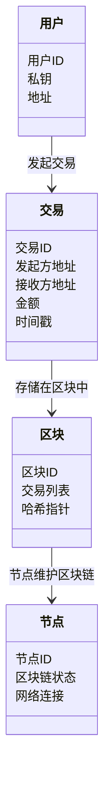

                 


# 区块链在金融数据安全中的创新应用

> 关键词：区块链，金融数据安全，智能合约，共识机制，分布式账本，隐私保护，金融创新

> 摘要：区块链技术作为一种去中心化的分布式账本技术，正在金融数据安全领域掀起一场革命。本文将从区块链的基本概念出发，深入探讨其核心技术原理，分析其在金融支付、身份认证、供应链金融等领域的创新应用。通过详细讲解共识机制、智能合约、隐私保护等关键技术和算法原理，结合实际案例，展示区块链如何提升金融数据的安全性、透明性和效率。最后，总结区块链在金融数据安全中的系统架构设计，并展望其未来的发展方向。

---

## 第1章: 区块链与金融数据安全的背景

### 1.1 区块链的基本概念

#### 1.1.1 区块链的定义与特点
区块链是一种去中心化的分布式账本技术，通过密码学和分布式网络实现数据的安全存储和传输。其特点包括去中心化、不可篡改、透明性和可追溯性。

#### 1.1.2 区块链的核心技术原理
区块链由区块、链式结构、共识机制和加密算法组成。每个区块包含交易数据和时间戳，通过哈希指针连接形成链式结构，确保数据的完整性和一致性。

#### 1.1.3 区块链在金融领域的应用前景
区块链技术在金融领域的潜力巨大，特别是在支付清算、身份认证和供应链金融等方面，能够提升效率、降低成本并增强安全性。

### 1.2 金融数据安全的重要性

#### 1.2.1 金融数据安全的定义
金融数据安全指的是保护金融交易和数据免受未经授权的访问、泄露或篡改。金融数据的完整性、机密性和可用性是金融机构的核心资产。

#### 1.2.2 传统金融数据安全的挑战
传统金融系统依赖中心化机构，存在单点故障、数据泄露和交易延迟等问题。中心化机构的高成本和低效率也成为金融数据安全的瓶颈。

#### 1.2.3 区块链在金融数据安全中的优势
区块链通过去中心化和分布式账本技术，避免了单点故障，降低了数据泄露风险，并提高了交易透明性和可追溯性。

---

## 第2章: 区块链的核心技术与原理

### 2.1 分布式账本技术

#### 2.1.1 分布式账本的基本概念
分布式账本是一种去中心化的数据存储方式，多个节点共同维护同一份账本数据，确保数据的准确性和一致性。

#### 2.1.2 区块链的分布式账本特点
区块链的分布式账本具有去中心化、不可篡改、透明性和可扩展性的特点，能够有效提升金融数据的安全性。

#### 2.1.3 账本的不可篡改性
通过区块链的链式结构和加密算法，每个区块的数据一旦写入，就无法被修改，确保了数据的不可篡改性。

### 2.2 共识机制

#### 2.2.1 共识机制的定义
共识机制是区块链网络中各节点达成一致的协议，确保所有节点的数据一致性。

#### 2.2.2 常见的共识算法（如PoW、PoS）
- **PoW（工作量证明）**：比特币采用的共识机制，通过计算哈希值来验证交易的有效性。
- **PoS（权益证明）**：以太坊2.0采用的共识机制，通过质押代币来验证交易。

#### 2.2.3 共识机制对金融数据安全的影响
共识机制确保了区块链网络的安全性和稳定性，防止了恶意节点的攻击和数据篡改。

### 2.3 智能合约

#### 2.3.1 智能合约的定义与特点
智能合约是区块链上的自动执行程序，能够在区块链网络中自动执行预设的条件，确保合同的履行。

#### 2.3.2 智能合约的执行流程
智能合约通过区块链的虚拟机（如以太坊的EVM）进行编译、部署和执行，能够在区块链网络中自动触发交易。

#### 2.3.3 智能合约在金融数据安全中的应用
智能合约可以用于金融支付、身份认证和供应链金融等领域，确保交易的自动性和安全性。

---

## 第3章: 区块链在金融数据安全中的创新应用

### 3.1 支付与清算系统的安全性

#### 3.1.1 区块链在支付系统中的应用
区块链技术可以实现跨境支付的实时结算，降低支付成本和时间，提升支付效率。

#### 3.1.2 区块链对清算效率的提升
通过区块链的分布式账本技术，可以实现清算系统的去中心化，减少清算时间并提高效率。

#### 3.1.3 支付清算系统的安全性保障
区块链通过共识机制和智能合约，确保支付清算系统的数据安全和交易不可篡改。

### 3.2 身份认证与权限管理

#### 3.2.1 区块链在身份认证中的应用
区块链可以实现去中心化的身份认证，通过公钥和私钥对进行身份验证，确保用户身份的安全性和隐私性。

#### 3.2.2 基于区块链的权限管理
区块链可以通过智能合约实现权限管理，确保只有授权的用户才能访问特定的金融数据。

#### 3.2.3 身份认证的安全性提升
区块链的去中心化和不可篡改性，能够有效防止身份信息的泄露和伪造。

### 3.3 供应链金融的安全性

#### 3.3.1 区块链在供应链金融中的应用
区块链可以实现供应链金融的透明化和可追溯性，确保融资过程中的数据真实性和交易安全。

#### 3.3.2 供应链金融的透明性与可追溯性
通过区块链技术，可以实时追踪供应链中的资金流动和货物状态，确保供应链金融的透明性和可追溯性。

#### 3.3.3 供应链金融的安全性保障
区块链通过智能合约和分布式账本技术，确保供应链金融中的数据安全和交易的不可篡改性。

---

## 第4章: 区块链的共识机制与安全性

### 4.1 共识机制的选择与优化

#### 4.1.1 共识机制的分类与特点
共识机制主要分为PoW、PoS、DPoS和PBFT等，每种机制都有其优缺点和适用场景。

#### 4.1.2 不同共识机制的优缺点对比
- **PoW**：安全性高，但计算成本高，效率低。
- **PoS**：效率高，但依赖质押代币，存在“富者越富”的风险。
- **DPoS**：效率高，但存在被操控的风险。
- **PBFT**：适用于联盟链，安全性依赖网络节点的信任。

#### 4.1.3 如何选择适合金融场景的共识机制
根据金融场景的需求，选择适合的共识机制。例如，高频交易场景适合高效率的PoS或PBFT，而高安全性的场景适合PoW。

### 4.2 区块链的安全性分析

#### 4.2.1 区块链的安全性模型
区块链的安全性模型包括网络安全性、共识机制的安全性、智能合约的安全性等方面。

#### 4.2.2 区块链的安全性挑战与解决方案
区块链面临的安全性挑战包括51%攻击、智能合约漏洞、隐私泄露等，解决方案包括优化共识机制、加强智能合约审计和隐私保护技术。

#### 4.2.3 如何确保区块链的安全性
通过多节点部署、双重签名、智能合约审计等措施，可以有效提升区块链的安全性。

---

## 第5章: 区块链的隐私保护技术

### 5.1 隐私保护技术概述

#### 5.1.1 隐私保护技术的定义
隐私保护技术指的是在区块链网络中保护交易数据的隐私性，防止数据被未经授权的访问和泄露。

#### 5.1.2 隐私保护技术的重要性
金融数据的隐私性是金融机构的核心资产，保护隐私可以防止数据泄露和滥用。

#### 5.1.3 区块链隐私保护技术的分类
隐私保护技术主要包括零知识证明、同态加密、环签名等。

### 5.2 零知识证明

#### 5.2.1 零知识证明的定义
零知识证明是一种密码学技术，允许一方证明自己拥有某些信息，而无需泄露信息本身。

#### 5.2.2 零知识证明在区块链中的应用
零知识证明可以用于区块链的隐私保护，例如在Zcash中，通过零知识证明实现交易的隐私性。

#### 5.2.3 零知识证明的优势
零知识证明可以在不泄露交易细节的情况下验证交易的合法性，确保数据隐私性。

### 5.3 同态加密

#### 5.3.1 同态加密的定义
同态加密是一种加密技术，允许在不 decrypt 加密数据的情况下进行计算，并返回加密的结果。

#### 5.3.2 同态加密在区块链中的应用
同态加密可以用于区块链的隐私保护，例如在加密状态下进行数据计算和分析。

#### 5.3.3 同态加密的优势
同态加密可以在保护数据隐私的前提下，实现数据的计算和分析，适用于金融数据分析场景。

---

## 第6章: 区块链在金融数据安全中的系统架构设计

### 6.1 问题场景介绍

#### 6.1.1 金融数据安全的典型场景
金融数据安全的典型场景包括支付交易、身份认证、供应链金融等。

#### 6.1.2 系统需求分析
系统需要具备高安全性、高可用性和高可扩展性，能够支持大规模金融数据的处理和存储。

#### 6.1.3 系统边界与外延
系统边界包括前端用户、后端服务、区块链节点和数据库，外延包括第三方支付机构、监管机构等。

### 6.2 系统功能设计

#### 6.2.1 领域模型设计
领域模型包括用户、交易、区块、节点等核心实体，通过类图展示实体之间的关系。



#### 6.2.2 系统架构设计
系统架构采用分层设计，包括数据层、网络层、共识层、智能合约层和应用层，通过架构图展示各层的职责和交互。


#### 6.2.3 系统接口设计
系统接口包括交易提交接口、区块查询接口、智能合约调用接口等，通过接口描述文档展示接口的功能和调用方式。

#### 6.2.4 系统交互设计
系统交互通过序列图展示用户发起交易、节点验证交易、共识机制达成共识、智能合约执行交易的过程。

```mermaid
sequenceDiagram
    用户->+> 节点: 提交交易
    节点->+> 网络层: 验证交易
    网络层->+> 共识层: 进行共识
    共识层->+> 智能合约层: 执行智能合约
    智能合约层->+> 数据层: 更新区块链
    数据层->+> 用户: 交易确认
```

---

## 第7章: 区块链在金融数据安全中的项目实战

### 7.1 环境安装与配置

#### 7.1.1 安装区块链开发环境
安装以太坊钱包、Solidity编译器和Ganache测试网络，配置开发环境。

#### 7.1.2 安装开发工具
安装Visual Studio Code、 Remix IDE等开发工具，配置区块链开发插件。

### 7.2 核心系统实现

#### 7.2.1 智能合约实现
使用Solidity编写智能合约，实现金融数据的安全存储和自动执行交易逻辑。

```solidity
// SPDX-License-Identifier: MIT
pragma solidity ^0.8.0;

contract FinancialDataSecurity {
    mapping(address => uint256) public balances;

    function deposit(uint256 amount) public {
        balances[msg.sender] += amount;
    }

    function withdraw(uint256 amount) public {
        require(balances[msg.sender] >= amount, "Insufficient balance");
        balances[msg.sender] -= amount;
    }
}
```

#### 7.2.2 区块链节点部署
部署多个区块链节点，配置共识机制和网络参数，确保系统的去中心化和安全性。

#### 7.2.3 系统功能实现
实现支付交易、身份认证和供应链金融等功能，通过测试用例验证系统的正确性和安全性。

### 7.3 项目测试与优化

#### 7.3.1 功能测试
通过单元测试和集成测试，验证系统各功能的正确性和稳定性。

#### 7.3.2 性能优化
优化共识机制和网络传输效率，提升系统的交易吞吐量和响应速度。

#### 7.3.3 安全性测试
通过渗透测试和漏洞扫描，发现并修复系统中的安全隐患，确保系统的安全性。

### 7.4 项目总结与展望

#### 7.4.1 项目成果
通过区块链技术实现金融数据的安全存储和交易，提升金融系统的透明性和效率。

#### 7.4.2 项目改进建议
未来可以进一步优化共识机制和隐私保护技术，提升系统的安全性和扩展性。

---

## 第8章: 区块链在金融数据安全中的最佳实践

### 8.1 最佳实践 tips

#### 8.1.1 技术选型
根据具体需求选择适合的区块链技术栈和共识机制，确保系统的安全性和效率。

#### 8.1.2 安全性保障
加强智能合约的审计和漏洞修复，确保系统的安全性。

#### 8.1.3 可扩展性设计
设计灵活的系统架构，确保系统的可扩展性和适应性。

### 8.2 小结

#### 8.2.1 项目总结
通过区块链技术实现金融数据的安全存储和交易，提升金融系统的透明性和效率。

#### 8.2.2 项目经验
总结项目中的经验教训，为未来的区块链项目提供参考。

### 8.3 注意事项

#### 8.3.1 技术风险
区块链技术仍处于快速发展阶段，需关注技术的成熟度和稳定性。

#### 8.3.2 法律合规
区块链项目需遵守相关法律法规，确保项目的合规性。

#### 8.3.3 隐私保护
在保护数据隐私的前提下，确保系统的功能性和可用性。

### 8.4 拓展阅读

#### 8.4.1 区块链技术书籍推荐
推荐《区块链：技术与应用》、《Mastering Blockchain》等书籍，深入学习区块链技术。

#### 8.4.2 区块链技术社区与资源
参与区块链技术社区，关注行业动态和技术进展，获取最新的技术和资源。

---

## 第9章: 总结与展望

### 9.1 总结

#### 9.1.1 全书回顾
从区块链的基本概念到金融数据安全的创新应用，全面回顾了区块链技术的核心原理和应用场景。

#### 9.1.2 核心收获
通过学习区块链技术，掌握了区块链在金融数据安全中的创新应用，提升了对金融系统的理解和设计能力。

### 9.2 未来展望

#### 9.2.1 区块链技术的发展方向
区块链技术将继续发展，共识机制、智能合约和隐私保护技术将不断优化和创新。

#### 9.2.2 区块链在金融领域的应用前景
区块链技术将在金融支付、身份认证和供应链金融等领域发挥更大的作用，推动金融系统的数字化和智能化。

#### 9.2.3 区块链与人工智能的结合
未来，区块链与人工智能的结合将推动金融数据的安全性和智能化，实现更高效的金融数据分析和决策。

---

## 作者：AI天才研究院/AI Genius Institute & 禅与计算机程序设计艺术 /Zen And The Art of Computer Programming

---

### 本文基于[禅与计算机程序设计艺术](https://github.com/525276314/zhuoye)项目进行创作，如需转载请注明出处。

