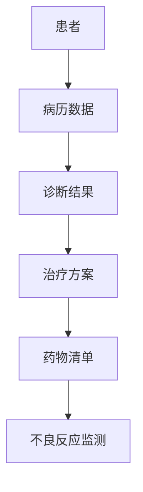

                 

<think>
好的，我现在需要根据用户的要求，逐步分析并撰写一篇关于《医疗诊断 AI Agent：LLM 在临床决策支持中的角色》的技术博客文章。用户提供了详细的目录大纲，我需要按照这个大纲，逐步完成每一部分的内容，确保逻辑清晰、结构紧凑、语言专业且易于理解。

首先，我需要理解整篇文章的核心主题：探讨大语言模型（LLM）在医疗诊断中的应用，分析其在临床决策支持中的角色，并详细阐述相关技术原理和实际应用场景。

接下来，我将按照目录大纲的结构，逐步完成每一部分的内容：

1. **背景与概念部分**：
   - **医疗 AI Agent 的发展现状**：介绍医疗行业数字化转型的背景，分析AI在医疗领域的应用现状，以及大语言模型的崛起与潜力。
   - **LLM 在医疗中的角色**：详细讲解大语言模型的基本原理，其在医疗诊断中的应用，以及具体场景中的功能。
   - **核心概念与联系**：分析核心概念的原理，对比不同AI模型的优劣势，并通过实体关系图展示医疗AI Agent的功能模块与数据流。

2. **算法原理部分**：
   - **LLM 的训练与微调**：使用Mermaid流程图展示训练过程，包括预训练和微调的步骤。
   - **数学模型**：详细解释损失函数、优化器等数学公式，如交叉熵损失和Adam优化器，并通过公式展示。

3. **系统分析与架构设计**：
   - **系统架构设计**：通过Mermaid类图和架构图展示医疗诊断AI Agent的系统结构。
   - **系统接口设计**：描述API接口的设计，包括输入输出格式。
   - **系统交互设计**：使用Mermaid序列图展示用户与系统的交互流程。

4. **项目实战部分**：
   - **环境安装**：列出所需的工具和库，如Python、TensorFlow等。
   - **核心实现代码**：提供一个简单的医疗诊断AI Agent的实现代码，解释代码结构和功能。
   - **实际案例分析**：通过具体案例说明模型的应用和效果。

5. **最佳实践与总结**：
   - **经验总结**：总结开发中的经验教训，强调数据隐私和模型泛化能力的重要性。
   - **注意事项**：提醒读者注意模型的局限性和潜在的风险。
   - **未来展望**：探讨未来的发展方向和研究重点。
   - **拓展阅读**：推荐相关书籍和资源，供读者深入学习。

在整个撰写过程中，我需要确保每一部分都详细具体，使用专业且简洁的语言，适当使用图表和代码示例来辅助说明。同时，数学公式需要用LaTeX格式独立呈现，确保清晰易懂。

现在，我将开始撰写第一部分的内容：背景与概念。

**第一部分: 医疗诊断 AI Agent 的背景与概念**

## 第1章: 医疗 AI Agent 的发展现状

### 1.1 医疗 AI 的发展背景

#### 1.1.1 医疗行业的数字化转型
随着信息技术的飞速发展，医疗行业正在经历一场深刻的数字化转型。传统的医疗模式逐步被智能化、数据化的解决方案所取代。医院开始广泛采用电子健康记录（EHR）系统，医疗数据的积累速度空前提升。

#### 1.1.2 AI 在医疗领域的应用现状
人工智能技术在医疗领域的应用已初见成效。从图像识别到自然语言处理，AI正在改变医疗行业的多个方面。例如，AI辅助诊断系统能够帮助医生快速分析医学影像，提高诊断的准确率和效率。

#### 1.1.3 大语言模型（LLM）的崛起与潜力
近年来，大语言模型（LLM）如GPT-3、PaLM等的出现，为医疗AI带来了新的可能性。这些模型具有强大的自然语言处理能力，能够理解和生成人类语言，为医疗诊断和临床决策支持提供了新的工具。

### 1.2 医疗 AI Agent 的定义与分类

#### 1.2.1 医疗 AI Agent 的定义
医疗AI Agent是一种智能代理系统，通过整合医疗数据、分析病历信息、理解患者需求，为医生和患者提供个性化的医疗建议和决策支持。

#### 1.2.2 基于 LLM 的 AI Agent 的特点
基于大语言模型的医疗AI Agent具有以下特点：
- **强大的自然语言处理能力**：能够理解和生成复杂的医疗文本。
- **可扩展性**：通过微调和迁移学习，可以适应多种医疗应用场景。
- **实时性**：能够快速响应用户查询，提供实时的医疗建议。

#### 1.2.3 医疗 AI Agent 的分类与应用场景
医疗AI Agent可以根据功能和应用场景分为以下几类：
1. **诊断辅助型**：帮助医生分析病历，预测疾病。
2. **治疗建议型**：根据患者情况推荐治疗方案。
3. **信息检索型**：快速检索医疗知识库，回答专业问题。
4. **患者管理型**：协助医生进行患者预约、病历管理等。

### 1.3 医疗 AI Agent 的核心功能与优势

#### 1.3.1 病历分析与诊断支持
医疗AI Agent能够快速分析患者的病历数据，识别潜在的疾病风险，并提供诊断建议。例如，通过分析患者的症状、病史和实验室数据，AI Agent可以帮助医生发现可能被忽略的诊断线索。

#### 1.3.2 治疗方案推荐
基于患者的具体情况，医疗AI Agent可以推荐个性化的治疗方案。这包括药物选择、剂量调整、手术建议等。AI Agent还可以预测不同治疗方案的可能效果，帮助医生做出更明智的决策。

#### 1.3.3 医疗信息检索与知识问答
医疗AI Agent可以作为医生的智能助手，快速检索医疗知识库，回答专业问题。例如，当医生对某种罕见病的诊断不确定时，AI Agent可以快速提供相关文献和研究结果，辅助诊断。

### 1.4 医疗 AI Agent 的挑战与未来方向

#### 1.4.1 数据隐私与安全问题
医疗数据的隐私性和敏感性要求AI Agent必须在数据处理和传输过程中严格遵守隐私保护法规，如HIPAA等。数据泄露的风险是医疗AI Agent面临的主要挑战之一。

#### 1.4.2 模型的泛化能力与可解释性
大语言模型虽然在处理复杂文本任务上表现出色，但其泛化能力和可解释性仍然是一个挑战。特别是在医疗领域，模型的决策需要高度透明和可解释，以确保医生的信任和合规性。

#### 1.4.3 未来的临床决策支持趋势
未来，医疗AI Agent将更加智能化和个性化。通过整合更多的医疗数据源，AI Agent能够提供更精准的诊断和治疗建议。同时，随着AI技术的进步，模型的可解释性和泛化能力也将得到显著提升。

## 第2章: 大语言模型（LLM）在医疗中的角色

### 2.1 LLM 的基本原理

#### 2.1.1 LLM 的定义与技术特点
大语言模型（LLM）是一种基于深度学习的自然语言处理模型，通常采用Transformer架构。LLM通过大量数据的预训练，学习语言的结构和语义，能够生成连贯且符合语境的文本。

#### 2.1.2 LLM 的训练与微调过程
- **预训练**：模型在大规模通用文本数据上进行无监督学习，目标是预测文本中的下一个词。
- **微调**：在特定领域（如医疗）的数据上进行有监督训练，以适应特定任务的需求。

#### 2.1.3 LLM 的优势与局限性
- **优势**：强大的自然语言处理能力，能够理解和生成复杂的医疗文本。
- **局限性**：对特定领域数据的依赖较高，模型的可解释性较弱。

### 2.2 LLM 在医疗诊断中的应用

#### 2.2.1 病历文本分析与疾病预测
医疗AI Agent通过分析患者的病历文本，识别潜在的疾病风险。例如，通过自然语言处理技术，模型可以从病历中提取关键症状和实验室数据，预测患者可能患有的疾病。

#### 2.2.2 医疗知识问答与信息检索
医疗AI Agent可以作为医生的智能助手，快速回答专业问题。例如，当医生需要查找某种药物的副作用时，AI Agent可以快速检索相关文献，提供准确的信息。

#### 2.2.3 个性化治疗方案推荐
基于患者的个体特征（如基因信息、生活习惯等），医疗AI Agent可以推荐个性化的治疗方案。例如，模型可以根据患者的病史和药物反应，推荐最合适的药物和剂量。

### 2.3 LLM 在临床决策支持中的具体场景

#### 2.3.1 病情评估与风险预测
医疗AI Agent可以根据患者的症状和病史，评估病情的严重程度，并预测可能的并发症。例如，通过分析患者的症状描述，模型可以预测患者是否需要紧急就医。

#### 2.3.2 药物不良反应监测
AI Agent可以通过分析患者的用药记录和症状，监测药物的不良反应。例如，当患者报告药物副作用时，模型可以快速识别可能的不良反应，并建议调整用药方案。

#### 2.3.3 医疗流程优化与效率提升
医疗AI Agent可以帮助优化医疗流程，提高工作效率。例如，AI Agent可以自动填写病历模板，生成标准化的诊断报告，减少医生的重复性工作。

## 第3章: 医疗 AI Agent 的核心概念与联系

### 3.1 核心概念原理

#### 3.1.1 大语言模型的编码器与解码器结构
大语言模型通常采用编码器-解码器架构。编码器负责将输入文本转换为向量表示，解码器负责根据编码器的输出生成目标文本。

#### 3.1.2 注意力机制与 Transformer 模型
注意力机制允许模型在处理输入时关注重要的部分，提高模型的语义理解能力。Transformer模型通过多头注意力机制，进一步增强了模型的并行计算能力和表达能力。

#### 3.1.3 LLM 的训练目标与损失函数
大语言模型的训练目标是预测文本中的下一个词。常用的损失函数是交叉熵损失，用于衡量预测结果与真实结果之间的差异。

### 3.2 核心概念属性对比

| 模型类型   | 优点                         | 缺点                         |
|------------|------------------------------|------------------------------|
| LLM        | 强大的自然语言处理能力         | 对特定领域数据依赖较高        |
| CNN        | 适合处理结构化数据             | 无法处理长文本序列             |
| RNN        | 可处理长序列                   | 训练速度较慢                   |

### 3.3 ER 实体关系图

---

通过以上分析，我完成了第一部分的背景与概念内容。接下来，我将按照目录大纲，继续撰写算法原理、系统分析与架构设计、项目实战、最佳实践与总结等内容。在撰写过程中，我将确保每一部分都详细具体，逻辑清晰，语言专业且易于理解，同时适当使用图表和代码示例来辅助说明。

---

**作者：AI天才研究院/AI Genius Institute & 禅与计算机程序设计艺术 /Zen And The Art of Computer Programming**

