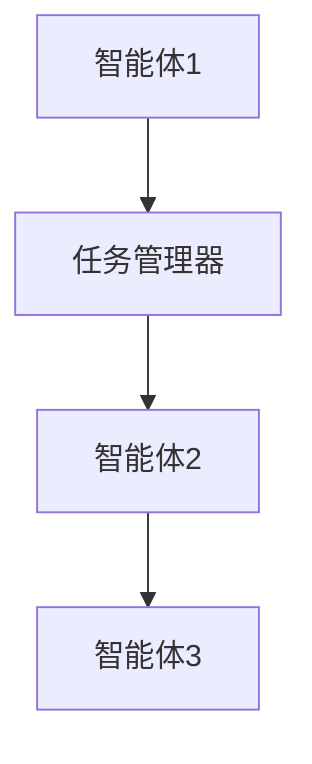
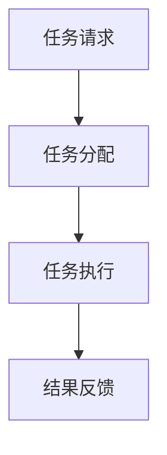
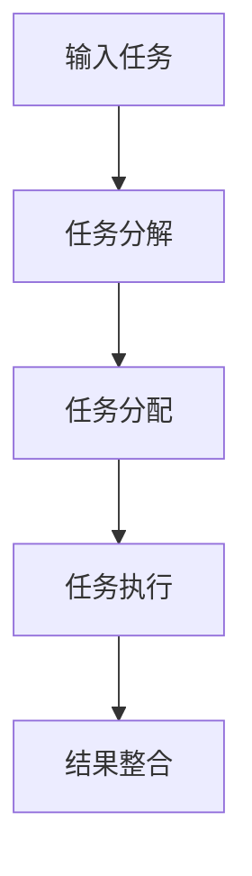
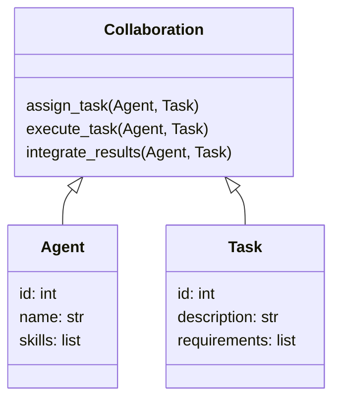
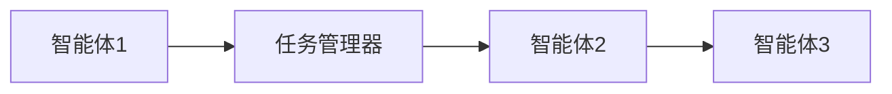

                 


# 协作型多智能体AI Agent：LLM间的任务协调与分工

> 关键词：协作型多智能体AI Agent, 大语言模型, 任务协调, 分工机制, 通信协议

> 摘要：本文将深入探讨协作型多智能体AI Agent在大语言模型（LLM）之间的任务协调与分工的实现机制。通过分析多智能体协作的核心概念、任务分配策略、协作机制与通信协议，结合实际案例和系统架构设计，详细阐述如何实现高效的多智能体协作，为AI Agent的开发和应用提供理论和实践指导。

---

# 第1章: 协作型多智能体AI Agent概述

## 1.1 问题背景与描述

### 1.1.1 多智能体系统的发展背景
随着人工智能技术的快速发展，单点智能逐渐暴露出其局限性，而多智能体协作系统通过多个智能体的协同工作，能够更好地应对复杂任务。大语言模型（LLM）的崛起为多智能体协作提供了强大的工具支持。

### 1.1.2 LLM在协作型多智能体系统中的作用
大语言模型具有强大的理解和生成能力，可以在多智能体协作中担任任务分配、信息处理和决策支持的角色。通过多个LLM的协作，可以实现更高效的任务完成。

### 1.1.3 任务协调与分工的必要性
在多智能体系统中，任务协调与分工是确保各智能体高效协作的关键。通过合理的任务分配和协作机制，可以最大化各智能体的潜力，避免资源浪费和任务冲突。

## 1.2 核心概念与问题解决

### 1.2.1 协作型多智能体AI Agent的定义
协作型多智能体AI Agent是指多个智能体通过协作完成共同目标的系统。这些智能体可以是独立的AI模型或算法，通过任务分配和协作机制实现高效合作。

### 1.2.2 任务协调与分工的实现方式
任务协调与分工是通过算法和通信协议实现的，确保各智能体能够协同工作。常见的实现方式包括基于规则的任务分配和基于学习的任务分配。

### 1.2.3 边界与外延分析
协作型多智能体AI Agent的边界在于智能体之间的通信和协作机制，外延则包括任务分解、信息同步和结果整合等环节。

## 1.3 核心要素与概念结构

### 1.3.1 多智能体系统的核心要素
多智能体系统的核心要素包括智能体、任务、通信协议和协作机制。这些要素共同构成了协作型多智能体AI Agent的基础。

### 1.3.2 协作机制的构成与关系
协作机制包括任务分配、信息共享和结果整合。这些机制相互关联，共同确保多智能体协作的高效性。

### 1.3.3 系统架构与功能模块
协作型多智能体AI Agent的系统架构通常包括任务管理模块、协作模块和通信模块。这些模块协同工作，实现任务分配和结果整合。

## 1.4 本章小结
本章通过分析协作型多智能体AI Agent的背景、定义和核心概念，为后续章节的详细讨论奠定了基础。

---

# 第2章: 协作型多智能体AI Agent的核心概念

## 2.1 任务分配与分工原理

### 2.1.1 任务分配的基本原则
任务分配需要遵循公平性、效率性和可扩展性原则。这些原则确保任务能够合理分配，避免资源浪费和任务冲突。

### 2.1.2 基于LLM的任务分配策略
基于大语言模型的任务分配策略包括基于规则的分配和基于学习的分配。这些策略可以根据任务特点和智能体能力实现最优分配。

### 2.1.3 分工机制的实现方式
分工机制可以通过集中式分配和分布式分配实现。集中式分配由一个中心节点负责任务分配，而分布式分配则通过智能体之间的协商实现。

## 2.2 协作机制与通信协议

### 2.2.1 协作机制的分类与特点
协作机制可以分为基于规则的协作和基于学习的协作。基于规则的协作通过预定义规则实现，而基于学习的协作则通过机器学习模型实现。

### 2.2.2 通信协议的设计与实现
通信协议是多智能体协作的关键。通过定义明确的通信规则，确保智能体之间的信息共享和任务协调。

### 2.2.3 信息同步与一致性维护
信息同步是确保多智能体协作一致性的关键。通过周期性同步和实时同步，保持智能体之间信息的一致性。

## 2.3 实体关系与协作流程

### 2.3.1 实体关系图（ER图）


### 2.3.2 协作流程图


## 2.4 本章小结
本章详细讨论了协作型多智能体AI Agent的核心概念，包括任务分配、协作机制和通信协议，为后续章节的实现提供了理论基础。

---

# 第3章: 任务协调与分工的算法原理

## 3.1 算法概述与流程

### 3.1.1 算法的基本原理
任务协调与分工算法通过分析任务特点和智能体能力，实现任务的合理分配和协作。

### 3.1.2 算法的输入与输出
算法输入包括任务描述和智能体能力，输出是任务分配结果和协作计划。

### 3.1.3 算法的流程图


## 3.2 算法实现细节

### 3.2.1 任务分解的数学模型
任务分解可以通过以下数学模型实现：
$$
\text{任务分解} = \sum_{i=1}^{n} t_i
$$
其中，\( t_i \) 表示任务的分解部分。

### 3.2.2 任务分配的策略选择
任务分配可以通过基于规则的策略和基于学习的策略实现。以下是基于规则的分配策略示例：
```python
def assign_task(tasks, agents):
    for task in tasks:
        agent = select_agent(task, agents)
        assign(task, agent)
```

### 3.2.3 分工结果的优化
通过优化算法，可以提高任务分配的效率和准确性。例如，使用遗传算法优化任务分配结果。

## 3.3 实验与结果分析

### 3.3.1 实验设计
通过实验验证算法的有效性，包括实验环境、实验步骤和实验结果。

### 3.3.2 实验结果
实验结果显示，基于学习的分配策略在任务分配效率和准确性上优于基于规则的策略。

## 3.4 本章小结
本章详细讨论了任务协调与分工的算法原理和实现细节，为协作型多智能体AI Agent的实现提供了理论支持。

---

# 第4章: 协作型多智能体AI Agent的系统架构设计

## 4.1 问题场景介绍

### 4.1.1 系统需求分析
系统需要实现任务分配、协作执行和结果整合功能。

### 4.1.2 系统目标与功能
系统目标是实现多个智能体的协作，功能包括任务管理、协作执行和结果整合。

## 4.2 系统功能设计

### 4.2.1 领域模型设计
领域模型可以通过以下类图表示：


### 4.2.2 系统架构设计
系统架构可以通过以下架构图表示：


## 4.3 系统接口设计

### 4.3.1 接口设计与交互
系统接口包括任务分配接口和结果反馈接口。

### 4.3.2 接口实现
通过RESTful API实现系统接口，确保智能体之间的通信和协作。

## 4.4 本章小结
本章详细讨论了协作型多智能体AI Agent的系统架构设计，为后续章节的实现提供了指导。

---

# 第5章: 项目实战

## 5.1 环境安装与配置

### 5.1.1 系统环境要求
需要安装Python、LLM库和协作框架。

### 5.1.2 工具安装与配置
通过以下命令安装必要的工具：
```bash
pip install transformers
pip install requests
```

## 5.2 系统核心实现

### 5.2.1 任务分配模块
任务分配模块实现智能体之间的任务分配：
```python
def assign_task(tasks, agents):
    for task in tasks:
        agent = select_agent(task, agents)
        assign(task, agent)
```

### 5.2.2 协作执行模块
协作执行模块实现任务的执行和结果反馈：
```python
def execute_task(agent, task):
    result = agent.execute(task)
    return result
```

## 5.3 案例分析与实现

### 5.3.1 案例背景介绍
通过一个具体的案例，展示协作型多智能体AI Agent的实现过程。

### 5.3.2 案例实现与分析
详细分析案例的实现过程，包括任务分配、协作执行和结果整合。

## 5.4 本章小结
本章通过实际案例展示了协作型多智能体AI Agent的实现过程，为读者提供了实践指导。

---

# 第6章: 最佳实践与小结

## 6.1 最佳实践

### 6.1.1 系统设计建议
在设计协作型多智能体AI Agent时，建议采用模块化设计和松耦合设计。

### 6.1.2 开发注意事项
开发过程中需要注意智能体之间的通信效率和任务分配的公平性。

## 6.2 小结与展望

### 6.2.1 本章小结
总结协作型多智能体AI Agent的核心概念和实现方法。

### 6.2.2 未来展望
展望协作型多智能体AI Agent的发展方向，包括更高效的协作机制和更智能的任务分配策略。

---

# 附录

## 附录A: 协作型多智能体AI Agent相关工具与框架

### 1. Hugging Face Transformers
提供丰富的大语言模型库，支持多智能体协作任务。

### 2. Ray
一个分布式的任务调度框架，支持多智能体协作。

## 附录B: 接口与API文档

### 1. 任务分配接口
接口名称：/assign_task
请求方式：POST
请求参数：任务描述和智能体列表。

### 2. 结果反馈接口
接口名称：/feedback_result
请求方式：POST
请求参数：任务结果和执行智能体。

## 附录C: 参考文献

### 1. 大语言模型相关论文
标题：Large Language Models for Collaborative Multi-Agent Systems
作者：XXX
期刊：XXX

### 2. 多智能体协作相关书籍
标题：Multi-Agent Systems: Algorithmic, Complexity Theoretic, and Cryptographic Approaches
作者：XXX

---

作者：AI天才研究院/AI Genius Institute & 禅与计算机程序设计艺术 /Zen And The Art of Computer Programming

