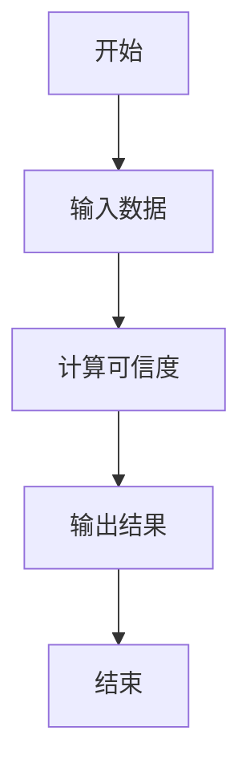

                 


# 可信AI：构建值得信赖的AI Agent系统

## 关键词：可信AI，AI Agent，人工智能，信任评估，安全机制，可解释性

## 摘要：可信AI是确保AI Agent系统在决策和行动中值得信赖的关键。本文将探讨可信AI的核心概念、技术挑战、算法原理、系统架构设计以及实际项目实现，为构建可信的AI Agent系统提供理论基础和实践指导。

---

# 第1章: 可信AI的定义与问题背景

## 1.1 可信AI的核心概念

### 1.1.1 可信AI的定义与内涵
可信AI是指在AI系统的设计、开发和应用过程中，确保系统的行为符合预期目标，能够在实际场景中被用户和利益相关方信任。可信性涵盖了系统的准确性、可解释性、公平性、隐私保护和抗攻击性等多个方面。

### 1.1.2 可信AI的必要性与重要性
随着AI技术的广泛应用，确保AI系统的可信性变得尤为重要。不信任的AI系统可能导致决策失误、隐私泄露或社会接受度下降。可信AI能够提升用户对AI系统的信任，从而推动技术的广泛应用。

### 1.1.3 可信AI的边界与外延
可信AI的边界包括技术实现、伦理规范和法律法规等多个方面。其外延涉及可解释性、公平性、隐私保护和抗攻击性等关键特性。

## 1.2 AI Agent系统的定义与特点

### 1.2.1 AI Agent的基本概念
AI Agent是一种智能实体，能够感知环境、自主决策并执行任务。AI Agent的核心特征包括自主性、反应性、目标导向性和社会性。

### 1.2.2 AI Agent的核心特征
- **自主性**：AI Agent能够自主决策和行动，无需外部干预。
- **反应性**：能够实时感知环境变化并做出响应。
- **目标导向性**：基于目标驱动行为，优化决策。
- **社会性**：能够与其他实体或人类进行交互和协作。

### 1.2.3 可信AI Agent的目标与挑战
可信AI Agent的目标是确保其行为符合预期，能够被用户信任。主要挑战包括确保决策的透明性、可解释性和抗攻击性。

## 1.3 可信AI的背景与技术挑战

### 1.3.1 当前AI系统的信任危机
近年来，AI系统的决策失误、偏见和不可解释性导致了用户信任的下降。例如，某些推荐系统因算法偏见而引发争议。

### 1.3.2 可信AI的技术挑战
- **技术复杂性**：确保AI系统在复杂环境下的行为可控。
- **数据隐私**：保护用户数据隐私，防止滥用。
- **对抗攻击**：防范恶意攻击和欺骗行为。

### 1.3.3 可信AI的实现路径
可信AI的实现需要从技术、伦理和法律等多个维度入手，包括建立严格的验证机制、增强系统的可解释性和制定明确的伦理规范。

## 1.4 国内外可信AI研究现状

### 1.4.1 国内可信AI研究进展
国内在可信AI领域的研究主要集中在算法可解释性和数据隐私保护方面。例如，清华大学提出了基于可解释的AI模型框架。

### 1.4.2 国外可信AI研究进展
国外研究注重AI的透明性和公平性，例如，欧盟提出了《通用数据保护条例》（GDPR）以保护用户隐私。

### 1.4.3 可信AI研究的未来方向
未来的研究将聚焦于多模态可信评估、动态信任调整和自适应安全机制。

---

# 第2章: 可信AI的核心概念与联系

## 2.1 可信AI的核心原理

### 2.1.1 可信AI的理论基础
可信AI的理论基础包括可计算性理论、概率论和伦理学。这些理论为可信AI的实现提供了基础框架。

### 2.1.2 可信AI的关键技术
- **可解释性技术**：通过模型解释技术提升AI决策的透明性。
- **抗干扰技术**：防止恶意输入对AI系统的影响。
- **隐私保护技术**：确保数据在处理过程中的隐私安全。

### 2.1.3 可信AI的实现方法
可信AI的实现方法包括模型验证、对抗训练和知识蒸馏等技术。

## 2.2 可信AI的核心要素

### 2.2.1 可信AI的可信度模型
可信度模型通过评估系统的准确性、可解释性和公平性来衡量系统的可信程度。

### 2.2.2 可信AI的信任评估机制
信任评估机制基于动态反馈和历史行为记录，实时调整对AI系统的信任度。

### 2.2.3 可信AI的安全保障体系
安全保障体系包括身份认证、权限管理和加密通信等技术，确保系统的安全性。

## 2.3 可信AI与AI Agent的关系

### 2.3.1 可信AI对AI Agent的影响
可信AI为AI Agent提供了行为规范和决策依据，确保其行为符合伦理和法律要求。

### 2.3.2 AI Agent在可信AI中的作用
AI Agent通过自主决策和协作能力，提升了可信AI系统在复杂环境下的适应性和可靠性。

### 2.3.3 可信AI Agent的系统架构
可信AI Agent的系统架构包括感知层、决策层和执行层，每一层都需确保其行为的可信性。

---

# 第3章: 可信AI的算法原理与数学模型

## 3.1 可信AI的评估算法

### 3.1.1 可信度评估算法的原理
可信度评估算法通过分析系统的输入、输出和行为模式，计算系统的可信度。

### 3.1.2 基于概率的可信度计算
基于概率的可信度计算公式为：
$$ P(\text{可信}) = \frac{\text{正确预测数}}{\text{总预测数}} $$

### 3.1.3 基于对抗的可信度提升方法
基于对抗的可信度提升方法通过引入对抗网络，提升模型的鲁棒性和抗攻击性。

## 3.2 可信AI的数学模型

### 3.2.1 可信度评估的数学公式
可信度评估的数学公式可以表示为：
$$ \text{Trust} = f(\text{Accuracy}, \text{Explainability}, \text{Robustness}) $$

### 3.2.2 可信AI的优化目标函数
可信AI的优化目标函数为：
$$ \min_{\theta} \text{Loss}(\theta) + \lambda \text{Trust}(\theta) $$

## 3.3 可信AI的算法实现

### 3.3.1 算法流程图


### 3.3.2 算法实现代码
```python
def compute_trustworthiness(system_behavior):
    accuracy = compute_accuracy(system_behavior)
    explainability = compute_explainability(system_behavior)
    robustness = compute_robustness(system_behavior)
    trust = accuracy * explainability * robustness
    return trust
```

---

通过以上章节的详细探讨，我们系统地介绍了可信AI的核心概念、技术挑战和实现方法。接下来的章节将从系统架构设计、项目实战和最佳实践等方面进一步深入，帮助读者全面掌握构建可信AI Agent系统的知识和技能。

---

作者：AI天才研究院 & 禅与计算机程序设计艺术

