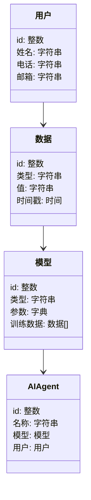
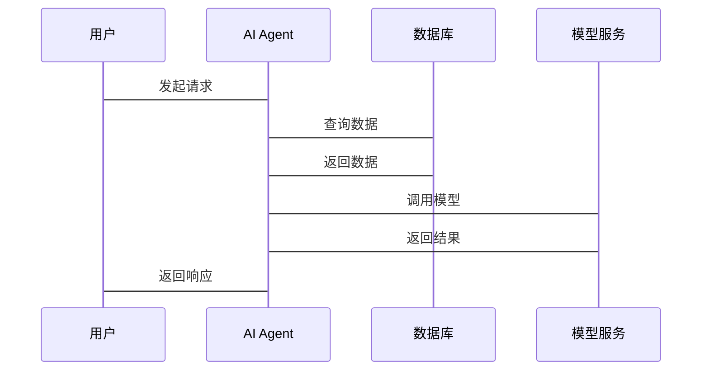

                 


# 合规性管理：确保AI Agent符合法规要求

## 关键词：AI Agent, 合规性管理, 数据隐私, 可解释性, 法律法规, 伦理规范, 技术实现

## 摘要：随着人工智能技术的快速发展，AI Agent在各个领域的应用日益广泛。然而，随之而来的数据隐私、模型透明性以及伦理法律问题也日益突出。本文将从合规性管理的角度，详细探讨如何确保AI Agent在设计、开发和应用过程中符合相关法规要求。通过分析合规性管理的核心概念、算法原理、系统架构以及项目实战，本文将为读者提供全面的理论和实践指导，帮助企业在AI Agent的应用中实现合规性管理，规避法律风险，提升技术竞争力。

---

# 第1章: 合规性管理概述

## 1.1 合规性管理的定义与背景
### 1.1.1 合规性管理的基本概念
合规性管理是指确保组织的活动、产品和服务符合相关法律法规、行业标准和企业政策的过程。在AI Agent领域，合规性管理的核心是确保AI系统的开发和应用符合数据隐私、伦理道德和法律要求。

### 1.1.2 AI Agent的定义与特点
AI Agent是一种能够感知环境、自主决策并执行任务的智能实体。其特点是自主性、反应性、目标导向和社交能力。AI Agent的应用广泛，如智能助手、自动驾驶、智能客服等。

### 1.1.3 合规性管理的重要性
随着AI技术的广泛应用，数据隐私、算法偏见和伦理问题逐渐成为社会关注的焦点。合规性管理不仅是企业规避法律风险的需要，也是提升用户信任和企业声誉的关键。

---

## 1.2 合规性管理的背景与问题背景
### 1.2.1 AI技术的快速发展与挑战
AI技术的快速发展带来了巨大的机遇，但也伴随着数据隐私泄露、算法歧视和伦理争议等问题。这些问题对企业合规性管理提出了更高的要求。

### 1.2.2 数据隐私与安全的法律要求
随着《通用数据保护条例》（GDPR）等法律法规的出台，数据隐私保护成为AI Agent合规性管理的核心内容。企业必须确保AI系统在数据收集、存储和使用过程中符合相关法律要求。

### 1.2.3 企业合规性管理的必要性
企业通过合规性管理可以降低法律风险，提升用户信任，同时在市场竞争中获得优势。合规性管理不仅是法律要求，也是企业可持续发展的基石。

---

## 1.3 合规性管理的核心问题
### 1.3.1 数据隐私与保护
AI Agent通常涉及大量用户数据的收集和处理，如何确保数据隐私是合规性管理的核心问题之一。

### 1.3.2 模型的透明性与可解释性
AI模型的复杂性使得其决策过程往往难以解释。然而，许多法律法规要求AI系统具备一定的透明性和可解释性，以确保决策的公正性和合法性。

### 1.3.3 伦理与法律的冲突
AI技术的应用可能引发伦理争议，例如自动驾驶汽车在紧急情况下的决策是否符合伦理道德。合规性管理需要在法律和伦理之间找到平衡点。

---

## 1.4 合规性管理的边界与外延
### 1.4.1 合规性管理的范围界定
合规性管理不仅包括数据隐私保护，还包括模型设计、算法选择、用户授权等多个方面。其范围涵盖AI Agent的全生命周期，从开发到应用。

### 1.4.2 合规性管理的外延与扩展
合规性管理的外延包括企业内部政策的制定、供应商管理、第三方服务的合规性评估等。其扩展涉及国际法律的遵守、行业标准的制定等。

### 1.4.3 合规性管理与业务目标的关系
合规性管理不仅是企业合规的需要，也是实现业务目标的重要保障。合规性管理能够提升用户体验、增强品牌信任度，从而为企业创造更大的价值。

---

## 1.5 合规性管理的概念结构与核心要素
### 1.5.1 合规性管理的结构化框架
合规性管理可以分为数据合规、算法合规和应用合规三个层面。数据合规关注数据的收集、存储和使用；算法合规关注模型的设计和训练；应用合规关注AI系统的部署和运行。

### 1.5.2 核心要素的分解与分析
合规性管理的核心要素包括：数据隐私保护、模型透明性、用户授权、风险评估、法律合规和伦理合规。这些要素相互关联，共同确保AI Agent的合规性。

### 1.5.3 合规性管理的系统性特征
合规性管理是一个系统工程，涉及企业内部的多个部门和外部的法律法规。其系统性特征要求企业在管理过程中注重整体性和协同性。

---

## 1.6 本章小结
本章从合规性管理的定义、背景、核心问题、边界和外延等方面进行了全面分析，为后续章节的深入探讨奠定了基础。合规性管理不仅是AI Agent应用的法律要求，也是企业可持续发展的必要条件。

---

# 第2章: 合规性管理的核心概念与联系

## 2.1 合规性管理的核心原理
### 2.1.1 数据隐私保护的原理
数据隐私保护的原理包括数据的最小化、加密存储、访问控制和数据脱敏。这些原理确保数据在处理过程中不会被未经授权的主体访问或滥用。

### 2.1.2 模型可解释性的实现方法
模型可解释性可以通过特征重要性分析、规则提取和可视化解释等方法实现。这些方法帮助用户理解AI系统的决策过程，确保其符合伦理和法律要求。

### 2.1.3 伦理与法律的平衡点
合规性管理需要在法律和伦理之间找到平衡点。例如，在自动驾驶汽车的决策中，如何在法律允许的范围内优先保护用户的生命安全。

---

## 2.2 合规性管理的核心概念对比
### 2.2.1 数据隐私与数据安全的对比
数据隐私关注数据的使用方式，而数据安全关注数据的保护措施。两者相辅相成，共同确保数据的安全性和合法性。

### 2.2.2 模型透明性与模型复杂性的对比
模型透明性要求AI系统具备可解释性，而模型复杂性可能导致决策过程难以解释。合规性管理需要在透明性和复杂性之间找到平衡。

### 2.2.3 合规性管理与业务目标的对比
合规性管理是企业实现业务目标的重要保障，但有时可能会增加企业的运营成本。合规性管理需要在成本和效益之间找到平衡。

---

## 2.3 合规性管理的ER实体关系图
以下是一个简单的ER实体关系图，展示了合规性管理的主要实体及其关系：

```mermaid
er
  actor: 用户
  role: 合规性管理角色
  entity: 数据
  attribute: 属性
  relationship: 关系
  rule: 合规性规则
```

---

## 2.4 本章小结
本章通过对比和分析合规性管理的核心概念，揭示了数据隐私、模型透明性和伦理法律之间的关系。这些分析为后续章节的算法实现和系统设计提供了理论基础。

---

# 第3章: AI Agent的合规性管理算法原理

## 3.1 合规性管理的算法概述
### 3.1.1 数据隐私保护的算法选择
数据隐私保护的算法包括数据加密、数据脱敏和数据匿名化。这些算法能够有效保护用户数据的安全性和隐私性。

### 3.1.2 模型可解释性的算法实现
模型可解释性的算法包括LIME和SHAP值算法。这些算法通过解释模型的决策过程，帮助用户理解AI系统的运作机制。

### 3.1.3 伦理与法律的算法平衡
合规性管理需要在算法设计中融入伦理和法律的要求，例如在自动驾驶汽车的决策算法中优先保护用户的生命安全。

---

## 3.2 数据隐私保护算法的实现
### 3.2.1 数据脱敏算法
数据脱敏算法通过替换、加密或删除敏感数据，确保数据在处理过程中不会泄露用户的隐私信息。

### 3.2.2 数据加密算法
数据加密算法通过加密技术保护数据的安全性，确保只有授权的主体能够访问加密数据。

### 3.2.3 数据访问控制算法
数据访问控制算法通过权限管理，确保只有经过授权的用户才能访问特定的数据。

---

## 3.3 模型可解释性算法的实现
### 3.3.1 LIME算法
LIME（Local Interpretable Model-agnostic Explanations）是一种用于解释模型决策过程的算法。它通过局部线性近似，生成可解释的规则。

### 3.3.2 SHAP值算法
SHAP（Shapley Additive exPlanations）是一种基于博弈论的解释方法。它通过分解模型的预测值，生成每个特征对预测结果的贡献值。

### 3.3.3 可视化解释算法
可视化解释算法通过绘制决策树、热力图等方式，直观展示模型的决策过程，帮助用户理解AI系统的运作机制。

---

## 3.4 合规性管理的数学模型与公式
### 3.4.1 数据隐私保护的数学模型
$$ P(x) = \sum_{i=1}^{n} w_i x_i $$
其中，\( x_i \) 表示输入数据，\( w_i \) 表示权重系数。

### 3.4.2 模型可解释性的数学公式
$$ SHAP = \phi_i = \frac{1}{n} \sum_{j=1}^{n} (f(x_j) - f(x_{base})) $$
其中，\( f(x_j) \) 表示模型在输入 \( x_j \) 时的预测值，\( f(x_{base}) \) 表示基线预测值。

---

## 3.5 本章小结
本章详细介绍了合规性管理的算法实现，包括数据隐私保护算法和模型可解释性算法。这些算法为AI Agent的合规性管理提供了技术支持。

---

# 第4章: 系统分析与架构设计

## 4.1 问题场景介绍
本章以一个AI Agent的应用场景为例，分析其合规性管理的系统架构。假设我们开发一个智能客服系统，需要确保其在数据处理和模型决策过程中符合相关法规要求。

---

## 4.2 系统功能设计
### 4.2.1 数据处理模块
数据处理模块负责数据的收集、存储和预处理。需要确保数据的隐私性和安全性。

### 4.2.2 模型训练模块
模型训练模块负责训练AI Agent的核心模型。需要确保模型的透明性和可解释性。

### 4.2.3 用户交互模块
用户交互模块负责与用户的交互，确保用户授权和数据的合法性。

---

## 4.3 系统架构设计
### 4.3.1 领域模型（类图）
以下是一个AI Agent系统的类图：



### 4.3.2 系统架构图
以下是一个AI Agent系统的架构图：


---

## 4.4 系统接口设计
### 4.4.1 数据接口
数据接口负责与外部系统进行数据交互，确保数据的合法性和安全性。

### 4.4.2 模型接口
模型接口负责与模型服务进行交互，确保模型的透明性和可解释性。

### 4.4.3 用户接口
用户接口负责与用户的交互，确保用户授权和数据的合法性。

---

## 4.5 系统交互流程
### 4.5.1 交互流程图
以下是一个AI Agent系统的交互流程图：



---

## 4.6 本章小结
本章通过系统分析和架构设计，明确了AI Agent合规性管理的实现路径。通过类图、架构图和交互流程图，展示了系统的整体结构和各模块之间的关系。

---

# 第5章: 项目实战

## 5.1 环境安装与配置
### 5.1.1 安装Python环境
安装Python 3.8或更高版本，确保环境满足项目需求。

### 5.1.2 安装依赖库
安装必要的依赖库，如TensorFlow、Keras、SHAP等。

---

## 5.2 系统核心实现
### 5.2.1 数据处理代码
以下是一个数据脱敏的Python代码示例：

```python
import pandas as pd
from sklearn.preprocessing import FunctionTransformer

def anonymize_data(data):
    # 数据脱敏函数
    transformer = FunctionTransformer()
    anonymized_data = transformer.fit_transform(data)
    return anonymized_data

# 读取数据
data = pd.read_csv('data.csv')
# 脱敏处理
anonymized_data = anonymize_data(data)
# 保存数据
anonymized_data.to_csv('anonymized_data.csv', index=False)
```

### 5.2.2 模型训练代码
以下是一个模型训练的Python代码示例：

```python
import tensorflow as tf
from tensorflow.keras import layers

# 定义模型
model = tf.keras.Sequential([
    layers.Dense(64, activation='relu'),
    layers.Dense(1, activation='sigmoid')
])
# 编译模型
model.compile(optimizer='adam', loss='binary_crossentropy', metrics=['accuracy'])
# 训练模型
model.fit(x_train, y_train, epochs=10, batch_size=32)
```

### 5.2.3 模型解释代码
以下是一个使用SHAP解释模型的Python代码示例：

```python
import shap

# 加载解释器
explainer = shap.Explainer(model, x_train)
# 生成解释结果
shap_values = explainer.shap_values(x_test)
# 可视化解释
shap.summary_plot(shap_values, x_test, plot_type='bar')
```

---

## 5.3 案例分析与详细讲解
### 5.3.1 案例背景
假设我们开发一个智能客服系统，需要确保其在数据处理和模型决策过程中符合相关法规要求。

### 5.3.2 数据处理与模型训练
通过数据脱敏和加密算法，确保用户数据的安全性和隐私性。同时，通过模型可解释性算法，确保模型的决策过程透明可解释。

### 5.3.3 系统测试与优化
通过系统测试，确保AI Agent在实际应用中符合合规性管理的要求。根据测试结果，不断优化模型和系统架构，提升用户体验和系统性能。

---

## 5.4 项目小结
本章通过项目实战，展示了合规性管理在AI Agent开发中的具体应用。通过环境安装、核心代码实现和案例分析，读者可以深入了解合规性管理的实现过程。

---

# 第6章: 最佳实践与注意事项

## 6.1 小结与总结
合规性管理是AI Agent应用的重要保障，贯穿于AI Agent的全生命周期。通过数据隐私保护、模型透明性和伦理法律的平衡，确保AI Agent的合规性。

---

## 6.2 注意事项
1. **数据隐私保护**：确保数据的最小化和加密存储，避免数据泄露。
2. **模型透明性**：通过可解释性算法，确保模型的决策过程透明。
3. **法律合规**：密切关注相关法律法规的变化，及时调整合规策略。
4. **伦理与法律的平衡**：在算法设计中融入伦理考量，确保AI系统的决策符合社会伦理。

---

## 6.3 拓展阅读
1. **《数据隐私与数据保护》**：深入了解数据隐私保护的理论与实践。
2. **《机器学习模型的可解释性》**：系统学习模型可解释性的实现方法。
3. **《AI与法律》**：探讨AI技术与法律的相互作用及未来发展趋势。

---

# 作者：AI天才研究院/AI Genius Institute & 禅与计算机程序设计艺术 /Zen And The Art of Computer Programming

