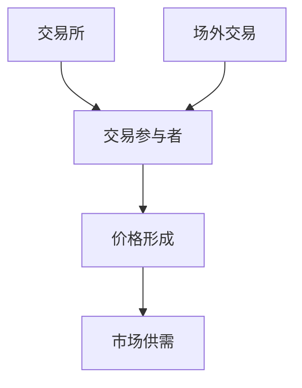
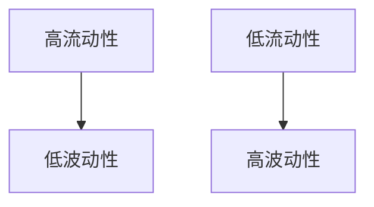
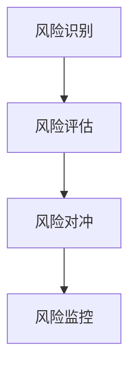
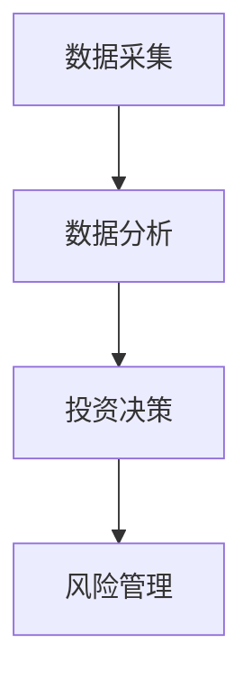
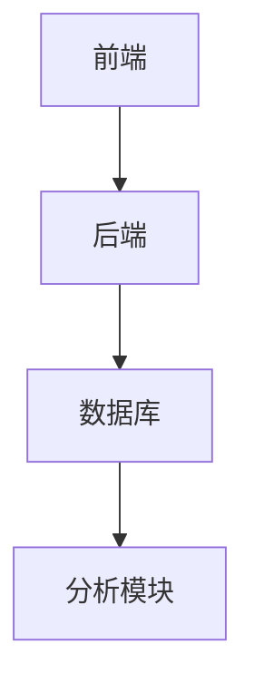

                 


# 吉姆·罗杰斯的大宗商品价值投资：实物资产中的机会

## 关键词：大宗商品投资，吉姆·罗杰斯，实物资产，价值投资，风险管理，投资策略

## 摘要：  
本文深入探讨了吉姆·罗杰斯的大宗商品投资理念，分析了实物资产在投资组合中的重要性，并提供了详细的投资策略和风险管理方法。通过结合实际案例和系统架构，本文为投资者提供了从理论到实践的全面指导。

---

## 第一章：引言

### 1.1 吉姆·罗杰斯的背景与投资理念  
吉姆·罗杰斯是全球著名投资人，以其对市场的深刻洞察和成功投资策略闻名。本文将探讨他在大宗商品领域的投资哲学，解析其对实物资产的重视。

### 1.2 大宗商品投资的背景与重要性  
大宗商品作为实物资产的重要组成部分，是投资组合中的关键配置。本文将介绍大宗商品的基本概念、市场结构及其在投资中的作用。

---

## 第二章：大宗商品基础知识

### 2.1 大宗商品的定义与分类  
大宗商品分为能源、金属和农产品三大类。本节通过表格详细对比各类别特点，帮助读者理解其差异。

| 类别       | 主要品种           | 主要用途           |
|------------|--------------------|--------------------|
| 能源       | 原油、天然气       | 电力、交通         |
| 金属       | 黄金、铜           | 制造业、珠宝       |
| 农产品       | 大豆、小麦         | 食品加工、饲料     |

### 2.2 大宗商品市场的结构  
市场由交易所和场外交易组成，本节将使用Mermaid图展示市场结构。



### 2.3 影响大宗商品价格的因素  
宏观经济因素（如利率）、供需关系和地缘政治风险均对价格产生影响。本节将通过公式分析这些因素的量化关系。

---

## 第三章：大宗商品投资策略

### 3.1 确定投资目标与风险承受能力  
投资目标和风险承受能力是制定策略的基础。本节将使用CAPM模型评估风险收益。

$$ E(r) = R_f + β(E(r_m - R_f)) $$

### 3.2 选择合适的大宗商品投资标的  
本节将通过Mermaid图展示各类资产的流动性与波动性对比。



### 3.3 制定投资计划  
本节将详细讲解如何通过Python代码进行投资组合优化，代码示例如下：

```python
import numpy as np
import pandas as pd

# 示例数据
data = {'原油': [100, 95, 105, 110],
        '黄金': [1200, 1250, 1220, 1230]}
df = pd.DataFrame(data)
print(df)
```

---

## 第四章：大宗商品投资的风险管理

### 4.1 风险评估与控制  
本节将通过Mermaid图展示风险控制流程。



### 4.2 使用衍生工具对冲风险  
本节将讲解如何利用期货对冲价格波动，代码示例如下：

```python
import matplotlib.pyplot as plt

# 示例期货价格
prices = [50, 52, 48, 55]
plt.plot(prices)
plt.title('期货价格走势')
plt.show()
```

---

## 第五章：吉姆·罗杰斯的经典投资案例

### 5.1 案例分析：原油投资  
通过具体案例分析罗杰斯如何利用供需关系做出投资决策，解读其背后的逻辑。

---

## 第六章：大宗商品投资的系统架构

### 6.1 系统功能设计  
本节将通过Mermaid图展示系统功能模块。



### 6.2 系统架构设计  
本节将使用Mermaid图展示系统架构。



---

## 第七章：大宗商品投资实战操作

### 7.1 环境配置与代码实现  
本节将指导读者如何配置投资环境，并通过Python代码进行数据分析。

### 7.2 案例分析与解读  
通过实际案例分析，解读投资策略的应用。

---

## 第八章：总结与展望

### 8.1 总结  
回顾文章主要内容，强调大宗商品投资的重要性。

### 8.2 进一步阅读与学习  
推荐相关书籍和资源，帮助读者深入学习。

---

## 作者：AI天才研究院 & 禅与计算机程序设计艺术

---

通过以上结构，本文系统地介绍了吉姆·罗杰斯的大宗商品投资策略，结合理论与实践，为投资者提供了全面的指导。

