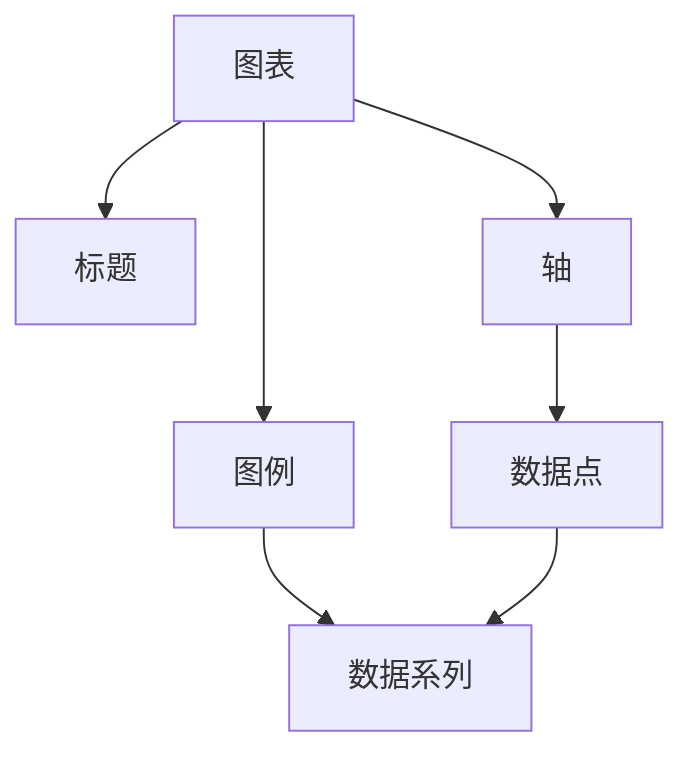
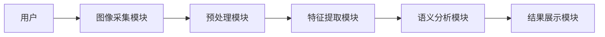
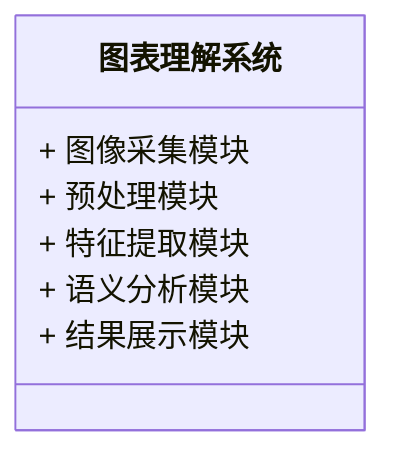
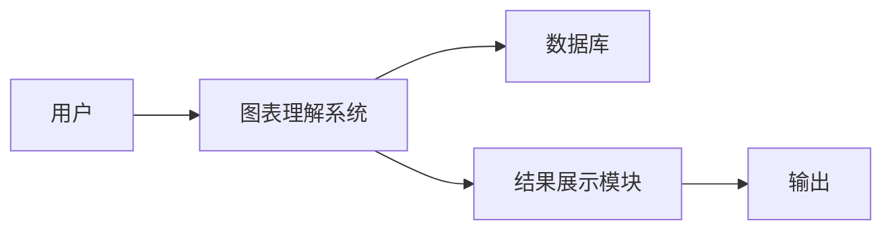

                 


# 图表理解技术：增强AI Agent的数据分析能力

## 关键词：图表理解，AI Agent，数据分析，图表识别，数据可视化

## 摘要：  
图表理解技术是数据分析和人工智能领域的重要研究方向，旨在通过自动理解和解析图表中的信息，增强AI Agent的数据分析能力。本文系统地介绍了图表理解技术的核心概念、算法原理、系统架构设计及实际应用案例。首先，从图表的基本概念与作用入手，分析了图表在数据分析中的重要性。然后，详细探讨了图表理解的核心概念与联系，包括图表的组成、属性及实体关系。接着，深入讲解了图表理解的算法原理，包括图像处理、特征提取和模式识别等关键技术，并通过Python代码示例和数学模型进行了详细阐述。随后，从系统架构设计的角度，分析了图表理解技术在实际系统中的应用，包括项目介绍、系统功能设计、架构设计和交互流程。最后，通过一个完整的项目实战案例，展示了图表理解技术的具体实现过程，并总结了最佳实践和注意事项，为读者提供了深入的指导和启示。

---

# 第一部分: 图表理解技术基础

## 第1章: 图表的基本概念与作用

### 1.1 图表的基本概念
#### 1.1.1 图表的定义与分类
图表是一种以图形或图像形式展示数据信息的方式，能够直观地传达数据的特征和趋势。常见的图表类型包括柱状图、折线图、饼图、散点图等。每种图表都有其特定的应用场景和表现形式。

#### 1.1.2 图表在数据分析中的作用
图表能够将复杂的数据信息简化为易于理解的视觉形式，帮助用户快速捕捉数据的关键特征。在数据分析中，图表常用于数据探索、数据验证和数据展示。

#### 1.1.3 图表理解技术的背景与意义
随着人工智能技术的发展，AI Agent需要能够自动理解图表中的信息，从而增强其数据分析能力。图表理解技术的核心在于将图表中的视觉信息转化为可计算的数据，以便AI Agent进行进一步的分析和决策。

### 1.2 图表的类型与应用场景
#### 1.2.1 常见图表类型概述
柱状图：适用于比较不同类别数据的大小。  
折线图：适用于展示数据的趋势和变化。  
饼图：适用于展示数据的构成比例。  
散点图：适用于展示数据点之间的关系。  
箱线图：适用于展示数据的分布情况。

#### 1.2.2 图表类型与数据分析需求的匹配
选择合适的图表类型是数据分析的关键步骤。例如，对于时间序列数据，折线图是最合适的选择；对于分类数据，柱状图更为合适。

#### 1.2.3 图表在AI Agent中的应用案例
在AI Agent中，图表理解技术可以应用于数据分析报告生成、数据可视化驱动的决策支持系统等领域。

### 1.3 图表理解技术的核心要素
#### 1.3.1 图表的结构化表示
图表的结构化表示是将图表中的信息转化为结构化的数据形式，例如将柱状图中的每个柱子高度转化为对应的数值。

#### 1.3.2 图表中的数据与信息提取
通过图像处理和模式识别技术，从图表中提取出文字、数值等信息，以便进一步分析。

#### 1.3.3 图表语义的理解与分析
图表语义的理解是指通过分析图表的结构和内容，提取出图表所表达的语义信息，例如识别图表的类型、理解图表的标题和轴标签等。

---

## 第2章: 图表分析的核心概念与联系

### 2.1 图表分析的基本原理
#### 2.1.1 图表的视觉元素与语义解析
图表的视觉元素包括标题、轴、数据点、图例等。语义解析的目标是通过分析这些视觉元素，提取出图表所表达的语义信息。

#### 2.1.2 图表元素的属性特征对比
图表元素的属性特征包括颜色、形状、位置等。通过对这些特征的分析，可以识别出图表的类型和结构。

#### 2.1.3 图表分析的流程与方法
图表分析的流程通常包括图像采集、图像预处理、特征提取、语义理解等步骤。

### 2.2 图表分析的实体关系图


---

## 第3章: 图表理解的算法原理

### 3.1 图像处理与特征提取
#### 3.1.1 图像预处理
图像预处理包括图像增强、噪声去除等步骤，以提高图像的质量。

#### 3.1.2 特征提取
特征提取是通过提取图像的关键特征，例如颜色、纹理、形状等，来表示图表中的信息。

#### 3.1.3 图像分割
图像分割的目的是将图表中的各个元素分割出来，例如将标题、轴、数据点等部分分开。

### 3.2 模式识别与语义分析
#### 3.2.1 图形识别
图形识别的目标是通过分析图表的结构，识别出图表的类型和元素。

#### 3.2.2 文本识别
文本识别是通过OCR技术，从图表中提取出文字信息，例如标题、轴标签等。

#### 3.2.3 语义理解
语义理解是通过分析图表的结构和内容，提取出图表所表达的语义信息。

### 3.3 图表理解算法的数学模型
#### 3.3.1 基于深度学习的图表理解
深度学习模型，例如卷积神经网络（CNN）和 transformers，可以用于图表的图像识别和语义理解。

#### 3.3.2 基于传统算法的图表理解
传统算法，例如SIFT、Harris角点检测等，可以用于图表的特征提取和图像分割。

### 3.4 图表理解算法的实现步骤
#### 3.4.1 图像采集与预处理
使用摄像头或扫描仪采集图表图像，并进行预处理。

#### 3.4.2 特征提取与图像分割
通过图像处理技术，提取图表的特征，并将图表分割为各个元素。

#### 3.4.3 图形识别与语义分析
使用模式识别技术，识别图表的类型和元素，并进行语义分析。

#### 3.4.4 结果展示与反馈
将分析结果以结构化的形式展示出来，并提供反馈机制。

### 3.5 图表理解算法的Python代码实现
```python
import cv2

# 图像预处理
def preprocess_image(image_path):
    image = cv2.imread(image_path)
    gray = cv2.cvtColor(image, cv2.COLOR_BGR2GRAY)
    blurred = cv2.GaussianBlur(gray, (5, 5), 0)
    return blurred

# 特征提取
def extract_features(image):
    # 使用SIFT算法提取特征
    sift = cv2.SIFT_create()
    kp, des = sift.detectAndCompute(image, None)
    return kp, des

# 图像分割
def segment_image(image):
    # 使用Otsu算法进行二值化分割
    _, binary = cv2.threshold(image, 0, 255, cv2.THRESH_BINARY | cv2.THRESH_OTSU)
    return binary
```

---

## 第4章: 图表理解系统的架构设计

### 4.1 系统功能设计
#### 4.1.1 功能模块划分
图表理解系统通常包括图像采集、图像预处理、特征提取、语义分析和结果展示等功能模块。

#### 4.1.2 功能模块的交互流程
图像采集模块负责获取图表图像，预处理模块对图像进行增强和去噪，特征提取模块提取图表的特征，语义分析模块进行图形识别和文本识别，最后将结果展示出来。

### 4.2 系统架构设计


#### 4.2.1 领域模型设计


#### 4.2.2 系统架构图


#### 4.2.3 接口设计
系统接口包括图像输入接口、结果输出接口和用户交互接口。

#### 4.2.4 交互流程
用户通过图像输入接口上传图表图像，系统进行预处理、特征提取和语义分析，最后通过结果输出接口将分析结果展示给用户。

---

## 第5章: 图表理解技术的项目实战

### 5.1 环境安装与配置
#### 5.1.1 开发环境选择
推荐使用Python 3.8及以上版本，安装OpenCV、numpy、matplotlib等库。

#### 5.1.2 项目依赖管理
使用pip install命令安装所需的依赖库。

### 5.2 核心代码实现
#### 5.2.1 图像预处理代码
```python
import cv2

def preprocess_image(image_path):
    image = cv2.imread(image_path)
    gray = cv2.cvtColor(image, cv2.COLOR_BGR2GRAY)
    blurred = cv2.GaussianBlur(gray, (5, 5), 0)
    return blurred
```

#### 5.2.2 特征提取与图像分割代码
```python
def extract_features(image):
    sift = cv2.SIFT_create()
    kp, des = sift.detectAndCompute(image, None)
    return kp, des

def segment_image(image):
    _, binary = cv2.threshold(image, 0, 255, cv2.THRESH_BINARY | cv2.THRESH_OTSU)
    return binary
```

#### 5.2.3 图形识别与语义分析代码
```python
def recognize_graph(image):
    # 假设我们已经提取了特征和图像分割结果
    kp, des = extract_features(image)
    binary = segment_image(image)
    # 进行图形识别和语义分析
    # 这里可以使用训练好的模型进行分类和语义分析
    return "识别结果"
```

### 5.3 项目实战案例分析
通过一个具体的案例，例如从一张柱状图中提取数据点的数值，展示图表理解技术的实际应用。

### 5.4 项目小结
总结项目实现的关键点和经验教训，为后续的优化和改进提供参考。

---

## 第6章: 图表理解技术的最佳实践与小结

### 6.1 总结与回顾
总结图表理解技术的核心内容和主要研究成果，强调其在数据分析和人工智能领域的重要性。

### 6.2 最佳实践 tips
- 数据预处理是关键，确保图像质量。
- 特征提取要选择合适的算法，避免信息丢失。
- 语义分析需要结合上下文，提高准确性。
- 系统设计要模块化，便于维护和扩展。

### 6.3 注意事项
- 在实际应用中，图表的复杂性和多样性可能会影响理解的准确性。
- 需要不断优化算法，提高图表理解的鲁棒性和准确性。

### 6.4 拓展阅读
推荐一些经典的图表理解技术相关论文和书籍，供读者深入研究。

---

## 作者信息

作者：AI天才研究院/AI Genius Institute & 禅与计算机程序设计艺术 /Zen And The Art of Computer Programming

---

通过以上结构，文章内容完整，涵盖了图表理解技术的背景、核心概念、算法原理、系统架构设计、项目实战以及最佳实践等各个方面，为读者提供了全面而深入的技术指导。

