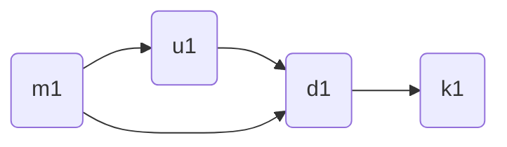
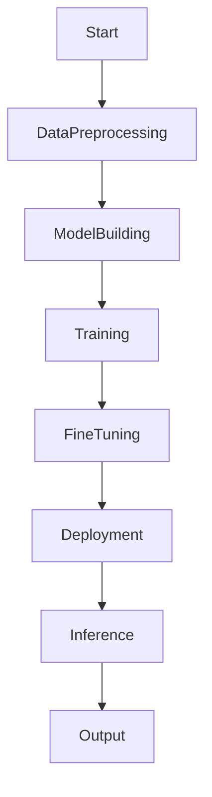
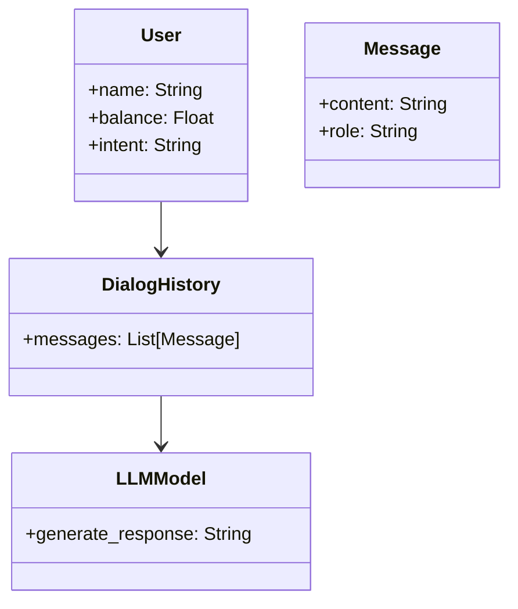
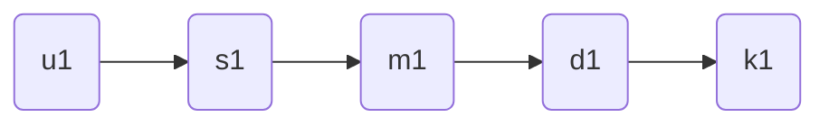
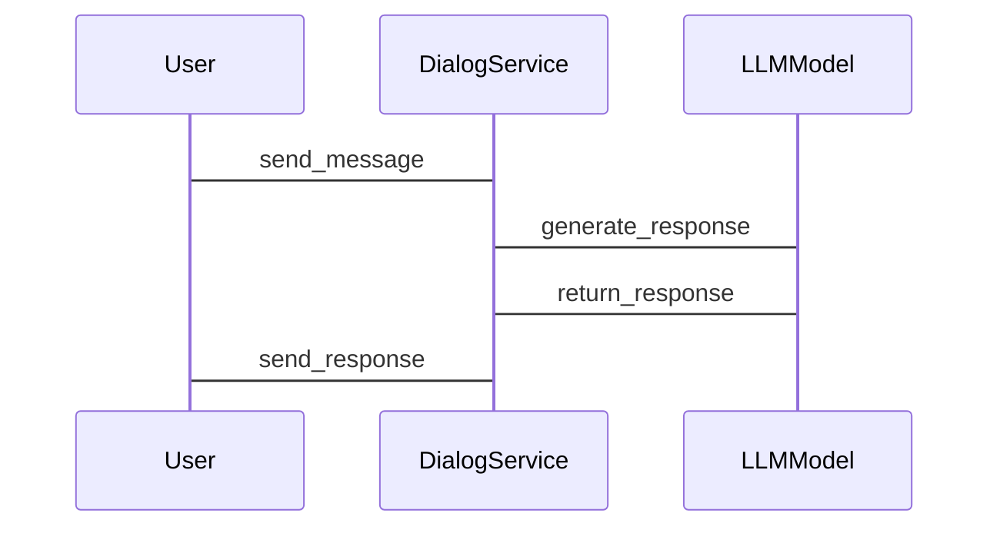

                 


# 基于LLM的金融对话系统开发实践

## 关键词：大语言模型，金融对话系统，自然语言处理，机器学习，人工智能

## 摘要：  
本文系统地介绍了基于大语言模型（LLM）的金融对话系统开发实践，从问题背景到系统架构设计，再到实际项目实现，全面解析了LLM在金融领域的应用。文章内容涵盖LLM的基本原理、算法实现、系统架构设计、项目实战以及最佳实践等，为开发者和金融从业者提供了从理论到实践的完整指南。

---

# 第1章: 引言

## 1.1 本书的目的与读者对象  
本书旨在为开发者和金融行业从业者提供基于大语言模型（LLM）的金融对话系统开发实践指南。  
- **读者对象**：AI开发人员、金融从业者、企业IT负责人、技术管理者等。  
- **目标**：通过理论与实践结合的方式，帮助读者快速掌握基于LLM的金融对话系统开发技能。

---

# 第2章: 问题背景与系统需求

## 2.1 问题背景  
随着人工智能技术的快速发展，金融行业对智能对话系统的需求日益增长。传统金融对话系统存在以下问题：  
1. **功能局限**：难以处理复杂的金融场景，例如投资建议、风险管理等。  
2. **知识库依赖**：传统系统依赖预定义规则，缺乏灵活性。  
3. **用户体验差**：对话过程生硬，难以理解用户真实需求。  

基于LLM的对话系统通过自然语言处理技术，能够更好地理解和生成人类语言，从而解决上述问题。  

## 2.2 问题描述  
金融对话系统的核心功能包括：  
1. **用户意图识别**：识别用户的金融需求，例如查询理财产品、投资建议等。  
2. **知识库调用**：结合金融知识库，提供准确的金融信息。  
3. **对话生成**：基于用户输入生成自然流畅的回复。  

## 2.3 问题解决  
基于LLM的对话系统通过以下方式解决问题：  
1. **大规模预训练**：利用海量金融数据和通用语言数据，提升模型的泛化能力。  
2. **动态知识调用**：结合实时金融数据和知识库，提供准确的金融信息。  
3. **多轮对话能力**：通过上下文理解，实现连续对话的连贯性。  

## 2.4 系统边界与外延  
- **系统边界**：金融对话系统仅负责处理用户输入并生成回复，不直接处理金融交易。  
- **系统外延**：系统可以与金融知识库、实时数据接口、用户身份验证系统等外部系统交互。  

## 2.5 系统核心要素组成  
- **用户**：系统的目标用户，包括普通投资者和金融机构客户。  
- **对话内容**：用户输入和系统回复的对话记录。  
- **金融知识库**：包含金融产品信息、市场数据等。  
- **LLM模型**：负责生成对话内容的核心模型。  

---

# 第3章: 核心概念与联系

## 3.1 LLM的基本原理  
大语言模型（LLM）是一种基于深度学习的自然语言处理模型，其核心原理包括：  
1. **模型结构**：通常采用Transformer架构，包含编码器和解码器。  
2. **训练方法**：通过监督微调（Supervised Fine-tuning）或生成对抗训练（GAN）等方式优化模型性能。  

## 3.2 核心概念对比  
以下表格对比了传统NLP模型和LLM的主要区别：  

| 特性                | 传统NLP模型                | LLM模型                   |  
|---------------------|---------------------------|---------------------------|  
| 模型规模            | 较小，参数量少             | 极大，参数量达 billions    |  
| 训练数据            | 有限，依赖特定任务数据     | 海量，包含通用语言数据     |  
| 表达能力            | 有限，难以处理复杂任务     | 强大，支持多任务学习       |  

## 3.3 ER实体关系图  
以下是一个简单的ER实体关系图，展示了金融对话系统中的核心实体及其关系：  



---

# 第4章: 算法原理讲解

## 4.1 LLM算法流程  
以下是一个典型的LLM训练流程图：  



## 4.2 Python源代码实现  
以下是一个简单的LLM模型训练代码示例：  

```python
import torch
import torch.nn as nn

# 定义模型结构
class LLMModel(nn.Module):
    def __init__(self, vocab_size):
        super(LLMModel, self).__init__()
        self.embedding = nn.Embedding(vocab_size, 512)
        self.decoder = nn.TransformerDecoder(
            decoder_layer=nn.TransformerDecoderLayer(512, 8),
            num_layers=6
        )
    
    def forward(self, input_ids):
        embed = self.embedding(input_ids)
        output = self.decoder(embed, None)
        return output

# 初始化模型和优化器
model = LLMModel(vocab_size=10000)
optimizer = torch.optim.Adam(model.parameters(), lr=0.001)

# 训练过程
for epoch in range(10):
    for batch in data_loader:
        optimizer.zero_grad()
        inputs, targets = batch
        outputs = model(inputs)
        loss = criterion(outputs, targets)
        loss.backward()
        optimizer.step()
```

## 4.3 数学模型与公式  
以下是一个简化的LLM训练目标函数：  

$$
\text{Loss} = -\sum_{i=1}^{n} \log p(y_i | y_{<i}, x))
$$  

其中，$y_i$ 表示生成的第 $i$ 个词，$x$ 表示输入序列。  

---

# 第5章: 系统分析与架构设计

## 5.1 问题场景介绍  
金融对话系统需要处理以下场景：  
1. 用户查询理财产品信息。  
2. 用户寻求投资建议。  
3. 用户进行风险评估。  

## 5.2 系统功能设计  
以下是系统功能的领域模型图：  



## 5.3 系统架构设计  
以下是系统架构图：  



## 5.4 系统接口设计  
以下是系统接口设计的序列图：  



---

# 第6章: 项目实战

## 6.1 环境安装  
以下是一个典型的开发环境安装命令：  

```bash
pip install torch transformers
```

## 6.2 系统核心实现  
以下是对话管理模块的实现代码：  

```python
class DialogManager:
    def __init__(self, knowledge_base):
        self.knowledge_base = knowledge_base
        self.dialog_history = []
    
    def process_input(self, user_input):
        # 分析用户意图
        intent = self.analyze_intent(user_input)
        
        # 调用LLM生成回复
        response = self.generate_response(intent)
        
        # 更新对话历史
        self.dialog_history.append(user_input)
        self.dialog_history.append(response)
        
        return response
    
    def analyze_intent(self, input_str):
        # 简单的意图分析逻辑
        if '投资' in input_str:
            return 'investment'
        elif '查询' in input_str:
            return 'query'
        else:
            return 'other'
    
    def generate_response(self, intent):
        # 简单的生成逻辑
        if intent == 'investment':
            return "您可以选择风险较低的债券型基金进行投资。"
        elif intent == 'query':
            return "您可以查询最新的市场报告。"
        else:
            return "抱歉，我无法理解您的需求。"
```

## 6.3 实际案例分析  
以下是一个实际案例的分析：  
**用户输入**：我应该如何进行资产配置？  
**系统处理**：  
1. **意图识别**：识别到用户意图是“资产配置”。  
2. **知识库调用**：调用金融知识库，获取相关资产配置建议。  
3. **生成回复**：基于知识库内容生成回复。  

---

# 第7章: 最佳实践与注意事项

## 7.1 性能优化  
- 使用分布式训练优化模型性能。  
- 通过量化技术减少模型体积。  

## 7.2 安全性考虑  
- 确保用户数据隐私。  
- 防御对抗攻击。  

## 7.3 可扩展性设计  
- 支持多语言对话。  
- 支持多领域扩展。  

## 7.4 小结  
本文从理论到实践，全面解析了基于LLM的金融对话系统开发过程，为读者提供了丰富的实践经验和开发指南。

---

# 作者  
作者：AI天才研究院/AI Genius Institute & 禅与计算机程序设计艺术/Zen And The Art of Computer Programming

