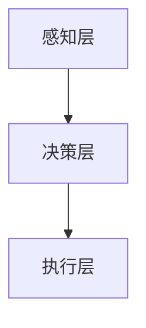

                 


# 基于Transformer的AI Agent架构设计

> **关键词**：Transformer, AI Agent, 自注意力机制, 多模态任务, 系统架构设计, 智能决策, 自然语言处理

> **摘要**：本文详细探讨了基于Transformer的AI Agent架构设计，从Transformer模型的基本原理到其在AI Agent中的应用，再到系统的架构设计、实现与优化。文章通过理论分析与实际案例相结合的方式，为读者提供了一个全面理解基于Transformer的AI Agent架构的视角。

---

# 第1章：Transformer与AI Agent概述

## 1.1 Transformer的基本概念

### 1.1.1 Transformer的定义
Transformer是由Vaswney等人提出的革命性模型，主要用于自然语言处理任务。其核心思想是将序列数据转换为可并行处理的结构。

### 1.1.2 Transformer的核心特点
- **自注意力机制**：模型能够关注输入序列中不同的位置，捕捉长距离依赖关系。
- **可并行计算**：通过分解计算过程，显著提升了计算效率。
- **多模态适应性**：通过调整架构，可以应用于文本、图像等多种数据类型。

### 1.1.3 Transformer与传统模型的区别
- **传统模型**：如RNN和LSTM，依赖序列处理，计算复杂度高，难以并行。
- **Transformer**：基于并行计算，处理速度快，适合大规模数据。

## 1.2 AI Agent的基本概念

### 1.2.1 AI Agent的定义
AI Agent是一种智能体，能够感知环境、做出决策并执行动作，以实现特定目标。

### 1.2.2 AI Agent的核心特点
- **自主性**：无需外部干预，自主完成任务。
- **反应性**：能够实时感知环境并做出反应。
- **社会性**：能够与其他智能体或人类进行交互。

### 1.2.3 AI Agent与传统AI的区别
- **传统AI**：基于规则或专家系统，缺乏自主性和适应性。
- **AI Agent**：具备自主决策和环境交互能力。

## 1.3 Transformer在AI Agent中的作用

### 1.3.1 Transformer在自然语言处理中的应用
- **文本生成**：通过自注意力机制生成连贯文本。
- **机器翻译**：利用编码器和解码器实现多语言翻译。

### 1.3.2 Transformer在智能决策中的应用
- **决策优化**：通过分析上下文，做出最优决策。
- **策略学习**：利用Transformer模型进行策略预测。

### 1.3.3 Transformer在多模态任务中的应用
- **多模态交互**：结合文本、图像等多种数据，提升决策准确性。

---

# 第2章：Transformer模型的结构与原理

## 2.1 Transformer模型的结构

### 2.1.1 编码器和解码器的结构
- **编码器**：将输入序列转换为高维向量。
- **解码器**：根据编码器输出生成目标序列。

### 2.1.2 自注意力机制的实现
- **自注意力计算**：通过查询、键、值的计算，确定每个位置的重要性。

### 2.1.3 前馈神经网络的实现
- **前馈网络结构**：多层感知机，用于非线性变换。

## 2.2 自注意力机制的数学模型

### 2.2.1 自注意力机制的公式推导
$$
\text{Attention}(Q, K, V) = \text{softmax}\left(\frac{QK^T}{\sqrt{d_k}}\right)V
$$

其中，$Q$、$K$、$V$分别为查询、键、值向量，$d_k$为键的维度。

### 2.2.2 多头注意力机制的原理
- **多头注意力**：通过并行计算多个注意力头，提升模型的表达能力。

---

# 第3章：AI Agent的核心算法与任务

## 3.1 AI Agent的感知、决策与执行机制

### 3.1.1 感知机制
- **环境感知**：通过传感器或数据输入，获取环境信息。

### 3.1.2 决策机制
- **策略网络**：基于感知信息，生成决策动作。

### 3.1.3 执行机制
- **动作执行**：根据决策结果，执行具体动作。

## 3.2 Transformer在AI Agent任务中的应用

### 3.2.1 任务场景分析
- **自然语言理解**：通过Transformer模型理解用户输入。
- **多轮对话**：利用自注意力机制进行上下文理解。

---

# 第4章：基于Transformer的AI Agent系统架构设计

## 4.1 系统架构的模块划分

### 4.1.1 模块划分
- **感知层**：负责数据输入和环境感知。
- **决策层**：基于感知信息，生成决策。
- **执行层**：根据决策，执行具体动作。

### 4.1.2 模块间关系
- **数据流**：感知层 → 决策层 → 执行层。

## 4.2 系统架构设计的Mermaid图


---

# 第5章：系统实现与项目实战

## 5.1 项目实战：智能对话系统

### 5.1.1 环境配置
- **工具安装**：安装Python、TensorFlow等开发工具。

### 5.1.2 核心代码实现
```python
import tensorflow as tf
from tensorflow import keras

def transformer_block(units, d_model, num_heads):
    return keras.layers.MultiHeadAttention(num_heads, d_model//num_heads)
```

### 5.1.3 案例分析
- **对话系统设计**：基于Transformer模型实现多轮对话。

---

# 第6章：系统优化与性能调优

## 6.1 模型优化策略

### 6.1.1 模型压缩
- **参数剪枝**：去除冗余参数，降低模型复杂度。

### 6.1.2 并行计算
- **分布式训练**：利用多GPU加速模型训练。

---

# 结语

基于Transformer的AI Agent架构设计为智能系统的发展提供了新的方向。通过深入理解Transformer模型的原理和AI Agent的核心机制，我们可以设计出更加高效、智能的系统架构。未来，随着技术的进步，AI Agent将在更多领域展现其强大的应用潜力。

---

**作者：AI天才研究院（AI Genius Institute）**

