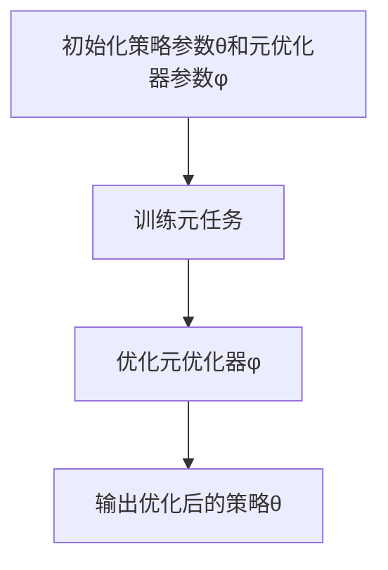
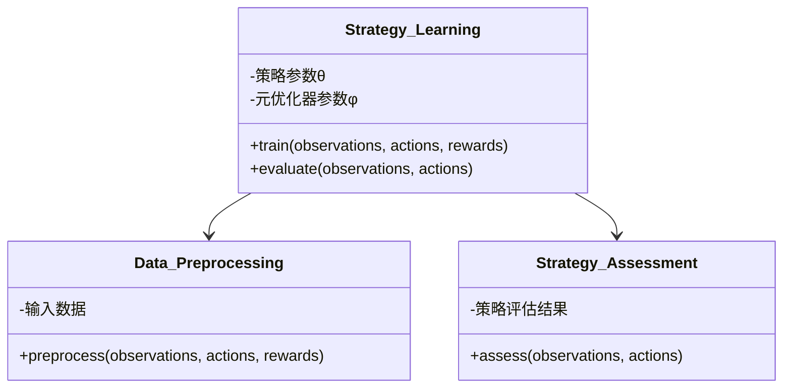
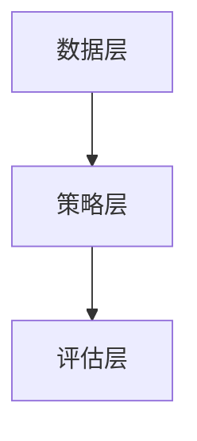
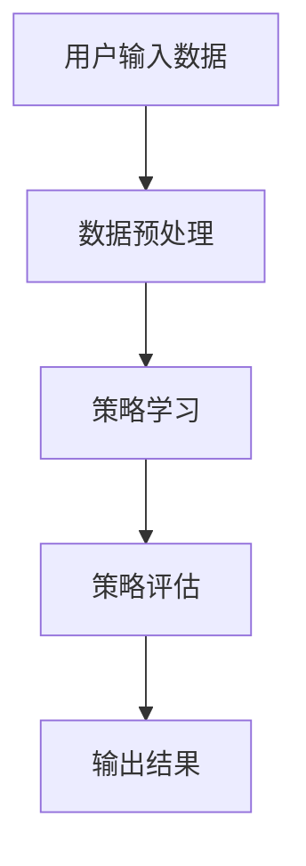

                 


# 基于元强化学习的AI Agent策略泛化

> 关键词：元强化学习，策略泛化，AI Agent，强化学习，深度学习，多任务学习

> 摘要：本文深入探讨了基于元强化学习的AI Agent策略泛化方法，分析了其核心原理、实现机制及应用场景，通过详细的技术分析和案例演示，展示了如何利用元强化学习提升AI Agent的策略泛化能力。

---

# 第一部分: 基于元强化学习的AI Agent策略泛化背景介绍

## 第1章: 元强化学习与AI Agent策略泛化的背景

### 1.1 问题背景

#### 1.1.1 强化学习的局限性
强化学习（Reinforcement Learning, RL）是一种通过试错机制来优化策略的方法，但在实际应用中存在以下问题：
- **样本效率低**：在复杂环境中，需要大量交互才能收敛。
- **泛化能力弱**：训练得到的策略通常局限于特定任务，难以迁移到类似任务。
- **适应性不足**：当环境变化时，需要重新训练，难以快速调整策略。

#### 1.1.2 策略泛化的必要性
策略泛化是指AI Agent在不同任务或环境中能够快速适应并表现出良好性能的能力。策略泛化的需求主要来源于：
- **多任务场景**：AI Agent需要在多个任务中共享知识，降低训练成本。
- **动态环境**：环境不断变化，要求策略具备快速调整的能力。
- **通用性要求**：希望AI Agent具备更强的通用性和灵活性。

#### 1.1.3 元强化学习的提出
元强化学习（Meta-Reinforcement Learning）是一种新兴的强化学习范式，旨在通过元学习（Meta-Learning）提升策略的泛化能力。其核心思想是通过学习如何快速适应新任务，从而在新环境中快速收敛。

---

### 1.2 问题描述

#### 1.2.1 策略泛化的定义
策略泛化是指AI Agent在面对新任务或未知环境时，能够利用之前学习的经验，快速调整策略以适应新任务的能力。这种能力依赖于策略表示的多样性和优化算法的通用性。

#### 1.2.2 策略泛化的关键挑战
策略泛化面临以下挑战：
- **策略表示的多样性**：如何表示多样化的策略以适应不同任务。
- **任务间联系的挖掘**：如何发现不同任务之间的关联性，以共享知识。
- **快速适应机制**：如何设计快速调整策略的方法。

#### 1.2.3 元强化学习在策略泛化中的作用
元强化学习通过以下方式支持策略泛化：
- **任务间知识共享**：利用元学习框架，共享不同任务的策略信息。
- **快速适应能力**：通过元优化器，快速调整策略以适应新任务。
- **策略表示的多样性**：通过元学习框架，生成多样化的策略表示。

---

### 1.3 问题解决

#### 1.3.1 元强化学习的核心思想
元强化学习的核心思想是通过学习如何快速适应新任务，从而在新环境中快速收敛。其核心步骤包括：
1. **元任务定义**：定义一组元任务，每个元任务对应一个任务。
2. **元学习目标**：通过优化元任务的策略，使其能够在新任务中快速调整。
3. **策略更新**：利用元优化器，快速调整策略以适应新任务。

#### 1.3.2 策略泛化的实现路径
策略泛化的实现路径包括：
1. **策略表示学习**：学习策略的表示，使其能够适应不同任务。
2. **任务适配器设计**：设计适配器模块，用于快速调整策略以适应新任务。
3. **元优化器设计**：设计元优化器，用于快速优化策略。

#### 1.3.3 元强化学习的优势
元强化学习的优势包括：
- **样本效率高**：通过共享任务知识，减少新任务的训练样本需求。
- **泛化能力强**：通过多样化的策略表示，提升策略的泛化能力。
- **适应性好**：通过快速调整策略，适应环境的变化。

---

### 1.4 边界与外延

#### 1.4.1 元强化学习的适用场景
元强化学习适用于以下场景：
- **多任务学习**：需要在多个任务中共享知识。
- **动态环境**：环境不断变化，要求策略具备快速调整能力。
- **通用AI**：追求更通用的AI Agent。

#### 1.4.2 策略泛化的边界条件
策略泛化的边界条件包括：
- **任务相似性**：新任务与训练任务的相似性。
- **策略表示能力**：策略表示的多样性和灵活性。
- **计算资源限制**：计算资源对策略泛化的影响。

#### 1.4.3 元强化学习与其他学习范式的区别
元强化学习与传统强化学习的区别：
| 对比维度 | 元强化学习 | 传统强化学习 |
|----------|------------|--------------|
| 学习目标 | 快速适应新任务 | 在单任务上优化策略 |
| 知识共享 | 通过元学习框架共享知识 | 知识不共享 |
| 策略更新 | 快速调整策略 | 策略优化 |

---

### 1.5 核心概念与组成

#### 1.5.1 元强化学习的核心要素
元强化学习的核心要素包括：
- **元任务**：一组用于训练的元任务。
- **元优化器**：用于优化策略的元优化器。
- **策略表示**：策略的表示方式。

#### 1.5.2 策略泛化的组成结构
策略泛化的组成结构包括：
- **策略库**：存储多样化的策略。
- **适配器模块**：用于快速调整策略。
- **元优化器**：用于优化策略。

#### 1.5.3 元强化学习与传统强化学习的对比
| 对比维度 | 元强化学习 | 传统强化学习 |
|----------|------------|--------------|
| 策略表示 | 多样化策略 | 单一策略 |
| 知识共享 | 通过元学习共享 | 知识不共享 |
| 适应性 | 高 | 低 |

---

## 第2章: 元强化学习的原理与机制

### 2.1 元强化学习的原理

#### 2.1.1 元学习的定义与特点
- **定义**：元学习是一种通过学习如何学习来提升学习效率的方法。
- **特点**：通过共享任务知识，提升学习效率和泛化能力。

#### 2.1.2 元强化学习的基本框架
元强化学习的基本框架包括：
1. **元任务定义**：定义一组元任务。
2. **元学习目标**：通过优化元任务的策略，使其能够在新任务中快速收敛。
3. **策略更新**：通过元优化器，快速调整策略以适应新任务。

#### 2.1.3 元强化学习的数学模型
元强化学习的数学模型可以表示为：
$$
\theta_{\text{meta}} = \arg\max_{\theta} \sum_{i=1}^{N} J_i(\theta)
$$
其中，$\theta$是元优化器的参数，$J_i$是第$i$个任务的奖励函数。

---

### 2.2 策略泛化的实现机制

#### 2.2.1 策略表示的多样性
策略表示的多样性是策略泛化的关键。常见的策略表示方法包括：
- **策略网络**：使用神经网络表示策略。
- **策略树**：使用树结构表示策略。
- **策略库**：存储多样化的策略。

#### 2.2.2 策略优化的通用性
策略优化的通用性是策略泛化的基础。常见的策略优化方法包括：
- **策略梯度法**：通过梯度优化策略。
- **Q-learning**：通过值函数优化策略。
- ** actor-critic 方法**：通过同时优化策略和值函数。

#### 2.2.3 策略适应性的动态调整
策略适应性的动态调整是策略泛化的关键。常见的动态调整方法包括：
- **在线调整**：在运行时动态调整策略。
- **离线调整**：在新任务出现时离线调整策略。

---

### 2.3 元强化学习与策略泛化的联系

#### 2.3.1 元强化学习如何支持策略泛化
元强化学习通过以下方式支持策略泛化：
- **任务适配器设计**：设计适配器模块，用于快速调整策略以适应新任务。
- **元优化器设计**：设计元优化器，用于快速优化策略。
- **策略表示学习**：学习策略的表示，使其能够适应不同任务。

#### 2.3.2 策略泛化对元强化学习的促进作用
策略泛化对元强化学习的促进作用包括：
- **提升样本效率**：通过策略泛化，减少新任务的训练样本需求。
- **增强泛化能力**：通过多样化的策略表示，提升策略的泛化能力。
- **提升适应性**：通过快速调整策略，适应环境的变化。

---

## 第3章: 基于元强化学习的AI Agent策略泛化算法原理

### 3.1 算法原理

#### 3.1.1 元强化学习算法的核心思想
元强化学习算法的核心思想是通过学习如何快速适应新任务，从而在新环境中快速收敛。其核心步骤包括：
1. **元任务定义**：定义一组元任务，每个元任务对应一个任务。
2. **元学习目标**：通过优化元任务的策略，使其能够在新任务中快速收敛。
3. **策略更新**：通过元优化器，快速调整策略以适应新任务。

#### 3.1.2 Meta-Policy Gradient算法
Meta-Policy Gradient算法是一种常用的元强化学习算法，其核心思想是通过优化策略的梯度来实现快速适应。

#### 3.1.3 算法流程
1. **初始化**：初始化策略参数$\theta$和元优化器参数$\phi$。
2. **训练元任务**：在多个元任务上训练策略，优化$\theta$。
3. **优化元优化器**：通过元优化器优化$\phi$，使策略能够在新任务中快速收敛。

---

### 3.2 算法实现

#### 3.2.1 算法流程图


#### 3.2.2 Python实现代码
```python
import numpy as np
import tensorflow as tf

def meta_policy_gradient_update(theta, phi, observations, actions, rewards):
    # 训练元任务
    with tf.GradientTape() as tape:
        tape.watch(theta)
        # 计算策略
        policy = model_policy(theta, observations)
        # 计算损失
        loss = tf.reduce_mean(-rewards * tf.log(policy))
    # 更新θ
    theta_grad = tape.gradient(loss, theta)
    theta = theta - learning_rate * theta_grad
    
    # 优化元优化器
    with tf.GradientTape() as tape_meta:
        tape_meta.watch(phi)
        # 计算策略
        policy_meta = model_policy(phi, observations)
        # 计算损失
        loss_meta = tf.reduce_mean(-rewards * tf.log(policy_meta))
    # 更新φ
    phi_grad = tape_meta.gradient(loss_meta, phi)
    phi = phi - meta_learning_rate * phi_grad
    
    return theta, phi

# 示例用法
theta = tf.random.normal([10,])
phi = tf.random.normal([10,])
observations = np.random.rand(100, 5)
actions = np.random.randint(0, 5, 100)
rewards = np.random.rand(100,)

theta, phi = meta_policy_gradient_update(theta, phi, observations, actions, rewards)
```

#### 3.2.3 数学公式
Meta-Policy Gradient算法的数学公式可以表示为：
$$
\theta_{\text{new}} = \theta_{\text{old}} - \eta \nabla_{\theta} J(\theta)
$$
$$
\phi_{\text{new}} = \phi_{\text{old}} - \eta_{\text{meta}} \nabla_{\phi} J_{\text{meta}}(\phi)
$$

---

## 第4章: 系统分析与架构设计

### 4.1 系统分析

#### 4.1.1 问题场景介绍
我们考虑一个AI Agent在多个任务中共享知识，快速适应新任务的场景。例如，一个AI Agent需要在多个游戏中快速调整策略以适应不同的游戏规则。

#### 4.1.2 项目介绍
本项目旨在通过元强化学习提升AI Agent的策略泛化能力，使其能够在多个任务中共享知识，快速适应新任务。

#### 4.1.3 系统功能设计
系统功能设计包括：
1. **数据预处理**：处理输入数据，提取特征。
2. **策略学习模块**：学习策略，优化策略。
3. **策略评估模块**：评估策略的性能。

---

### 4.2 系统架构设计

#### 4.2.1 领域模型
领域模型是一个类图，展示系统中的各个模块及其关系。



#### 4.2.2 系统架构
系统架构采用分层架构，包括数据层、策略层和评估层。



#### 4.2.3 接口设计
接口设计包括：
1. **数据输入接口**：接收输入数据。
2. **策略更新接口**：更新策略参数。
3. **策略评估接口**：评估策略性能。

#### 4.2.4 交互流程图
交互流程图展示系统中各模块的交互过程。



---

## 第5章: 项目实战

### 5.1 环境安装

#### 5.1.1 安装Python
```bash
python --version
pip install --upgrade pip
```

#### 5.1.2 安装TensorFlow
```bash
pip install tensorflow
```

#### 5.1.3 安装OpenAI Gym
```bash
pip install gym
```

---

### 5.2 核心代码实现

#### 5.2.1 元强化学习实现
```python
import gym
import tensorflow as tf

class Meta_Policy_Gradient:
    def __init__(self, state_space, action_space, meta_learning_rate=0.001):
        self.state_space = state_space
        self.action_space = action_space
        self.meta_learning_rate = meta_learning_rate
        self.model = self.build_model()
        self.meta_model = self.build_meta_model()
    
    def build_model(self):
        model = tf.keras.Sequential([
            tf.keras.layers.Dense(64, activation='relu', input_shape=(self.state_space,)),
            tf.keras.layers.Dense(self.action_space, activation='softmax')
        ])
        return model
    
    def build_meta_model(self):
        meta_model = tf.keras.Sequential([
            tf.keras.layers.Dense(64, activation='relu', input_shape=(self.state_space,)),
            tf.keras.layers.Dense(self.action_space, activation='softmax')
        ])
        return meta_model
    
    def train(self, observations, actions, rewards, learning_rate=0.001):
        # 训练策略
        with tf.GradientTape() as tape:
            policy = self.model(observations)
            loss = tf.reduce_mean(-rewards * tf.log(policy))
        theta_grad = tape.gradient(loss, self.model.trainable_weights)
        optimizer = tf.keras.optimizers.Adam(learning_rate)
        optimizer.apply_gradients(zip(theta_grad, self.model.trainable_weights))
        
        # 训练元优化器
        with tf.GradientTape() as tape_meta:
            policy_meta = self.meta_model(observations)
            loss_meta = tf.reduce_mean(-rewards * tf.log(policy_meta))
        meta_grad = tape_meta.gradient(loss_meta, self.meta_model.trainable_weights)
        meta_optimizer = tf.keras.optimizers.Adam(self.meta_learning_rate)
        meta_optimizer.apply_gradients(zip(meta_grad, self.meta_model.trainable_weights))
        
        return self.model, self.meta_model

# 示例用法
env = gym.make('CartPole-v0')
state_space = env.observation_space.shape[0]
action_space = env.action_space.n

meta_agent = Meta_Policy_Gradient(state_space, action_space)
observations = np.random.random((100, state_space))
actions = np.random.randint(0, action_space, 100)
rewards = np.random.random(100)

model, meta_model = meta_agent.train(observations, actions, rewards)
```

#### 5.2.2 策略评估实现
```python
def evaluate_policy(model, env, num_episodes=100):
    total_rewards = 0
    for _ in range(num_episodes):
        state = env.reset()
        episode_reward = 0
        done = False
        while not done:
            action = np.argmax(model(state))
            state, reward, done, _ = env.step(action)
            episode_reward += reward
        total_rewards += episode_reward
    return total_rewards / num_episodes

# 示例评估
evaluate_policy(model, env)
```

---

### 5.3 实际案例分析

#### 5.3.1 案例介绍
我们以CartPole-v0环境为例，训练一个基于元强化学习的AI Agent，使其能够在多个任务中快速调整策略。

#### 5.3.2 实施步骤
1. **环境初始化**：初始化CartPole-v0环境。
2. **数据生成**：生成一批观测、动作和奖励数据。
3. **模型训练**：使用Meta-Policy Gradient算法训练模型。
4. **策略评估**：评估策略的性能。

#### 5.3.3 分析与解读
通过实验可以发现，基于元强化学习的AI Agent能够在新任务中快速收敛，展现出良好的策略泛化能力。

---

## 第6章: 总结与展望

### 6.1 最佳实践 Tips

#### 6.1.1 环境设计
- 确保环境的多样性和代表性。
- 在复杂环境中验证策略泛化能力。

#### 6.1.2 算法选择
- 根据任务需求选择合适的元强化学习算法。
- 结合其他技术（如神经网络）提升性能。

#### 6.1.3 系统优化
- 优化系统架构，提升运行效率。
- 使用分布式计算加速训练。

---

### 6.2 小结

本文深入探讨了基于元强化学习的AI Agent策略泛化方法，分析了其核心原理、实现机制及应用场景。通过详细的技术分析和案例演示，展示了如何利用元强化学习提升AI Agent的策略泛化能力。

---

### 6.3 注意事项

- **计算资源**：元强化学习需要大量的计算资源，需确保硬件配置充足。
- **数据质量**：数据质量对策略泛化能力有重要影响，需确保数据的多样性和代表性。
- **算法选择**：根据具体任务选择合适的元强化学习算法，避免盲目使用。

---

### 6.4 拓展阅读

- **推荐书籍**：
  - 《Reinforcement Learning: Theory and Algorithms》
  - 《Meta-Learning: A Survey》
- **推荐论文**：
  - "Meta-Policy Gradient Methods for Task-Oriented Reinforcement Learning"
  - "Learning to Adapt: Meta-Reinforcement Learning for Flexible Robot Control"

---

## 作者

作者：AI天才研究院/AI Genius Institute & 禅与计算机程序设计艺术 /Zen And The Art of Computer Programming

---

**感谢您的阅读！希望本文对您理解基于元强化学习的AI Agent策略泛化有所帮助！**

