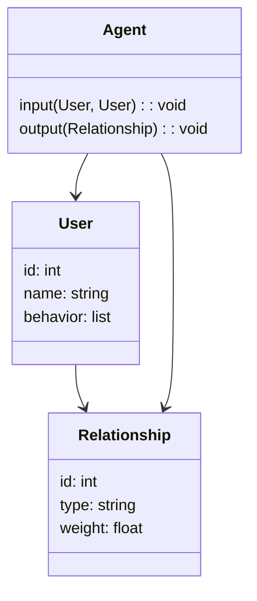
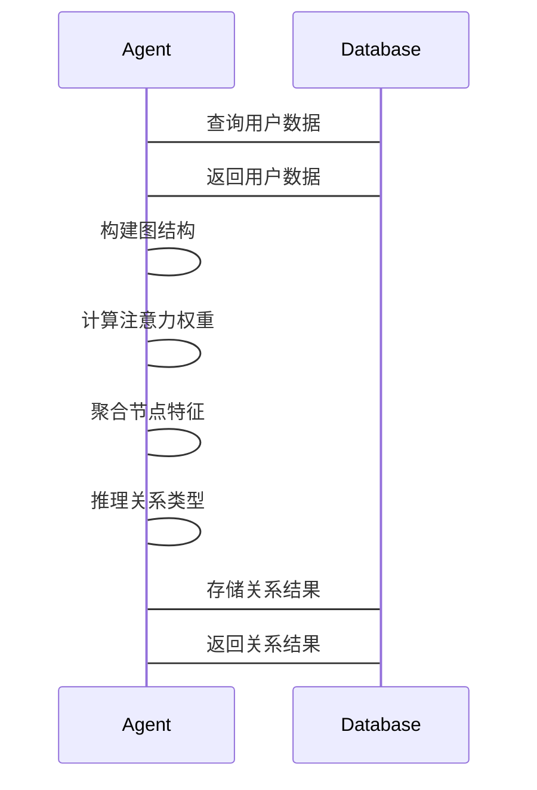

                 


# 基于图注意力网络的AI Agent关系推理

> 关键词：图注意力网络，AI Agent，关系推理，深度学习，图神经网络，注意力机制

> 摘要：本文深入探讨了基于图注意力网络的AI Agent关系推理方法，分析了图注意力网络的核心原理及其在AI Agent中的应用，详细介绍了图注意力网络在关系推理中的数学模型和算法实现，结合实际案例展示了如何构建基于图注意力网络的AI Agent关系推理系统。文章内容涵盖了从理论基础到系统实现的全过程，为读者提供了全面的技术指导。

---

# 第1章: 图注意力网络与AI Agent概述

## 1.1 图注意力网络的基本概念

### 1.1.1 图注意力网络的定义
图注意力网络（Graph Attention Network，GAT）是一种结合图结构和注意力机制的深度学习模型，用于处理图数据中的节点关系和特征信息。

### 1.1.2 图注意力网络的核心特点
- **节点关系建模**：能够捕捉图中节点之间的复杂关系。
- **全局注意力**：通过注意力机制，模型可以关注重要的节点和边，提升特征表达能力。
- **可解释性**：注意力权重可以解释节点之间的关系重要性。

### 1.1.3 图注意力网络与传统图神经网络的对比
| 特性               | 图注意力网络（GAT） | 传统图神经网络（如GCN） |
|--------------------|---------------------|--------------------------|
| 关注全局关系       | 是                 | 否                       |
| 注意力权重可解释    | 是                 | 否                       |
| 处理长距离依赖      | 是                 | 否                       |

---

## 1.2 AI Agent的基本概念

### 1.2.1 AI Agent的定义
AI Agent（人工智能代理）是一种能够感知环境、自主决策并执行任务的智能体。

### 1.2.2 AI Agent的核心功能与应用场景
- **感知环境**：通过传感器或数据输入获取环境信息。
- **决策与推理**：基于感知信息进行推理和决策。
- **执行任务**：通过执行机构或算法实现目标。

### 1.2.3 AI Agent与传统AI的区别
- **自主性**：AI Agent具有自主决策能力。
- **动态性**：能够适应动态变化的环境。
- **交互性**：能够与人类或其他智能体进行交互。

---

## 1.3 图注意力网络在AI Agent中的应用

### 1.3.1 图注意力网络在关系推理中的作用
- **建模复杂关系**：图注意力网络能够捕捉节点之间的复杂关系。
- **注意力机制**：通过注意力权重，模型可以关注重要的关系信息。

### 1.3.2 图注意力网络如何提升AI Agent的智能性
- **关系推理能力**：通过图注意力网络，AI Agent能够更好地理解实体之间的关系。
- **决策能力**：基于关系推理结果，AI Agent可以做出更智能的决策。

### 1.3.3 图注意力网络在AI Agent中的具体应用场景
- **社交网络分析**：分析用户之间的关系。
- **知识图谱推理**：推理实体之间的关系。
- **推荐系统**：基于用户行为推荐相关内容。

---

## 1.4 本章小结
本章介绍了图注意力网络和AI Agent的基本概念，分析了图注意力网络在AI Agent中的应用价值，为后续章节奠定了理论基础。

---

# 第2章: 图注意力网络的核心原理

## 2.1 图注意力网络的基本结构

### 2.1.1 图的表示与节点关系
图由节点和边组成，节点表示实体，边表示实体之间的关系。

### 2.1.2 注意力机制在图结构中的应用
- **注意力权重计算**：通过计算节点之间的注意力权重，确定节点之间的关系重要性。
- **特征聚合**：基于注意力权重，聚合节点特征。

### 2.1.3 图注意力网络的数学模型
图注意力网络的数学模型可以表示为：
$$
a_{ij} = \text{softmax}(W_a h_i^T h_j)
$$
其中，$a_{ij}$ 是节点 $i$ 和 $j$ 之间的注意力权重，$h_i$ 和 $h_j$ 是节点的特征向量。

---

## 2.2 图注意力机制的算法流程

### 2.2.1 图注意力网络的输入与输出
- **输入**：图的邻接矩阵和节点特征矩阵。
- **输出**：节点的注意力表示。

### 2.2.2 注意力权重的计算过程
1. 计算节点特征的线性变换。
2. 计算节点之间的注意力权重。
3. 聚合节点特征，得到节点的注意力表示。

### 2.2.3 图注意力网络的训练与优化
- **损失函数**：交叉熵损失或均方误差。
- **优化算法**：Adam优化器。

---

## 2.3 图注意力网络的优势与挑战

### 2.3.1 图注意力网络的优势
- **全局注意力**：能够捕捉全局关系。
- **可解释性**：注意力权重可以解释模型决策。

### 2.3.2 图注意力网络的挑战
- **计算复杂度**：注意力机制计算量较大。
- **模型训练难度**：需要大量标注数据。

### 2.3.3 图注意力网络的未来发展方向
- **轻量化设计**：降低计算复杂度。
- **多模态融合**：结合文本、图像等多种模态信息。

---

## 2.4 本章小结
本章详细讲解了图注意力网络的核心原理，包括基本结构、算法流程以及优势与挑战，为后续章节的应用奠定了理论基础。

---

# 第3章: AI Agent关系推理的核心任务

## 3.1 关系推理的基本概念

### 3.1.1 关系推理的定义
关系推理是通过分析实体之间的关系，推断出实体之间的关联性。

### 3.1.2 关系推理的核心任务
- **关系建模**：建立实体之间的关系模型。
- **关系推理**：基于关系模型，推理实体之间的关系。

### 3.1.3 关系推理的评价指标
| 指标             | 定义                                   |
|------------------|--------------------------------------|
| 准确率           | 推理结果与真实结果一致的比例         |
| 召回率           | 推理结果中正确的关系数占真实关系数的比例 |
| F1值             | 准确率和召回率的调和平均值           |

---

## 3.2 图注意力网络在关系推理中的应用

### 3.2.1 图注意力网络如何建模关系
- **注意力权重**：注意力权重表示节点之间关系的重要性。
- **特征聚合**：基于注意力权重，聚合节点特征，得到节点的注意力表示。

### 3.2.2 图注意力网络在关系推理中的优势
- **全局视角**：能够捕捉全局关系。
- **注意力机制**：能够关注重要的关系信息。

### 3.2.3 图注意力网络在关系推理中的具体实现
1. 构建图结构，包括节点和边。
2. 计算节点之间的注意力权重。
3. 聚合节点特征，得到节点的注意力表示。
4. 基于注意力表示，进行关系推理。

---

## 3.3 基于图注意力网络的关系推理算法

### 3.3.1 基于图注意力网络的关系推理模型
- **输入**：图的邻接矩阵和节点特征矩阵。
- **输出**：节点之间的关系。

### 3.3.2 图注意力网络的关系推理流程
1. 计算节点之间的注意力权重。
2. 聚合节点特征，得到节点的注意力表示。
3. 基于注意力表示，进行关系推理。

---

## 3.4 本章小结
本章详细介绍了关系推理的核心任务，分析了图注意力网络在关系推理中的应用，为后续章节的系统设计奠定了基础。

---

# 第4章: 图注意力网络的数学模型与公式

## 4.1 图注意力网络的数学基础

### 4.1.1 图的表示
图可以表示为 $G = (V, E)$，其中 $V$ 是节点集合，$E$ 是边集合。

### 4.1.2 注意力机制的数学表达
注意力机制的数学表达为：
$$
a_{ij} = \text{softmax}(W_a h_i^T h_j)
$$
其中，$a_{ij}$ 是节点 $i$ 和 $j$ 之间的注意力权重，$h_i$ 和 $h_j$ 是节点的特征向量。

### 4.1.3 图注意力网络的数学模型
图注意力网络的数学模型可以表示为：
$$
h_i^{(l+1)} = \sum_{j \in V} a_{ij} h_j
$$
其中，$h_i^{(l+1)}$ 是节点 $i$ 的注意力表示。

---

## 4.2 图注意力网络的核心公式

### 4.2.1 注意力权重计算公式
$$
a_{ij} = \text{softmax}(W_a h_i^T h_j)
$$

### 4.2.2 图注意力网络的损失函数
$$
\mathcal{L} = -\sum_{i,j} y_{ij} \log p_{ij}
$$
其中，$y_{ij}$ 是真实标签，$p_{ij}$ 是模型预测的概率。

### 4.2.3 图注意力网络的关系推理流程
1. 计算节点之间的注意力权重。
2. 聚合节点特征，得到节点的注意力表示。
3. 基于注意力表示，进行关系推理。

---

## 4.3 本章小结
本章详细讲解了图注意力网络的数学模型和公式，为后续章节的系统实现奠定了数学基础。

---

# 第5章: 基于图注意力网络的AI Agent关系推理系统设计

## 5.1 问题场景介绍

### 5.1.1 问题背景
在一个社交网络中，用户之间存在复杂的关系。我们需要通过分析用户之间的关系，推断出用户之间的关系类型。

### 5.1.2 问题描述
给定用户的行为数据和社交网络结构，如何通过图注意力网络，推断用户之间的关系类型。

### 5.1.3 问题解决
通过构建图结构，使用图注意力网络进行关系推理，推断出用户之间的关系类型。

---

## 5.2 系统功能设计

### 5.2.1 系统功能概述
系统功能包括数据输入、图结构构建、关系推理和结果输出。

### 5.2.2 领域模型（Mermaid 类图）


### 5.2.3 系统架构（Mermaid 架构图）
```mermaid
rectangle Database {
    User表
    Relationship表
}
rectangle Agent {
    输入处理模块
    图构建模块
    关系推理模块
    输出模块
}
Database ---(-> Agent
Agent ---(-> Database
```

### 5.2.4 系统接口设计
- **输入接口**：接收用户的行为数据和社交网络结构。
- **输出接口**：输出用户之间的关系类型。

### 5.2.5 系统交互（Mermaid 序列图）


---

## 5.3 本章小结
本章详细设计了基于图注意力网络的AI Agent关系推理系统，包括功能设计、系统架构和交互流程，为后续章节的实现提供了系统框架。

---

# 第6章: 项目实战——基于图注意力网络的关系推理系统实现

## 6.1 环境安装

### 6.1.1 安装Python环境
使用Python 3.8及以上版本。

### 6.1.2 安装依赖库
安装以下依赖库：
- `numpy`
- `networkx`
- `tensorflow`

```bash
pip install numpy networkx tensorflow
```

---

## 6.2 系统核心实现

### 6.2.1 图结构构建
```python
import networkx as nx
G = nx.Graph()
G.add_nodes_from([1, 2, 3])
G.add_edges_from([(1, 2), (2, 3)])
```

### 6.2.2 注意力机制实现
```python
import tensorflow as tf
from tensorflow import keras

class GraphAttention(tf.keras.layers.Layer):
    def __init__(self, units, **kwargs):
        super(GraphAttention, self).__init__(**kwargs)
        self.units = units
        self.W = tf.keras.layers.Dense(units, activation='relu')
        self.V = tf.keras.layers.Dense(1, activation='sigmoid')

    def call(self, inputs):
        A = tf.matmul(inputs, inputs, transpose_b=True)
        A = tf.nn.softmax(A, axis=-1)
        output = tf.matmul(inputs, A)
        return output
```

### 6.2.3 关系推理实现
```python
model = tf.keras.Sequential([
    GraphAttention(64),
    tf.keras.layers.Dense(1, activation='sigmoid')
])

model.compile(optimizer='adam', loss='binary_crossentropy', metrics=['accuracy'])
model.fit(X_train, y_train, epochs=10, batch_size=32)
```

---

## 6.3 案例分析

### 6.3.1 数据准备
假设我们有一个社交网络，包含3个用户：用户1、用户2、用户3。用户1和用户2是朋友，用户2和用户3是同事。

### 6.3.2 模型训练
使用上述数据训练模型，得到用户之间的关系类型。

### 6.3.3 模型推理
输入用户1和用户3，模型输出关系类型。

---

## 6.4 本章小结
本章通过实际案例展示了如何基于图注意力网络实现关系推理系统，为读者提供了从理论到实践的完整指导。

---

# 第7章: 总结与展望

## 7.1 本章总结
本文详细探讨了基于图注意力网络的AI Agent关系推理方法，分析了图注意力网络的核心原理及其在AI Agent中的应用，详细介绍了图注意力网络在关系推理中的数学模型和算法实现，并结合实际案例展示了如何构建基于图注意力网络的AI Agent关系推理系统。

---

## 7.2 未来展望
- **模型优化**：进一步优化图注意力网络的模型结构，提升关系推理的准确率。
- **多模态融合**：结合文本、图像等多种模态信息，提升关系推理的全面性。
- **实时推理**：研究实时关系推理方法，提升模型的实时性。

---

# 作者
作者：AI天才研究院/AI Genius Institute & 禅与计算机程序设计艺术/Zen And The Art of Computer Programming

