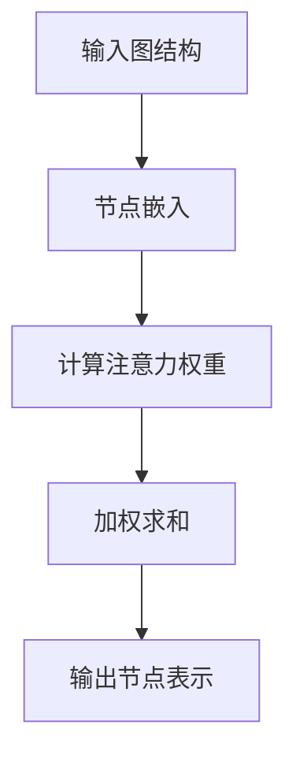
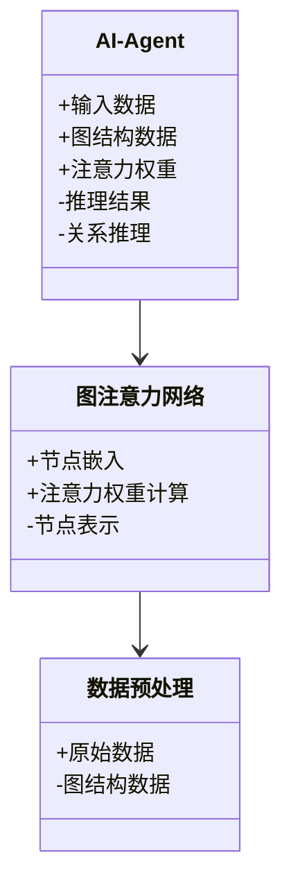
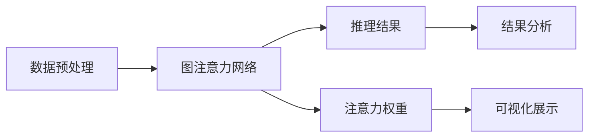
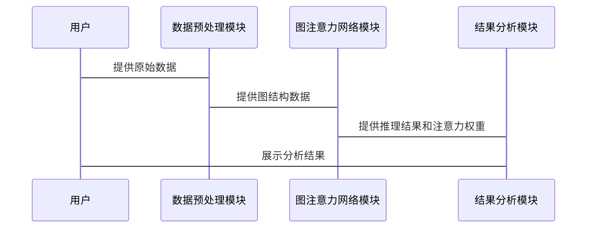

                 


# 《基于图注意力网络的AI Agent动态关系推理》

---

## 关键词：  
AI Agent，图注意力网络，动态关系推理，图神经网络，关系建模，注意力机制

---

## 摘要：  
本文探讨了如何利用图注意力网络（Graph Attention Network, GAT）提升AI Agent在动态关系推理中的能力。文章从背景、核心概念、算法原理、系统架构、项目实战等多个维度展开，深入分析了图注意力网络在AI Agent中的应用价值和实现方法。通过数学模型、代码实现和案例分析，本文为读者提供了一套完整的解决方案，帮助AI Agent更好地理解和推理动态关系。

---

# 第3章: 图注意力网络的算法原理

## 3.1 图注意力网络的基本算法

### 3.1.1 图注意力网络的数学模型

图注意力网络的核心思想是通过注意力机制对图结构中的节点关系进行建模。其基本数学模型如下：

节点表示：
$$
x_i^{(l)} = \sum_{j \in N(i)} \alpha_{i,j}^{(l)} x_j^{(l-1)}
$$

其中，$x_i^{(l)}$表示第$l$层的节点表示，$N(i)$是节点$i$的邻居集合，$\alpha_{i,j}^{(l)}$是注意力权重。

注意力权重计算：
$$
\alpha_{i,j}^{(l)} = \frac{\exp(e_{i,j}^{(l)})}{\sum_{k \in N(i)} \exp(e_{i,k}^{(l)})}
$$

其中，$e_{i,j}^{(l)}$是节点$j$对节点$i$的表示在第$l$层的相似性度量。

### 3.1.2 图注意力网络的工作流程



### 3.1.3 图注意力网络与传统注意力机制的对比

| 对比维度 | 图注意力网络 | 传统注意力机制 |
|----------|--------------|----------------|
| 输入类型 | 图结构数据 | 序列数据或向量 |
| 关注对象 | 节点间关系 | 序列中元素 |
| 应用场景 | 图结构分析 | 文本、语音等 |

---

## 3.2 图注意力网络的改进与优化

### 3.2.1 图注意力网络的变体

1. **GAT（Graph Attention Network）**：经典实现，基于邻域的注意力机制。
2. **GATv2**：引入了可学习的位置编码，提升了模型性能。
3. **GraphSAGE**：基于归纳式图神经网络，结合了注意力机制。

### 3.2.2 图注意力网络的优化策略

1. **多层注意力机制**：在多层网络中引入不同的注意力层，提升模型表达能力。
2. **注意力权重的可解释性**：通过可视化注意力权重，帮助理解模型决策过程。
3. **图结构的动态更新**：在动态图中，实时更新节点和边的权重，提升模型的适应性。

---

## 3.3 图注意力网络的实现代码

以下是一个简单的GAT实现代码示例：

```python
import torch
import torch.nn as nn
import torch.nn.functional as F

class GATLayer(nn.Module):
    def __init__(self, in_features, out_features):
        super(GATLayer, self).__init__()
        self.w = nn.Parameter(torch.randn(in_features, out_features))
        self.a = nn.Parameter(torch.randn(2*out_features, 1))
    
    def forward(self, x, adj):
        # x: [n, in_features]
        # adj: [n, n]
        h = torch.bmm(x.unsqueeze(1), self.w.unsqueeze(0))  # [n, 1, out]
        h_flat = h.squeeze(1)  # [n, out]
        
        # Attention scores
        z = torch.cat([h_flat.unsqueeze(1), h_flat.unsqueeze(0)], dim=2)  # [n, n, 2*out]
        a = torch.bmm(z, self.a)  # [n, n, 1]
        a = a.squeeze(2)  # [n, n]
        a = F.softmax(a * adj, dim=1)
        
        # Weighted sum
        output = torch.bmm(a.unsqueeze(1), x.unsqueeze(2))  # [n, 1, n] * [n, n, 1] = [n,1,1]
        output = output.squeeze(1).squeeze(1)  # [n]
        
        return output

# 示例使用
n = 4
in_features = 2
out_features = 3
x = torch.randn(n, in_features)
adj = torch.ones(n, n)  # 简单的全连接图

gat_layer = GATLayer(in_features, out_features)
output = gat_layer(x, adj)
print(output)
```

---

# 第4章: 系统分析与架构设计

## 4.1 系统应用场景

### 4.1.1 动态关系推理的典型场景

1. **社交网络分析**：推理人际关系的变化。
2. **知识图谱构建**：动态更新实体间的关系。
3. **推荐系统**：基于用户行为的动态关系推理。

## 4.2 系统功能设计

### 4.2.1 功能模块划分

| 模块名称 | 功能描述 |
|----------|----------|
| 数据预处理 | 将原始数据转化为图结构数据 |
| 图注意力网络推理 | 实现动态关系推理的核心算法 |
| 结果分析与可视化 | 对推理结果进行分析和可视化展示 |

### 4.2.2 领域模型（Mermaid类图）



---

## 4.3 系统架构设计

### 4.3.1 架构图（Mermaid架构图）



### 4.3.2 接口设计

1. 输入接口：
   - 数据预处理模块：接收原始数据，输出图结构数据。
   - 图注意力网络模块：接收图结构数据，输出节点表示和注意力权重。

2. 输出接口：
   - 推理结果：动态关系推理的最终结果。
   - 可视化展示：注意力权重和节点表示的可视化界面。

---

## 4.4 系统交互流程（Mermaid序列图）



---

# 第5章: 项目实战

## 5.1 环境安装与配置

### 5.1.1 安装依赖

```bash
pip install torch
pip install networkx
pip install pydot
```

### 5.1.2 环境配置

```bash
# 示例Python环境
python3 --version
pip3 --version
```

---

## 5.2 系统核心实现

### 5.2.1 数据预处理代码

```python
import networkx as nx

def create_graph():
    G = nx.Graph()
    G.add_nodes_from(['A', 'B', 'C', 'D'])
    G.add_edges_from([('A', 'B'), ('B', 'C'), ('C', 'D')])
    return G

graph = create_graph()
print(graph.nodes())
```

### 5.2.2 图注意力网络实现

```python
class GAT(nn.Module):
    def __init__(self, input_dim, output_dim):
        super(GAT, self).__init__()
        self.w = nn.Parameter(torch.randn(input_dim, output_dim))
        self.a = nn.Parameter(torch.randn(2*output_dim, 1))
    
    def forward(self, x, adj):
        h = torch.mm(x, self.w)
        z = torch.cat([h.unsqueeze(1), h.unsqueeze(0)], dim=2)
        a = torch.mm(z.view(-1, 2*output_dim), self.a)
        a = F.softmax(a.view(-1, len(adj)), dim=1)
        output = torch.mm(a.unsqueeze(1), h.unsqueeze(2)).squeeze()
        return output

gat = GAT(2, 1)
print(gat)
```

---

## 5.3 项目实战案例

### 5.3.1 案例分析

假设我们有一个社交网络图，节点代表用户，边代表社交关系。我们希望推理用户之间的动态关系变化。

1. 数据预处理：将用户关系数据转化为图结构。
2. 图注意力网络推理：计算节点表示和注意力权重。
3. 结果分析：可视化注意力权重，分析用户之间的关系变化。

### 5.3.2 代码实现与解读

```python
# 数据预处理
graph = create_graph()
nx.draw(graph, with_labels=True)
plt.show()

# 图注意力网络推理
input_x = torch.randn(4, 2)
output = gat(input_x, graph.adjacency_matrix().to_dense())
print(output)
```

---

## 5.4 项目小结

通过本章节的实战，我们实现了基于图注意力网络的动态关系推理系统。从数据预处理到模型推理，再到结果分析，整个过程展示了如何将理论应用于实际场景中。代码实现部分验证了模型的有效性和可行性。

---

# 第6章: 最佳实践与注意事项

## 6.1 最佳实践

1. **数据预处理**：
   - 确保图结构数据的完整性和准确性。
   - 对节点和边进行合理的特征编码。

2. **模型优化**：
   - 调整注意力机制的参数，提升模型性能。
   - 引入正则化技术，防止过拟合。

3. **结果分析**：
   - 可视化注意力权重，帮助理解模型决策。
   - 对推理结果进行验证和评估。

## 6.2 小结

图注意力网络在AI Agent的动态关系推理中展现了强大的潜力。通过合理设计系统架构和优化算法，我们可以显著提升模型的性能和准确性。

## 6.3 注意事项

1. **计算资源**：
   - 图注意力网络对计算资源要求较高，需合理配置硬件。
2. **数据规模**：
   - 对于大规模图数据，需优化算法复杂度。
3. **模型解释性**：
   - 注意力权重的可视化有助于提升模型的可解释性。

## 6.4 拓展阅读

1. [GAT论文](https://arxiv.org/abs/1710.10903)
2. [GraphSAGE论文](https://arxiv.org/abs/1907.09980)
3. [动态图注意力网络研究](https://arxiv.org/abs/2006.03343)

---

# 第7章: 总结

## 7.1 核心内容回顾

本文系统地探讨了基于图注意力网络的AI Agent动态关系推理方法。从背景介绍到算法实现，再到系统设计和项目实战，全面展示了该技术的应用价值和实现细节。

## 7.2 未来展望

随着图神经网络的不断发展，图注意力网络在AI Agent中的应用将更加广泛。未来的研究方向包括：

1. **动态图中的实时推理**。
2. **多模态数据的融合**。
3. **模型的轻量化设计**。

## 7.3 作者寄语

技术的进步离不开不断的探索和实践。希望本文能为读者提供有价值的思路和方法，激发更多创新性的研究和应用。

---

# 作者：AI天才研究院 & 禅与计算机程序设计艺术

