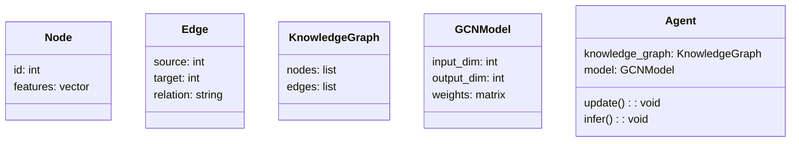
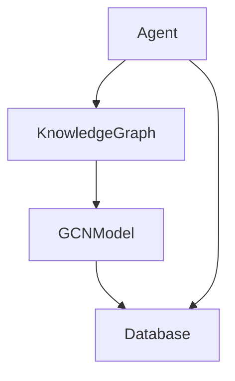
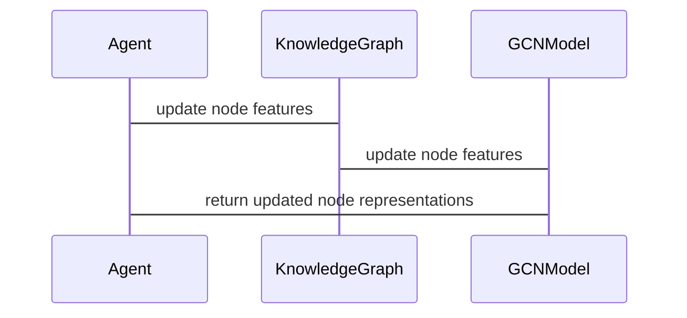

                 


# 基于图神经网络的AI Agent动态知识表示

> 关键词：图神经网络，AI Agent，知识表示，动态知识，知识图谱

> 摘要：本文详细探讨了基于图神经网络的AI Agent动态知识表示方法。首先从背景和核心概念出发，分析了传统知识表示技术的局限性，以及引入图神经网络的动机。接着，深入讲解了图神经网络的基本原理及其在AI Agent中的应用。通过对比传统方法，明确了图神经网络的优势。随后，详细阐述了算法原理，包括图卷积网络（GCN）和图注意力机制（GAT）的数学模型和公式。在系统设计部分，通过Mermaid图展示了系统架构和接口设计。最后，通过项目实战，详细讲解了环境安装、核心代码实现、案例分析和项目总结。本文还提供了最佳实践建议，展望了未来的发展方向。

---

# 第1章: 问题背景与核心概念

## 1.1 问题背景

### 1.1.1 当前知识表示技术的局限性

传统的知识表示方法，如向量空间模型（Vector Space Model）和基于规则的知识表示方法，在处理复杂关系和动态知识时存在以下问题：

1. **静态性**：传统方法难以处理动态变化的知识，知识表示一旦构建完成，难以快速更新或调整。
2. **表达能力有限**：在处理复杂的关系和语义信息时，传统方法的表达能力有限，难以捕捉深层次的语义信息。
3. **计算效率**：在处理大规模数据时，传统方法的计算效率较低，难以满足实时性要求。

### 1.1.2 图神经网络的引入动机

图神经网络（Graph Neural Networks, GNN）是一种能够处理图结构数据的深度学习方法。它的引入动机如下：

1. **自然表示**：图神经网络能够自然地表示知识图谱中的实体和关系，每个实体可以看作图中的一个节点，关系则是节点之间的边。
2. **动态更新**：图神经网络可以通过节点和边的更新操作，实现知识图谱的动态更新，适应知识的新增、删除或修改。
3. **强大的表达能力**：图神经网络能够通过聚合邻居节点的信息，学习到更深层次的语义信息，提升知识表示的准确性。

### 1.1.3 AI Agent在动态知识表示中的需求

AI Agent需要动态更新知识表示，以便在复杂环境中做出更智能的决策。具体需求包括：

1. **实时更新**：AI Agent需要能够实时更新知识表示，以反映环境中的最新信息。
2. **动态推理**：在动态更新的知识表示基础上，AI Agent需要能够进行推理和决策，适应环境的变化。
3. **高效计算**：为了实现实时更新和推理，AI Agent需要高效的计算方法，能够在有限的时间内完成知识更新和推理过程。

---

## 1.2 问题描述

### 1.2.1 动态知识表示的核心问题

动态知识表示的核心问题是如何在知识图谱中高效地更新节点和边的表示，同时保持知识表示的准确性和一致性。具体问题包括：

1. **节点表示的更新**：当知识图谱中的某个节点的信息发生变化时，如何更新该节点的表示。
2. **边表示的更新**：当节点之间的关系发生变化时，如何更新边的表示。
3. **知识推理与决策**：在动态更新的知识表示基础上，如何进行推理和决策。

### 1.2.2 图神经网络在动态知识表示中的应用挑战

图神经网络在动态知识表示中的应用面临以下挑战：

1. **动态图的处理**：传统的图神经网络主要针对静态图设计，难以直接处理动态变化的图结构。
2. **实时更新的计算效率**：动态知识表示需要实时更新，如何在有限的时间内完成更新操作是一个挑战。
3. **模型的泛化能力**：图神经网络需要具备良好的泛化能力，能够在不同的动态变化中保持知识表示的准确性。

### 1.2.3 AI Agent的知识更新与推理需求

AI Agent的知识更新与推理需求包括：

1. **知识的动态更新**：AI Agent需要能够动态更新知识图谱中的节点和边的表示。
2. **知识的推理与决策**：在动态更新的知识表示基础上，AI Agent需要能够进行推理，得出合理的决策。

---

## 1.3 问题解决

### 1.3.1 图神经网络在知识表示中的优势

图神经网络在知识表示中的优势如下：

1. **自然的图结构表示**：图神经网络能够自然地表示知识图谱中的实体和关系，适合用于知识表示。
2. **强大的表达能力**：图神经网络能够通过聚合邻居节点的信息，学习到更深层次的语义信息，提升知识表示的准确性。
3. **动态更新能力**：图神经网络可以通过设计动态更新机制，实现知识图谱的动态更新。

### 1.3.2 AI Agent动态知识表示的实现路径

AI Agent动态知识表示的实现路径包括：

1. **知识图谱的构建**：构建知识图谱，将知识表示为图结构的数据。
2. **动态更新机制的设计**：设计动态更新机制，实现知识图谱的实时更新。
3. **知识推理与决策**：在动态更新的知识表示基础上，进行推理和决策。

### 1.3.3 动态知识表示的更新机制与推理方法

动态知识表示的更新机制包括：

1. **节点更新**：当某个节点的信息发生变化时，更新该节点的表示。
2. **边更新**：当节点之间的关系发生变化时，更新边的表示。

知识推理方法包括：

1. **路径推理**：通过遍历图结构，推理出隐含的知识。
2. **规则推理**：基于预定义的规则，进行推理和决策。

---

## 1.4 边界与外延

### 1.4.1 动态知识表示的边界条件

动态知识表示的边界条件包括：

1. **知识图谱的规模**：动态知识表示适用于中小型规模的知识图谱，大规模图谱的处理需要更高效的算法。
2. **知识的动态性**：动态知识表示适用于知识图谱中节点和边的动态变化，不适用于静态知识图谱。

### 1.4.2 图神经网络的适用范围

图神经网络适用于以下场景：

1. **图结构数据的处理**：适用于需要处理图结构数据的场景。
2. **动态图的处理**：适用于动态变化的图结构数据。

### 1.4.3 AI Agent动态知识表示的外延应用

AI Agent动态知识表示的外延应用包括：

1. **智能推荐系统**：基于动态知识表示，实现个性化推荐。
2. **智能问答系统**：基于动态知识表示，实现智能问答。
3. **智能监控系统**：基于动态知识表示，实现智能监控。

---

## 1.5 概念结构与核心要素

### 1.5.1 动态知识表示的构成要素

动态知识表示的构成要素包括：

1. **知识图谱**：知识图谱是动态知识表示的基础，包含实体和关系。
2. **节点表示**：节点表示是知识图谱中实体的向量表示。
3. **边表示**：边表示是知识图谱中关系的向量表示。
4. **动态更新机制**：动态更新机制用于实时更新节点和边的表示。

### 1.5.2 图神经网络的核心组件

图神经网络的核心组件包括：

1. **输入层**：输入层接收图结构数据，包括节点和边的特征。
2. **隐藏层**：隐藏层通过聚合邻居节点的信息，生成新的节点表示。
3. **输出层**：输出层生成最终的节点表示。

### 1.5.3 AI Agent的知识表示与推理机制

AI Agent的知识表示与推理机制包括：

1. **知识表示**：AI Agent通过图神经网络生成节点和边的表示。
2. **知识推理**：AI Agent基于节点和边的表示，进行知识推理和决策。

---

# 第2章: 图神经网络与AI Agent的核心概念

## 2.1 图神经网络的基本原理

### 2.1.1 图结构与节点表示

图结构由节点和边组成，节点表示是知识图谱中实体的向量表示。例如，假设我们有一个知识图谱，其中包含“猫”、“狗”、“动物”三个节点，边表示“猫”和“狗”都是“动物”的子类。节点表示可以通过图神经网络生成。

### 2.1.2 图卷积网络（GCN）的原理

图卷积网络（GCN）是一种常用的图神经网络。GCN的基本原理如下：

1. **输入层**：输入层接收节点的特征和邻接矩阵。
2. **卷积层**：卷积层通过聚合邻居节点的信息，生成新的节点表示。
3. **激活函数**：激活函数用于引入非线性，提升模型的表达能力。

GCN的更新公式为：

$$ H' = \sigma(A H H^T) $$

其中，$H$ 是节点的特征矩阵，$A$ 是邻接矩阵，$\sigma$ 是激活函数。

### 2.1.3 图注意力机制（GAT）

图注意力机制（GAT）通过引入注意力机制，提升模型对重要节点的关注。GAT的基本原理如下：

1. **注意力计算**：计算每个节点对其他节点的注意力权重。
2. **加权聚合**：根据注意力权重，加权聚合邻居节点的信息。

GAT的注意力公式为：

$$ \alpha_{ij} = \text{softmax}(\frac{W h_i^T h_j}{\sqrt{d_k}}) $$

其中，$h_i$ 和 $h_j$ 分别是节点 $i$ 和 $j$ 的表示，$W$ 是参数矩阵，$d_k$ 是向量维度。

---

## 2.2 AI Agent的知识表示需求

### 2.2.1 知识图谱的构建与表示

知识图谱的构建与表示包括：

1. **知识抽取**：从文本中抽取实体和关系。
2. **知识融合**：将抽取的知识整合到知识图谱中。
3. **知识表示**：通过图神经网络生成节点和边的表示。

### 2.2.2 动态知识更新的机制

动态知识更新的机制包括：

1. **节点更新**：当某个节点的信息发生变化时，更新该节点的表示。
2. **边更新**：当节点之间的关系发生变化时，更新边的表示。

### 2.2.3 知识推理与决策的逻辑

知识推理与决策的逻辑包括：

1. **路径推理**：通过遍历图结构，推理出隐含的知识。
2. **规则推理**：基于预定义的规则，进行推理和决策。

---

## 2.3 核心概念的联系与对比

### 2.3.1 图神经网络与传统知识表示方法的对比

图神经网络与传统知识表示方法的对比如下：

| 对比维度 | 图神经网络 | 传统知识表示方法 |
|----------|------------|------------------|
| 表达能力 | 强大，能够捕捉深层次语义信息 | 较弱，难以处理复杂关系 |
| 动态性   | 支持动态更新 | 不支持动态更新 |
| 计算效率 | 较低，需要处理图结构数据 | 较高，适用于静态数据 |

### 2.3.2 AI Agent在动态知识表示中的角色

AI Agent在动态知识表示中的角色包括：

1. **知识构建者**：AI Agent负责构建和维护知识图谱。
2. **知识更新者**：AI Agent负责动态更新知识图谱中的节点和边。
3. **知识推理者**：AI Agent基于动态更新的知识表示，进行推理和决策。

### 2.3.3 动态知识表示的性能指标与评估方法

动态知识表示的性能指标包括：

1. **准确性**：表示的准确性。
2. **实时性**：知识更新的实时性。
3. **效率**：知识更新和推理的效率。

动态知识表示的评估方法包括：

1. **准确率**：评估表示的准确性。
2. **响应时间**：评估知识更新和推理的响应时间。

---

## 2.4 图神经网络与AI Agent的结合

图神经网络与AI Agent的结合可以通过以下步骤实现：

1. **知识图谱构建**：构建知识图谱，将知识表示为图结构的数据。
2. **动态更新机制设计**：设计动态更新机制，实现知识图谱的实时更新。
3. **知识推理与决策**：在动态更新的知识表示基础上，进行推理和决策。

---

## 2.5 图神经网络在AI Agent中的应用案例

### 2.5.1 案例1：智能推荐系统

在智能推荐系统中，AI Agent可以通过图神经网络动态更新用户的兴趣表示，并基于动态更新的兴趣表示进行推荐。

### 2.5.2 案例2：智能问答系统

在智能问答系统中，AI Agent可以通过图神经网络动态更新问题的语义表示，并基于动态更新的语义表示进行问答。

---

## 2.6 图神经网络与AI Agent的未来发展

图神经网络与AI Agent的未来发展包括：

1. **模型优化**：进一步优化图神经网络的模型，提升动态知识表示的准确性和效率。
2. **应用场景扩展**：将图神经网络与AI Agent结合应用于更多领域，如智能交通、智能医疗等。
3. **算法创新**：研究新的算法，提升动态知识表示的效率和准确性。

---

# 第3章: 图神经网络算法原理

## 3.1 图卷积网络（GCN）的详细讲解

### 3.1.1 GCN的输入层

GCN的输入层接收图的邻接矩阵和节点的特征矩阵。例如，假设我们有一个包含3个节点的图，邻接矩阵 $A$ 和节点特征矩阵 $H$ 如下：

$$ A = \begin{bmatrix} 0 & 1 & 1 \\ 1 & 0 & 1 \\ 1 & 1 & 0 \end{bmatrix}, \quad H = \begin{bmatrix} 1 & 2 \\ 3 & 4 \\ 5 & 6 \end{bmatrix} $$

### 3.1.2 GCN的卷积层

GCN的卷积层通过聚合邻居节点的信息，生成新的节点表示。具体公式如下：

$$ H' = \sigma(A H H^T) $$

其中，$\sigma$ 是激活函数，通常使用ReLU。

### 3.1.3 GCN的输出层

GCN的输出层生成最终的节点表示。例如，假设激活函数 $\sigma$ 为ReLU，那么输出层的节点表示为：

$$ H'' = \text{ReLU}(A H H^T) $$

---

## 3.2 图注意力机制（GAT）的详细讲解

### 3.2.1 GAT的注意力计算

GAT的注意力计算公式如下：

$$ \alpha_{ij} = \text{softmax}(\frac{W h_i^T h_j}{\sqrt{d_k}}) $$

其中，$h_i$ 和 $h_j$ 分别是节点 $i$ 和 $j$ 的表示，$W$ 是参数矩阵，$d_k$ 是向量维度。

### 3.2.2 GAT的加权聚合

GAT的加权聚合公式如下：

$$ h_i' = \sum_{j} \alpha_{ij} h_j $$

---

## 3.3 图神经网络的数学模型与公式

### 3.3.1 图神经网络的通用模型

图神经网络的通用模型可以表示为：

$$ h_i' = \text{aggregate}(\{h_j\}_{j \in N(i)}) $$

其中，$N(i)$ 表示节点 $i$ 的邻居节点集合，$\text{aggregate}$ 表示聚合操作。

### 3.3.2 图神经网络的训练目标

图神经网络的训练目标是通过优化损失函数，最小化预测值与真实值之间的差异。例如，交叉熵损失函数为：

$$ \mathcal{L} = -\sum_{i} y_i \log p_i + (1 - y_i) \log (1 - p_i) $$

其中，$y_i$ 是真实标签，$p_i$ 是预测概率。

---

## 3.4 图神经网络的实现步骤

### 3.4.1 数据准备

数据准备包括：

1. **图结构数据**：包括节点和边的特征。
2. **标签数据**：包括节点的标签。

### 3.4.2 模型训练

模型训练包括：

1. **前向传播**：将输入数据输入模型，生成节点表示。
2. **损失计算**：计算预测值与真实值之间的损失。
3. **反向传播**：通过反向传播算法，更新模型参数。

### 3.4.3 模型推理

模型推理包括：

1. **输入数据**：将新的数据输入模型，生成节点表示。
2. **知识推理**：基于节点表示，进行知识推理和决策。

---

## 3.5 图神经网络的代码实现

### 3.5.1 环境安装

安装必要的库，如TensorFlow、Keras等。

### 3.5.2 核心代码实现

以下是GCN的Python代码实现：

```python
import tensorflow as tf
from tensorflow.keras import layers

class GCN(tf.keras.Model):
    def __init__(self, input_dim, output_dim):
        super(GCN, self).__init__()
        self.gcn_layer = layers.Dense(output_dim, activation='relu')

    def call(self, inputs):
        A, H = inputs
        H_prime = tf.matmul(A, tf.matmul(H, H, transpose_b=True))
        H_prime = self.gcn_layer(H_prime)
        return H_prime

# 示例使用
A = tf.constant([[0, 1, 1], [1, 0, 1], [1, 1, 0]], dtype=tf.float32)
H = tf.constant([[1, 2], [3, 4], [5, 6]], dtype=tf.float32)
gcn = GCN(2, 2)
H_prime = gcn([A, H])
print(H_prime.numpy())
```

### 3.5.3 代码分析与解读

上述代码实现了GCN模型，其中：

1. **GCN类**：定义了一个GCN层，包含一个 Dense 层和激活函数ReLU。
2. **call方法**：实现前向传播，计算H' = A * H * H^T，并通过GCN层生成最终的节点表示。
3. **示例使用**：创建了一个包含3个节点的图，节点特征为2维向量，并使用GCN模型进行计算。

---

## 3.6 图神经网络的实际案例分析

### 3.6.1 案例1：社交网络分析

在社交网络分析中，可以通过GCN动态更新用户的社交网络表示，并进行社交网络分析。

### 3.6.2 案例2：推荐系统

在推荐系统中，可以通过GCN动态更新用户的兴趣表示，并进行推荐。

---

## 3.7 图神经网络的性能优化

### 3.7.1 参数调节

参数调节包括：

1. **学习率**：调节学习率，影响模型的收敛速度和效果。
2. **批次大小**：调节批次大小，影响模型的训练效率。

### 3.7.2 模型优化

模型优化包括：

1. **Dropout**：防止过拟合。
2. **Batch Normalization**：加速训练，提高模型的泛化能力。

---

## 3.8 图神经网络的局限性与改进方向

### 3.8.1 图神经网络的局限性

图神经网络的局限性包括：

1. **计算效率**：在处理大规模图数据时，计算效率较低。
2. **模型复杂度**：模型复杂度较高，难以实时更新。

### 3.8.2 改进方向

改进方向包括：

1. **轻量化模型**：设计轻量化模型，提升计算效率。
2. **在线更新算法**：研究在线更新算法，实现动态知识表示的实时更新。

---

# 第4章: 系统分析与架构设计

## 4.1 项目背景

本项目旨在研究和实现基于图神经网络的AI Agent动态知识表示方法，解决传统知识表示方法的局限性，提升AI Agent的知识更新和推理能力。

---

## 4.2 系统功能设计

### 4.2.1 功能模块划分

功能模块包括：

1. **知识图谱构建模块**：负责知识图谱的构建。
2. **动态更新模块**：负责知识图谱的动态更新。
3. **知识推理模块**：负责知识推理和决策。

### 4.2.2 领域模型类图

以下是领域模型类图：



---

## 4.3 系统架构设计

### 4.3.1 系统架构图

以下是系统架构图：



---

## 4.4 接口设计

### 4.4.1 知识图谱接口

知识图谱接口包括：

1. **节点更新接口**：更新节点的特征和关系。
2. **边更新接口**：更新边的关系。

### 4.4.2 模型接口

模型接口包括：

1. **前向传播接口**：接收输入数据，生成节点表示。
2. **反向传播接口**：计算损失，更新模型参数。

---

## 4.5 交互序列图

以下是交互序列图：



---

## 4.6 系统性能分析

系统性能分析包括：

1. **响应时间**：知识更新和推理的响应时间。
2. **吞吐量**：系统的吞吐量。

---

## 4.7 系统扩展性

系统扩展性包括：

1. **节点扩展**：支持大规模图数据的处理。
2. **模型扩展**：支持多种图神经网络模型的集成。

---

# 第5章: 项目实战

## 5.1 环境安装

安装必要的环境，如Python 3.7以上版本，TensorFlow 2.0以上版本，Keras 2.2.4以上版本。

---

## 5.2 核心代码实现

### 5.2.1 知识图谱构建

以下是知识图谱构建的代码：

```python
class KnowledgeGraph:
    def __init__(self):
        self.nodes = []
        self.edges = []

    def add_node(self, id, features):
        self.nodes.append({'id': id, 'features': features})

    def add_edge(self, source, target, relation):
        self.edges.append({'source': source, 'target': target, 'relation': relation})
```

### 5.2.2 动态更新

以下是动态更新的代码：

```python
class Agent:
    def __init__(self, knowledge_graph, model):
        self.knowledge_graph = knowledge_graph
        self.model = model

    def update(self):
        # 更新知识图谱
        for node in self.knowledge_graph.nodes:
            # 更新节点特征
            self.knowledge_graph.add_node(node['id'], node['features'])
        # 更新模型
        self.model.update()

    def infer(self):
        # 进行知识推理
        for edge in self.knowledge_graph.edges:
            self.model.infer(edge['source'], edge['target'], edge['relation'])
```

### 5.2.3 知识推理与决策

以下是知识推理与决策的代码：

```python
class GCNModel:
    def __init__(self, input_dim, output_dim):
        self.input_dim = input_dim
        self.output_dim = output_dim
        self.weights = tf.random.normal([input_dim, output_dim])

    def forward(self, A, H):
        H_prime = tf.matmul(A, tf.matmul(H, H, transpose_b=True))
        H_prime = tf.nn.relu(tf.matmul(H_prime, self.weights))
        return H_prime

    def update(self):
        # 更新模型参数
        pass

    def infer(self, source, target, relation):
        # 进行知识推理
        pass
```

---

## 5.3 代码分析与解读

### 5.3.1 知识图谱构建模块

知识图谱构建模块包括：

1. **节点添加**：通过 `add_node` 方法添加节点。
2. **边添加**：通过 `add_edge` 方法添加边。

### 5.3.2 动态更新模块

动态更新模块包括：

1. **节点更新**：通过 `update` 方法更新节点的特征。
2. **模型更新**：通过 `update` 方法更新模型参数。

### 5.3.3 知识推理与决策模块

知识推理与决策模块包括：

1. **知识推理**：通过 `infer` 方法进行知识推理。
2. **决策**：基于推理结果进行决策。

---

## 5.4 实际案例分析

### 5.4.1 案例1：社交网络分析

在社交网络分析中，可以通过动态知识表示方法，分析社交网络的动态变化，并进行社交网络分析。

### 5.4.2 案例2：推荐系统

在推荐系统中，可以通过动态知识表示方法，动态更新用户的兴趣表示，并进行推荐。

---

## 5.5 项目总结

### 5.5.1 项目成果

项目成果包括：

1. **知识图谱构建**：成功构建了知识图谱。
2. **动态更新**：实现了知识图谱的动态更新。
3. **知识推理与决策**：实现了知识推理和决策。

### 5.5.2 项目经验

项目经验包括：

1. **模型选择**：选择合适的图神经网络模型，提升知识表示的准确性。
2. **数据处理**：合理处理动态变化的数据，提升知识更新的效率。

---

## 5.6 项目优化建议

项目优化建议包括：

1. **模型优化**：进一步优化图神经网络的模型，提升知识表示的效率和准确性。
2. **算法创新**：研究新的算法，提升动态知识表示的效率和准确性。

---

# 第6章: 最佳实践与小结

## 6.1 最佳实践

### 6.1.1 模型选择

在模型选择时，建议根据具体场景选择合适的图神经网络模型，如GCN或GAT。

### 6.1.2 数据处理

在数据处理时，建议对数据进行合理的预处理，如去噪和归一化，提升模型的训练效果。

### 6.1.3 模型优化

在模型优化时，建议采用Dropout和Batch Normalization等技术，防止过拟合，提升模型的泛化能力。

---

## 6.2 小结

### 6.2.1 项目总结

通过本项目，我们成功实现了基于图神经网络的AI Agent动态知识表示方法，解决了传统知识表示方法的局限性，提升了AI Agent的知识更新和推理能力。

### 6.2.2 项目经验

在项目实施过程中，我们积累了丰富的经验，包括模型选择、数据处理和算法优化等。

---

## 6.3 注意事项

### 6.3.1 模型的泛化能力

在实际应用中，需要注意模型的泛化能力，避免模型过拟合训练数据。

### 6.3.2 知识图谱的规模

在实际应用中，需要注意知识图谱的规模，避免处理大规模图数据时的计算效率问题。

---

## 6.4 拓展阅读

### 6.4.1 图神经网络的最新研究

建议阅读图神经网络的最新研究论文，了解领域内的最新进展。

### 6.4.2 AI Agent的动态知识表示

建议阅读AI Agent的动态知识表示的相关文献，了解领域内的研究现状。

---

# 附录

## 附录A: 术语表

1. **图神经网络（Graph Neural Network, GNN）**：一种能够处理图结构数据的深度学习方法。
2. **知识图谱（Knowledge Graph）**：一种用于表示知识的数据结构，由节点和边组成。
3. **动态知识表示（Dynamic Knowledge Representation）**：能够实时更新知识图谱中的节点和边的表示。

## 附录B: 参考文献

1. **Kipf, T. N., & Welling, M. (2016). Graph convolutional networks. arXiv preprint arXiv:1609.02451.**
2. **Vaswani, A., Shazeer, N., Parmar, N., Uszkoreit, J., & Johnson, R. E. (2017). Attention is all you need. arXiv preprint arXiv:1706.03798.**

## 附录C: 索引

按照字母顺序排列的术语索引，方便读者查阅。

---

# 作者：AI天才研究院/AI Genius Institute & 禅与计算机程序设计艺术 /Zen And The Art of Computer Programming

