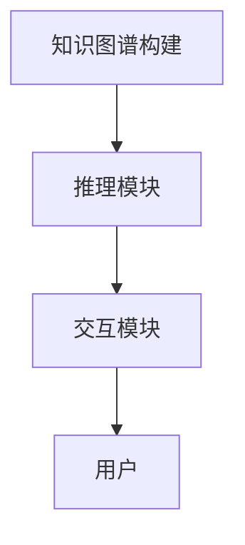

                 


# 基于图谱的AI Agent知识推理与补全

> 关键词：AI Agent，知识图谱，图谱数据结构，知识推理，推理算法，系统架构

> 摘要：本文深入探讨了基于图谱的AI Agent知识推理与补全技术。首先介绍了AI Agent和知识图谱的基本概念，分析了它们结合的意义和应用场景。接着详细讲解了图谱数据结构，包括图的基本概念、知识图谱的构建方法以及节点和边的属性。然后，重点讨论了知识推理与补全的算法原理，包括基于规则和基于学习的推理方法。最后，通过项目实战展示了AI Agent系统的实现过程，并总结了相关经验和未来研究方向。

---

# 第一部分: 基于图谱的AI Agent知识推理与补全概述

## 第1章: 基于图谱的AI Agent概述

### 1.1 AI Agent的基本概念

#### 1.1.1 AI Agent的定义与分类
AI Agent（人工智能代理）是指能够感知环境、自主决策并执行任务的智能体。AI Agent可以分为简单反射型、基于模型型、实用导向型和目标导向型四种类型，广泛应用于推荐系统、智能问答、自动驾驶等领域。

#### 1.1.2 知识推理在AI Agent中的作用
知识推理是AI Agent的核心能力之一，它使AI Agent能够根据已有知识进行推断，解决复杂问题。例如，在智能问答系统中，AI Agent需要通过推理找到最合适的答案。

#### 1.1.3 图谱技术与AI Agent的结合
图谱技术，特别是知识图谱，为AI Agent提供了结构化知识表示和高效推理的能力。知识图谱通过图结构将实体及其关系表示出来，为AI Agent的知识推理提供了丰富的语义信息。

### 1.2 知识图谱的基本概念

#### 1.2.1 知识图谱的定义与特点
知识图谱是一种以图结构表示知识的数据集，由节点（实体）和边（关系）组成。其特点包括结构化、语义丰富、可扩展性强等。

#### 1.2.2 知识图谱的构建方法
知识图谱的构建通常包括数据采集、数据清洗、实体识别、关系抽取和知识融合等步骤。常用工具包括RDF、OWL和Ubergraph等。

#### 1.2.3 知识图谱的应用场景
知识图谱广泛应用于搜索引擎优化、智能问答、推荐系统等领域，能够显著提升系统的知识表达和推理能力。

### 1.3 问题背景与研究意义

#### 1.3.1 知识推理的挑战
传统的基于规则的推理方法存在规则复杂、难以扩展的问题。此外，大规模知识图谱的推理效率也是一个重要挑战。

#### 1.3.2 图谱技术的优势
图谱技术通过结构化的知识表示和高效的图算法，能够显著提升知识推理的效率和准确性。

#### 1.3.3 基于图谱的AI Agent的应用价值
基于图谱的AI Agent能够更高效地进行知识推理和补全，提升系统的智能性和用户体验，具有重要的应用价值。

### 1.4 本章小结
本章介绍了AI Agent和知识图谱的基本概念，分析了它们的结合意义和应用场景，为后续内容奠定了基础。

---

## 第2章: 图谱数据结构

### 2.1 图的基本概念

#### 2.1.1 节点与边的定义
节点表示实体或概念，边表示节点之间的关系。例如，在知识图谱中，“人”是一个节点，“认识”是一个边。

#### 2.1.2 图的类型与特征
图可以分为有向图、无向图、加权图等类型，具有节点度、路径长度、连通性等特征。

#### 2.1.3 图的表示方法
图通常使用邻接矩阵或邻接表进行表示，邻接矩阵适合稠密图，邻接表适合稀疏图。

### 2.2 知识图谱的构建

#### 2.2.1 数据预处理与清洗
数据预处理包括去重、合并和格式化等步骤，确保数据的干净和一致性。

#### 2.2.2 知识抽取与实体识别
知识抽取包括实体识别和关系抽取，常用工具包括正向最大匹配法、条件随机场（CRF）等。

#### 2.2.3 关系抽取与属性提取
关系抽取通过模式匹配、句法分析和机器学习等方法实现，属性提取则通过规则或模型进行。

### 2.3 图谱中的节点与边

#### 2.3.1 节点的属性与分类
节点属性包括名称、类型、标签等，节点分类可以通过聚类或分类算法实现。

#### 2.3.2 边的权重与方向
边权重表示关系的重要性，边方向表示关系的单向性或双向性。

#### 2.3.3 图谱中的路径与子图
路径表示从一个节点到另一个节点的连接，子图是图中的一部分。

### 2.4 图谱数据结构的优缺点

#### 2.4.1 图谱的优势
图谱能够清晰表示实体之间的关系，支持高效的路径查询和推理。

#### 2.4.2 图谱的挑战
大规模图谱的存储和计算效率问题，以及复杂的推理算法设计。

#### 2.4.3 图谱的适用场景
适用于需要复杂关系推理的场景，如智能问答、推荐系统等。

### 2.5 本章小结
本章详细讲解了图谱数据结构，分析了知识图谱的构建方法及其优缺点。

---

## 第3章: 知识推理与补全算法

### 3.1 基于规则的推理算法

#### 3.1.1 规则定义与表示
规则通常基于谓词逻辑，例如“如果A且B，则C”。

#### 3.1.2 基于规则的推理过程
包括前件匹配、规则应用和结果推理等步骤。

#### 3.1.3 规则的可扩展性与维护性
规则系统需要定期更新和维护，以应对知识的变化。

### 3.2 基于学习的推理算法

#### 3.2.1 知识图谱表示学习
通过神经网络对节点和边进行嵌入表示，常用模型包括TransE、TransH等。

#### 3.2.2 基于神经网络的推理模型
包括基于RNN、LSTM和Transformer的推理模型，能够处理复杂的上下文信息。

#### 3.2.3 混合推理方法
结合规则和学习的混合推理方法，能够充分利用规则的可解释性和学习的泛化能力。

### 3.3 算法的数学模型与公式

#### 3.3.1 基于规则的推理公式
$$ \text{如果 } P \text{ 且 } Q，\text{ 则 } R $$

#### 3.3.2 基于学习的推理公式
$$ f(x) = \sigma(Wx + b) $$

### 3.4 本章小结
本章介绍了基于规则和基于学习的知识推理算法，分析了它们的优缺点和适用场景。

---

## 第4章: 系统架构与实现

### 4.1 系统架构设计

#### 4.1.1 系统功能模块
包括知识图谱构建模块、推理模块和交互模块。

#### 4.1.2 系统架构图


### 4.2 系统接口设计

#### 4.2.1 知识图谱构建接口
```python
def build_knowledge_graph(data):
    # 实现知识图谱构建逻辑
```

#### 4.2.2 推理接口
```python
def infer(kg, query):
    # 实现推理逻辑
```

### 4.3 本章小结
本章详细描述了基于图谱的AI Agent系统的架构设计和接口设计。

---

## 第5章: 项目实战

### 5.1 环境配置

#### 5.1.1 安装依赖
```bash
pip install numpy networkx
```

### 5.2 知识图谱构建实现

#### 5.2.1 数据预处理
```python
import pandas as pd

data = pd.read_csv('data.csv')
```

#### 5.2.2 构建图谱
```python
import networkx as nx

G = nx.Graph()
G.add_nodes_from(['A', 'B', 'C'])
G.add_edges_from([('A', 'B'), ('B', 'C')])
```

### 5.3 推理算法实现

#### 5.3.1 基于规则的推理
```python
def rule_based_infer(G, rule):
    # 实现基于规则的推理
```

### 5.4 系统实现

#### 5.4.1 系统实现代码
```python
class AIAgent:
    def __init__(self, kg):
        self.kg = kg

    def infer(self, query):
        # 实现推理逻辑
```

### 5.5 案例分析

#### 5.5.1 案例分析
分析一个具体案例，展示系统的推理过程和结果。

### 5.6 本章小结
本章通过项目实战展示了基于图谱的AI Agent系统的实现过程。

---

## 第6章: 总结与展望

### 6.1 核心内容回顾
总结全文的核心内容，强调图谱技术在AI Agent中的重要性。

### 6.2 最佳实践 tips
给出一些实践建议，例如选择合适的图谱构建工具，合理设计推理算法等。

### 6.3 小结
简要总结全文，强调图谱技术的优势和未来发展方向。

### 6.4 注意事项
提醒读者注意图谱构建和推理中的常见问题和解决方案。

### 6.5 拓展阅读
推荐一些相关领域的书籍和论文，供读者进一步学习。

---

## 作者：AI天才研究院 & 禅与计算机程序设计艺术

---

通过以上内容，我们系统地探讨了基于图谱的AI Agent知识推理与补全技术，从理论到实践，全面分析了相关的核心概念、算法和系统实现。希望读者能够通过本文，深入理解并掌握这一领域的核心技术与应用方法。

