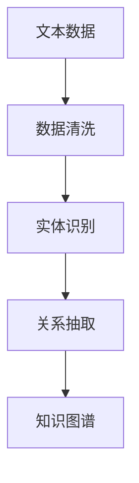
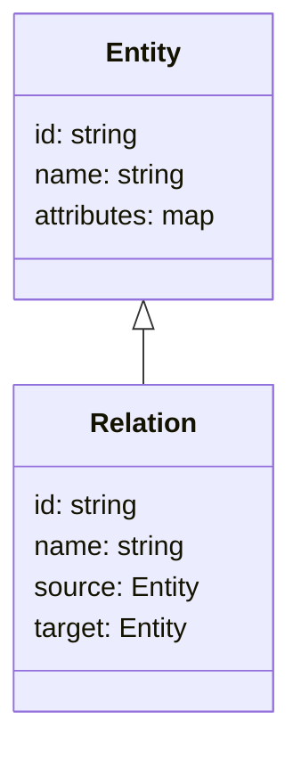
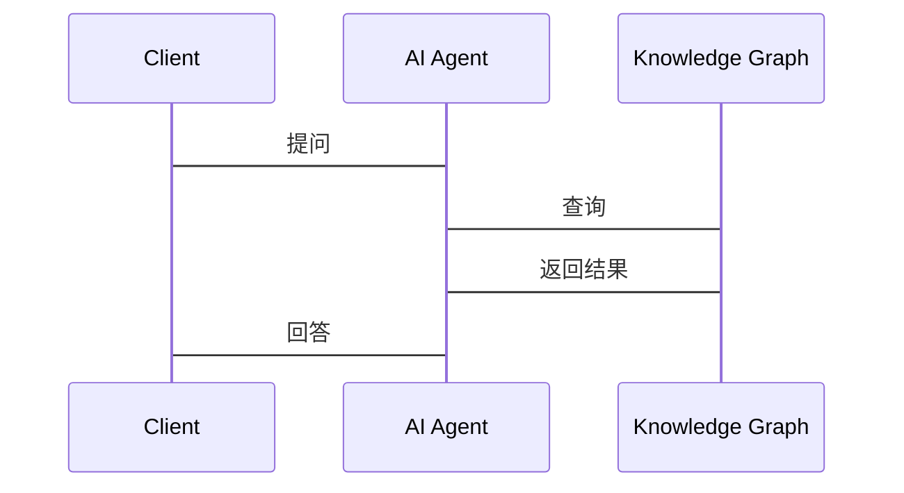

                 


# 基于图谱的AI Agent知识推理与问答

> 关键词：知识图谱，AI Agent，知识推理，问答系统，图谱构建，推理算法，系统架构

> 摘要：本文深入探讨了基于知识图谱的AI Agent知识推理与问答系统的核心技术，分析了知识图谱的构建与表示方法，详细讲解了基于图谱的知识推理算法及其在问答系统中的应用。通过实际案例分析和系统架构设计，展示了如何利用知识图谱提升AI Agent的智能问答能力。

---

## 第一部分: 基于图谱的AI Agent知识推理与问答基础

### 第1章: 背景介绍

#### 1.1 问题背景
当前，AI Agent技术在各个领域得到了广泛应用，但其知识处理能力受限于传统数据结构，难以实现复杂的知识推理。知识图谱作为一种强大的语义网络，为AI Agent提供了结构化知识表示和推理的能力，解决了传统问答系统在复杂问题上的局限性。

#### 1.2 问题描述
基于图谱的AI Agent知识推理与问答系统的核心问题是如何有效地构建、表示和利用知识图谱进行推理，并将其应用于问答系统中。这涉及到知识图谱的构建方法、推理算法的设计以及系统架构的优化。

#### 1.3 问题解决
通过引入知识图谱，结合先进的推理算法，AI Agent能够更好地理解和回答复杂问题。本文将从知识图谱的构建、推理算法的实现到系统的整体架构进行详细探讨。

---

## 第二部分: 核心概念与联系

### 第2章: 基于图谱的知识表示与推理

#### 2.1 知识图谱的构建与表示
知识图谱的构建包括数据抽取、实体识别和关系抽取等步骤。其表示方法主要采用RDF（资源描述框架）和图嵌入技术，如Node2Vec和Word2Vec。

#### 2.2 知识推理的基本原理
基于图谱的推理算法包括路径搜索、规则推理和机器学习方法。其中，路径搜索是通过遍历图谱中的节点和边来寻找答案的一种方法。

#### 2.3 知识图谱与问答系统的联系
问答系统通过查询知识图谱中的实体和关系，能够回答基于常识的问题。基于图谱的问答系统具有较高的准确性和扩展性。

#### 2.4 核心概念对比表
以下是知识图谱与传统知识库的对比：

| 对比维度         | 知识图谱               | 传统知识库           |
|------------------|-----------------------|----------------------|
| 表示方式         | 图结构                | 关系型数据库         |
| 可扩展性         | 高                    | 低                  |
| 复杂度           | 中等                  | 高                  |

#### 2.5 ER实体关系图
以下是知识图谱的ER实体关系图：

```mermaid
er
actor:
    entity
    --(is a)-- category
    --(has attribute)-- attribute
    --(has relationship)-- relationship
```

---

## 第三部分: 算法原理讲解

### 第3章: 图谱构建与知识表示

#### 3.1 图谱构建算法
以下是图谱构建的流程图：



#### 3.2 知识表示方法
知识表示可以采用符号逻辑或本体论，例如：

$$ R(x, y) \text{表示} x \text{与} y \text{之间存在关系} R $$

---

## 第四部分: 系统分析与架构设计

### 第4章: 系统架构设计

#### 4.1 领域模型设计
以下是领域模型的类图：



#### 4.2 系统架构图
以下是系统架构的架构图：


#### 4.3 系统接口设计
系统接口主要涉及查询接口和回答生成接口，使用RESTful API进行通信。

#### 4.4 系统交互流程
以下是系统交互的序列图：



---

## 第五部分: 项目实战

### 第5章: 项目实战

#### 5.1 环境安装
需要安装Python、TensorFlow和相关图谱处理库。

#### 5.2 核心代码实现
以下是知识图谱构建的核心代码：

```python
class KnowledgeGraph:
    def __init__(self):
        self.nodes = {}
        self.edges = {}
    
    def add_node(self, node_id, label):
        self.nodes[node_id] = label
    
    def add_edge(self, edge_id, source, target, label):
        self.edges[edge_id] = {
            'source': source,
            'target': target,
            'label': label
        }
```

#### 5.3 案例分析
通过一个简单的问答案例，展示如何利用知识图谱进行推理。

#### 5.4 项目小结
项目展示了基于图谱的知识推理与问答系统的实现过程，验证了其可行性和有效性。

---

## 第六部分: 扩展内容

### 第6章: 最佳实践与注意事项

#### 6.1 最佳实践
建议在构建知识图谱时，注重数据的质量和多样性，同时优化推理算法的效率。

#### 6.2 小结
本文全面探讨了基于图谱的AI Agent知识推理与问答系统的核心技术，为实际应用提供了理论支持和实践指导。

#### 6.3 注意事项
在实际应用中，需要注意数据安全和隐私保护问题。

#### 6.4 拓展阅读
推荐阅读相关领域的最新论文和书籍，深入了解知识图谱和推理算法的最新进展。

---

## 作者信息

作者：AI天才研究院/AI Genius Institute & 禅与计算机程序设计艺术 /Zen And The Art of Computer Programming

---

以上是基于图谱的AI Agent知识推理与问答的技术博客文章的大纲和内容概述，具体内容可根据需要进一步扩展和详细阐述。

