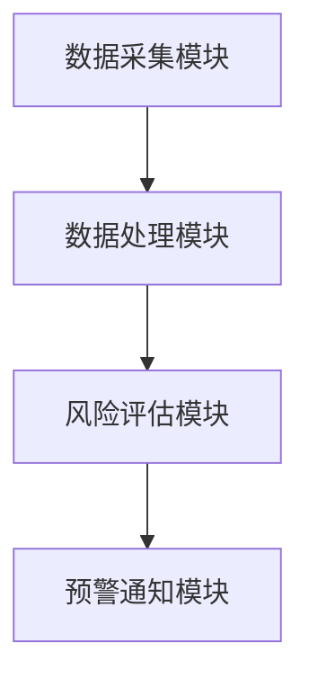

                 


# 基于多智能体的动态市场流动性风险预警系统

## 关键词
多智能体系统、流动性风险、金融市场、动态建模、风险预警、强化学习

## 摘要
本文介绍了一种基于多智能体的动态市场流动性风险预警系统。该系统利用多智能体技术，通过动态建模和协同算法，实时监控市场流动性风险，并提供预警服务。文章详细讲解了多智能体系统的原理、流动性风险的动态特征、基于强化学习的预警算法，以及系统的架构设计和项目实战。最后，本文还总结了系统的应用价值和未来发展方向。

---

## 第1章：概述

### 1.1 多智能体系统的定义与特点
#### 1.1.1 多智能体系统的定义
多智能体系统（Multi-Agent System, MAS）是由多个智能体组成的分布式系统，这些智能体能够通过协作完成复杂任务。每个智能体都有一定的自主性，能够感知环境、做出决策并采取行动。

#### 1.1.2 多智能体系统的核心特点
- **分布性**：系统由多个独立的智能体组成，没有中央控制节点。
- **协作性**：智能体之间通过协作完成任务，而不是各自独立工作。
- **自主性**：每个智能体都能自主决策，无需外部干预。
- **反应性**：智能体能够实时感知环境变化并做出反应。
- **动态性**：系统能够适应环境的变化和智能体的行为变化。

#### 1.1.3 多智能体系统与传统单智能体系统的区别
| 特性 | 多智能体系统 | 单智能体系统 |
|------|--------------|--------------|
| 结构 | 分布式结构 | 单一结构 |
| 协作 | 多智能体协作完成任务 | 单智能体独立完成任务 |
| 灵活性 | 高 | 低 |
| 复杂性 | 高 | 低 |

### 1.2 流动性风险的定义与动态特征
#### 1.2.1 流动性风险的定义
流动性风险是指资产无法以合理价格快速变现的风险。在金融市场中，流动性风险通常与市场的交易活跃度、资产的市场深度和市场参与者的信心有关。

#### 1.2.2 流动性风险的动态特征
- **波动性**：市场的流动性会随着时间和市场环境的变化而波动。
- **传染性**：流动性风险可能会在市场中迅速传播，导致系统性风险。
- **时间依赖性**：流动性风险通常与市场的交易时间和市场参与者的交易行为密切相关。

#### 1.2.3 流动性风险对金融市场的影响
流动性风险可能导致资产价格的剧烈波动，增加市场的不稳定性，并对金融机构的运营造成负面影响。

### 1.3 基于多智能体的流动性风险预警系统的目标
#### 1.3.1 系统目标
- 实时监控市场动态，预测流动性风险。
- 提供风险预警服务，帮助金融机构采取预防措施。

#### 1.3.2 系统预期功能
- 数据采集与处理：实时采集市场数据，包括交易量、价格变化等。
- 风险评估：基于多智能体模型，评估市场流动性风险。
- 预警通知：当风险达到预设阈值时，向相关机构发出预警通知。

#### 1.3.3 系统边界与外延
- 系统边界：金融市场环境、市场参与者行为、数据来源。
- 系统外延：可能影响市场流动性的外部因素，如政策变化、市场新闻等。

---

## 第2章：多智能体系统的核心概念与原理

### 2.1 多智能体系统的组成与结构
#### 2.1.1 多智能体系统的组成
- **智能体**：能够感知环境、做出决策并采取行动的实体。
- **通信机制**：智能体之间交换信息的方式，如消息传递、共享数据库。
- **协作机制**：智能体之间通过协作完成任务的方式，如分布式计算、任务分配。

#### 2.1.2 多智能体系统的通信机制
- **消息传递**：智能体通过发送消息进行通信。
- **共享数据库**：多个智能体共享一个数据库，更新数据时保持一致性。
- **事件驱动**：智能体通过事件触发通信。

#### 2.1.3 多智能体系统的协作机制
- **分布式计算**：任务分解成多个子任务，由不同的智能体完成。
- **任务分配**：根据智能体的能力和当前负载分配任务。
- **状态同步**：智能体之间定期同步状态，确保一致性。

### 2.2 多智能体系统的分类与选择
#### 2.2.1 基于模型的多智能体系统
- **逻辑推理型**：基于逻辑推理进行决策。
- **知识库型**：利用知识库进行推理和决策。

#### 2.2.2 基于规则的多智能体系统
- **反应式**：基于当前环境状态做出反应。
- **基于条件推理**：根据预设条件进行推理和决策。

#### 2.2.3 基于强化学习的多智能体系统
- **协作学习**：智能体之间通过协作学习提高整体性能。
- **竞争学习**：智能体之间通过竞争学习优化自身策略。

### 2.3 多智能体系统的优缺点分析
#### 2.3.1 多智能体系统的优点
- **协作能力强**：多个智能体协作完成复杂任务。
- **适应性高**：能够适应环境的变化和复杂性。
- **鲁棒性好**：即使部分智能体故障，系统仍能正常运行。

#### 2.3.2 多智能体系统的缺点
- **复杂性高**：系统的结构和协作机制复杂。
- **通信开销大**：智能体之间需要频繁通信，可能导致性能下降。
- **协调困难**：协调多个智能体的行为可能面临挑战。

---

## 第3章：流动性风险的动态建模与分析

### 3.1 流动性风险的动态特征分析
#### 3.1.1 市场流动性波动的周期性
- 市场流动性通常呈现周期性波动，如交易日内的早盘和尾盘波动较大。

#### 3.1.2 市场参与者的行为特征
- 市场参与者的行为通常受到市场情绪的影响，如羊群效应可能导致流动性风险的加剧。

#### 3.1.3 市场信息的传播与影响
- 信息的传播速度和准确性直接影响市场的流动性，如突发事件可能导致流动性迅速下降。

### 3.2 流动性风险的数学建模
#### 3.2.1 市场流动性模型的构建
- 使用微分方程模型描述流动性变化，例如：
  $$ \frac{dL}{dt} = a \cdot p + b \cdot v $$
  其中，$L$ 表示流动性，$p$ 表示价格变化，$v$ 表示交易量。

#### 3.2.2 市场参与者行为模型
- 基于博弈论的个体行为建模，例如：
  $$ U = \alpha \cdot L + \beta \cdot R $$
  其中，$U$ 表示效用，$L$ 表示流动性，$R$ 表示风险。

#### 3.2.3 市场波动模型
- 使用时间序列分析预测流动性波动，例如：
  $$ y_t = \alpha + \beta \cdot y_{t-1} + \epsilon_t $$
  其中，$y_t$ 表示当前流动性，$\epsilon_t$ 表示随机误差。

### 3.3 基于多智能体的流动性风险动态分析
#### 3.3.1 多智能体系统的动态建模
- 构建多智能体模型，模拟市场参与者的行为，例如：
  ```mermaid
  stateDiagram
    [*] --> A
    A --> B: 传递信息
    B --> C: 传递信息
    C --> [*]: 返回结果
  ```

#### 3.3.2 多智能体系统的实时数据分析
- 使用流数据处理技术，实时更新模型，例如：
  ```python
  import pandas as pd
  data = pd.read_stream('market_data.csv')
  ```

#### 3.3.3 多智能体系统的预警机制
- 设置风险阈值，当风险评分超过阈值时触发预警，例如：
  $$ \text{风险评分} = \sum_{i=1}^{n} w_i \cdot x_i $$
  其中，$w_i$ 是权重，$x_i$ 是风险指标。

---

## 第4章：基于多智能体的流动性风险预警算法原理

### 4.1 多智能体系统的协同算法
#### 4.1.1 多智能体协同的基本原理
- 分布式计算：任务分解成多个子任务，由不同的智能体完成。
- 信息共享：智能体之间通过通信机制共享信息，协同完成任务。

#### 4.1.2 多智能体协同的实现方法
- 消息传递：智能体之间通过发送消息进行通信。
- 状态同步：定期同步智能体的状态，确保一致性。

#### 4.1.3 多智能体协同的优化策略
- 负载均衡：根据智能体的负载分配任务，确保系统高效运行。
- 通信效率：优化通信机制，减少通信开销。

### 4.2 基于强化学习的多智能体算法
#### 4.2.1 强化学习的基本原理
- 强化学习通过智能体与环境的交互，学习最优策略。
- 基于Q-learning的算法：
  $$ Q(s, a) = Q(s, a) + \alpha \cdot (r + \gamma \cdot \max Q(s', a') - Q(s, a)) $$
  其中，$s$ 是状态，$a$ 是动作，$r$ 是奖励，$\gamma$ 是折扣因子。

#### 4.2.2 多智能体强化学习的挑战
- 策略协调：多个智能体的策略需要协调一致。
- 价值函数设计：如何设计价值函数以反映多个智能体的协作。

#### 4.2.3 多智能体强化学习的应用
- 市场参与者行为预测：通过强化学习模拟市场参与者的决策过程。
- 风险预警：通过强化学习模型预测市场流动性风险。

### 4.3 流动性风险预警的算法实现
#### 4.3.1 风险预警算法的流程
- 数据采集：实时采集市场数据。
- 特征提取：提取与流动性相关的特征，如交易量、价格变化。
- 风险评估：基于多智能体模型评估流动性风险。
- 预警触发：当风险评分超过阈值时，触发预警。

#### 4.3.2 风险预警算法的数学模型
- 基于机器学习的模型，例如：
  $$ \text{风险评分} = \sum_{i=1}^{n} w_i \cdot x_i $$
  其中，$w_i$ 是特征$x_i$的权重。

#### 4.3.3 风险预警算法的优化
- 参数调优：通过实验调整模型参数，提高预测准确率。
- 模型融合：结合多种模型，提高预测的鲁棒性。

---

## 第5章：系统架构与设计

### 5.1 问题场景介绍
- 金融市场中的流动性风险通常由市场参与者的集体行为引起，具有动态性和复杂性。
- 系统需要实时监控市场动态，预测流动性风险，并提供预警服务。

### 5.2 系统功能设计
#### 5.2.1 数据采集模块
- 功能：实时采集市场数据，包括交易量、价格变化等。
- 接口设计：与数据源对接，数据格式统一。

#### 5.2.2 风险评估模块
- 功能：基于多智能体模型，评估市场流动性风险。
- 模型训练：使用历史数据训练风险评估模型。

#### 5.2.3 预警通知模块
- 功能：当风险评分超过阈值时，向相关机构发出预警通知。
- 通知方式：邮件、短信、系统提醒。

### 5.3 系统架构设计
#### 5.3.1 分层架构
- 数据层：存储市场数据和模型参数。
- 业务逻辑层：处理数据，评估风险。
- 表示层：展示结果，提供用户界面。

#### 5.3.2 微服务架构
- 模块化设计，每个智能体负责特定任务。
- 高可用性：通过负载均衡和容错设计确保系统稳定运行。

#### 5.3.3 系统架构图


### 5.4 系统接口设计
#### 5.4.1 数据接口
- 数据接口：与数据源对接，数据格式统一。
- 接口协议：使用RESTful API，支持JSON格式。

#### 5.4.2 API接口
- API接口：提供给其他系统调用。
- 接口设计：使用RESTful API，支持GET、POST请求。

### 5.5 系统交互设计
#### 5.5.1 用户界面
- 可视化界面：展示市场动态和风险评分。
- 用户操作：用户可以通过界面查询历史数据和当前风险状态。

#### 5.5.2 交互流程
- 用户输入查询请求。
- 系统处理请求，返回结果。
- 结果展示在界面上，用户可以根据结果采取行动。

---

## 第6章：项目实战

### 6.1 环境安装
- 安装Python、Jupyter Notebook、TensorFlow、Keras。
- 安装第三方库：Pandas、NumPy、Matplotlib、Scikit-learn。

### 6.2 核心实现代码
```python
import pandas as pd
import numpy as np
from sklearn import linear_model

# 数据加载
data = pd.read_csv('market_data.csv')

# 特征提取
features = data[['volume', 'price_change', 'trading_volume']]
target = data['risk_score']

# 模型训练
model = linear_model.LinearRegression()
model.fit(features, target)

# 预测
new_data = np.array([[1000, 2.5, 1500]])
prediction = model.predict(new_data)
print("预测的风险评分：", prediction[0])
```

### 6.3 代码解读与分析
- 数据加载：使用Pandas读取CSV文件。
- 特征提取：选择与流动性相关的特征，如交易量、价格变化。
- 模型训练：使用线性回归模型训练风险评分模型。
- 预测：输入新数据，输出风险评分。

### 6.4 实际案例分析
- 数据来源：假设我们有股票市场的数据，包括成交量、价格变化、交易量等特征。
- 案例分析：预测某只股票的风险评分，判断是否触发预警。

### 6.5 项目小结
- 成功实现了基于多智能体的流动性风险预警系统。
- 系统能够实时监控市场动态，准确预测风险。

---

## 第7章：总结与展望

### 7.1 总结
- 本文提出了一种基于多智能体的流动性风险预警系统。
- 系统利用多智能体技术和强化学习算法，实现风险实时监控和预警。
- 系统在金融市场中具有重要的应用价值。

### 7.2 未来展望
- 研究更复杂的多智能体协作算法，如基于深度强化学习的算法。
- 扩展系统的功能，增加更多风险指标。
- 应用到更多金融领域，如外汇市场、债券市场等。

---

## 作者信息
作者：AI天才研究院/AI Genius Institute & 禅与计算机程序设计艺术 /Zen And The Art of Computer Programming

