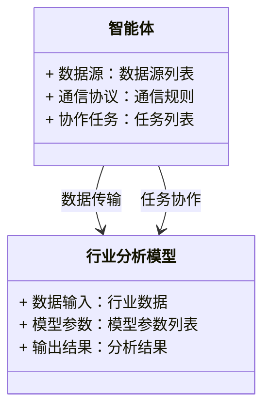
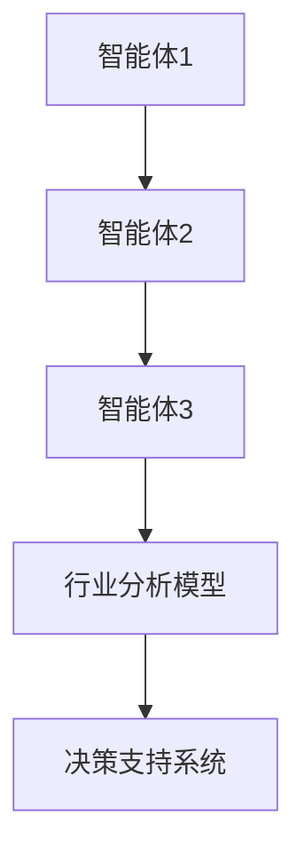

                 


# 基于多智能体的动态行业分析模型在价值投资中的应用

> **关键词**：多智能体系统，动态行业分析，价值投资，协作机制，数学模型，金融建模  
> **摘要**：本文探讨了基于多智能体的动态行业分析模型在价值投资中的应用。通过分析多智能体系统的协作机制与动态行业分析模型的核心原理，提出了一种结合两者优势的金融建模方法，并通过实际案例展示了其在价值投资中的潜力和优势。文章内容涵盖背景介绍、核心概念、算法原理、系统架构、项目实战等部分，为读者提供了从理论到实践的全面指导。

---

## 第一部分：多智能体系统与动态行业分析基础

### 第1章：多智能体系统概述

#### 1.1 多智能体系统的定义与特点

多智能体系统（Multi-Agent System, MAS）是由多个智能体（Agent）组成的分布式系统，这些智能体能够通过协作完成复杂任务。以下是其核心特点：

- **独立性**：每个智能体都是独立的个体，具有自主决策能力。
- **协作性**：智能体之间通过通信和协作完成共同目标。
- **分布式性**：系统中的智能体分布在网络的各个节点上，能够并行处理任务。
- **动态性**：系统能够适应环境的变化，智能体之间可以动态调整协作策略。

#### 1.2 动态行业分析模型的定义与特点

动态行业分析模型是一种能够实时更新和适应行业变化的分析工具。其特点包括：

- **实时性**：能够快速响应市场变化，提供实时的行业分析结果。
- **动态性**：模型参数和分析逻辑可以根据市场环境动态调整。
- **准确性**：通过多智能体的协作，能够提高分析结果的准确性。

#### 1.3 多智能体与动态行业分析的结合

多智能体系统与动态行业分析模型的结合，能够充分发挥两者的优点。具体表现为：

- **数据采集与处理**：多智能体可以从多个数据源实时采集行业数据，并通过协作完成数据的清洗和预处理。
- **模型构建与优化**：动态行业分析模型可以通过多智能体的协作不断优化模型参数，提高分析精度。
- **决策支持**：通过多智能体的协作，动态行业分析模型能够为投资者提供更加精准的决策支持。

---

## 第二部分：多智能体动态行业分析模型的算法原理

### 第2章：多智能体协作机制

#### 2.1 多智能体协作的基本原理

多智能体协作机制是动态行业分析模型的核心。以下是协作的基本原理：

- **协作目标**：明确多智能体的协作目标，例如数据采集、模型优化等。
- **协作规则**：制定智能体之间的协作规则，例如通信协议、任务分配规则等。
- **协作过程**：通过智能体之间的通信和协作，完成特定任务。

#### 2.2 多智能体通信与信息共享

多智能体之间的通信和信息共享是协作的基础。以下是实现通信与信息共享的关键点：

- **通信协议**：设计合理的通信协议，确保智能体之间的信息传递高效且可靠。
- **信息共享机制**：通过共享数据库或消息队列实现智能体之间的信息共享。
- **信息冲突处理**：当智能体之间的信息发生冲突时，需要设计合理的冲突解决机制。

#### 2.3 多智能体协作的算法实现

以下是基于博弈论的多智能体协作算法实现示例：

$$
\text{收益函数} = \sum_{i=1}^{n} \text{智能体}_i的收益
$$

---

## 第三部分：系统分析与架构设计方案

### 第3章：系统架构设计

#### 3.1 问题场景介绍

动态行业分析模型需要在复杂的金融环境中实时更新和优化。以下是问题场景的描述：

- **数据来源**：多智能体从多个数据源（如新闻、财务报表、市场数据）采集行业信息。
- **数据处理**：智能体之间协作完成数据的清洗、预处理和特征提取。
- **模型优化**：通过多智能体的协作，动态优化行业分析模型的参数。

#### 3.2 系统功能设计

以下是系统功能设计的领域模型：



#### 3.3 系统架构设计

以下是系统架构设计的架构图：



---

## 第四部分：项目实战

### 第4章：项目实战

#### 4.1 环境安装

以下是项目实战的环境安装说明：

- **Python版本**：Python 3.8以上
- **依赖库**：numpy, pandas, matplotlib, networkx

#### 4.2 核心代码实现

以下是核心代码实现：

```python
import numpy as np
import pandas as pd
import matplotlib.pyplot as plt
import networkx as nx

class Agent:
    def __init__(self, name):
        self.name = name
        self.data = []
    
    def collect_data(self, data):
        self.data.append(data)
    
    def send_data(self, agent):
        agent.collect_data(self.data[-1])

# 创建多个智能体
agent1 = Agent("Agent1")
agent2 = Agent("Agent2")
agent3 = Agent("Agent3")

# 智能体协作
agent1.collect_data(100)
agent1.send_data(agent2)
agent2.send_data(agent3)

# 可视化协作过程
G = nx.Graph()
G.add_nodes_from([agent1.name, agent2.name, agent3.name])
G.add_edge(agent1.name, agent2.name)
G.add_edge(agent2.name, agent3.name)
nx.draw(G, with_labels=True)
plt.show()
```

#### 4.3 案例分析与解读

以下是案例分析与解读：

- **案例背景**：假设我们有三个智能体，分别负责采集、处理和分析行业数据。
- **案例实现**：通过上述代码实现智能体之间的数据协作。
- **案例结果**：智能体协作完成数据的采集、处理和分析，生成行业分析报告。

---

## 第五部分：总结与展望

### 第5章：总结与展望

#### 5.1 总结

通过本文的介绍，我们了解了基于多智能体的动态行业分析模型在价值投资中的应用。本文详细讲解了多智能体系统的核心概念、协作机制、算法原理和系统架构设计，并通过项目实战展示了其在金融建模中的具体应用。

#### 5.2 展望

未来，随着人工智能技术的不断发展，多智能体系统和动态行业分析模型将在金融领域发挥越来越重要的作用。我们可以进一步研究多智能体系统在金融风险控制、投资决策支持等领域的应用，为投资者提供更加智能化和个性化的服务。

---

## 作者

作者：AI天才研究院/AI Genius Institute & 禅与计算机程序设计艺术 /Zen And The Art of Computer Programming

