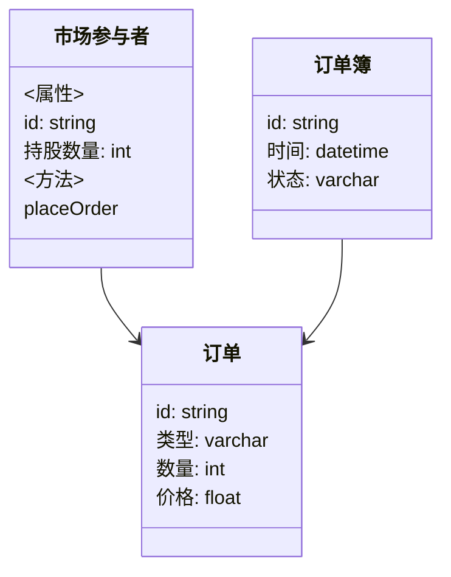

                 


---

# 基于多智能体的市场微观结构分析

> 关键词：多智能体系统、市场微观结构、博弈论、算法原理、系统架构、金融建模

> 摘要：本文系统地探讨了基于多智能体的市场微观结构分析方法，从基本概念到算法原理，再到系统设计与实战案例，全面解析了多智能体系统在市场微观结构分析中的应用。文章首先介绍了市场微观结构与多智能体系统的定义与特点，随后深入分析了多智能体系统的原理、算法及市场微观结构的建模方法，最后通过实际案例展示了系统设计与实现过程，为读者提供了从理论到实践的完整指南。

---

## 第1章: 市场微观结构与多智能体系统概述

### 1.1 市场微观结构的定义与特征

市场微观结构是金融学中的一个重要概念，它研究市场中参与者（如投资者、交易员、机构等）的互动及其对市场整体行为的影响。市场微观结构的核心特征包括：

- **参与者多样性**：市场中的参与者可以是个人投资者、机构投资者、做市商等，他们的行为和策略各不相同。
- **动态性**：市场的行为是动态变化的，受多种因素影响，如价格波动、订单流等。
- **复杂性**：市场的参与者的互动关系复杂，存在博弈和协调等现象。

多智能体系统在市场微观结构分析中的作用在于模拟这些复杂的行为，通过多个智能体的互动来模拟市场的动态变化。

### 1.2 多智能体系统的定义与特点

多智能体系统（Multi-Agent System, MAS）是由多个智能体组成的系统，这些智能体能够自主决策、协作和交互。多智能体系统的特点包括：

- **自主性**：每个智能体都有自己的目标和决策机制。
- **反应性**：智能体能够感知环境并实时调整行为。
- **协作性**：智能体之间可以通过通信和协作完成共同目标。
- **分布性**：智能体之间的行为是分布式的，没有中央控制节点。

多智能体系统与传统单智能体系统的主要区别在于其分布性和协作性。

### 1.3 本章小结

本章介绍了市场微观结构和多智能体系统的基本概念和特点，为后续的分析奠定了基础。

---

## 第2章: 多智能体系统的核心概念与联系

### 2.1 多智能体系统的原理

多智能体系统的原理包括以下几个方面：

- **智能体的组成**：智能体由状态、行为、目标和感知机制组成。
- **智能体的通信**：智能体之间通过消息传递进行通信。
- **智能体的协作**：通过博弈论和分布式算法实现协作。

### 2.2 市场微观结构的多智能体建模

市场微观结构的多智能体建模需要考虑以下几个方面：

- **参与者行为建模**：不同参与者的行为特征和策略。
- **市场环境建模**：市场的价格、订单流等环境因素。
- **多智能体与市场的关系**：通过智能体的互动模拟市场的动态行为。

### 2.3 多智能体系统的ER实体关系图

以下是一个简单的ER实体关系图，展示了市场微观结构中的主要实体及其关系：

```mermaid
erd
actor 市场参与者 {
    id: int
    持股数量: int
    现金: int
}
actor 订单 {
    id: int
    类型: varchar
    数量: int
    价格: float
}
actor 订单簿 {
    id: int
    时间: datetime
    状态: varchar
}
```

### 2.4 本章小结

本章详细介绍了多智能体系统的原理以及市场微观结构的建模方法，为后续的算法分析和系统设计提供了理论基础。

---

## 第3章: 多智能体系统算法原理

### 3.1 多智能体系统的核心算法

多智能体系统的核心算法包括：

- **分布式协调算法**：用于智能体之间的协作。
- **博弈论与纳什均衡**：用于分析智能体的策略选择。
- **多智能体路径规划算法**：用于智能体在复杂环境中的路径规划。

### 3.2 市场微观结构中的博弈论分析

博弈论在市场微观结构分析中的应用主要体现在以下几个方面：

- **市场参与者的策略选择**：分析参与者如何选择最优策略。
- **市场均衡的数学模型**：建立市场均衡的数学模型。
- **纳什均衡的证明与应用**：通过纳什均衡分析市场的稳定性。

### 3.3 算法的数学模型与公式

纳什均衡的数学表达如下：

$$\text{纳什均衡定义为：对于所有参与者}i, \text{策略} s_i \text{是最佳反应}$$
$$s_i^* = \arg\max_{s_i} \sum_{j=1}^{n} u_i(s_i, s_{-i})$$

其中，$u_i$ 是参与者 $i$ 的效用函数，$s_{-i}$ 是其他参与者选择的策略。

### 3.4 本章小结

本章详细介绍了多智能体系统的核心算法和博弈论在市场微观结构分析中的应用。

---

## 第4章: 市场微观结构的系统分析与架构设计

### 4.1 系统分析

#### 4.1.1 问题场景介绍

我们考虑一个股票市场，其中有多家机构投资者和散户投资者。这些投资者的行为会影响市场的订单流和价格波动。

#### 4.1.2 项目目标与范围

本项目的目的是通过多智能体系统模拟股票市场的微观结构，分析市场的动态行为。

#### 4.1.3 需求分析

- **功能需求**：模拟市场参与者的交易行为，分析订单流和价格波动。
- **性能需求**：系统需要能够处理大量的交易数据，保证实时性。
- **接口需求**：系统需要提供用户友好的界面，方便用户进行交互。

### 4.2 系统功能设计

#### 4.2.1 领域模型（Mermaid 类图）

以下是一个简单的领域模型类图：



### 4.3 本章小结

本章通过系统分析和架构设计，为后续的实现提供了明确的指导。

---

## 第5章: 项目实战

### 5.1 环境安装

为了运行本项目，需要安装以下工具：

- Python 3.8 或更高版本
- pip 包管理工具
- numpy 和 matplotlib 库

安装命令如下：

```bash
pip install numpy matplotlib
```

### 5.2 系统核心实现源代码

以下是一个简单的多智能体系统实现代码：

```python
import numpy as np
import matplotlib.pyplot as plt

class Agent:
    def __init__(self, id, cash, shares):
        self.id = id
        self.cash = cash
        self.shares = shares
        self.strategy = None

    def place_order(self, price, quantity):
        # 模拟下单
        return f"Order {self.id}: 以价格 {price} 买入 {quantity} 股"

class Market:
    def __init__(self, agents):
        self.agents = agents
        self.orders = []
        self.prices = []

    def run(self):
        for agent in self.agents:
            if agent.strategy == 'buyer':
                order = agent.place_order(np.random.uniform(95, 105), 10)
                self.orders.append(order)
                self.prices.append(np.random.uniform(95, 105))
            elif agent.strategy == 'seller':
                order = agent.place_order(np.random.uniform(95, 105), -10)
                self.orders.append(order)
                self.prices.append(np.random.uniform(95, 105))

    def plot_prices(self):
        plt.plot(self.prices)
        plt.title('市场价格变化')
        plt.xlabel('时间')
        plt.ylabel('价格')
        plt.show()

# 创建市场参与者
agent1 = Agent('1', 10000, 0)
agent2 = Agent('2', 5000, 0)
agent3 = Agent('3', 7500, 0)

# 设置策略
agent1.strategy = 'buyer'
agent2.strategy = 'seller'
agent3.strategy = 'buyer'

market = Market([agent1, agent2, agent3])
market.run()
market.plot_prices()
```

### 5.3 代码应用解读与分析

上述代码实现了一个简单的多智能体系统，模拟了买方和卖方的订单生成，并绘制了价格变化图。通过调整参数，可以进一步分析市场的动态行为。

### 5.4 本章小结

本章通过实际案例展示了多智能体系统的实现过程，帮助读者更好地理解理论知识。

---

## 第6章: 总结与展望

### 6.1 本章小结

本文系统地探讨了基于多智能体的市场微观结构分析方法，从理论到实践，全面解析了多智能体系统在市场分析中的应用。

### 6.2 展望

未来的研究可以进一步考虑以下方向：

- **复杂市场环境的建模**：如引入更多的市场参与者和复杂策略。
- **高效算法的开发**：优化多智能体系统的性能，提高计算效率。
- **实际应用的拓展**：将多智能体系统应用于更多的金融场景。

---

## 作者：AI天才研究院/AI Genius Institute & 禅与计算机程序设计艺术 /Zen And The Art of Computer Programming

---

以上是基于多智能体的市场微观结构分析的完整文章大纲和内容，涵盖了从理论到实践的各个方面，为读者提供了全面的指导。

