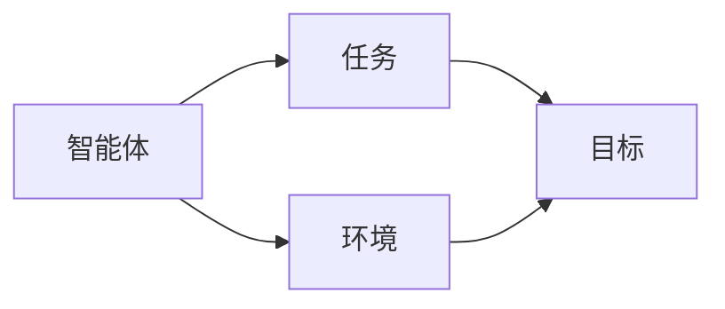
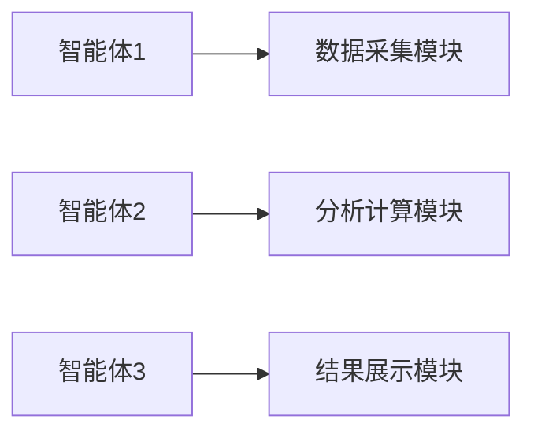

                 

# 基于多智能体的自动化产业周期分析

> 关键词：多智能体系统，产业周期分析，自动化，分布式计算，协同算法，系统架构

> 摘要：本文深入探讨了基于多智能体的自动化产业周期分析方法，结合技术背景、核心概念、算法原理、系统架构和项目实战，系统性地分析了多智能体系统在产业周期分析中的应用。通过详细的技术讲解和案例分析，展示了如何利用多智能体系统的优势，实现对产业周期的智能化、自动化分析。

---

## 第一部分: 基于多智能体的自动化产业周期分析基础

### 第1章: 多智能体系统与产业周期分析概述

#### 1.1 多智能体系统的基本概念
多智能体系统（Multi-Agent System, MAS）是由多个智能体组成的分布式系统，每个智能体都是具备独立性、反应性和社会性的实体。多智能体系统的核心在于智能体之间的协同合作，通过信息共享和任务分配，实现复杂问题的解决。

#### 1.2 产业周期分析的定义与重要性
产业周期分析是指对一个行业或产业在经济发展过程中的不同阶段进行研究，包括成长期、成熟期、衰退期等。通过对产业周期的分析，企业可以更好地制定战略规划，抓住市场机遇，规避风险。

#### 1.3 多智能体系统在产业周期分析中的应用
多智能体系统在产业周期分析中的应用主要体现在数据采集、信息处理和决策支持等方面。通过多智能体系统的协同合作，可以实现对市场数据的实时监控和分析，为产业周期预测提供科学依据。

---

### 第2章: 多智能体系统的核心概念与联系

#### 2.1 多智能体系统的核心原理
多智能体系统的核心原理包括智能体的独立性、反应性和社会性。智能体之间通过通信协议进行信息交互，通过协同算法实现任务分配和目标达成。

#### 2.2 多智能体系统与相关技术的对比
多智能体系统与分布式系统、人工智能和物联网等技术有显著区别。例如，分布式系统强调计算资源的分布式部署，而多智能体系统强调智能体之间的协同合作。

#### 2.3 多智能体系统的ER实体关系图

---

## 第二部分: 产业周期分析的方法与应用

### 第3章: 产业周期分析的传统方法
#### 3.1 宏观经济分析法
宏观经济分析法通过分析GDP、利率、通胀等宏观经济指标，判断产业所处的周期阶段。

#### 3.2 行业生命周期分析法
行业生命周期分析法将产业周期分为导入期、成长期、成熟期和衰退期，帮助企业制定相应的战略。

#### 3.3 市场趋势分析法
市场趋势分析法通过分析市场需求、供给和竞争格局，预测产业周期的变化趋势。

### 第4章: 基于多智能体的产业周期分析方法
#### 4.1 数据采集与处理
多智能体系统通过传感器、数据库和API接口等途径采集市场数据，并进行清洗和预处理。

#### 4.2 多智能体协同分析
多智能体系统通过分布式计算和协同算法，对市场数据进行分析和建模，生成产业周期的预测结果。

#### 4.3 结果可视化与反馈
分析结果通过可视化界面呈现，智能体根据反馈调整分析模型和参数，提高预测精度。

### 第5章: 产业周期分析的实际案例
#### 5.1 某行业周期分析案例
以某行业为例，详细分析其产业周期，并展示多智能体系统在其中的应用。

---

## 第三部分: 技术基础与算法原理

### 第6章: 多智能体系统的算法原理
#### 6.1 一致性算法
一致性算法用于保证多智能体系统中数据的一致性，常用算法包括Paxos和Raft。

#### 6.2 任务分配算法
任务分配算法通过智能体之间的协商和竞争，实现任务的最优分配。

#### 6.3 路径规划算法
路径规划算法用于智能体在复杂环境中的路径规划，常用算法包括A*和Dijkstra。

### 第7章: 系统架构设计
#### 7.1 系统功能设计
系统功能包括数据采集、分析计算、结果展示和反馈优化。

#### 7.2 系统架构图

---

## 第四部分: 项目实战与总结

### 第8章: 项目实战
#### 8.1 环境安装
安装必要的开发工具和依赖库，如Python、Django和Docker。

#### 8.2 核心代码实现
实现多智能体系统的协同算法和数据处理模块。

#### 8.3 案例分析
通过具体案例展示系统的实际应用和效果。

### 第9章: 总结与展望
#### 9.1 总结
总结全文内容，强调多智能体系统在产业周期分析中的优势和应用前景。

#### 9.2 展望
展望未来的研究方向和应用领域，指出多智能体系统在产业周期分析中的潜力。

---

## 最佳实践 Tips

- 在实际应用中，建议结合具体业务需求，灵活调整系统架构和算法参数。
- 定期更新和优化系统模型，以适应市场变化和新的数据需求。
- 注意数据隐私和安全问题，确保系统的合规性。

---

作者：AI天才研究院/AI Genius Institute & 禅与计算机程序设计艺术 /Zen And The Art of Computer Programming

