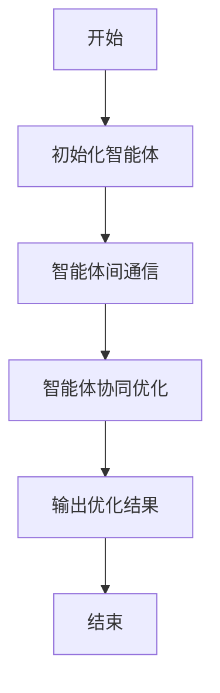
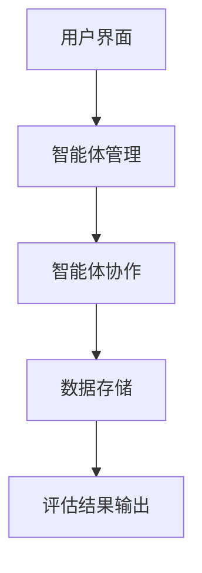

                 


# 基于多智能体的自动化公司创新效率评估

> 关键词：多智能体系统、创新效率评估、企业创新、协同优化、系统架构

> 摘要：本文探讨了基于多智能体系统的公司创新效率评估方法，分析了多智能体系统在企业创新中的潜力与应用，详细介绍了创新效率评估的核心指标、算法实现、系统架构设计以及实际案例分析，为企业的创新效率提升提供了理论依据和实践指导。

---

# 第一部分: 基于多智能体的创新效率评估概述

## 第1章: 创新效率评估的背景与挑战

### 1.1 创新效率评估的背景
#### 1.1.1 创新效率评估的定义与重要性
创新效率评估是指通过量化的方法，对企业在创新过程中的效率进行测量和分析。它不仅关注创新成果的数量，还关注创新过程的效率和资源利用情况。在当前快速变化的商业环境中，创新效率已成为企业竞争力的核心要素之一。

#### 1.1.2 当前企业创新效率评估的痛点
传统的创新效率评估方法通常依赖于事后统计和经验判断，存在以下问题：
- 数据采集困难：创新过程涉及多个部门和环节，数据分散且难以整合。
- 方法单一：传统评估方法往往只关注最终结果，忽视了创新过程中的动态变化。
- 及时性不足：评估结果通常滞后于创新过程，难以提供实时反馈。

#### 1.1.3 多智能体系统在创新效率评估中的潜力
多智能体系统（Multi-Agent System, MAS）通过多个智能体之间的协同合作，能够实时感知和分析创新过程中的动态信息。这种系统能够将创新过程中的各个要素（如团队协作、资源分配、知识共享等）纳入评估范围，提供更加全面和动态的评估结果。

### 1.2 多智能体系统的核心概念
#### 1.2.1 多智能体系统的定义与特点
多智能体系统是由多个具有自主性、反应性和协作性的智能体组成的分布式系统。与传统系统相比，MAS具有以下特点：
- **自主性**：每个智能体都有独立的目标和决策能力。
- **反应性**：智能体能够根据环境变化实时调整行为。
- **协作性**：智能体之间通过通信和协作共同完成复杂任务。
- **分布性**：系统由多个智能体组成，不存在集中控制节点。

#### 1.2.2 多智能体系统与传统评估方法的区别
传统的创新效率评估方法通常基于静态数据和单点分析，而多智能体系统则能够动态捕捉创新过程中的实时信息，并通过多个智能体的协作实现全面评估。

#### 1.2.3 多智能体系统在企业创新中的应用场景
多智能体系统可以应用于企业的多个创新环节，例如：
- 创新团队协作优化
- 资源分配与调度
- 知识共享与传播
- 创新过程中的风险预警

### 1.3 本章小结
本章介绍了创新效率评估的背景和挑战，重点分析了多智能体系统在创新效率评估中的潜力和应用场景。多智能体系统的自主性、反应性和协作性使其成为解决创新效率评估问题的理想选择。

---

# 第二部分: 多智能体系统与创新效率评估的核心概念

## 第2章: 多智能体系统的原理与架构

### 2.1 多智能体系统的原理
#### 2.1.1 多智能体系统的组成要素
多智能体系统由以下要素组成：
- **智能体**：具有自主性、反应性和协作性的实体。
- **环境**：智能体所处的外部环境，包括物理环境和信息环境。
- **通信机制**：智能体之间交换信息的渠道。
- **协作协议**：智能体之间协同工作的规则和协议。

#### 2.1.2 多智能体系统的核心算法
多智能体系统的协同优化算法是其核心，常见的算法包括：
- **分布式优化算法**：通过智能体之间的协作实现全局优化。
- **协商算法**：智能体通过协商达成一致的行动方案。
- **学习算法**：智能体通过学习不断优化自身的决策能力。

#### 2.1.3 多智能体系统在企业创新中的应用场景
在企业创新中，多智能体系统可以应用于：
- 创新团队协作优化：通过智能体模拟团队成员的行为，优化协作效率。
- 资源分配与调度：智能体可以根据实时需求动态分配资源。
- 知识共享与传播：智能体可以自动识别和传播有价值的知识。

### 2.2 创新效率评估的指标体系
#### 2.2.1 创新效率评估的关键指标
创新效率评估的关键指标包括：
- **创新周期**：从创意产生到产品落地的时间。
- **创新成功率**：创新项目成功实施的比例。
- **资源利用率**：创新过程中资源的使用效率。
- **知识共享度**：团队内部知识共享的水平。

#### 2.2.2 指标权重的确定方法
指标权重可以通过以下方法确定：
- **层次分析法（AHP）**：通过专家评分确定各指标的权重。
- **熵值法**：基于数据的分布情况确定权重。

#### 2.2.3 指标数据的采集与处理
创新效率评估的指标数据可以通过以下途径采集：
- **企业内部数据**：包括项目进度、资源分配记录等。
- **外部数据**：如市场反馈、行业基准数据。
- **实时数据**：通过多智能体系统实时采集创新过程中的动态信息。

### 2.3 多智能体系统与创新效率评估的结合
#### 2.3.1 多智能体系统在创新效率评估中的角色
多智能体系统在创新效率评估中的角色包括：
- **数据采集**：实时采集创新过程中的动态信息。
- **协同优化**：通过智能体的协作实现创新过程的优化。
- **结果输出**：生成创新效率评估报告。

#### 2.3.2 多智能体系统与创新效率评估的协同机制
多智能体系统与创新效率评估的协同机制包括：
- **信息共享**：智能体之间共享创新过程中的关键信息。
- **任务分配**：智能体根据评估结果动态调整任务分配。
- **反馈优化**：根据评估结果优化智能体的行为。

#### 2.3.3 多智能体系统在创新效率评估中的优势
多智能体系统在创新效率评估中的优势包括：
- **实时性**：能够实时捕捉创新过程中的动态信息。
- **全面性**：能够从多个维度对创新效率进行评估。
- **可扩展性**：适用于不同规模和复杂度的企业创新场景。

### 2.4 本章小结
本章详细介绍了多智能体系统的原理与架构，并探讨了其在创新效率评估中的应用。通过多智能体系统的协同优化能力，可以显著提升企业的创新效率评估能力。

---

# 第三部分: 基于多智能体的创新效率评估算法原理

## 第3章: 基于多智能体的协同优化算法

### 3.1 协同优化算法的概述
#### 3.1.1 协同优化算法的基本原理
协同优化算法通过多个智能体的协作实现全局优化。其基本原理包括：
- **智能体协作**：多个智能体通过通信和协作共同完成任务。
- **局部优化**：每个智能体在局部范围内进行优化。
- **全局优化**：通过智能体的协作实现全局优化。

#### 3.1.2 协同优化算法的核心思想
协同优化算法的核心思想是通过局部优化的组合实现全局优化。其特点包括：
- **分布式计算**：算法不依赖于集中计算，而是通过分布式计算实现全局优化。
- **自主性**：每个智能体具有自主决策能力。
- **动态性**：算法能够动态调整以适应环境变化。

#### 3.1.3 协同优化算法的应用场景
协同优化算法可以应用于以下场景：
- **资源分配**：通过智能体的协作实现资源的最优分配。
- **任务调度**：通过智能体的协作实现任务的最优调度。
- **动态优化**：在动态环境下实现系统的实时优化。

### 3.2 基于多智能体的协同优化算法实现
#### 3.2.1 算法流程图


#### 3.2.2 算法的数学模型
协同优化算法的数学模型可以表示为：
$$f(x) = \arg \max_{x} \sum_{i=1}^{n} f_i(x_i)$$
其中，$f_i(x_i)$表示第$i$个智能体的优化目标，$x_i$表示该智能体的决策变量。

#### 3.2.3 算法实现的Python代码示例
```python
class Agent:
    def __init__(self, id):
        self.id = id
        self.goal = None
        self.state = None

    def set_goal(self, goal):
        self.goal = goal

    def set_state(self, state):
        self.state = state

    def decide(self):
        # 根据当前状态和目标做出决策
        pass

# 初始化智能体
agents = [Agent(i) for i in range(4)]

# 智能体间通信
for agent in agents:
    agent.set_state("待命")

# 协同优化
for agent in agents:
    agent.set_goal("优化资源分配")
    agent.decide()

# 输出优化结果
for agent in agents:
    print(f"Agent {agent.id} 的决策结果：{agent.decide()}")
```

### 3.3 算法的优化与改进
#### 3.3.1 算法的优化策略
- **局部优化**：每个智能体在局部范围内进行优化，减少全局优化的复杂性。
- **动态调整**：根据环境变化动态调整智能体的行为。
- **学习机制**：通过机器学习算法优化智能体的决策能力。

#### 3.3.2 算法的改进方向
- **提高实时性**：优化算法的计算效率，减少响应时间。
- **增强鲁棒性**：提高算法在动态环境下的适应能力。
- **扩展性改进**：增强算法的可扩展性，适用于更大规模的系统。

#### 3.3.3 算法的性能评估
算法的性能可以通过以下指标进行评估：
- **计算效率**：算法的执行时间。
- **优化效果**：优化结果的最优程度。
- **适应性**：算法在动态环境下的适应能力。

### 3.4 本章小结
本章详细介绍了基于多智能体的协同优化算法，并通过流程图和代码示例展示了其实现过程。通过协同优化算法，可以显著提高企业的创新效率评估能力。

---

# 第四部分: 基于多智能体的创新效率评估系统设计

## 第4章: 系统分析与架构设计

### 4.1 系统分析
#### 4.1.1 系统目标与范围
系统的目标是通过多智能体系统实现对公司创新效率的自动化评估。系统的范围包括创新过程中的关键环节，如团队协作、资源分配、知识共享等。

#### 4.1.2 系统功能需求
系统的功能需求包括：
- **数据采集**：实时采集创新过程中的动态信息。
- **协同优化**：通过多智能体系统的协作实现创新过程的优化。
- **结果输出**：生成创新效率评估报告。

#### 4.1.3 系统性能需求
系统的性能需求包括：
- **实时性**：能够实时捕捉创新过程中的动态信息。
- **可扩展性**：适用于不同规模和复杂度的企业创新场景。
- **可靠性**：系统能够稳定运行，保证评估结果的准确性。

### 4.2 系统架构设计
#### 4.2.1 系统架构图


#### 4.2.2 系统功能设计
系统的功能设计包括：
- **智能体管理**：管理多个智能体，分配任务和目标。
- **智能体协作**：实现智能体之间的通信和协作。
- **数据存储**：存储创新过程中的动态信息和评估结果。
- **评估结果输出**：生成创新效率评估报告。

#### 4.2.3 系统接口设计
系统的接口设计包括：
- **用户界面**：供用户查看和管理智能体。
- **智能体接口**：智能体之间的通信接口。
- **数据接口**：与企业内部数据系统对接的接口。

#### 4.2.4 系统交互流程
系统的交互流程包括：
1. 用户通过界面启动系统。
2. 智能体管理模块分配任务和目标。
3. 智能体协作模块实现智能体之间的通信和协作。
4. 数据存储模块存储动态信息和评估结果。
5. 评估结果输出模块生成创新效率评估报告。

### 4.3 本章小结
本章详细介绍了基于多智能体的创新效率评估系统的架构设计，并通过系统架构图和交互流程展示了其实现过程。通过该系统，企业可以实现创新效率的自动化评估。

---

# 第五部分: 基于多智能体的创新效率评估项目实战

## 第5章: 项目实战

### 5.1 环境安装与配置
#### 5.1.1 环境要求
- **操作系统**：Windows/Mac/Linux
- **编程语言**：Python 3.6+
- **依赖库**：numpy, matplotlib, scikit-learn

#### 5.1.2 环境配置
```bash
pip install numpy matplotlib scikit-learn
```

### 5.2 系统核心实现
#### 5.2.1 创新效率评估的核心代码实现
```python
import numpy as np
from sklearn.metrics import accuracy_score

class InnovationEfficiencyEvaluator:
    def __init__(self):
        self.agents = []
        self.results = []

    def add_agent(self, agent):
        self.agents.append(agent)

    def evaluate(self):
        for agent in self.agents:
            result = agent.decide()
            self.results.append(result)

        return self.results

# 示例智能体
class SimpleAgent:
    def __init__(self, id):
        self.id = id
        self.goal = None

    def set_goal(self, goal):
        self.goal = goal

    def decide(self):
        if self.goal == "优化资源分配":
            return "资源分配优化完成"
        else:
            return "无法完成目标"

# 创建评估器和智能体
evaluator = InnovationEfficiencyEvaluator()
agent1 = SimpleAgent(1)
agent2 = SimpleAgent(2)

evaluator.add_agent(agent1)
evaluator.add_agent(agent2)

# 设置目标
agent1.set_goal("优化资源分配")
agent2.set_goal("优化资源分配")

# 开始评估
results = evaluator.evaluate()
print("评估结果：", results)
```

#### 5.2.2 代码实现的详细解读
- **InnovationEfficiencyEvaluator类**：负责管理多个智能体并进行评估。
- **SimpleAgent类**：简单的智能体实现，能够根据目标做出决策。
- **evaluate方法**：对所有智能体进行评估并返回结果。

### 5.3 实际案例分析
#### 5.3.1 案例背景
某公司希望优化其创新团队的协作效率，希望通过多智能体系统实现创新效率的自动化评估。

#### 5.3.2 案例实现
```python
# 创建评估器和智能体
evaluator = InnovationEfficiencyEvaluator()
agent1 = SimpleAgent(1)
agent2 = SimpleAgent(2)
agent3 = SimpleAgent(3)

evaluator.add_agent(agent1)
evaluator.add_agent(agent2)
evaluator.add_agent(agent3)

# 设置目标
agent1.set_goal("优化团队协作")
agent2.set_goal("优化资源分配")
agent3.set_goal("优化知识共享")

# 开始评估
results = evaluator.evaluate()
print("评估结果：", results)
```

#### 5.3.3 案例分析与优化
通过上述案例，我们可以看到多智能体系统在创新效率评估中的优势。每个智能体都可以根据自己的目标和环境做出决策，从而实现全局优化。

### 5.4 本章小结
本章通过实际案例展示了如何基于多智能体系统实现创新效率的自动化评估。通过代码实现和案例分析，读者可以更好地理解多智能体系统在创新效率评估中的应用。

---

# 第六部分: 总结与展望

## 第6章: 总结与展望

### 6.1 本章总结
本文详细介绍了基于多智能体的公司创新效率评估方法，分析了多智能体系统在创新效率评估中的潜力与应用。通过算法实现和系统设计，展示了如何利用多智能体系统实现创新效率的自动化评估。

### 6.2 最佳实践 tips
- **数据采集**：确保数据的实时性和准确性。
- **算法优化**：根据具体场景优化算法的性能。
- **系统架构**：合理设计系统架构，确保系统的可扩展性和可维护性。

### 6.3 小结
通过本文的探讨，我们可以看到，多智能体系统在创新效率评估中的应用前景广阔。随着人工智能技术的不断发展，多智能体系统将为企业创新效率的提升提供更加强有力的支持。

### 6.4 注意事项
- **数据隐私**：在数据采集和处理过程中，需要注意数据隐私和合规性。
- **系统安全**：确保系统的安全性，防止数据泄露和系统攻击。
- **算法适应性**：根据具体场景调整算法，确保算法的适应性和鲁棒性。

### 6.5 拓展阅读
- **多智能体系统**：深入学习多智能体系统的理论与实践。
- **协同优化算法**：研究更多协同优化算法及其应用。
- **创新效率评估**：探索更多创新效率评估的方法和工具。

---

# 作者：AI天才研究院/AI Genius Institute & 禅与计算机程序设计艺术 /Zen And The Art of Computer Programming

---

**本文通过详细分析和系统设计，展示了如何利用多智能体系统实现公司创新效率的自动化评估。通过理论分析和实际案例，本文为企业的创新效率提升提供了新的思路和方法。**

