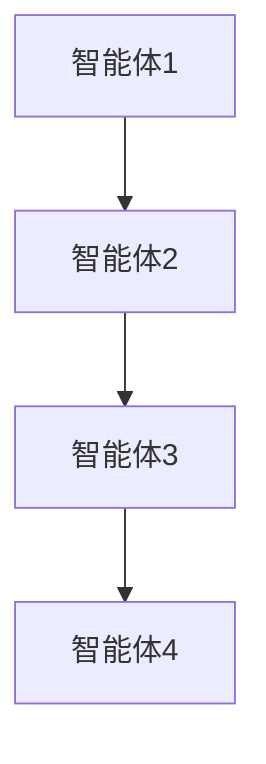
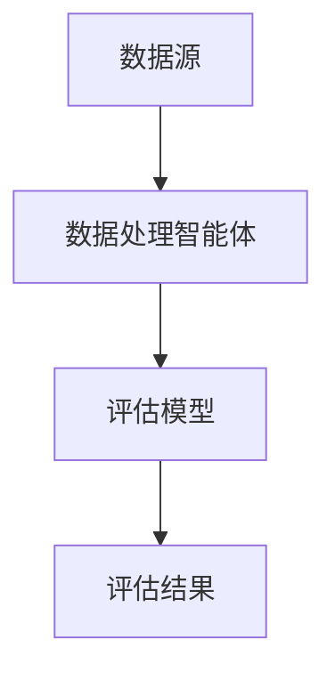
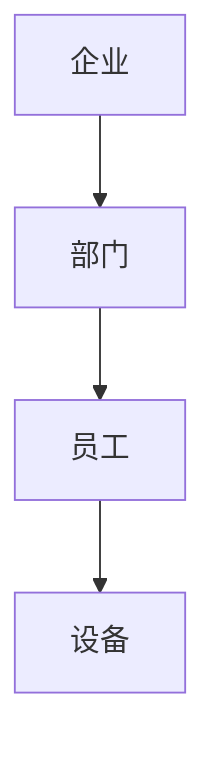
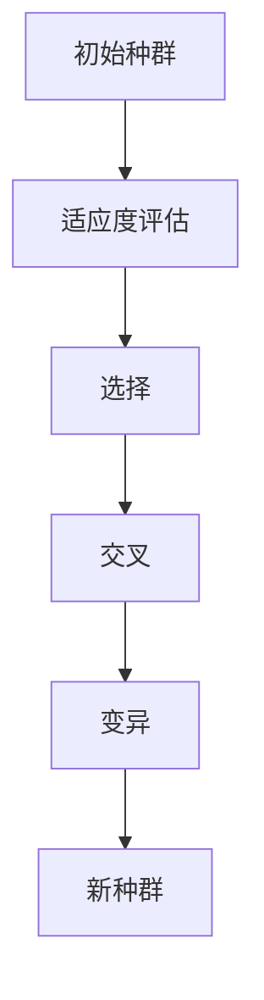
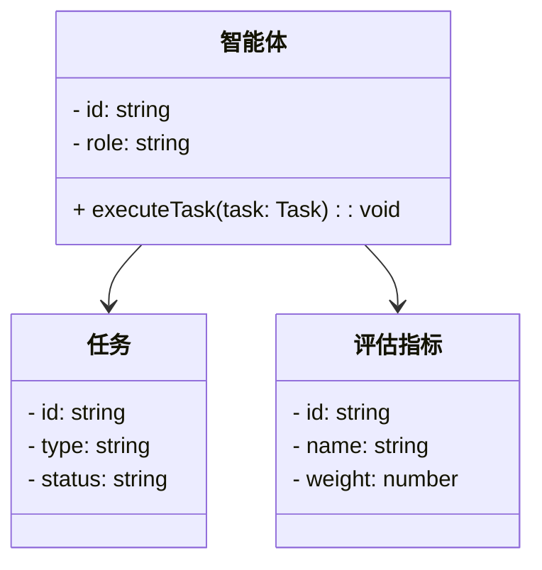
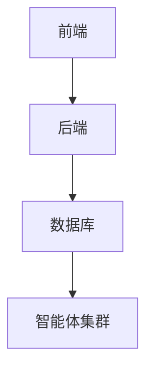
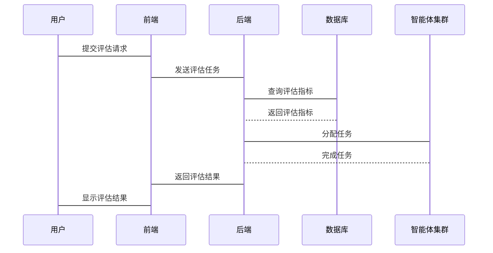

                 


# 基于多智能体的自动化公司可持续发展评估

## 关键词：多智能体系统、可持续发展评估、自动化评估、协同算法、系统架构

## 摘要：  
随着全球对企业可持续发展的关注日益增加，如何高效、准确地评估公司的可持续发展能力成为企业的一项重要任务。本文提出了一种基于多智能体的自动化公司可持续发展评估方法。通过多智能体系统的协同工作，结合先进的算法和系统架构设计，本文详细探讨了如何实现对公司可持续发展能力的自动化评估。文章从背景介绍、核心概念、算法原理、系统架构、项目实战到最佳实践，全面解析了基于多智能体的自动化评估方法，为企业提供了新的思路和解决方案。

---

# 第一部分: 基于多智能体的自动化公司可持续发展评估概述

## 第1章: 问题背景与定义

### 1.1 问题背景
#### 1.1.1 可持续发展评估的现状与挑战
随着全球可持续发展目标的推进，企业面临的环境、社会和治理（ESG）压力越来越大。传统的可持续发展评估方法通常依赖人工数据收集和分析，效率低下且容易出错。企业需要一种更高效、更准确的评估方法，以快速响应市场变化和监管要求。

#### 1.1.2 多智能体系统在企业评估中的应用前景
多智能体系统（Multi-Agent System, MAS）是一种由多个自主或协作的智能体组成的分布式系统。每个智能体能够独立决策并与其他智能体协作，共同完成复杂任务。MAS在数据处理、任务分配和决策优化方面的优势，使其成为企业自动化评估的理想选择。

#### 1.1.3 自动化评估的必要性与优势
自动化评估能够显著提高评估效率，减少人为错误，并实时跟踪企业的可持续发展表现。通过MAS，企业可以实现数据的自动采集、分析和决策，从而更快地响应市场需求和优化内部管理。

### 1.2 核心概念定义
#### 1.2.1 多智能体系统（MAS）的定义
多智能体系统是由多个智能体组成的分布式系统，每个智能体能够感知环境、自主决策并与其他智能体协作。MAS的特点包括分布式性、协作性和适应性。

#### 1.2.2 可持续发展评估的定义与维度
可持续发展评估是对企业在环境、社会和经济三个维度上的表现进行全面评价的过程。环境维度关注资源消耗和排放，社会维度关注员工权益和社会责任，经济维度关注经济效益和财务健康。

#### 1.2.3 自动化评估的实现方式
自动化评估通过智能系统自动采集数据、分析指标并生成评估结果。MAS在其中起到关键作用，通过多个智能体协同完成数据处理和决策优化。

---

## 第2章: 多智能体系统与可持续发展评估的关系

### 2.1 多智能体系统的特征
#### 2.1.1 分布式计算
MAS中的每个智能体都运行在不同的计算节点上，能够并行处理数据，提高计算效率。

#### 2.1.2 协作性
智能体之间通过协作完成任务，例如数据共享、任务分配和决策优化。

#### 2.1.3 自适应性
MAS能够根据环境变化动态调整智能体的行为，适应不同的评估需求。

### 2.2 可持续发展评估的维度
#### 2.2.1 环境维度
评估企业在资源消耗、排放和能源使用方面的表现。

#### 2.2.2 社会维度
评估企业在员工权益、社会责任和社区贡献方面的表现。

#### 2.2.3 经济维度
评估企业在经济效益、财务健康和风险管理方面的表现。

### 2.3 多智能体系统在可持续发展评估中的作用
#### 2.3.1 数据采集与处理
MAS中的智能体能够从多个数据源自动采集和处理数据，例如从企业系统、传感器和外部数据库获取数据。

#### 2.3.2 智能决策支持
通过MAS的协作，企业可以快速生成评估结果，并提供优化建议，帮助企业在可持续发展方面进行改进。

#### 2.3.3 实时监控与反馈
MAS能够实时监控企业的可持续发展表现，并根据反馈调整评估策略，确保评估结果的准确性和及时性。

---

## 第3章: 多智能体系统的核心概念与联系

### 3.1 多智能体系统的核心原理
#### 3.1.1 实体关系分析
通过分析企业中的各个实体（如部门、员工、设备等）之间的关系，确定智能体的职责和协作方式。

#### 3.1.2 任务分配机制
根据智能体的能力和当前负载，动态分配任务，确保任务高效完成。

#### 3.1.3 协作策略
制定智能体之间的协作规则，例如协商、拍卖和规则驱动的协作方式。

### 3.2 可持续发展评估的数学模型
#### 3.2.1 综合评估指标体系
构建一个包含环境、社会和经济三个维度的评估指标体系，每个指标都有相应的权重。

#### 3.2.2 权重分配模型
通过专家评分或数据驱动的方法，确定每个指标的权重，确保评估结果的客观性和准确性。

#### 3.2.3 优化算法
使用优化算法（如遗传算法和粒子群优化算法）对评估模型进行优化，提高评估效率和准确性。

### 3.3 系统架构与流程图
#### 3.3.1 系统架构图


#### 3.3.2 数据流图


#### 3.3.3 实体关系图


---

# 第二部分: 多智能体协同算法与数学模型

## 第4章: 多智能体协同算法

### 4.1 任务分配算法
#### 4.1.1 基于角色的分配策略
根据智能体的角色和能力分配任务，例如将数据分析任务分配给具有数据处理能力的智能体。

#### 4.1.2 基于优先级的分配策略
根据任务的优先级动态分配任务，确保关键任务优先完成。

#### 4.1.3 基于负载均衡的分配策略
根据智能体的负载情况，动态调整任务分配，确保系统资源的充分利用。

### 4.2 协作决策算法
#### 4.2.1 基于协商的决策算法
智能体之间通过协商达成一致，确定最优决策方案。

#### 4.2.2 基于拍卖的决策算法
通过拍卖机制确定任务的最优执行智能体，确保任务高效完成。

#### 4.2.3 基于规则的决策算法
根据预定义的规则，智能体自动完成任务分配和决策。

### 4.3 优化算法
#### 4.3.1 遗传算法
通过模拟生物进化的过程，优化评估模型的参数，提高评估准确度。

#### 4.3.2 蚁群算法
通过模拟蚂蚁觅食的行为，优化任务分配和路径选择，提高系统效率。

#### 4.3.3 粒子群优化算法
通过模拟鸟群觅食的行为，优化评估模型的参数，提高评估效率。

---

## 第5章: 数学模型与公式

### 5.1 综合评估模型
#### 5.1.1 综合评估公式
$$ S = \sum_{i=1}^{n} w_i x_i $$
其中，\( S \) 表示综合评分，\( w_i \) 表示第 \( i \) 个指标的权重，\( x_i \) 表示第 \( i \) 个指标的评分。

### 5.2 优化算法模型
#### 5.2.1 遗传算法流程图


---

## 第三部分: 系统分析与架构设计方案

## 第6章: 系统分析与架构设计

### 6.1 项目背景介绍
本项目旨在通过多智能体系统实现对公司可持续发展能力的自动化评估，帮助企业快速响应市场需求和优化内部管理。

### 6.2 系统功能设计
#### 6.2.1 领域模型类图


#### 6.2.2 系统架构图


#### 6.2.3 系统接口设计
系统提供以下接口：
1. 数据采集接口：用于采集企业数据。
2. 任务分配接口：用于分配智能体任务。
3. 评估结果接口：用于返回评估结果。

#### 6.2.4 系统交互序列图


---

## 第四部分: 项目实战

## 第7章: 项目实战

### 7.1 环境安装
安装必要的软件和库：
1. 安装Python和相关开发工具。
2. 安装多智能体框架（如.AgentSpeak）。
3. 安装数据处理库（如Pandas和NumPy）。

### 7.2 系统核心实现源代码
以下是核心代码实现：

```python
class Agent:
    def __init__(self, id, role):
        self.id = id
        self.role = role
        self.tasks = []
    
    def executeTask(self, task):
        # 处理任务并返回结果
        pass

class Task:
    def __init__(self, id, type):
        self.id = id
        self.type = type

class SustainabilityEvaluator:
    def __init__(self, agents):
        self.agents = agents
    
    def evaluate(self):
        # 分配任务并执行评估
        pass
```

### 7.3 代码应用解读与分析
该代码定义了一个多智能体系统，每个智能体都有唯一的标识和角色，并能够执行任务。SustainabilityEvaluator类负责协调智能体完成评估任务。

### 7.4 实际案例分析
以某制造企业为例，通过MAS系统自动采集生产数据、分析能源消耗，并生成环境、社会和经济三个维度的评估结果。

### 7.5 项目小结
通过本项目，我们验证了基于多智能体的自动化评估方法的有效性，并展示了其在企业可持续发展评估中的应用潜力。

---

## 第五部分: 最佳实践

## 第8章: 最佳实践

### 8.1 小结
基于多智能体的自动化评估方法能够显著提高企业的评估效率和准确性，为企业实现可持续发展目标提供有力支持。

### 8.2 注意事项
1. 确保智能体之间的协作机制设计合理，避免任务冲突。
2. 定期更新评估指标和权重，确保评估结果的准确性。
3. 优化算法的性能，提高系统的响应速度。

### 8.3 拓展阅读
建议读者进一步阅读多智能体系统和优化算法的相关文献，深入了解其在企业评估中的应用。

---

## 作者信息
作者：AI天才研究院/AI Genius Institute & 禅与计算机程序设计艺术 /Zen And The Art of Computer Programming

