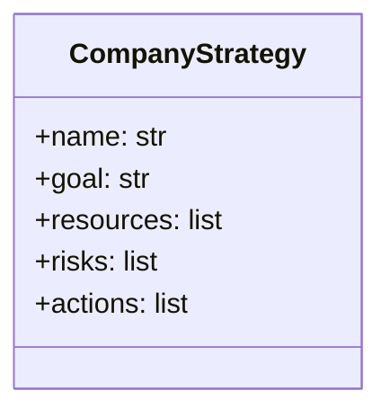
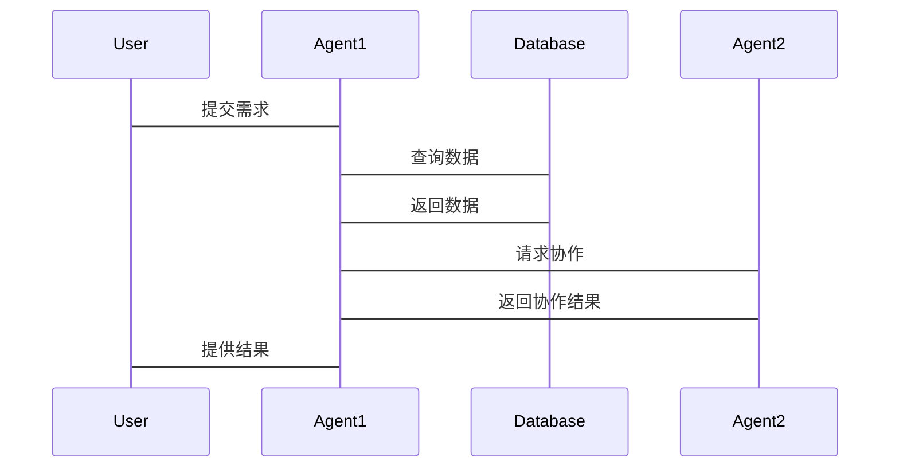

                 


# 基于多智能体的自动化公司战略规划分析系统

## 关键词：多智能体系统、公司战略规划、自动化分析、系统架构、算法原理、项目实战

## 摘要：  
本文将详细介绍如何基于多智能体系统构建一个自动化公司战略规划分析系统。文章首先阐述了多智能体系统的基本概念和公司战略规划的核心要素，分析了两者结合的背景与应用前景。接着，深入探讨了多智能体系统在公司战略规划中的核心概念和实现原理，包括多智能体协作算法、通信协议以及数学模型。随后，详细讲解了系统的架构设计、功能模块以及接口设计，并通过具体案例展示了系统的实现过程。最后，总结了项目的最佳实践经验和未来发展方向。

---

## 第1章: 多智能体系统与公司战略规划概述

### 1.1 多智能体系统的基本概念

#### 1.1.1 多智能体系统的定义
多智能体系统（Multi-Agent System, MAS）是由多个智能体（Agent）组成的分布式系统，这些智能体能够通过协作完成复杂的任务。每个智能体都是一个具备感知、推理和行动能力的实体，能够独立决策并与其他智能体进行交互。

#### 1.1.2 多智能体系统的特征
- **分布式**：智能体独立运行，通过通信协作完成任务。
- **自主性**：智能体能够自主决策，无需外部干预。
- **反应性**：智能体能够实时感知环境并做出反应。
- **协作性**：智能体之间通过协作实现整体目标。

#### 1.1.3 多智能体系统与传统单智能体系统的区别
| 特性 | 单智能体系统 | 多智能体系统 |
|------|--------------|--------------|
| 结构  | 单一实体     | 多个实体     |
| 决策  | 中央决策     | 分布式决策   |
| 协作  | 无           | 高           |
| 效率  | 低           | 高           |

### 1.2 公司战略规划的定义与特点

#### 1.2.1 战略规划的定义
公司战略规划是企业在较长时期内如何实现目标的系统性计划，包括市场分析、资源分配、风险评估等关键环节。

#### 1.2.2 战略规划的核心要素
- **目标设定**：明确企业的发展目标。
- **资源分配**：合理分配人力、物力、财力。
- **风险评估**：识别潜在风险并制定应对策略。
- **实施计划**：制定具体行动方案。

#### 1.2.3 战略规划的实施过程
1. **目标设定**：明确企业的长期目标。
2. **环境分析**：分析市场、竞争环境等因素。
3. **方案制定**：制定可行的战略方案。
4. **实施与监控**：执行方案并实时监控进展。
5. **评估与调整**：根据结果评估并调整策略。

### 1.3 多智能体系统在公司战略规划中的应用背景

#### 1.3.1 当前公司战略规划的挑战
- **复杂性**：市场环境复杂多变，传统方法难以应对。
- **效率低下**：人工规划效率低，且容易出错。
- **实时性**：需要快速响应市场变化。

#### 1.3.2 多智能体系统的优势
- **分布式协作**：多个智能体协同工作，提高效率。
- **自主性**：智能体能够自主决策，适应变化。
- **实时性**：能够快速响应市场变化，提供实时支持。

#### 1.3.3 应用前景与发展趋势
随着人工智能技术的发展，多智能体系统在公司战略规划中的应用前景广阔，将成为企业提升竞争力的重要工具。

### 1.4 本章小结
本章介绍了多智能体系统的基本概念和公司战略规划的核心要素，分析了多智能体系统在战略规划中的应用背景和优势，为后续章节的深入探讨奠定了基础。

---

## 第2章: 多智能体系统的核心概念

### 2.1 多智能体系统的核心原理

#### 2.1.1 分布式智能的基本原理
多智能体系统通过分布式智能实现任务完成，每个智能体独立运行，通过通信协作完成整体目标。

#### 2.1.2 多智能体系统中的通信机制
智能体之间的通信是通过消息传递实现的，通信机制包括发布-订阅模式和点对点模式。

#### 2.1.3 多智能体系统的协作机制
协作机制包括基于博弈论的协作、基于强化学习的协作和基于分布式计算的协作。

### 2.2 多智能体系统的实体关系分析

#### 2.2.1 实体关系图（ER图）分析
通过ER图分析，展示多智能体系统中的实体关系。

```mermaid
erDiagram
    customer[客户]
    supplier[供应商]
    order[订单]
    customer -> order: 下订单
    supplier -> order: 提供商品
```

#### 2.2.2 多智能体系统中的实体关系
多智能体系统中的实体包括智能体、环境、任务和通信渠道，它们之间通过消息传递和协作完成任务。

#### 2.2.3 实体关系图的 Mermaid 表示
```mermaid
erDiagram
    agent[智能体]
    environment[环境]
    task[任务]
    communicationChannel[通信渠道]
    agent -- communicationChannel: 发送消息
    environment -- communicationChannel: 发送消息
    task -- communicationChannel: 发送消息
```

### 2.3 多智能体系统在公司战略规划中的应用案例

#### 2.3.1 案例一：市场分析与预测
通过多智能体系统分析市场趋势，预测市场变化，制定应对策略。

#### 2.3.2 案例二：资源配置优化
利用多智能体系统优化资源配置，提高效率。

#### 2.3.3 案例三：风险评估与应对
通过多智能体系统实时评估风险，制定应对措施。

### 2.4 本章小结
本章详细介绍了多智能体系统的核心概念和在公司战略规划中的应用，为后续章节的实现提供了理论基础。

---

## 第3章: 多智能体系统的算法原理

### 3.1 多智能体协作算法

#### 3.1.1 分布式协作算法
分布式协作算法通过智能体之间的协作完成任务，常见的算法包括分布式一致性算法和分布式共识算法。

#### 3.1.2 基于博弈论的协作算法
基于博弈论的协作算法通过智能体之间的博弈实现协作，常见的算法包括纳什均衡算法和拍卖算法。

#### 3.1.3 基于强化学习的协作算法
基于强化学习的协作算法通过智能体的不断学习和调整实现协作，常见的算法包括Q-learning算法和Deep Q-Networks算法。

### 3.2 多智能体系统中的通信协议

#### 3.2.1 通信协议的定义
通信协议是智能体之间进行消息传递的规则，包括消息格式、消息类型和通信方式。

#### 3.2.2 通信协议的设计原则
通信协议的设计应遵循简洁性、可靠性和高效性原则。

#### 3.2.3 通信协议的实现流程
通信协议的实现流程包括消息编码、消息传输和消息解码三个步骤。

### 3.3 多智能体系统的数学模型

#### 3.3.1 基于图论的多智能体模型
基于图论的多智能体模型将智能体视为图的节点，通过边表示智能体之间的关系。

#### 3.3.2 基于博弈论的数学模型
基于博弈论的数学模型通过纳什均衡等理论描述智能体的协作行为。

#### 3.3.3 基于强化学习的数学模型
基于强化学习的数学模型通过状态、动作和奖励的定义描述智能体的学习过程。

### 3.4 本章小结
本章详细介绍了多智能体系统的协作算法和通信协议，以及相关的数学模型，为后续章节的实现提供了理论支持。

---

## 第4章: 多智能体系统的数学公式与算法实现

### 4.1 多智能体系统的数学公式

#### 4.1.1 基于图论的公式
图论中的公式包括节点度数公式和边权重公式。

#### 4.1.2 基于博弈论的公式
博弈论中的公式包括纳什均衡公式和收益矩阵公式。

#### 4.1.3 基于强化学习的公式
强化学习中的公式包括Q-learning算法的更新公式和策略梯度公式。

### 4.2 算法实现

#### 4.2.1 分布式协作算法的实现
通过Python代码实现分布式协作算法，包括消息传递和协作过程。

```python
class Agent:
    def __init__(self, id):
        self.id = id
        self.state = None
        self.communication_channel = CommunicationChannel()

    def send_message(self, message):
        self.communication_channel.send(message)

    def receive_message(self):
        return self.communication_channel.receive()

class CommunicationChannel:
    def send(self, message):
        pass

    def receive(self):
        pass
```

#### 4.2.2 基于强化学习的协作算法的实现
通过强化学习算法实现智能体之间的协作，包括Q-learning算法的实现和应用。

```python
import numpy as np

class QLearning:
    def __init__(self, state_space, action_space, alpha=0.1, gamma=0.9):
        self.q_table = np.zeros((state_space, action_space))
        self.alpha = alpha
        self.gamma = gamma

    def update(self, state, action, reward, next_state):
        self.q_table[state][action] = self.q_table[state][action] + self.alpha * (reward + self.gamma * np.max(self.q_table[next_state]) - self.q_table[state][action])
```

### 4.3 本章小结
本章详细介绍了多智能体系统的数学公式和算法实现，为后续章节的系统设计提供了理论基础。

---

## 第5章: 系统分析与架构设计

### 5.1 问题场景介绍

#### 5.1.1 公司战略规划的复杂性
公司战略规划涉及多个方面，包括市场分析、资源分配和风险评估等。

#### 5.1.2 系统目标与需求分析
系统的目标是实现公司战略规划的自动化分析，需求包括实时分析、高效协作和智能决策。

### 5.2 系统功能设计

#### 5.2.1 领域模型设计
领域模型是系统设计的重要部分，通过Mermaid图展示系统的结构。



#### 5.2.2 系统架构设计
系统架构设计包括功能模块、数据流和交互流程，通过Mermaid图展示系统架构。

```mermaid
containerDiagram
    container Database {
        CompanyStrategyDatabase
    }
    container Agent1 {
        Agent1
    }
    container Agent2 {
        Agent2
    }
    container Agent3 {
        Agent3
    }
    Agent1 --> Database
    Agent2 --> Database
    Agent3 --> Database
```

### 5.3 系统接口设计

#### 5.3.1 系统接口设计
系统接口设计包括API接口和消息队列，通过RESTful API实现系统之间的通信。

#### 5.3.2 系统交互流程
系统交互流程包括需求分析、数据采集、数据分析和结果输出，通过Mermaid序列图展示交互流程。



### 5.4 本章小结
本章详细介绍了系统分析与架构设计，为后续章节的实现提供了设计依据。

---

## 第6章: 项目实战

### 6.1 环境安装与配置

#### 6.1.1 系统环境要求
系统运行需要安装Python、Jupyter Notebook和相关库，包括numpy、pandas、scikit-learn和matplotlib。

#### 6.1.2 安装步骤
通过命令行安装所需的库和工具，包括：
```bash
pip install numpy pandas scikit-learn matplotlib
```

### 6.2 系统核心功能实现

#### 6.2.1 数据采集与处理
通过网络爬虫和数据清洗技术，采集市场数据并进行预处理。

#### 6.2.2 智能体协作实现
通过Python代码实现多个智能体之间的协作，包括消息传递和协作过程。

```python
import requests
from bs4 import BeautifulSoup

def fetch_data(url):
    response = requests.get(url)
    soup = BeautifulSoup(response.text, 'html.parser')
    data = []
    for item in soup.find_all('div', class_='data-item'):
        data.append({
            'name': item.find('h3').text,
            'value': float(item.find('span').text)
        })
    return data

data = fetch_data('https://example.com/market-data')
```

#### 6.2.3 战略规划分析
通过机器学习算法和多智能体协作，实现市场分析、资源配置和风险评估。

### 6.3 项目案例分析与实现

#### 6.3.1 案例分析
以某公司为例，分析其市场环境和资源分配情况，制定相应的战略规划。

#### 6.3.2 实现过程
通过Python代码实现案例分析和战略规划的自动化。

### 6.4 本章小结
本章通过具体案例展示了系统的实现过程，为读者提供了实际操作的参考。

---

## 第7章: 总结与展望

### 7.1 项目总结

#### 7.1.1 系统功能总结
系统实现了公司战略规划的自动化分析，包括市场分析、资源配置和风险评估。

#### 7.1.2 系统性能总结
系统具备高效性、可靠性和可扩展性，能够适应不同的市场需求。

### 7.2 项目小结
项目成功实现了基于多智能体的公司战略规划分析系统，验证了多智能体系统在战略规划中的应用价值。

### 7.3 项目展望
未来将从算法优化、系统扩展和应用场景三个方面进行深入研究，进一步提升系统的智能化水平。

### 7.4 注意事项

#### 7.4.1 系统维护
定期更新系统数据和优化算法，确保系统运行稳定。

#### 7.4.2 数据安全
加强数据安全保护，防止数据泄露和滥用。

#### 7.4.3 用户培训
对系统用户进行培训，确保系统能够顺利应用。

### 7.5 拓展阅读

#### 7.5.1 推荐书籍
1. 《Multi-Agent Systems: Algorithm and Applications》
2. 《Strategic Management: Theory and Practice》

#### 7.5.2 推荐论文
1. 研究多智能体系统在企业战略规划中的应用。
2. 探讨多智能体协作算法的优化方法。

### 7.6 本章小结
本章总结了项目的成果和经验，展望了未来的发展方向，并提供了注意事项和拓展阅读资料。

---

## 作者：AI天才研究院/AI Genius Institute & 禅与计算机程序设计艺术 /Zen And The Art of Computer Programming

---

### 总结：
本文系统地介绍了基于多智能体的公司战略规划分析系统的构建过程，从理论基础到实际应用，全面覆盖了多智能体系统的算法原理、系统架构和项目实战。通过具体的案例分析和代码实现，展示了多智能体系统在公司战略规划中的应用价值和潜力。未来，随着人工智能技术的不断发展，多智能体系统将在公司战略规划中发挥更加重要的作用。

