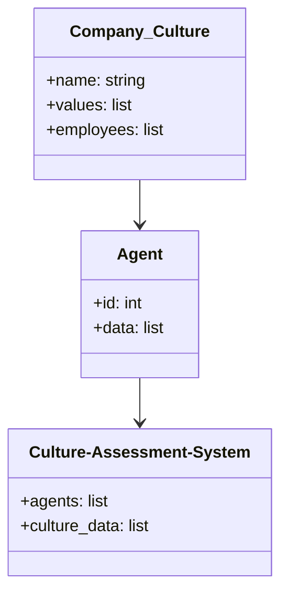
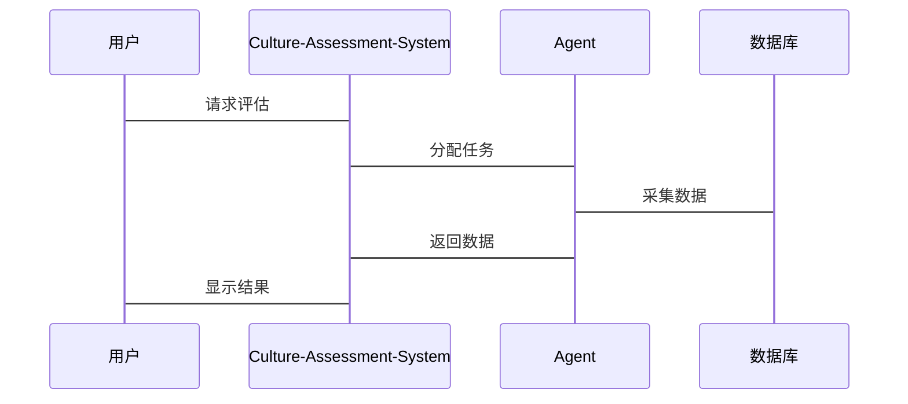

                 


---

# 基于多智能体的自动化公司文化影响评估

**关键词：** 多智能体系统、公司文化、自动化评估、文化影响分析、分布式计算、文化管理优化

**摘要：**  
随着企业规模的不断扩大和管理复杂性的增加，公司文化的影响评估变得越来越重要。传统的文化评估方法依赖于人工分析和主观判断，效率低下且难以量化。本文提出了一种基于多智能体的自动化公司文化影响评估方法，通过分布式计算和协同算法，实现对公司文化的自动化分析和优化。本文详细介绍了多智能体系统的基本原理、公司在文化评估中的应用，以及基于多智能体的算法实现和系统架构设计。通过实际案例分析，展示了该方法在提高评估效率和准确性方面的优势，为企业文化管理提供了新的思路。

---

## 第一部分：公司文化与多智能体系统概述

### 第1章：公司文化与多智能体系统概述

#### 1.1 公司文化的基本概念

##### 1.1.1 公司文化的定义与核心要素
公司文化是企业在长期经营过程中形成的价值观、行为准则和思维方式的总和。它包括以下几个核心要素：
- **愿景与使命**：企业的长期目标和存在的意义。
- **价值观**：企业倡导的核心信念，如诚信、创新、客户至上等。
- **行为规范**：员工在日常工作中的行为准则和工作方式。
- **组织结构**：企业内部的分工与协作模式。

##### 1.1.2 公司文化的分类与特征
公司文化可以分为以下几类：
- **层级文化**：从基层到高层的文化层次。
- **部门文化**：不同部门之间的文化差异。
- **整体文化**：整个企业的统一文化。

公司文化的特征包括：
- **动态性**：随着环境变化而不断调整。
- **渗透性**：影响企业的各个方面。
- **一致性**：内部各部分的高度统一。

##### 1.1.3 公司文化在企业管理中的作用
公司文化是企业的灵魂，对企业的生存和发展起着至关重要的作用。它不仅影响员工的行为，还决定了企业的市场定位和品牌形象。良好的公司文化能够增强员工的凝聚力，提高企业的竞争力。

#### 1.2 多智能体系统的基本概念

##### 1.2.1 多智能体系统的定义
多智能体系统（Multi-Agent System，MAS）是由多个智能体组成的系统，这些智能体能够自主决策、协作完成任务，并通过通信实现信息共享。

##### 1.2.2 多智能体系统的特点与优势
- **分布式计算**：任务分布在多个智能体中完成。
- **协作性**：智能体之间通过协作提高整体效率。
- **自适应性**：能够根据环境变化调整行为。

##### 1.2.3 多智能体系统在企业管理中的应用前景
多智能体系统在企业管理中的应用前景广阔，特别是在公司文化评估、资源分配、决策支持等方面具有潜力。

#### 1.3 多智能体系统与公司文化评估的结合

##### 1.3.1 公司文化评估的必要性
公司文化评估是企业管理中的重要环节，能够帮助企业发现文化中的问题，优化管理策略。

##### 1.3.2 多智能体系统在公司文化评估中的优势
- **高效性**：通过分布式计算提高评估效率。
- **准确性**：智能体协同分析能够提高评估的准确性。
- **实时性**：能够实时监控文化变化。

##### 1.3.3 本章小结
本章介绍了公司文化的基本概念和多智能体系统的基本原理，并分析了两者结合的必要性和优势。

---

### 第2章：多智能体系统的核心概念与原理

#### 2.1 多智能体系统的组成与结构

##### 2.1.1 智能体的定义与分类
智能体（Agent）是具有感知环境、自主决策和执行任务能力的实体。智能体可以分为以下几类：
- **简单反射智能体**：基于当前感知做出反应。
- **基于模型智能体**：具有内部状态和目标。
- **目标驱动智能体**：根据目标选择行动。

##### 2.1.2 多智能体系统的层次结构
多智能体系统的层次结构包括：
- **智能体层**：由多个智能体组成，负责具体任务。
- **协调层**：负责智能体之间的协作与通信。
- **环境层**：智能体所处的外部环境。

##### 2.1.3 多智能体系统中的通信与协作机制
智能体之间的通信可以通过以下方式实现：
- **直接通信**：智能体之间直接交换信息。
- **间接通信**：通过中间媒介进行信息传递。

协作机制包括：
- **任务分配**：智能体根据自身能力分配任务。
- **协同决策**：多个智能体共同决策。

#### 2.2 多智能体系统的算法原理

##### 2.2.1 分布式计算与多智能体系统
分布式计算是多智能体系统的核心，它将任务分解为多个子任务，由不同的智能体完成。

##### 2.2.2 多智能体系统中的协调算法
协调算法是多智能体系统中确保智能体协作的关键。常见的协调算法包括：
- **一致性算法**：确保所有智能体达成一致。
- **分布式协商算法**：通过协商分配任务。

##### 2.2.3 多智能体系统中的冲突解决机制
冲突解决机制用于处理智能体之间的冲突，包括：
- **优先级机制**：根据任务优先级解决冲突。
- **协商机制**：通过协商达成一致。

#### 2.3 公司文化评估的数学模型与方法

##### 2.3.1 公司文化评估的指标体系
公司文化评估的指标体系包括：
- **员工满意度**：员工对公司文化的认可程度。
- **文化一致性**：公司文化与企业目标的匹配程度。
- **文化影响力**：文化对员工行为的影响程度。

##### 2.3.2 多智能体系统在文化评估中的数学模型
数学模型用于描述多智能体系统在文化评估中的行为。例如，可以使用以下公式描述文化影响度：
$$
I = \sum_{i=1}^{n} w_i \cdot x_i
$$
其中，$I$ 是文化影响度，$w_i$ 是指标权重，$x_i$ 是指标值。

##### 2.3.3 评估模型的验证与优化
通过实际数据验证模型的有效性，并根据反馈优化模型。

---

### 第3章：多智能体系统在公司文化影响评估中的应用

#### 3.1 公司文化影响评估的场景与需求

##### 3.1.1 公司文化评估的主要场景
- **企业并购**：评估目标企业的文化是否匹配。
- **组织变革**：评估文化对变革的适应性。
- **文化传承**：评估企业文化传承的效果。

##### 3.1.2 自动化评估的需求分析
- **提高效率**：通过自动化减少人工成本。
- **增强准确性**：通过智能分析提高评估的准确性。
- **实时监控**：实时跟踪文化变化。

##### 3.1.3 多智能体系统在自动化评估中的角色
多智能体系统通过分布式计算和协同算法，实现对公司文化的自动化评估。

#### 3.2 多智能体系统在公司文化评估中的具体应用

##### 3.2.1 基于多智能体的员工行为分析
通过分析员工的行为数据，识别文化问题。

##### 3.2.2 基于多智能体的文化传播与影响分析
分析文化在企业中的传播路径和影响程度。

##### 3.2.3 基于多智能体的文化评估结果优化
根据评估结果，优化企业文化管理策略。

#### 3.3 多智能体系统在公司文化管理中的优势

##### 3.3.1 提高评估效率
通过自动化减少人工成本。

##### 3.3.2 增强评估的客观性
通过智能分析提高评估的准确性。

##### 3.3.3 促进文化管理的动态优化
实时监控文化变化，及时调整管理策略。

---

## 第4章：多智能体系统与公司文化评估的算法实现

### 4.1 多智能体协同算法的基本原理

#### 4.1.1 分布式协同算法概述
分布式协同算法是多智能体系统的核心算法，用于协调多个智能体的行为。

#### 4.1.2 基于多智能体的协同算法实现
协同算法的实现步骤包括：
1. 初始化智能体。
2. 智能体感知环境。
3. 智能体做出决策。
4. 智能体执行任务。
5. 智能体反馈结果。

#### 4.1.3 协同算法的数学模型与公式
协同算法的数学模型可以表示为：
$$
C = \sum_{i=1}^{n} \alpha_i \cdot a_i
$$
其中，$C$ 是协同度，$\alpha_i$ 是权重，$a_i$ 是智能体的贡献。

### 4.2 公司文化评估的算法实现

#### 4.2.1 基于多智能体的文化评估流程
评估流程包括：
1. 数据采集：收集员工行为数据。
2. 数据分析：使用多智能体算法分析数据。
3. 评估结果：生成文化影响报告。

#### 4.2.2 文化评估算法的实现步骤
实现步骤包括：
1. 初始化智能体。
2. 智能体采集数据。
3. 智能体分析数据。
4. 智能体生成报告。

#### 4.2.3 算法实现的代码示例
以下是一个简单的Python代码示例：

```python
class Agent:
    def __init__(self, id):
        self.id = id
        self.data = []

    def collect_data(self):
        # 采集数据
        pass

    def analyze_data(self):
        # 分析数据
        pass

    def generate_report(self):
        # 生成报告
        pass

# 初始化智能体
agents = [Agent(i) for i in range(5)]

# 启动评估过程
for agent in agents:
    agent.collect_data()
    agent.analyze_data()
    agent.generate_report()
```

### 4.3 算法实现的优化与改进

#### 4.3.1 算法性能的优化方法
- **并行计算**：提高数据处理速度。
- **负载均衡**：优化任务分配。

#### 4.3.2 算法的可扩展性改进
- **模块化设计**：便于扩展。
- **动态调整**：适应环境变化。

#### 4.3.3 算法的鲁棒性增强
- **容错机制**：处理智能体故障。
- **自适应算法**：根据环境调整参数。

---

## 第5章：基于多智能体的公司文化评估系统架构设计

### 5.1 系统架构

#### 5.1.1 问题场景介绍
系统用于对公司文化进行自动化评估，帮助企业管理者优化文化管理。

#### 5.1.2 系统功能设计

##### 5.1.2.1 领域模型类图
以下是一个简单的领域模型类图：



#### 5.1.2.2 系统架构图
以下是一个系统的架构图：


#### 5.1.2.3 系统接口设计
系统接口包括：
- **数据接口**：与数据库交互。
- **用户接口**：供用户查看评估结果。

#### 5.1.2.4 系统交互序列图
以下是一个系统的交互序列图：



---

## 第6章：项目实战

### 6.1 环境安装

#### 6.1.1 安装Python
安装Python 3.8及以上版本。

#### 6.1.2 安装必要的库
安装以下Python库：
- `numpy`
- `pandas`
- `matplotlib`

#### 6.1.3 安装系统依赖
安装其他必要的系统依赖。

### 6.2 系统核心实现源代码

#### 6.2.1 代码实现
以下是核心代码示例：

```python
import numpy as np
import pandas as pd

class Agent:
    def __init__(self, id):
        self.id = id
        self.data = []

    def collect_data(self, employees):
        # 采集员工数据
        for emp in employees:
            self.data.append(emp)

    def analyze_data(self):
        # 分析数据
        return np.mean(self.data)

    def generate_report(self):
        # 生成报告
        pass

class CultureAssessmentSystem:
    def __init__(self, num_agents):
        self.agents = [Agent(i) for i in range(num_agents)]

    def assess_culture(self, employees):
        for agent in self.agents:
            agent.collect_data(employees)
            result = agent.analyze_data()
            print(f"Agent {agent.id} result: {result}")

# 示例用法
system = CultureAssessmentSystem(5)
employees = [1, 2, 3, 4, 5]
system.assess_culture(employees)
```

#### 6.2.2 代码解读与分析
上述代码实现了多智能体系统的基本功能，包括数据采集、数据分析和报告生成。

### 6.3 实际案例分析

#### 6.3.1 案例背景
某公司希望通过自动化评估优化企业文化。

#### 6.3.2 数据分析
使用多智能体系统分析员工行为数据。

#### 6.3.3 结果解读
生成文化影响报告，指导文化优化。

### 6.4 项目小结
本章通过实际案例展示了多智能体系统在公司文化评估中的应用，验证了系统的有效性和可行性。

---

## 第7章：最佳实践、小结、注意事项、拓展阅读

### 7.1 最佳实践

#### 7.1.1 系统设计
- **模块化设计**：便于维护和扩展。
- **容错机制**：提高系统的鲁棒性。

#### 7.1.2 算法优化
- **并行计算**：提高效率。
- **动态调整**：适应环境变化。

### 7.2 小结
本文详细介绍了基于多智能体的公司文化影响评估方法，包括系统设计、算法实现和实际应用。

### 7.3 注意事项

#### 7.3.1 数据隐私
在数据采集和分析过程中，需注意保护员工隐私。

#### 7.3.2 系统安全
确保系统的安全性，防止数据泄露。

#### 7.3.3 算法的适用性
根据具体需求选择合适的算法。

### 7.4 拓展阅读

#### 7.4.1 多智能体系统
推荐阅读《Multi-Agent Systems》。

#### 7.4.2 公司文化管理
推荐阅读《Corporate Culture: The Ultimate Business Tool》。

---

## 作者信息

作者：AI天才研究院/AI Genius Institute & 禅与计算机程序设计艺术 /Zen And The Art of Computer Programming

---

以上是基于多智能体的自动化公司文化影响评估的技术博客文章的详细内容，涵盖了从理论到实践的各个方面，旨在为企业提供一种高效、准确的文化评估方法。

