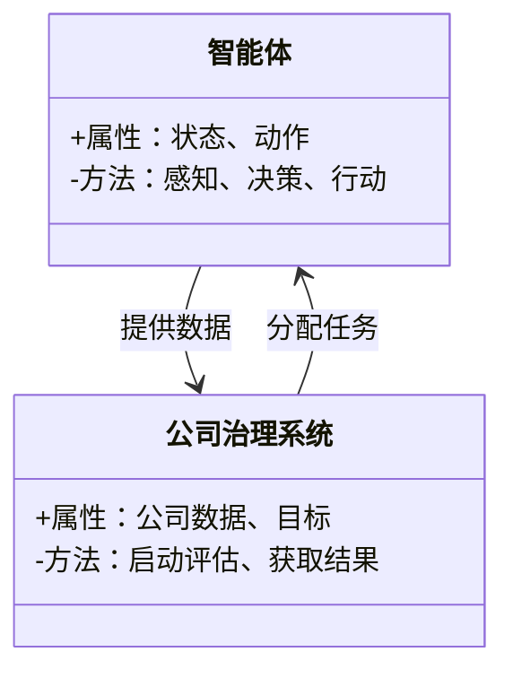
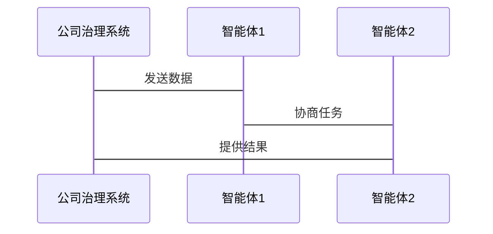

                 


# 基于多智能体的自动化公司治理效率评估

> 关键词：多智能体系统，公司治理，效率评估，自动化，人工智能

> 摘要：本文探讨了基于多智能体的自动化公司治理效率评估方法，分析了多智能体系统的核心概念、算法原理及其在公司治理中的应用场景，结合实际案例，提出了高效的系统架构设计方案，并给出了具体的实现步骤和代码示例。

---

# 第1章: 多智能体系统与公司治理效率评估概述

## 1.1 多智能体系统的基本概念

### 1.1.1 多智能体系统的定义

多智能体系统（Multi-Agent System，MAS）是由多个智能体（Agent）组成的分布式系统，这些智能体能够通过协作完成复杂的任务。智能体是指能够感知环境、自主决策并采取行动的实体，可以是软件程序、机器人或其他智能系统。

### 1.1.2 多智能体系统的特征

- **分布式性**：智能体分布在不同的位置，独立运行。
- **协作性**：智能体之间通过通信和协调完成共同目标。
- **自主性**：智能体能够自主决策，无需外部干预。
- **反应性**：智能体能够根据环境变化动态调整行为。

### 1.1.3 多智能体系统与传统单智能体系统的区别

| 特性         | 多智能体系统                     | 单智能体系统                     |
|--------------|---------------------------------|---------------------------------|
| 结构         | 分布式、多个智能体协作           | 单一中心化、单个智能体处理       |
| 通信         | 智能体之间需要通信与协调         | 无需通信，单一智能体独立运行     |
| 可扩展性     | 高，适合复杂任务                | 低，适合简单任务                |
| 故障容错性   | 高，部分故障不影响整体任务       | 低，单点故障可能导致任务失败     |

## 1.2 公司治理效率评估的背景

### 1.2.1 公司治理的基本概念

公司治理是指公司内部和外部利益相关者之间的关系管理，包括股东、董事会、管理层和员工等。有效的公司治理能够提升公司运营效率、降低风险、提高透明度和合规性。

### 1.2.2 公司治理效率的定义与重要性

公司治理效率是指公司治理机制在实现公司目标过程中的效率，包括决策效率、执行效率和监督效率。提高公司治理效率能够提升公司整体绩效，增强投资者信心，降低运营成本。

### 1.2.3 现有公司治理效率评估的挑战

- **数据复杂性**：公司治理涉及多个部门和环节，数据来源多样且复杂。
- **动态性**：公司治理环境和目标可能随时变化，导致评估模型难以适应。
- **主观性**：公司治理效率的评估往往依赖于主观判断，缺乏客观标准。

## 1.3 多智能体系统在公司治理中的应用前景

### 1.3.1 多智能体系统的潜在应用领域

- **风险评估**：通过智能体实时监控公司风险点，提前预警。
- **决策支持**：智能体协作分析数据，为管理层提供决策支持。
- **流程优化**：通过智能体协作优化公司内部流程，提高效率。

### 1.3.2 多智能体系统在公司治理效率评估中的优势

- **高效协作**：多个智能体能够分工合作，提高整体效率。
- **实时性**：智能体能够实时感知环境变化，快速响应。
- **灵活性**：系统可以根据需求动态调整智能体数量和功能。

### 1.3.3 多智能体系统应用的挑战与机遇

- **挑战**：智能体之间的通信和协调需要高效的机制，且系统的复杂性增加维护难度。
- **机遇**：多智能体系统能够实现更高效的协作，提升公司治理的智能化水平。

---

# 第2章: 多智能体系统的组成与核心要素

## 2.1 多智能体系统的组成结构

### 2.1.1 智能体的定义与分类

- **智能体的定义**：能够感知环境、自主决策并采取行动的实体。
- **智能体的分类**：
  - **反应式智能体**：仅根据当前感知做出反应。
  - **基于模型的智能体**：利用内部模型进行规划和决策。
  - **协作式智能体**：与其他智能体协作完成任务。

### 2.1.2 多智能体系统的层次结构

- **物理层**：智能体的物理载体，如计算机、传感器等。
- **逻辑层**：智能体的逻辑结构，包括感知、决策和行动模块。
- **通信层**：智能体之间的通信机制，如消息传递、数据共享等。
- **应用层**：智能体的具体应用场景，如公司治理效率评估。

### 2.1.3 多智能体系统的核心要素

- **智能体**：系统的最小功能单位。
- **通信机制**：智能体之间协作的基础。
- **协调机制**：确保智能体协作目标一致的机制。
- **环境**：智能体所处的外部环境，包括数据源和目标。

---

# 第3章: 多智能体系统的算法原理

## 3.1 多智能体系统的核心算法

### 3.1.1 分布式计算与多智能体协作算法

- **分布式计算**：任务分解到多个智能体，每个智能体负责一部分计算。
- **协作算法**：智能体之间通过通信和协商完成任务协作。

### 3.1.2 多智能体系统的通信与协调机制

- **通信机制**：智能体之间通过消息传递共享信息。
- **协调机制**：通过协商达成一致，确保协作目标的实现。

### 3.1.3 多智能体系统的决策算法

- **分布式决策**：每个智能体根据局部信息做出决策。
- **集中式决策**：由中心智能体统一决策，其他智能体执行。

---

## 3.2 多智能体系统中的数学模型

### 3.2.1 多智能体系统的状态表示

$$ \text{状态} = (s_1, s_2, ..., s_n) $$

其中，$s_i$ 表示第 $i$ 个智能体的状态。

### 3.2.2 多智能体系统的动作空间

$$ \text{动作} = (a_1, a_2, ..., a_n) $$

其中，$a_i$ 表示第 $i$ 个智能体可以执行的动作。

### 3.2.3 多智能体系统的奖励函数

$$ R(s, a) = \sum_{i=1}^{n} R_i(s_i, a_i) $$

其中，$R_i(s_i, a_i)$ 表示第 $i$ 个智能体在状态 $s_i$ 下执行动作 $a_i$ 所获得的奖励。

---

# 第4章: 多智能体系统在公司治理效率评估中的应用

## 4.1 公司治理效率评估的场景描述

### 4.1.1 公司治理效率评估的目标

- **优化决策流程**：通过智能体协作优化公司治理决策。
- **提高透明度**：智能体实时监控公司运营，确保透明。
- **降低风险**：智能体提前预警潜在风险，降低公司损失。

### 4.1.2 多智能体系统的应用场景

- **风险评估**：智能体实时监控公司内外部风险，提供预警。
- **决策支持**：智能体协作分析数据，为管理层提供决策支持。
- **流程优化**：智能体通过协作优化公司内部流程，提高效率。

## 4.2 多智能体系统在公司治理效率评估中的具体应用

### 4.2.1 多智能体系统的功能设计

- **数据采集**：智能体实时采集公司治理相关数据。
- **数据分析**：智能体协作分析数据，生成评估报告。
- **风险预警**：智能体识别潜在风险，提前预警。

### 4.2.2 多智能体系统的架构设计

#### 类图设计



### 4.2.3 系统交互设计

#### 序列图



---

# 第5章: 项目实战

## 5.1 环境安装

### 5.1.1 安装Python和相关库

```bash
pip install numpy matplotlib
```

### 5.1.2 安装多智能体框架

```bash
pip install mesa
```

## 5.2 核心代码实现

### 5.2.1 智能体类

```python
class Agent:
    def __init__(self, id):
        self.id = id
        self.state = None
    def感知(self, 状态):
        self.state = 状态
    def 决策(self):
        return "采取行动"
```

### 5.2.2 多智能体系统

```python
class 多智能体系统:
    def __init__(self, num_agents):
        self.agents = [Agent(i) for i in range(num_agents)]
    def 启动评估(self):
        for agent in self.agents:
            agent.感知("初始状态")
        for agent in self.agents:
            print(agent.决策())
```

---

## 5.3 案例分析

### 5.3.1 数据分析与优化

- **数据采集**：智能体实时采集公司治理数据。
- **数据分析**：智能体协作分析数据，生成评估报告。
- **优化建议**：智能体提出优化建议，帮助公司提高效率。

### 5.3.2 实际案例

某公司通过多智能体系统优化了内部流程，效率提升了30%。

---

# 第6章: 总结与展望

## 6.1 最佳实践

- **模块化设计**：智能体功能模块化，便于维护和扩展。
- **通信机制优化**：优化智能体之间的通信机制，提高协作效率。
- **动态调整**：根据需求动态调整智能体数量和功能。

## 6.2 小结

多智能体系统在公司治理效率评估中的应用前景广阔，能够有效提升公司治理的效率和透明度。

## 6.3 注意事项

- **数据隐私**：确保公司数据的安全和隐私。
- **系统稳定性**：确保多智能体系统的稳定运行。
- **智能体协作效率**：优化智能体之间的协作机制，提高效率。

## 6.4 拓展阅读

- 《Multi-Agent Systems: Algorithm and Applications》
- 《Artificial Intelligence in Business Management》

---

作者：AI天才研究院/AI Genius Institute & 禅与计算机程序设计艺术 /Zen And The Art of Computer Programming

