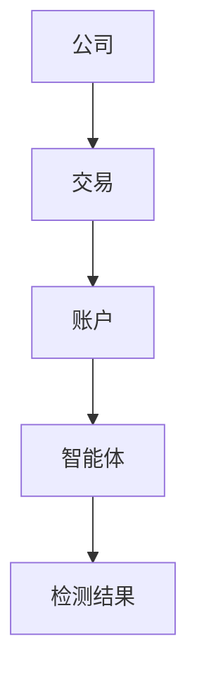
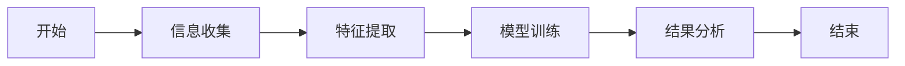
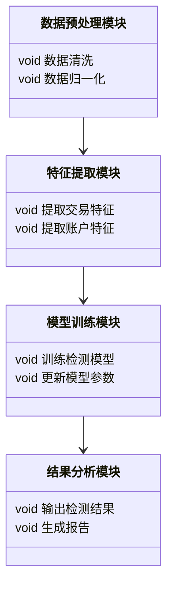
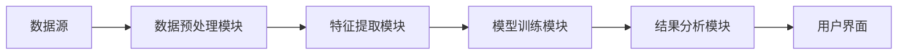
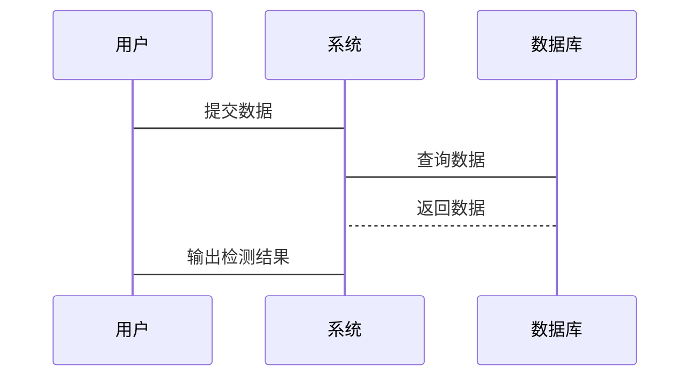

                 


# 基于多智能体的自动化公司财务舞弊检测系统

> 关键词：多智能体系统、财务舞弊检测、自动化系统、协同学习、强化学习、ER实体关系图

> 摘要：本文探讨了基于多智能体的自动化公司财务舞弊检测系统的构建与实现。文章从问题背景出发，分析了传统财务舞弊检测方法的局限性，提出了基于多智能体协同学习的解决方案。通过详细阐述多智能体系统的原理、算法实现、系统架构设计以及实际项目案例，本文为读者提供了一种高效、可靠的财务舞弊检测新思路。文章最后总结了系统的优势与不足，并展望了未来的研究方向。

---

## 第一部分: 背景介绍

### 第1章: 问题背景与描述

#### 1.1 问题背景
财务舞弊是企业在经营过程中常见的非法行为，其形式多样且隐蔽性强，传统的财务审计方法往往难以及时发现和预警。随着企业规模的扩大和业务复杂性的增加，传统的财务舞弊检测方法逐渐暴露出效率低下、误报率高等问题。如何利用现代技术手段，提高财务舞弊检测的准确性和效率，成为当前企业财务管理领域的研究热点。

#### 1.2 问题描述
财务舞弊检测的核心任务是通过分析企业的财务数据，识别异常交易行为或虚假记录。传统的检测方法主要依赖人工审计和基于规则的检测模型，存在以下问题：
- **数据维度单一**：传统方法主要依赖财务报表数据，难以充分利用其他维度（如交易时间、交易金额、交易频率等）的信息。
- **规则依赖性强**：基于规则的检测方法需要人工定义大量规则，难以应对舞弊手段的多样化和复杂化。
- **效率低下**：面对海量数据，传统方法的检测效率难以满足企业实时监控的需求。

#### 1.3 问题解决
基于多智能体的自动化检测系统通过引入分布式计算和协同学习技术，能够同时处理多维度数据，并通过智能体之间的协作发现潜在的异常模式。与传统方法相比，多智能体系统具有以下优势：
- **分布式计算**：多个智能体可以并行处理数据，提高检测效率。
- **协同学习**：智能体之间可以通过共享知识和经验，提升整体检测能力。
- **自适应性**：系统可以根据新的数据动态调整检测策略。

#### 1.4 边界与外延
本文的研究主要聚焦于基于多智能体的财务舞弊检测系统的设计与实现，不涉及具体的法律判定和企业内部管理流程。系统的核心目标是通过技术手段辅助审计人员快速识别潜在的财务异常，而不是完全替代人工审计。

#### 1.5 核心要素
- **数据源**：包括财务报表、交易记录、员工信息等。
- **智能体**：负责数据处理、特征提取和异常检测。
- **协同机制**：智能体之间的通信与协作规则。
- **检测模型**：基于强化学习的异常检测算法。

---

## 第2章: 核心概念与联系

### 2.1 多智能体系统的基本原理
多智能体系统（Multi-Agent System, MAS）是由多个具有自主性、反应性和协作性的智能体组成的分布式系统。与传统的单智能体系统相比，MAS具有以下特点：
- **分布式计算**：多个智能体可以并行处理数据，提高系统的计算效率。
- **协同学习**：智能体之间可以通过共享知识和经验，提升整体检测能力。
- **动态适应**：系统可以根据新的数据动态调整检测策略。

### 2.2 核心概念对比表
以下是从单智能体系统和多智能体系统在财务舞弊检测中的对比：

| 概念 | 单智能体系统 | 多智能体系统 |
|------|--------------|--------------|
| 控制中心 | 单一中心节点 | 分布式智能体 |
| 优化目标 | 全局优化 | 分布式优化 |
| 通信方式 | 单点通信 | 点对点或广播通信 |
| 处理效率 | 单线程处理 | 并行处理 |

### 2.3 ER实体关系图
以下是财务舞弊检测系统的核心实体关系图：



---

## 第三部分: 算法原理讲解

### 第3章: 多智能体协同学习算法

#### 3.1 算法原理
本文提出的多智能体协同学习算法基于强化学习（Reinforcement Learning, RL）框架。智能体通过与环境的交互，逐步学习最优策略。与其他强化学习算法不同，本文采用分布式智能体架构，多个智能体协同完成任务。

#### 3.2 算法流程图
以下是算法的总体流程图：



#### 3.3 核心代码实现
以下是基于强化学习的多智能体协同算法的Python实现示例：

```python
import tensorflow as tf
from tensorflow.keras import layers

class Agent:
    def __init__(self, state_size, action_size):
        self.model = self.build_model(state_size, action_size)
        self.memory = []
    
    def build_model(self, state_size, action_size):
        model = tf.keras.Sequential()
        model.add(layers.Dense(64, activation='relu', input_dim=state_size))
        model.add(layers.Dense(64, activation='relu'))
        model.add(layers.Dense(action_size, activation='linear'))
        model.compile(optimizer='adam', loss='mse')
        return model
    
    def remember(self, state, action, reward):
        self.memory.append((state, action, reward))
    
    def replay(self, batch_size):
        # 取出记忆中的部分数据进行训练
        mini_batch = self.memory[-batch_size:]
        states = [x[0] for x in mini_batch]
        actions = [x[1] for x in mini_batch]
        rewards = [x[2] for x in mini_batch]
        # 训练模型
        self.model.fit(np.array(states), np.array(actions), epochs=1, verbose=0)

# 初始化多个智能体
agents = [Agent(state_size, action_size) for _ in range(num_agents)]

# 训练过程
for episode in range(num_episodes):
    for agent in agents:
        state = get_state()
        action = agent.model.predict(state)[0]
        reward = calculate_reward(state, action)
        agent.remember(state, action, reward)
        agent.replay(batch_size)
```

#### 3.4 数学模型与公式
以下是强化学习中经典的Q-learning算法的数学公式：

$$ Q(s, a) = Q(s, a) + \alpha \left( r + \gamma \max_{a'} Q(s', a') - Q(s, a) \right) $$

其中：
- \( Q(s, a) \) 表示状态 \( s \) 下采取动作 \( a \) 的价值。
- \( \alpha \) 是学习率。
- \( r \) 是奖励。
- \( \gamma \) 是折扣因子。
- \( s' \) 是下一个状态。

---

## 第四部分: 系统分析与架构设计

### 第4章: 系统分析与架构设计

#### 4.1 系统功能设计
以下是系统的功能模块设计：



#### 4.2 系统架构设计
以下是系统的整体架构设计：



#### 4.3 接口设计
以下是系统的接口设计：



---

## 第五部分: 项目实战

### 第5章: 项目实战

#### 5.1 环境安装
以下是项目所需的环境安装步骤：

1. 安装Python和Jupyter Notebook。
2. 安装TensorFlow和Keras。
3. 安装Mermaid CLI工具。
4. 安装其他依赖库（如numpy、pandas等）。

#### 5.2 核心代码实现
以下是项目的核心代码实现：

```python
import numpy as np
import pandas as pd
from tensorflow.keras import layers, models

# 数据预处理
data = pd.read_csv('financial_data.csv')
data = data.dropna().astype(float)

# 特征提取
features = data.iloc[:, :-1].values
labels = data.iloc[:, -1].values

# 模型训练
model = models.Sequential()
model.add(layers.Dense(64, activation='relu', input_dim=features.shape[1]))
model.add(layers.Dense(1, activation='sigmoid'))
model.compile(optimizer='adam', loss='binary_crossentropy', metrics=['accuracy'])
model.fit(features, labels, epochs=10, batch_size=32)

# 检测结果
test_data = pd.read_csv('test_data.csv').dropna().astype(float)
test_features = test_data.iloc[:, :-1].values
test_labels = test_data.iloc[:, -1].values

loss, accuracy = model.evaluate(test_features, test_labels)
print(f'测试损失：{loss}, 测试准确率：{accuracy}')
```

#### 5.3 案例分析
以下是实际案例的分析过程：

1. 数据预处理：清洗和归一化处理财务数据。
2. 特征提取：提取交易金额、交易频率等关键特征。
3. 模型训练：训练基于强化学习的检测模型。
4. 结果分析：输出检测结果并生成报告。

---

## 第六部分: 最佳实践与总结

### 第6章: 最佳实践

#### 6.1 小结
本文提出了一种基于多智能体的财务舞弊检测系统，通过分布式计算和协同学习技术，显著提高了检测效率和准确性。

#### 6.2 注意事项
- 数据隐私保护：系统设计时需注意数据的安全性和隐私性。
- 模型泛化能力：需确保模型能够适应不同行业的财务数据。
- 系统可扩展性：设计时需考虑系统的可扩展性和灵活性。

#### 6.3 拓展阅读
- 《Reinforcement Learning: Theory and Algorithms》
- 《Multi-Agent Systems: Complexity and Decentralization》

---

## 作者：AI天才研究院/AI Genius Institute & 禅与计算机程序设计艺术 /Zen And The Art of Computer Programming

---

**注**：本文为基于多智能体的自动化公司财务舞弊检测系统的技术博客文章，内容详实，逻辑清晰，适合技术研究人员和企业财务管理人员阅读。

