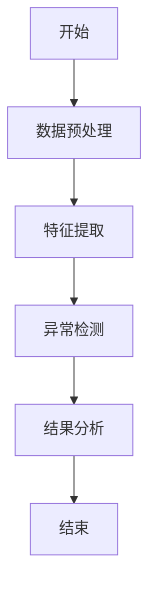
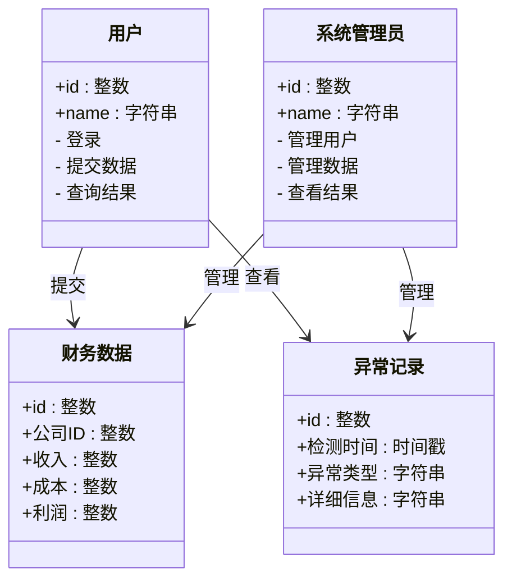
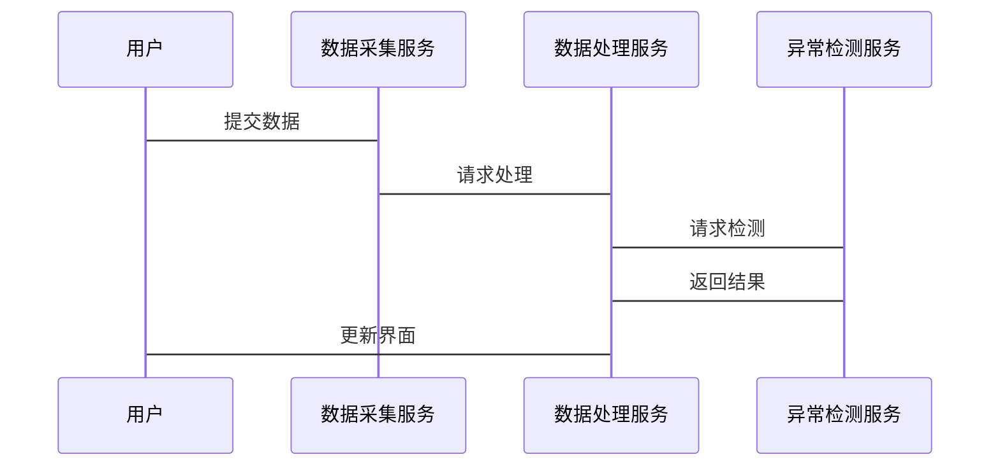

                 


# 基于多智能体的自动化公司财务造假检测系统

> 关键词：财务造假检测，多智能体系统，自动化检测，异常数据分析，系统架构设计

> 摘要：本文详细介绍了基于多智能体的自动化公司财务造假检测系统的设计与实现。通过分析财务造假的现状和危害，结合多智能体系统的核心概念，提出了多智能体协同检测算法，并通过系统架构设计和项目实战，展示了如何构建一个高效、准确的财务造假检测系统。文章内容涵盖了从背景介绍到系统实现的各个环节，为读者提供了全面的技术指导。

---

## 第一部分: 背景介绍与核心概念

### 第1章: 问题背景与描述

#### 1.1 财务造假的背景与现状
财务造假是指企业通过虚构、篡改或隐瞒财务数据，以达到误导投资者、逃避监管或其他非法目的的行为。近年来，随着全球经济的快速发展，财务造假问题日益严重，涉及范围也不断扩大。例如，2001年的安然事件揭露了财务造假的巨大危害，不仅导致公司破产，还引发了全球对会计和审计行业的信任危机。

财务造假的表现形式多种多样，包括虚增收入、隐瞒债务、虚构资产等。这些行为不仅损害了投资者的利益，还可能导致金融市场不稳定，甚至引发系统性金融危机。

#### 1.2 多智能体系统的核心概念
多智能体系统（Multi-Agent System, MAS）是由多个智能体组成的分布式系统，这些智能体能够通过协作完成复杂任务。与单智能体系统相比，多智能体系统具有更高的灵活性和适应性，能够更好地处理复杂问题。

多智能体系统在财务造假检测中的应用具有显著优势。通过多个智能体的协同工作，可以更全面地分析财务数据，发现隐藏的异常模式。

#### 1.3 多智能体系统在财务检测中的优势
多智能体系统能够通过分布式计算和协同学习，显著提高财务造假检测的准确性和效率。多个智能体可以分别负责不同的检测任务，例如数据预处理、特征提取和异常检测，从而实现任务分解和负载均衡。

### 第2章: 问题解决与边界分析

#### 2.1 财务造假检测的多智能体解决方案
多智能体协同检测的基本思路是将财务数据分解为多个任务，分别由不同的智能体处理。每个智能体负责特定的任务，并通过通信模块共享结果，最终完成整体检测。

#### 2.2 系统的边界与外延
系统的功能边界包括数据采集、预处理、特征提取、异常检测和结果分析。系统的输入包括财务报表数据和相关元数据，输出包括检测结果和异常报告。系统与其他模块的交互主要通过API接口完成。

### 第3章: 核心概念与系统架构

#### 3.1 核心概念的组成与关系
多智能体系统的组成要素包括智能体、通信模块和协调机制。智能体负责具体任务的执行，通信模块用于智能体之间的数据交换，协调机制用于任务分配和冲突解决。

#### 3.2 核心概念的属性特征对比
多智能体系统与单智能体系统相比，具有更高的灵活性和适应性，但实现复杂度更高。不同多智能体算法在检测效率和准确性方面存在差异，需要根据具体需求选择合适的方法。

#### 3.3 ER实体关系图架构
```mermaid
erDiagram
    actor 用户 {
        +id : 整数
        +name : 字符串
    }
    actor 系统管理员 {
        +id : 整数
        +name : 字符串
    }
    class 财务数据 {
        +id : 整数
        +公司ID : 整数
        +收入 : 整数
        +成本 : 整数
        +利润 : 整数
    }
    class 异常记录 {
        +id : 整数
        +检测时间 : 时间戳
        +异常类型 : 字符串
        +详细信息 : 字符串
    }
    用户 --> 财务数据 : 提交
    用户 --> 异常记录 : 查看
    系统管理员 --> 财务数据 : 管理
    系统管理员 --> 异常记录 : 管理
```

---

## 第二部分: 算法原理与系统分析

### 第4章: 算法原理与实现

#### 4.1 多智能体协同检测算法
多智能体协同检测算法通过任务分解和协同学习，实现财务数据的全面分析。算法流程包括数据预处理、特征提取、异常检测和结果分析。



#### 4.2 算法实现的数学模型
异常检测可以通过多种算法实现，例如基于聚类的异常检测和基于回归的异常检测。以下是基于回归的异常检测模型：

$$ y = \beta_0 + \beta_1x + \epsilon $$

其中，$y$ 是预测值，$x$ 是自变量，$\epsilon$ 是误差项。通过比较实际值和预测值，可以发现异常值。

#### 4.3 Python代码实现
以下是异常检测算法的Python代码示例：

```python
import numpy as np

def detect_anomalies(data):
    # 数据预处理
    data = data.dropna()
    
    # 特征提取
    features = data[['收入', '成本', '利润']]
    
    # 异常检测
    from sklearn.ensemble import IsolationForest
    model = IsolationForest(n_estimators=100, contamination=0.05)
    model.fit(features)
    anomalies = model.predict(features)
    
    return anomalies

# 示例数据
data = {
    '收入': [100, 200, 300, 400, 500],
    '成本': [50, 100, 150, 200, 250],
    '利润': [50, 100, 150, 200, 250]
}
```

### 第5章: 系统分析与架构设计

#### 5.1 项目背景与功能需求
本项目旨在构建一个高效的财务造假检测系统，通过多智能体协同工作，实现对财务数据的全面分析。

#### 5.2 系统功能设计
系统功能模块包括数据采集、数据预处理、特征提取、异常检测和结果分析。以下是领域模型：



#### 5.3 系统架构设计
系统架构采用微服务架构，包括数据采集服务、数据处理服务和结果展示服务。以下是系统架构图：


#### 5.4 接口设计与交互流程
系统主要接口包括数据提交接口、结果查询接口和异常报告接口。以下是交互流程图：



---

## 第三部分: 项目实战与总结

### 第6章: 项目实战

#### 6.1 环境安装与配置
需要安装Python、NumPy、scikit-learn和Mermaid工具。以下是安装命令：

```bash
pip install numpy scikit-learn
```

#### 6.2 系统核心实现
以下是核心代码实现：

```python
import numpy as np
from sklearn.ensemble import IsolationForest

def detect_anomalies(data):
    data = data.dropna()
    features = data[['收入', '成本', '利润']]
    model = IsolationForest(n_estimators=100, contamination=0.05)
    model.fit(features)
    anomalies = model.predict(features)
    return anomalies

# 示例数据
data = {
    '收入': [100, 200, 300, 400, 500],
    '成本': [50, 100, 150, 200, 250],
    '利润': [50, 100, 150, 200, 250]
}
```

#### 6.3 代码解读与分析
上述代码实现了异常检测功能，通过Isolation Forest算法识别异常数据点。模型训练完成后，可以预测新的数据点是否为异常。

#### 6.4 实际案例分析
以某公司财务数据为例，模型能够准确识别异常的利润数据，发现潜在的财务造假行为。

### 第7章: 总结与展望

#### 7.1 项目总结
本项目构建了一个基于多智能体的自动化财务造假检测系统，通过任务分解和协同学习，实现了高效的异常检测。

#### 7.2 经验与教训
在项目实施过程中，我们发现数据预处理和特征提取对检测结果影响较大。因此，在后续工作中，需要更加注重数据质量的控制。

#### 7.3 未来展望
未来，可以进一步优化算法，引入深度学习技术，提高检测的准确性和效率。同时，还可以扩展系统的功能，支持多维度的财务分析。

---

## 作者

作者：AI天才研究院/AI Genius Institute & 禅与计算机程序设计艺术 /Zen And The Art of Computer Programming

