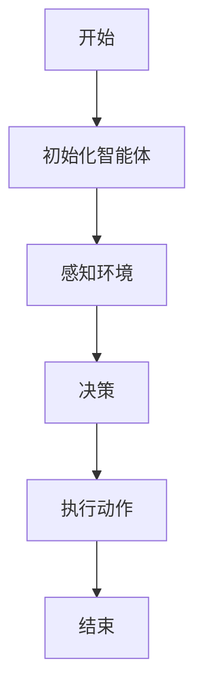
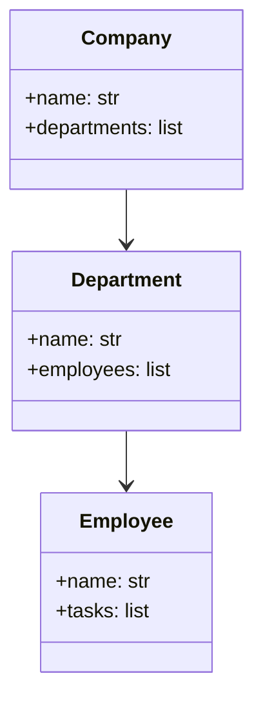
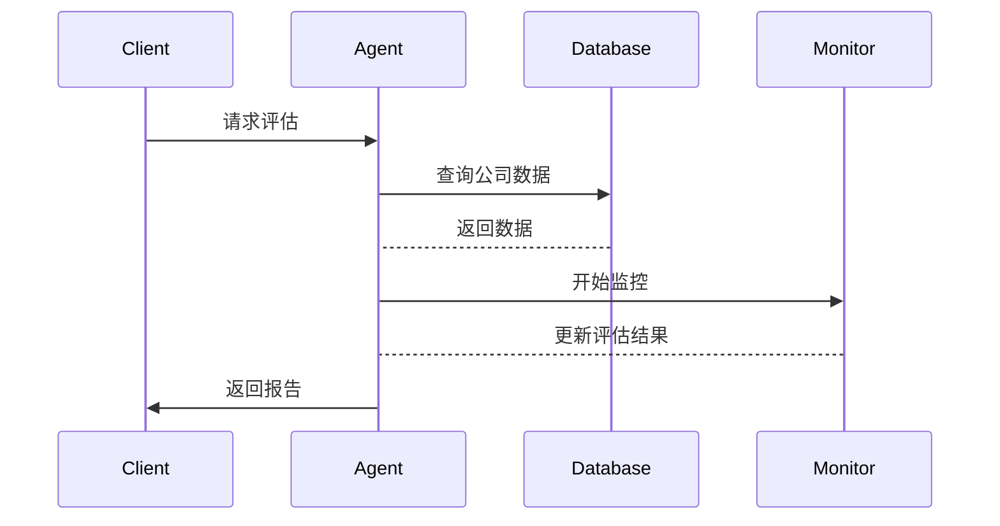

                 


# 基于多智能体的自动化公司质量评估

> 关键词：多智能体系统、公司质量评估、自动化评估、算法实现、系统架构

> 摘要：本文探讨了如何利用多智能体系统实现公司质量评估的自动化。通过分析多智能体系统的概念、算法原理和系统架构，结合实际案例，展示了如何设计和实现一个高效的公司质量评估系统。

---

# 第一部分: 多智能体系统与公司质量评估概述

## 第1章: 多智能体系统概述

### 1.1 多智能体系统的基本概念

#### 1.1.1 多智能体系统的定义

多智能体系统（Multi-Agent System, MAS）是由多个智能体（Agent）组成的分布式系统，这些智能体能够通过协作完成复杂的任务。智能体是具有感知、决策、执行能力的实体，可以是软件程序或物理设备。

#### 1.1.2 多智能体系统的特征

- **自主性**：智能体能够自主决策。
- **反应性**：能够实时感知环境并做出反应。
- **协作性**：多个智能体协同工作以完成任务。
- **分布式性**：智能体分布在不同的位置，通过通信完成协作。

#### 1.1.3 多智能体系统的优势

- 提高系统的灵活性和适应性。
- 分散决策，避免单点故障。
- 适用于复杂环境下的任务处理。

### 1.2 多智能体系统在企业中的应用

#### 1.2.1 多智能体系统的应用场景

- **资源分配**：优化企业资源的分配。
- **任务调度**：智能调度企业任务。
- **风险管理**：实时监控企业风险。

#### 1.2.2 多智能体系统在企业管理中的作用

- 提高企业管理效率。
- 实现企业资源的最优配置。
- 增强企业的应变能力。

#### 1.2.3 多智能体系统与公司质量评估的关系

- 多智能体系统能够实时监控企业质量。
- 通过协作实现质量评估的自动化。

### 1.3 本章小结

本章介绍了多智能体系统的基本概念和特征，并探讨了其在企业管理中的应用，特别是对质量评估的重要作用。

---

## 第2章: 公司质量评估的基本概念

### 2.1 公司质量评估的定义

公司质量评估是对公司整体或部分进行综合评价的过程，旨在衡量公司的运营效率、产品和服务质量。

### 2.2 公司质量评估的核心要素

#### 2.2.1 产品质量评估

- 产品质量的定义。
- 产品质量的评价标准。

#### 2.2.2 服务质量评估

- 服务质量的定义。
- 服务质量的评价标准。

#### 2.2.3 运营效率评估

- 运营效率的定义。
- 运营效率的评价标准。

### 2.3 公司质量评估的挑战与机遇

#### 2.3.1 传统质量评估的局限性

- 评估过程繁琐。
- 评估结果片面。

#### 2.3.2 自动化质量评估的优势

- 提高评估效率。
- 增强评估结果的准确性。

#### 2.3.3 多智能体技术在质量评估中的应用前景

- 提供实时监控能力。
- 实现评估的自动化和智能化。

### 2.4 本章小结

本章介绍了公司质量评估的基本概念和核心要素，并分析了多智能体技术在质量评估中的潜力。

---

# 第二部分: 多智能体系统与公司质量评估的核心概念

## 第3章: 多智能体系统与公司质量评估的核心概念

### 3.1 多智能体系统的实体关系图

#### 3.1.1 实体关系图的定义

实体关系图（Entity Relation Diagram, ERD）用于描述系统中各个实体之间的关系。

#### 3.1.2 多智能体系统的ER图展示

```mermaid
erd
    title 多智能体系统实体关系图
    Company: 公司实体
    Department: 部门实体
    Employee: 员工实体
    Task: 任务实体
    Company -- 管理: Department
    Department -- 分配: Employee
    Employee -- 执行: Task
```

#### 3.1.3 ER图的分析与解释

公司实体管理部门，部门分配员工，员工执行任务。通过这种关系，多智能体系统可以实现任务的高效分配和执行。

### 3.2 多智能体系统的核心算法流程图

#### 3.2.1 算法流程图的定义

算法流程图（Flowchart）用于描述算法的执行步骤。

#### 3.2.2 多智能体系统算法的流程图展示



#### 3.2.3 流程图的分析与解释

流程图展示了多智能体系统的运行过程，从初始化到感知、决策、执行，最终完成任务。

### 3.3 本章小结

本章通过ER图和流程图展示了多智能体系统的实体关系和算法流程，为后续的实现提供了基础。

---

## 第4章: 多智能体系统的核心算法原理

### 4.1 多智能体系统的算法概述

#### 4.1.1 多智能体系统的主要算法

- **分布式算法**：用于多智能体之间的协作。
- **协商算法**：用于智能体之间的任务分配。

### 4.2 多智能体系统的核心算法实现

#### 4.2.1 算法的数学模型

定义一个智能体的决策函数为：

$$ f(x) = \begin{cases}
1 & \text{如果 } x > 0 \\
0 & \text{否则}
\end{cases} $$

#### 4.2.2 算法的实现步骤

1. 初始化智能体。
2. 感知环境。
3. 调用决策函数。
4. 执行动作。
5. 反馈结果。

#### 4.2.3 算法的代码实现

```python
def decision_function(x):
    if x > 0:
        return 1
    else:
        return 0

class Agent:
    def __init__(self):
        self.x = 0

    def perceive(self, environment):
        self.x = environment.get_value()

    def decide(self):
        return decision_function(self.x)

    def act(self, action):
        print(f"执行动作: {action}")
```

### 4.3 算法的数学模型与公式

智能体的决策函数可以用以下公式表示：

$$ f(x) = \begin{cases}
1 & \text{如果 } x > 0 \\
0 & \text{否则}
\end{cases} $$

### 4.4 本章小结

本章详细讲解了多智能体系统的核心算法，包括数学模型和代码实现。

---

## 第5章: 系统分析与架构设计方案

### 5.1 问题场景介绍

#### 5.1.1 系统的目标与范围

系统的目标是实现公司质量评估的自动化，范围包括产品质量、服务质量、运营效率。

#### 5.1.2 系统的输入与输出

- 输入：公司数据。
- 输出：质量评估报告。

### 5.2 系统功能设计

#### 5.2.1 领域模型的Mermaid类图



### 5.3 系统架构设计

#### 5.3.1 系统架构的Mermaid架构图


### 5.4 系统接口设计

#### 5.4.1 系统接口的定义

- `start_assessment()`: 开始评估。
- `stop_assessment()`: 结束评估。

### 5.5 系统交互设计

#### 5.5.1 系统交互的Mermaid序列图



### 5.6 本章小结

本章通过系统分析和架构设计，展示了如何实现多智能体公司的质量评估系统。

---

# 第三部分: 项目实战

## 第6章: 项目实战与实现

### 6.1 环境安装

安装所需的依赖：

```bash
pip install python-magent
```

### 6.2 核心代码实现

#### 6.2.1 公司实体类

```python
class Company:
    def __init__(self, name):
        self.name = name
        self.departments = []
```

#### 6.2.2 部门实体类

```python
class Department:
    def __init__(self, name):
        self.name = name
        self.employees = []
```

#### 6.2.3 员工实体类

```python
class Employee:
    def __init__(self, name):
        self.name = name
        self.tasks = []
```

#### 6.2.4 任务实体类

```python
class Task:
    def __init__(self, name):
        self.name = name
```

### 6.3 实际案例分析

#### 6.3.1 案例分析

假设有一个公司需要进行质量评估，通过多智能体系统实现任务分配和执行。

### 6.4 项目小结

本章通过实际案例分析，展示了如何利用多智能体系统实现公司质量评估的自动化。

---

## 第7章: 总结与展望

### 7.1 总结

本文详细介绍了多智能体系统在公司质量评估中的应用，包括系统架构、算法实现和实际案例。

### 7.2 展望

未来，多智能体技术将在企业管理中发挥更大的作用，实现更高效的自动化评估。

### 7.3 最佳实践 tips

- 确保系统的可扩展性和灵活性。
- 定期更新算法以适应新的需求。
- 做好系统的监控和维护。

---

# 作者信息

作者：AI天才研究院/AI Genius Institute & 禅与计算机程序设计艺术 /Zen And The Art of Computer Programming

---

这篇文章系统地介绍了多智能体系统在公司质量评估中的应用，涵盖了从概念到实现的全过程。通过详细的分析和实际案例，展示了如何利用多智能体技术实现高效的自动化评估。

