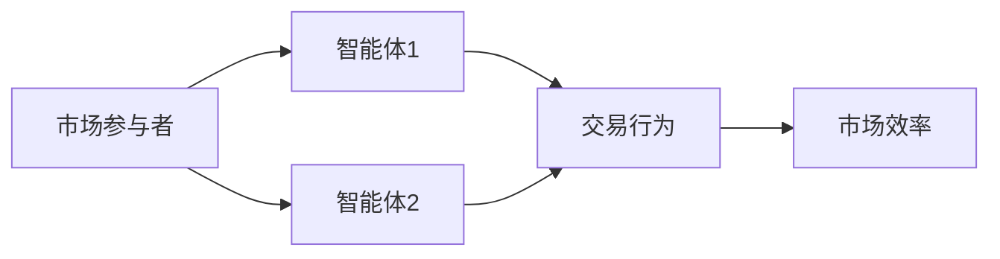
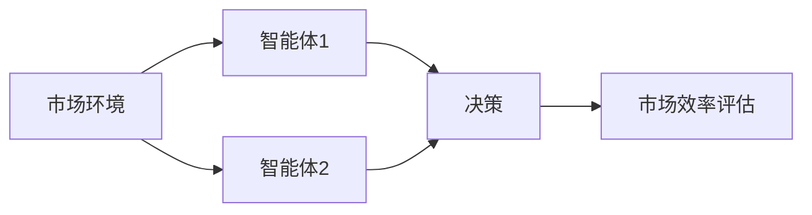

                 


# 基于多智能体的自动化市场效率评估

> 关键词：多智能体系统, 市场效率评估, 分布式计算, 博弈论, 人工智能, 自动化评估

> 摘要：本文探讨了基于多智能体的自动化市场效率评估方法，分析了多智能体系统的核心概念及其在市场效率评估中的应用。通过详细讲解多智能体系统的原理、算法设计、系统架构以及实际项目案例，本文为读者提供了一套完整的自动化市场效率评估解决方案，帮助读者理解如何利用多智能体技术提升市场分析的效率和准确性。

---

## 第一部分: 多智能体系统与市场效率评估基础

### 第1章: 基于多智能体的市场效率评估概述

#### 1.1 多智能体系统的基本概念

##### 1.1.1 多智能体系统的定义与特点
多智能体系统（Multi-Agent System, MAS）是由多个相互作用的智能体组成的分布式系统。这些智能体通过协作完成特定任务，具有以下特点：
- **自主性**：每个智能体都能独立决策。
- **反应性**：能够感知环境并实时调整行为。
- **协作性**：智能体之间通过通信和协调完成共同目标。
- **分布性**：系统中的智能体分布在网络中，不存在集中控制点。

##### 1.1.2 市场效率的基本概念
市场效率是指市场在资源配置中的有效性，通常用市场价格与实际价值的接近程度来衡量。高效的市场能够快速反映信息，确保资源的最优分配。

##### 1.1.3 多智能体与市场效率评估的关系
多智能体系统能够模拟市场中的多个参与者（如买家、卖家、交易机构等），通过智能体之间的交互和协作，实时评估市场效率。这种模拟能够帮助我们更好地理解市场动态，优化资源配置。

#### 1.2 多智能体系统的核心要素

##### 1.2.1 智能体的定义与属性
智能体（Agent）是具有感知和行动能力的实体，其核心属性包括：
- **目标**：智能体的行为动机。
- **知识**：智能体对环境的认知。
- **推理**：智能体根据知识做出决策的能力。
- **通信**：智能体与其他智能体或环境交互的能力。

##### 1.2.2 智能体之间的交互与协作
智能体之间的交互可以通过以下方式进行：
- **直接通信**：智能体之间通过消息传递进行信息交流。
- **间接协作**：通过共享环境状态或中间媒介进行协作。
- **分布式决策**：多个智能体共同参与决策过程。

##### 1.2.3 市场环境的建模与分析
市场环境建模是多智能体系统设计的关键步骤。通过构建市场环境模型，可以模拟市场中的参与者行为、交易规则和市场动态，为市场效率评估提供基础。

---

### 第2章: 多智能体系统的核心原理

#### 2.1 多智能体系统的原理概述

##### 2.1.1 分布式智能的基本原理
分布式智能是指通过多个智能体的协作实现整体智能。与集中式系统相比，分布式系统具有更高的容错性和灵活性。

##### 2.1.2 智能体的自主性与协作性
智能体的自主性使其能够在没有外部干预的情况下完成任务，而协作性则确保多个智能体能够共同完成复杂任务。

##### 2.1.3 多智能体系统的层次结构
多智能体系统的层次结构通常包括：
- **物理层**：智能体与环境的物理交互。
- **认知层**：智能体的感知、推理和决策。
- **通信层**：智能体之间的信息交换。
- **协调层**：智能体的协作与任务分配。

#### 2.2 多智能体系统与市场效率评估的关系

##### 2.2.1 市场效率的多维度分析
市场效率可以从多个维度进行评估，包括价格效率、分配效率和信息效率。多智能体系统能够从多个维度对市场效率进行综合评估。

##### 2.2.2 多智能体系统在市场中的应用场景
- **股票交易模拟**：通过模拟多个交易智能体的行为，评估市场的波动性和效率。
- **资源分配优化**：通过智能体协作，实现资源的最优分配。
- **市场预测**：基于历史数据和市场动态，预测市场未来的效率变化。

##### 2.2.3 市场效率评估的多智能体模型构建
构建多智能体模型时，需要考虑以下几个方面：
- **智能体角色**：确定市场中的参与者（如买家、卖家、经纪商等）。
- **行为规则**：定义智能体的行为策略和决策逻辑。
- **环境模型**：模拟市场环境，包括价格、供需关系等。

#### 2.3 本章小结

---

### 第3章: 多智能体系统的核心概念与联系

#### 3.1 多智能体系统的实体关系图


#### 3.2 多智能体系统与市场效率评估的流程图


#### 3.3 本章小结

---

## 第二部分: 多智能体系统算法原理

### 第4章: 多智能体协作算法原理

#### 4.1 基于博弈论的多智能体协作

##### 4.1.1 博弈论基础
博弈论研究的是理性决策者之间的策略互动。在多智能体系统中，博弈论常用于分析智能体之间的竞争与合作。

##### 4.1.2 多智能体协作的博弈模型
常见的博弈模型包括：
- **纳什均衡**：所有智能体都采取最优策略，使得任何单个智能体单方面改变策略不会带来收益。
- **囚徒困境**：用于分析智能体之间的合作与背叛问题。

##### 4.1.3 常见的博弈算法（如纳什均衡）
纳什均衡的计算可以通过以下步骤进行：
1. 确定所有可能的策略组合。
2. 找出在给定其他智能体策略的情况下，每个智能体的最佳反应。
3. 确定所有智能体的最佳反应策略组合。

#### 4.2 多智能体系统中的分布式计算

##### 4.2.1 分布式计算的基本原理
分布式计算是指通过多个计算节点协作完成任务的过程。在多智能体系统中，分布式计算用于实现智能体之间的协作与通信。

##### 4.2.2 多智能体系统的分布式算法
常见的分布式算法包括：
- **一致性算法**：用于确保分布式系统中各节点的数据一致性。
- **路由算法**：用于智能体之间的信息传递。

##### 4.2.3 分布式计算在市场效率评估中的应用
通过分布式计算，可以实现多个智能体之间的高效协作，提高市场效率评估的准确性和实时性。

#### 4.3 本章小结

### 第5章: 多智能体系统中的数学模型与公式

#### 5.1 市场效率的数学模型

##### 5.1.1 市场效率的定义公式
$$ \text{市场效率} = \frac{\text{实际交易量}}{\text{理论最大交易量}} $$

##### 5.1.2 市场效率评估的多智能体模型
$$ \text{市场效率} = \sum_{i=1}^{n} \text{智能体}_i \text{的贡献} $$

#### 5.2 多智能体协作的数学模型

##### 5.2.1 多智能体协作的优化目标
$$ \max_{x_i} \sum_{i=1}^{n} x_i $$

##### 5.2.2 博弈论中的纳什均衡
$$ \text{纳什均衡} = (x_1^*, x_2^*, ..., x_n^*) $$

#### 5.3 本章小结

---

## 第三部分: 多智能体系统算法原理

### 第6章: 系统架构设计与实现

#### 6.1 系统架构设计

##### 6.1.1 系统功能设计
- **数据采集模块**：收集市场数据（如价格、供需关系等）。
- **智能体协作模块**：实现智能体之间的协作与通信。
- **市场效率评估模块**：根据智能体的协作结果，评估市场效率。

##### 6.1.2 系统架构图


#### 6.2 系统接口设计

##### 6.2.1 系统接口描述
- **数据接口**：用于智能体与数据源之间的数据交换。
- **通信接口**：用于智能体之间的信息传递。
- **控制接口**：用于系统的启动、停止和配置。

#### 6.3 系统交互流程图


#### 6.4 本章小结

### 第7章: 项目实战与分析

#### 7.1 项目背景与目标
本项目旨在通过多智能体系统实现市场效率的自动化评估，帮助市场参与者更好地理解市场动态，优化资源配置。

#### 7.2 环境安装与配置
- **安装Python**：用于开发和运行多智能体系统。
- **安装相关库**：如numpy、pandas、networkx等。

#### 7.3 核心代码实现

##### 7.3.1 智能体类的定义
```python
class Agent:
    def __init__(self, id):
        self.id = id
        self.strategy = "market"
    
    def decide(self, market_state):
        # 根据市场状态做出决策
        pass
```

##### 7.3.2 市场模拟类的定义
```python
class MarketSimulator:
    def __init__(self, agents):
        self.agents = agents
        self.market_state = {"price": 100, "supply": 1000, "demand": 1000}
    
    def step(self):
        # 模拟市场的一次交易
        for agent in self.agents:
            agent.decide(self.market_state)
```

#### 7.4 案例分析与结果解读
通过模拟多个智能体在市场中的行为，我们可以观察市场效率的变化。例如，当智能体数量增加时，市场效率可能会提高，但同时智能体之间的竞争也可能导致效率下降。

#### 7.5 项目总结
本项目通过多智能体系统的实现，展示了如何利用分布式计算和博弈论原理，实现市场效率的自动化评估。项目的成功实施为市场分析和优化提供了新的思路。

#### 7.6 本章小结

### 第8章: 最佳实践与注意事项

#### 8.1 最佳实践
- **模块化设计**：将系统划分为多个模块，便于开发和维护。
- **智能体通信**：确保智能体之间的通信高效且可靠。
- **实时监控**：对系统的运行状态进行实时监控，及时发现和解决问题。

#### 8.2 注意事项
- **数据隐私**：在处理市场数据时，需要注意数据隐私和安全问题。
- **系统容错性**：确保系统具有良好的容错性和可扩展性。
- **性能优化**：通过优化算法和系统架构，提高系统的运行效率。

#### 8.3 本章小结

---

## 第四部分: 总结与展望

### 第9章: 总结与展望

#### 9.1 文章总结
本文详细探讨了基于多智能体的自动化市场效率评估方法，分析了多智能体系统的核心概念及其在市场效率评估中的应用。通过实际案例的分析，本文为读者提供了一套完整的解决方案。

#### 9.2 未来展望
未来，随着人工智能和分布式计算技术的不断发展，多智能体系统在市场效率评估中的应用将更加广泛。我们可以期待更多的创新和突破，为市场分析和优化提供更强大的工具和方法。

#### 9.3 本章小结

---

## 作者信息

作者：AI天才研究院/AI Genius Institute & 禅与计算机程序设计艺术 /Zen And The Art of Computer Programming

---

以上是基于《基于多智能体的自动化市场效率评估》的详细内容，涵盖了从基础概念到实际应用的各个方面，确保读者能够全面理解多智能体系统在市场效率评估中的作用和实现方法。

