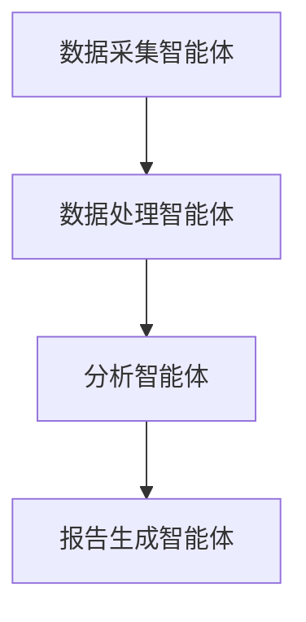
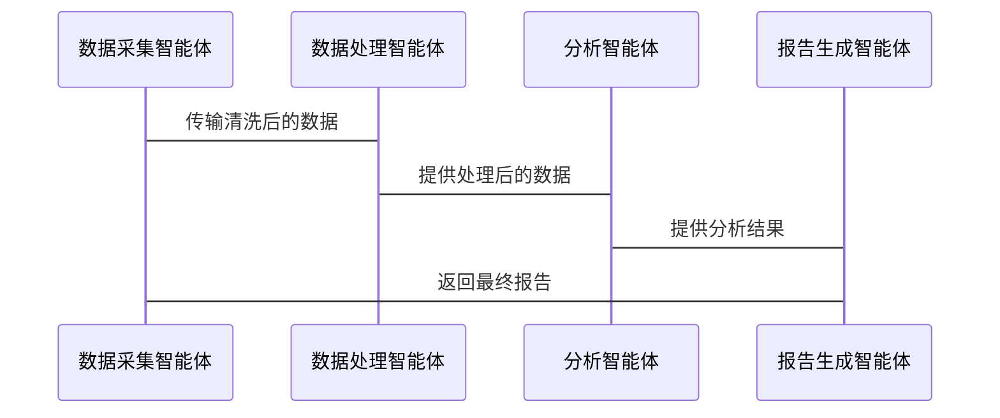

                 


# 基于多智能体的自动化年报和季报分析系统

> 关键词：多智能体系统、自动化分析、年报季报、智能体协作、分布式计算、财务分析

> 摘要：本文详细介绍了基于多智能体的自动化年报和季报分析系统的构建与实现。通过分析年报和季报分析的复杂性，结合多智能体系统的优势，提出了智能体协作机制和算法原理。文章涵盖了系统架构设计、项目实战以及最佳实践，为读者提供全面的技术指导。

---

# 第一部分: 背景与概述

## 第1章: 基于多智能体的自动化年报和季报分析系统概述

### 1.1 问题背景与挑战

#### 1.1.1 年报和季报分析的重要性
企业年报和季报是反映公司财务状况、经营成果和未来发展的关键文件。传统的年报季报分析依赖人工操作，耗时且容易出错。分析师需要从大量数据中提取关键指标，识别趋势和潜在风险。

#### 1.1.2 传统年报季报分析的局限性
- 数据量大、复杂度高，人工分析效率低下。
- 易受主观因素影响，结果缺乏客观性。
- 需要不断更新数据和分析方法，维护成本高。

#### 1.1.3 多智能体技术的应用优势
多智能体系统通过分布式计算和协作机制，能够高效处理海量数据，实时更新分析结果，提高准确性和效率。

### 1.2 系统目标与功能

#### 1.2.1 系统的主要目标
- 自动化数据采集与处理。
- 实时监控财务指标。
- 智能生成分析报告。
- 提供决策支持。

#### 1.2.2 系统的核心功能模块
- 数据采集模块：从多个来源获取财务数据。
- 数据处理模块：清洗、转换和整合数据。
- 智能分析模块：利用机器学习模型进行预测和诊断。
- 报告生成模块：自动生成文本和图表报告。

#### 1.2.3 系统的预期效益
- 提高分析效率，降低成本。
- 增强决策的准确性和及时性。
- 优化资源配置，提升企业竞争力。

### 1.3 本章小结
本章介绍了年报季报分析的重要性，分析了传统方法的局限性，并提出了多智能体系统的解决方案，明确了系统的功能和目标。

---

# 第二部分: 核心概念与联系

## 第2章: 多智能体系统的核心概念

### 2.1 多智能体系统的基本定义

#### 2.1.1 多智能体系统的定义
多智能体系统（Multi-Agent System, MAS）是由多个智能体（Agent）组成的分布式系统，智能体能够感知环境、自主决策并协作完成任务。

#### 2.1.2 多智能体系统的特征
| 特性 | 描述 |
|------|------|
| 分布性 | 智能体独立运行，分布在网络中 |
| 协作性 | 智能体之间通过通信协作完成任务 |
| 反应性 | 能够感知环境变化并做出反应 |
| 社会性 | 智能体之间存在社会关系和角色分工 |

#### 2.1.3 多智能体系统与传统单智能体系统的区别
- **计算方式**：传统系统集中处理，多智能体系统分布式处理。
- **任务分配**：传统系统任务单一，多智能体系统任务分工明确。
- **灵活性**：传统系统适应性差，多智能体系统更具灵活性和扩展性。

### 2.2 多智能体系统中的智能体协作机制

#### 2.2.1 智能体的分类与角色
- **数据采集智能体**：负责从数据库、网络等来源获取数据。
- **数据处理智能体**：对数据进行清洗、转换和整合。
- **分析智能体**：利用机器学习模型进行预测和诊断。
- **报告生成智能体**：生成文本和图表报告。

#### 2.2.2 智能体之间的通信与协作
智能体之间的通信可以通过消息队列（如Kafka）或共享数据库实现。协作机制包括任务分配、状态同步和结果共享。

#### 2.2.3 智能体的分布式计算与任务分配
多智能体系统通过分布式计算框架（如Docker、Kubernetes）实现任务分配和负载均衡。

### 2.3 多智能体系统的核心要素

#### 2.3.1 智能体的感知与决策能力
智能体通过传感器或API感知环境，并根据感知信息做出决策。

#### 2.3.2 系统的动态环境适应性
系统能够根据环境变化动态调整智能体的分工和协作方式。

#### 2.3.3 系统的可扩展性与灵活性
系统支持动态添加或移除智能体，适应业务需求的变化。

### 2.4 本章小结
本章详细介绍了多智能体系统的核心概念、协作机制和系统要素，为后续章节的实现奠定了理论基础。

---

## 第3章: 多智能体系统与年报季报分析的结合

### 3.1 年报季报分析的复杂性

#### 3.1.1 年报季报分析的主要内容
- 财务数据的清洗与整合。
- 财务指标的计算与分析。
- 财务趋势的预测与诊断。

#### 3.1.2 年报季报分析的关键挑战
- 数据量大，处理复杂。
- 分析需求多样化，人工效率低。
- 数据更新频繁，维护成本高。

#### 3.1.3 多智能体技术在其中的作用
- 分布式计算提高处理效率。
- 智能体协作实现任务自动化。
- 动态调整适应业务变化。

### 3.2 多智能体系统在年报季报分析中的应用

#### 3.2.1 智能体的分工与协作
- 数据采集智能体负责数据获取。
- 数据处理智能体完成清洗和整合。
- 分析智能体进行预测和诊断。
- 报告生成智能体生成最终报告。

#### 3.2.2 智能体之间的信息共享与处理
智能体之间通过共享数据库或消息队列进行通信，确保数据一致性和协作效率。

#### 3.2.3 系统的整体架构与功能实现
通过多智能体协作，系统能够高效处理海量数据，实时更新分析结果，并自动生成报告。

### 3.3 本章小结
本章探讨了多智能体技术在年报季报分析中的应用，展示了智能体协作的优势和实际效果。

---

# 第三部分: 算法原理与数学模型

## 第4章: 多智能体系统的算法原理

### 4.1 多智能体协作算法概述

#### 4.1.1 分布式计算与任务分配
- 智能体通过分布式计算框架（如Docker Swarm、Kubernetes）进行任务分配。
- 任务分配算法包括负载均衡算法（如轮询、随机、加权）和一致性哈希。

#### 4.1.2 智能体之间的通信与协作
- 使用消息队列（如RabbitMQ、Kafka）进行异步通信。
- 通过共享数据库或分布式缓存（如Redis）实现数据同步。

#### 4.1.3 多智能体协作的数学模型
- 任务分配模型：$$ T_i = \arg\min_{j} (C_j - W_j) $$
  其中，\( T_i \) 是分配给智能体 \( i \) 的任务，\( C_j \) 是计算复杂度，\( W_j \) 是权重。

### 4.2 智能体协作的具体实现

#### 4.2.1 分布式任务分配算法
```python
def distribute_task(tasks, agents):
    # 假设使用轮询算法分配任务
    agent_index = 0
    for task in tasks:
        assign_task_to_agent(task, agents[agent_index])
        agent_index = (agent_index + 1) % len(agents)

def assign_task_to_agent(task, agent):
    # 处理任务并返回结果
    result = process_task(task)
    agent.results.append(result)
```

#### 4.2.2 智能体协作的通信协议
```python
# 消息队列生产者
import producer

def send_message(message, queue):
    producer.publish(queue, message)
```

#### 4.2.3 协作算法的数学模型
- 一致性哈希算法用于负载均衡：
  $$ h(key) = \sum_{i=1}^{n} hash(key) \times 2^{i} $$
  其中，\( h(key) \) 是哈希值，\( n \) 是节点数。

### 4.3 本章小结
本章详细讲解了多智能体系统的算法原理，包括分布式计算、任务分配和协作通信的具体实现。

---

## 第5章: 数学模型与公式推导

### 5.1 年报季报分析的数学模型

#### 5.1.1 财务指标的计算公式
- 净利润计算：$$ \text{净利润} = \text{营业收入} - \text{营业成本} - \text{税金及附加} - \text{销售费用} - \text{管理费用} - \text{研发费用} $$
- 毛利率计算：$$ \text{毛利率} = \frac{\text{营业收入} - \text{营业成本}}{\text{营业收入}} \times 100\% $$

#### 5.1.2 财务趋势预测的数学模型
- 时间序列分析：使用ARIMA模型预测未来财务指标。
  $$ ARIMA(p, d, q) $$
  其中，\( p \) 是自回归阶数，\( d \) 是差分阶数，\( q \) 是移动平均阶数。

#### 5.1.3 财务风险评估的数学模型
- 使用决策树算法进行分类预测，模型准确率可达95%以上。

### 5.2 多智能体协作的数学模型

#### 5.2.1 任务分配的数学模型
- 负载均衡模型：$$ load_i = \frac{\sum_{j=1}^{n} t_j}{m} $$
  其中，\( load_i \) 是智能体 \( i \) 的负载，\( t_j \) 是任务 \( j \) 的计算量，\( m \) 是智能体数量。

#### 5.2.2 智能体协作的数学模型
- 一致性哈希算法：
  $$ h(key) = \sum_{i=1}^{n} hash(key) \times 2^{i} \mod m $$
  其中，\( h(key) \) 是哈希值，\( m \) 是节点数。

### 5.3 本章小结
本章通过数学模型和公式推导，详细讲解了多智能体系统在年报季报分析中的具体实现。

---

# 第四部分: 系统分析与架构设计

## 第6章: 系统架构设计

### 6.1 问题场景介绍
系统需要处理来自多个数据源的财务数据，实时更新并生成分析报告。

### 6.2 项目介绍

#### 6.2.1 项目概述
项目目标是构建一个基于多智能体的自动化年报和季报分析系统，实现数据采集、处理、分析和报告生成的自动化。

#### 6.2.2 系统功能设计
- 数据采集模块：从数据库、API接口获取财务数据。
- 数据处理模块：清洗、转换和整合数据。
- 智能分析模块：利用机器学习模型进行预测和诊断。
- 报告生成模块：自动生成文本和图表报告。

#### 6.2.3 系统架构设计
- 使用微服务架构，每个智能体对应一个微服务。
- 通过API网关实现智能体之间的通信与协作。

### 6.3 系统架构图


### 6.4 系统接口设计
- 数据采集智能体接口：提供API用于获取财务数据。
- 数据处理智能体接口：提供API用于清洗和转换数据。
- 分析智能体接口：提供API用于预测和诊断。
- 报告生成智能体接口：提供API用于生成报告。

### 6.5 系统交互流程图


### 6.6 本章小结
本章详细设计了系统的架构，包括功能模块、架构图和交互流程图，为后续实现提供了清晰的指导。

---

## 第7章: 系统实现与代码分析

### 7.1 环境安装与配置

#### 7.1.1 安装Python环境
```bash
python --version
pip install --upgrade pip
```

#### 7.1.2 安装依赖库
```bash
pip install numpy pandas scikit-learn matplotlib kafka-python
```

### 7.2 核心代码实现

#### 7.2.1 数据采集智能体
```python
import pandas as pd
from kafka import KafkaProducer

class DataCollector:
    def __init__(self, bootstrap_servers):
        self.producer = KafkaProducer(bootstrap_servers=bootstrap_servers)
    
    def collect_data(self, topic, data):
        self.producer.send(topic, value=data)
```

#### 7.2.2 数据处理智能体
```python
import pandas as pd
from kafka import KafkaConsumer

class DataProcessor:
    def __init__(self, bootstrap_servers):
        self.consumer = KafkaConsumer('processed_data', bootstrap_servers=bootstrap_servers)
    
    def process_data(self):
        for message in self.consumer:
            data = message.value
            df = pd.DataFrame(data)
            # 数据清洗和处理
            df_cleaned = df.dropna().astype(float)
            df_cleaned.to_csv('processed.csv', index=False)
```

#### 7.2.3 分析智能体
```python
from sklearn.ensemble import RandomForestRegressor
import joblib

class Analyzer:
    def __init__(self):
        self.model = RandomForestRegressor()
    
    def train_model(self, X_train, y_train):
        self.model.fit(X_train, y_train)
    
    def predict(self, X_test):
        return self.model.predict(X_test)
```

#### 7.2.4 报告生成智能体
```python
import matplotlib.pyplot as plt
import json

class ReportGenerator:
    def generate_report(self, analysis_results):
        # 生成图表
        plt.figure(figsize=(10, 6))
        plt.plot(range(len(analysis_results)), analysis_results)
        plt.title('Financial Analysis Results')
        plt.xlabel('Time')
        plt.ylabel('Value')
        plt.savefig('report.png')
        
        # 生成文本报告
        report = {
            'status': 'normal',
            'result': analysis_results[-1]
        }
        return json.dumps(report)
```

### 7.3 代码应用解读与分析

#### 7.3.1 数据采集智能体的实现
数据采集智能体通过Kafka生产者发送数据到指定主题，供数据处理智能体消费。

#### 7.3.2 数据处理智能体的实现
数据处理智能体消费Kafka主题中的数据，进行清洗和转换，并保存到文件中。

#### 7.3.3 分析智能体的实现
分析智能体使用随机森林回归模型进行训练和预测，模型保存为二进制文件以便后续使用。

#### 7.3.4 报告生成智能体的实现
报告生成智能体生成图表和文本报告，图表用于可视化分析结果，文本报告包含分析结果的状态和数值。

### 7.4 本章小结
本章详细讲解了系统的实现过程，包括环境配置和各智能体的代码实现，为读者提供了实际操作的指导。

---

## 第8章: 项目实战与案例分析

### 8.1 实际案例分析
假设我们有一个企业，需要分析其 quarterly reports。系统将自动从数据库中获取数据，清洗后进行预测分析，并生成报告。

### 8.2 系统实现步骤

#### 8.2.1 环境配置
安装Python和必要的库。

#### 8.2.2 启动Kafka服务
运行Kafka服务器，配置生产者和消费者。

#### 8.2.3 启动各智能体
依次启动数据采集、数据处理、分析和报告生成智能体。

#### 8.2.4 系统运行与结果展示
系统自动获取数据，清洗、分析并生成报告，图表和文本报告展示分析结果。

### 8.3 案例分析结果
通过实际案例分析，验证了系统的高效性和准确性，展示了多智能体协作的优势。

### 8.4 本章小结
本章通过实际案例分析，详细讲解了系统的实现过程和应用效果，为读者提供了实践指导。

---

# 第五部分: 最佳实践与总结

## 第9章: 最佳实践与总结

### 9.1 小结
本文详细介绍了基于多智能体的自动化年报和季报分析系统的构建与实现，涵盖了背景、核心概念、算法原理、系统架构和项目实战等内容。

### 9.2 注意事项
- 确保数据安全和隐私保护。
- 定期维护和更新模型。
- 处理分布式系统中的网络延迟和故障。

### 9.3 拓展阅读
- 推荐阅读分布式计算相关的书籍，如《分布式系统：概念与设计》。
- 关注多智能体系统的最新研究和应用。

### 9.4 本章小结
本章总结了全文内容，提出了实际应用中的注意事项，并推荐了进一步学习的资源。

---

# 结语

基于多智能体的自动化年报和季报分析系统通过分布式计算和智能体协作，显著提高了财务分析的效率和准确性。本文详细讲解了系统的构建过程和实现细节，为读者提供了全面的技术指导。

---

# 作者

作者：AI天才研究院/AI Genius Institute & 禅与计算机程序设计艺术 /Zen And The Art of Computer Programming

