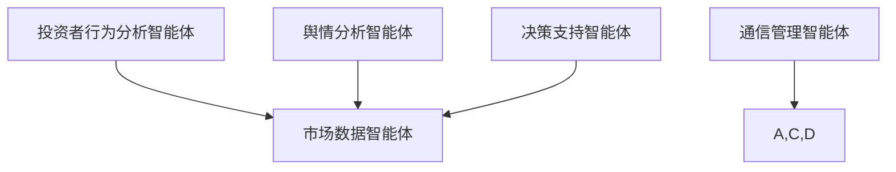
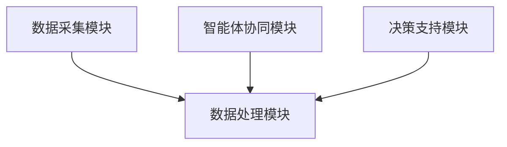
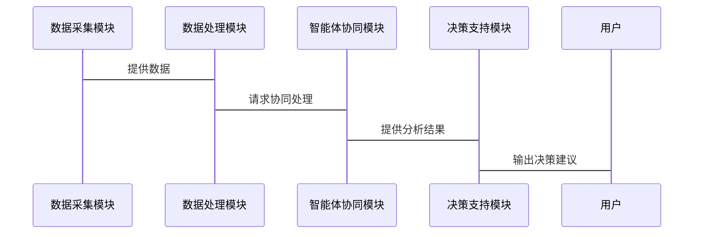

                 


# 基于多智能体的自动化投资者关系分析系统

> 关键词：多智能体系统、投资者关系分析、自动化分析、系统架构设计、算法原理

> 摘要：本文系统地介绍了基于多智能体的自动化投资者关系分析系统的构建与实现。从背景与问题分析入手，详细阐述了多智能体系统在投资者关系分析中的优势与应用。通过分析核心概念、算法原理、系统架构设计和项目实战，全面展示了如何利用多智能体技术实现投资者关系分析的自动化。最后，总结了最佳实践经验和未来的发展方向。

---

## 第1章: 投资者关系分析的背景与问题

### 1.1 投资者关系分析的重要性

#### 1.1.1 投资者关系管理的核心目标
投资者关系管理（Investor Relations Management,IRM）是指公司通过与投资者进行有效沟通，提升投资者对公司价值的认知和信任，从而实现公司市值管理的目标。其核心目标包括：

- 提供透明、及时的信息披露。
- 建立与投资者的良好互动关系。
- 优化公司资本市场形象。
- 管理投资者预期，降低信息不对称风险。

#### 1.1.2 数字化投资者关系管理的必要性
随着信息技术的发展，投资者关系管理逐渐从传统的人工化管理向数字化、自动化方向转型。数字化投资者关系管理能够通过大数据分析、自然语言处理（NLP）和机器学习等技术，实时监控市场动态，分析投资者情绪，为公司决策提供数据支持。

#### 1.1.3 自动化投资者关系分析的挑战与机遇
自动化投资者关系分析能够显著提高信息处理效率，但同时也面临以下挑战：
- 数据量大：投资者行为数据、市场新闻、社交媒体数据等海量信息需要实时处理。
- 数据复杂性：投资者行为数据具有多模态（文本、语音、图像）和异构性的特点。
- 实时性要求高：投资者关系分析需要对实时市场动态做出快速反应。

### 1.2 多智能体系统在投资者关系分析中的优势

#### 1.2.1 多智能体系统的定义与特点
多智能体系统（Multi-Agent System, MAS）是由多个智能体（Agent）组成的分布式系统，每个智能体能够独立感知环境、自主决策并执行任务。其特点包括：
- 分布式计算：智能体之间通过通信协议进行交互。
- 协作性：智能体协同完成复杂任务。
- 自适应性：智能体能够根据环境变化动态调整行为。

#### 1.2.2 多智能体系统在投资者关系分析中的应用场景
多智能体系统在投资者关系分析中的应用主要体现在以下几个方面：
- **实时监控**：多个智能体协同监控市场动态、新闻舆情和社交媒体信息。
- **信息处理**：智能体通过自然语言处理技术分析文本数据，提取关键词和情感倾向。
- **决策支持**：基于多源数据的分析结果，为投资者关系管理提供决策支持。

#### 1.2.3 多智能体系统的优势分析
与传统单智能体系统相比，多智能体系统在投资者关系分析中的优势包括：
- **并行处理能力**：多个智能体可以同时处理不同类型的数据，提高效率。
- **任务分配优化**：智能体可以根据自身能力动态分配任务，提升整体性能。
- **容错性**：系统中单个智能体的故障不会导致整个系统崩溃。

### 1.3 当前投资者关系分析中存在的问题

#### 1.3.1 传统投资者关系分析的局限性
传统投资者关系分析主要依赖人工分析和简单统计方法，存在以下问题：
- **效率低下**：人工分析耗时长，难以应对海量数据。
- **准确性不足**：主观判断可能导致分析结果偏差。
- **实时性差**：无法对实时市场动态做出快速反应。

#### 1.3.2 数据量大、实时性要求高的挑战
随着金融市场的快速发展，投资者行为数据呈现出以下特点：
- **数据量大**：每天产生的市场数据和社交媒体信息数量巨大。
- **数据实时性要求高**：需要对实时市场动态做出快速反应。
- **数据复杂性**：数据来源多样，包括文本、语音、图像等多种形式。

#### 1.3.3 多维度数据分析的复杂性
投资者关系分析需要综合分析多维度数据，包括：
- **市场数据**：股票价格、成交量、市场指数等。
- **舆情数据**：新闻媒体、社交媒体上的投资者情绪分析。
- **投资者行为数据**：投资者交易记录、市场参与度等。

### 1.4 本章小结
本章从投资者关系分析的背景出发，详细阐述了其重要性，并分析了多智能体系统在投资者关系分析中的优势。同时，也指出了当前投资者关系分析中存在的主要问题，为后续章节的深入分析奠定了基础。

---

## 第2章: 多智能体系统与投资者关系分析的核心概念

### 2.1 多智能体系统的定义与原理

#### 2.1.1 多智能体系统的定义
多智能体系统是由多个智能体组成的分布式系统，每个智能体能够感知环境、自主决策并与其他智能体协同工作。智能体之间通过通信协议进行交互，共同完成复杂任务。

#### 2.1.2 多智能体系统的核心原理
多智能体系统的核心原理包括：
- **分布式计算**：智能体之间通过分布式计算实现任务分配和数据处理。
- **协作与通信**：智能体通过通信协议进行信息交换，实现协作。
- **任务分配与调度**：根据智能体的能力和当前负载，动态分配任务。

#### 2.1.3 多智能体系统与单智能体系统的区别
| 特性 | 单智能体系统 | 多智能体系统 |
|------|--------------|--------------|
| 系统结构 | 单点处理 | 分布式处理 |
| 任务分配 | 单点决策 | 分布式决策 |
| 并行性 | 串行处理 | 并行处理 |

### 2.2 投资者关系分析的定义与核心要素

#### 2.2.1 投资者关系分析的定义
投资者关系分析是指通过分析投资者的行为、市场动态和舆情信息，为投资者关系管理提供数据支持和决策建议的过程。

#### 2.2.2 投资者关系分析的核心要素
投资者关系分析的核心要素包括：
- **市场数据**：股票价格、成交量等实时数据。
- **舆情数据**：新闻媒体和社交媒体上的投资者情绪分析。
- **投资者行为数据**：投资者交易记录和市场参与度。

#### 2.2.3 投资者关系分析的目标与任务
投资者关系分析的目标是通过多维度数据的分析，识别市场趋势、投资者情绪和潜在风险。主要任务包括：
- **实时监控**：实时跟踪市场动态和投资者行为。
- **数据处理**：对多源数据进行清洗、整合和分析。
- **决策支持**：为投资者关系管理提供数据支持和决策建议。

### 2.3 多智能体系统在投资者关系分析中的核心联系

#### 2.3.1 多智能体系统与投资者关系分析的结合点
多智能体系统与投资者关系分析的结合点主要体现在：
- **数据处理**：多个智能体协同处理不同类型的数据。
- **任务分配**：根据数据类型和智能体能力动态分配任务。
- **实时协作**：智能体之间实时协作，共同完成复杂任务。

#### 2.3.2 多智能体系统在投资者关系分析中的角色分配
在投资者关系分析中，智能体的角色分配可以基于以下原则：
- **任务相关性**：智能体根据任务需求分配角色。
- **能力互补性**：智能体之间能力互补，共同完成复杂任务。
- **动态调整**：根据系统负载和任务需求动态调整角色分配。

#### 2.3.3 多智能体系统的实体关系图
以下是一个投资者关系分析系统中多智能体系统的实体关系图：



---

## 第3章: 算法原理

### 3.1 多智能体协同算法

#### 3.1.1 分布式一致性算法
分布式一致性算法是多智能体系统中实现数据一致性的关键算法。常用的算法包括：
- **Paxos算法**：用于在分布式系统中实现一致性的基础算法。
- **Raft算法**：Paxos的优化版本，更容易理解和实现。
- **Consensus算法**：用于分布式系统中达成共识的算法。

#### 3.1.2 一致性算法的实现
以下是基于Paxos算法的简单实现：

```python
class Paxos:
    def __init__(self, proposer_id):
        self.proposer_id = proposer_id
        self.ballot_number = 0
        self.accepted = {}

    def propose(self, value):
        self.ballot_number += 1
        # 发起提案
        # 通过询问超过半数的接受者，获取当前最高提案
        # 根据接受者反馈，决定是否接受当前提案
        # 返回是否成功
        pass

    def accept(self, proposal):
        # 接收提案，更新自己的状态
        pass
```

#### 3.1.3 一致性算法的数学模型
一致性算法的核心思想是通过协调多个智能体的行为，确保系统中所有智能体的状态一致。数学模型如下：

$$
\text{Consistency} = \forall i, j \in \text{Agents}, s_i = s_j
$$

其中，$s_i$ 和 $s_j$ 分别表示智能体 $i$ 和 $j$ 的状态。

### 3.2 任务分配与调度算法

#### 3.2.1 分布式任务分配算法
在多智能体系统中，任务分配可以通过以下算法实现：

1. 每个智能体向协调者报告自身的资源和能力。
2. 协调者根据任务需求和智能体能力，动态分配任务。
3. 智能体执行分配的任务，并将结果返回给协调者。
4. 协调者汇总结果，完成任务。

#### 3.2.2 任务分配算法的实现
以下是任务分配算法的简单实现：

```python
class TaskAllocator:
    def __init__(self, agents):
        self.agents = agents

    def allocate_task(self, task):
        # 根据任务类型和智能体能力分配任务
        for agent in self.agents:
            if agent.capability matches task.type:
                agent.receive_task(task)
                break
```

#### 3.2.3 任务分配算法的数学模型
任务分配算法的目标是最小化任务执行时间，同时平衡系统负载。数学模型如下：

$$
\text{Minimize } \sum_{i=1}^{n} t_i
$$

其中，$t_i$ 表示智能体 $i$ 执行任务的时间。

---

## 第4章: 系统架构设计

### 4.1 系统架构设计

#### 4.1.1 功能模块设计
投资者关系分析系统的功能模块包括：
- **数据采集模块**：采集市场数据、舆情数据和投资者行为数据。
- **数据处理模块**：对数据进行清洗、整合和分析。
- **智能体协同模块**：实现多智能体之间的通信与协作。
- **决策支持模块**：提供投资者关系管理的决策支持。

#### 4.1.2 系统架构图
以下是系统的架构图：



#### 4.1.3 接口设计
系统接口设计包括：
- **数据接口**：与数据源（如股票交易系统、社交媒体平台）对接。
- **智能体接口**：智能体之间的通信接口。
- **用户接口**：供用户查询和分析结果的接口。

#### 4.1.4 交互流程图
以下是系统的交互流程图：



---

## 第5章: 项目实战

### 5.1 环境安装与配置

#### 5.1.1 系统运行环境
建议使用以下环境：
- **操作系统**：Linux 或 Windows。
- **编程语言**：Python 3.8+。
- **框架**：Django 或 Flask。
- **工具**：Jupyter Notebook、Git。

#### 5.1.2 安装依赖包
安装以下依赖包：

```bash
pip install requests
pip install beautifulsoup4
pip install pandas
pip install numpy
pip install matplotlib
pip install networkx
pip install mermaid
```

### 5.2 系统核心实现

#### 5.2.1 数据采集模块实现
以下是数据采集模块的代码示例：

```python
import requests
from bs4 import BeautifulSoup

def fetch_data(url):
    response = requests.get(url)
    if response.status_code == 200:
        return response.text
    else:
        return None

def parse_data(html):
    soup = BeautifulSoup(html, 'html.parser')
    # 提取数据
    return data

# 示例使用
url = 'https://example.com'
html = fetch_data(url)
data = parse_data(html)
```

#### 5.2.2 智能体协同模块实现
以下是智能体协同模块的代码示例：

```python
class Agent:
    def __init__(self, name):
        self.name = name
        self.communication_channel = {}

    def send_message(self, recipient, message):
        self.communication_channel[recipient] = message

    def receive_message(self, sender):
        return self.communication_channel.get(sender, None)

# 示例使用
agent1 = Agent('Agent1')
agent2 = Agent('Agent2')
agent1.send_message('Agent2', 'Task allocation request')
message = agent2.receive_message('Agent1')
```

### 5.3 实际案例分析

#### 5.3.1 案例背景
假设我们有一个投资者关系分析系统，需要实时监控某上市公司的市场动态和投资者情绪。

#### 5.3.2 数据处理与分析
以下是数据处理与分析的代码示例：

```python
import pandas as pd
import numpy as np

# 示例数据
data = {
    'date': ['2023-10-01', '2023-10-02', '2023-10-03'],
    'sentiment': [0.8, 0.6, 0.9],
    'volume': [1000, 1500, 1200]
}

df = pd.DataFrame(data)
print(df.head())
```

#### 5.3.3 结果展示与解释
以下是结果展示与解释：


---

## 第6章: 最佳实践与小结

### 6.1 最佳实践

#### 6.1.1 系统设计建议
- **模块化设计**：确保系统模块化，便于维护和扩展。
- **容错设计**：设计容错机制，确保系统稳定性。
- **安全性设计**：确保系统数据安全，防止数据泄露。

#### 6.1.2 开发注意事项
- **代码规范**：遵循代码规范，提高代码可读性。
- **测试覆盖率**：确保系统测试覆盖率高，减少潜在问题。
- **日志记录**：设计完善的日志记录系统，便于问题排查。

### 6.2 小结

#### 6.2.1 本文总结
本文系统地介绍了基于多智能体的自动化投资者关系分析系统的构建与实现。从背景与问题分析入手，详细阐述了多智能体系统在投资者关系分析中的优势与应用。通过分析核心概念、算法原理、系统架构设计和项目实战，全面展示了如何利用多智能体技术实现投资者关系分析的自动化。

#### 6.2.2 未来展望
随着人工智能和大数据技术的不断发展，多智能体系统在投资者关系分析中的应用前景广阔。未来，可以通过以下方向进一步优化系统：
- **智能化提升**：引入更先进的机器学习算法，提高分析精度。
- **系统扩展**：扩展系统功能，支持更多类型的数据分析。
- **性能优化**：优化系统性能，提高处理效率。

---

## 作者：AI天才研究院 & 禅与计算机程序设计艺术

---

**摘要**：本文系统地介绍了基于多智能体的自动化投资者关系分析系统的构建与实现。从背景与问题分析入手，详细阐述了多智能体系统在投资者关系分析中的优势与应用。通过分析核心概念、算法原理、系统架构设计和项目实战，全面展示了如何利用多智能体技术实现投资者关系分析的自动化。最后，总结了最佳实践经验和未来的发展方向。

