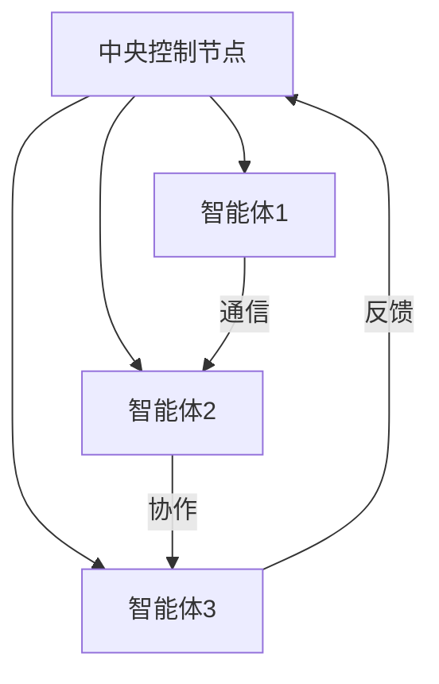
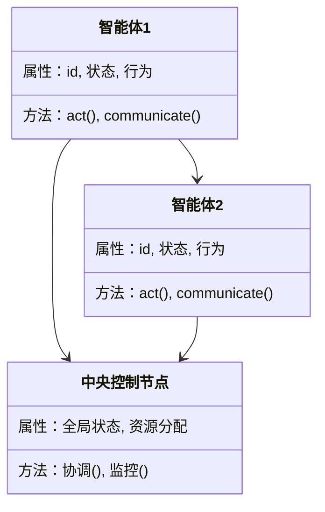
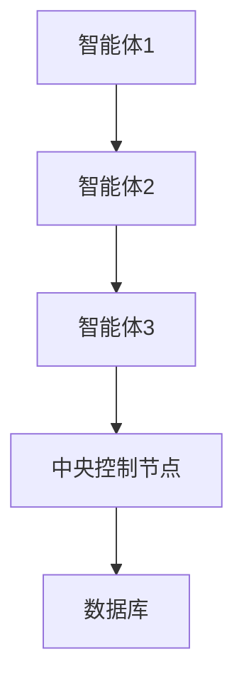

                 


# 基于多智能体的自动化财务建模和估值系统

## 关键词：多智能体系统, 自动化财务建模, 估值系统, 分布式计算, 财务优化, 多智能体协作

## 摘要

基于多智能体的自动化财务建模和估值系统是一种创新的解决方案，通过多智能体系统的协作与优化，实现了财务建模和估值的自动化与智能化。本文从背景介绍、核心概念、算法原理、系统架构、项目实战到总结展望，详细阐述了多智能体系统在财务建模中的应用，展示了其在提高效率、降低成本、增强决策能力方面的显著优势。

---

## 第一部分: 背景与核心概念

### 第1章: 多智能体系统与财务建模的背景

#### 1.1 多智能体系统的基本概念

多智能体系统（Multi-Agent System, MAS）是由多个相互作用的智能体（Agent）组成的分布式系统，每个智能体都有自己的目标、行为和决策能力。与传统单智能体系统相比，多智能体系统具有以下特点：

- **分布式性**：智能体分布在网络中，各自独立运行。
- **协作性**：智能体之间通过通信和协作完成共同目标。
- **自主性**：智能体能够自主决策，无需外部干预。

#### 1.2 多智能体系统在财务建模中的应用背景

传统的财务建模方法依赖于人工输入和计算，存在效率低、误差大、难以处理复杂场景等问题。而多智能体系统通过分布计算和协作优化，能够高效处理复杂的财务建模问题。具体表现在以下几个方面：

- **数据处理能力**：多智能体系统能够同时处理大量异构数据，提高建模效率。
- **决策优化**：通过智能体之间的协作，实现财务模型的优化。
- **动态适应性**：能够实时响应市场变化，调整建模策略。

#### 1.3 系统架构概述

图1-1展示了多智能体系统在财务建模中的基本架构：



---

## 第二部分: 多智能体系统的核心概念

### 第2章: 多智能体系统的协作机制

#### 2.1 智能体的通信机制

智能体之间的通信是多智能体系统的核心功能之一。通过通信，智能体可以共享信息、协调行动。常见的通信方式包括：

- **直接通信**：智能体之间通过消息传递进行实时通信。
- **间接通信**：通过共享数据库或中间件进行间接通信。

#### 2.2 智能体的协作机制

协作机制决定了智能体如何共同完成任务。以下是几种常见的协作机制：

- **基于合同的协作**：智能体通过签订合同明确各自的职责和任务。
- **基于规则的协作**：智能体根据预定义的规则进行协作。
- **基于市场的协作**：智能体通过市场机制进行资源分配和任务协作。

#### 2.3 多智能体系统与财务建模的关系

图2-1展示了多智能体系统在财务建模中的核心要素：



---

## 第三部分: 多智能体系统的算法原理

### 第3章: 多智能体协作算法

#### 3.1 分布式计算与多智能体协作

分布式计算是多智能体系统的核心算法之一。以下是分布式计算的基本流程：

1. **任务分解**：将整体任务分解为多个子任务。
2. **任务分配**：将子任务分配给不同的智能体。
3. **子任务执行**：智能体独立执行分配的任务。
4. **结果汇总**：汇总各智能体的执行结果，形成最终结果。

#### 3.2 多智能体系统的优化算法

优化算法是多智能体系统中实现协作优化的重要手段。以下是一个简单的优化算法示例：

```python
def multi_agent_optimization(n_agents, target_function):
    agents = [Agent() for _ in range(n_agents)]
    for agent in agents:
        agent.initialize()
    while not all_agents_converged(agents):
        for agent in agents:
            agent.act()
            agent.communicate()
    return get_global_optimum(agents)
```

---

## 第四部分: 多智能体系统的系统架构与设计

### 第4章: 系统架构设计

#### 4.1 系统功能模块划分

多智能体系统的功能模块可以划分为以下几个部分：

- **智能体模块**：负责执行具体的建模任务。
- **通信模块**：负责智能体之间的信息传递。
- **协调模块**：负责任务的分配与协作。
- **监控模块**：负责系统的整体监控与优化。

#### 4.2 系统架构图

图4-1展示了多智能体系统的整体架构：



---

## 第五部分: 项目实战

### 第5章: 项目实现与案例分析

#### 5.1 项目环境与安装

以下是实现多智能体系统的环境配置：

```bash
# 安装所需的依赖库
pip install numpy
pip install matplotlib
pip install networkx
```

#### 5.2 核心代码实现

以下是多智能体系统的核心代码实现：

```python
class Agent:
    def __init__(self, id):
        self.id = id
        self.state = None
        self.behavior = None

    def act(self):
        # 具体行为实现
        pass

    def communicate(self, other_agent):
        # 通信实现
        pass

# 初始化智能体
agents = [Agent(i) for i in range(5)]

# 分配任务
for agent in agents:
    agent.behavior = 'modeling'
```

#### 5.3 案例分析与结果展示

通过上述代码实现的多智能体系统，可以在财务建模中实现以下功能：

- **数据采集**：智能体从不同数据源获取财务数据。
- **数据处理**：智能体对数据进行清洗、转换和分析。
- **模型构建**：智能体协作构建财务模型。
- **结果输出**：智能体将建模结果汇总并输出。

---

## 第六部分: 总结与展望

### 第6章: 总结与展望

#### 6.1 系统总结

本文详细阐述了基于多智能体的自动化财务建模和估值系统的实现与应用，展示了其在提高效率、降低成本、增强决策能力方面的显著优势。

#### 6.2 未来展望

未来，随着人工智能和分布式计算技术的不断发展，多智能体系统在财务建模中的应用将更加广泛和深入。以下是未来的发展方向：

- **智能体的自我学习与进化**：通过机器学习技术，实现智能体的自我优化与进化。
- **多智能体系统的扩展性与适应性**：进一步提高系统的扩展性和适应性，以应对更加复杂的财务建模需求。
- **智能化决策支持**：通过多智能体系统的协作，实现更加智能化的决策支持。

---

## 作者信息

作者：AI天才研究院/AI Genius Institute & 禅与计算机程序设计艺术 /Zen And The Art of Computer Programming

