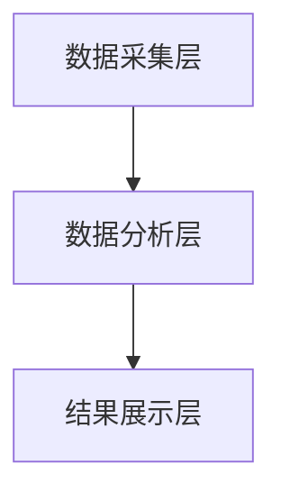
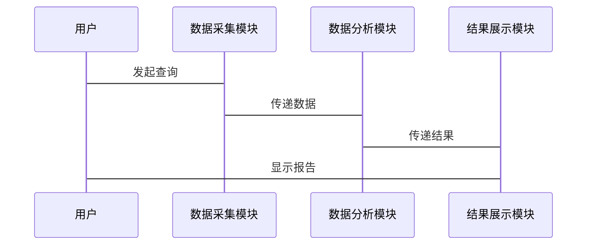

                 


# 基于多智能体的自动化财务报表比较分析系统

> 关键词：多智能体系统，财务报表分析，自动化比较，协同算法，系统架构

> 摘要：本文介绍了一种基于多智能体的自动化财务报表比较分析系统，详细探讨了多智能体系统在财务分析中的应用，分析了系统的架构设计、算法原理及实现方案。通过实际案例分析，展示了该系统的高效性和准确性，为财务数据分析提供了新的思路。

---

## 第一部分: 多智能体系统与财务报表分析概述

### 第1章: 多智能体系统概述

#### 1.1 多智能体系统的基本概念

多智能体系统（Multi-Agent System, MAS）是由多个智能体（Agent）组成的分布式系统，这些智能体通过协作完成特定任务。以下是多智能体系统的基本概念：

- **智能体（Agent）**：智能体是具有感知环境、自主决策和行动能力的实体。它可以是一个软件程序、机器人或其他具备智能行为的实体。
- **多智能体系统**：由多个智能体组成的系统，智能体之间通过通信和协作完成复杂的任务。
- **协同与协作**：智能体之间的协作是通过通信和信息共享实现的，目的是完成共同的目标。

#### 1.2 多智能体系统与财务报表分析的结合

财务报表分析是企业财务管理的重要部分，传统的人工分析效率低、容易出错。基于多智能体的自动化财务报表比较分析系统能够提高分析效率和准确性。

- **财务报表分析的复杂性**：财务报表涉及大量数据，分析需要考虑多个维度，如收入、利润、资产负债等。
- **多智能体系统的优势**：多智能体系统能够将复杂的分析任务分解为多个子任务，通过智能体的协同完成。
- **自动化分析的必要性**：通过自动化分析，企业可以快速获取财务数据的比较结果，为决策提供支持。

#### 1.3 本章小结

本章介绍了多智能体系统的基本概念，分析了其在财务报表分析中的应用，强调了自动化分析的必要性。

---

### 第2章: 财务报表比较分析的背景与需求

#### 2.1 财务报表分析的基本概念

财务报表分析是通过对企业的财务报表进行分析，评估企业的财务状况、经营成果和现金流量。以下是财务报表分析的基本概念：

- **财务报表的构成**：包括资产负债表、利润表和现金流量表。
- **财务报表分析的目的**：评估企业的财务健康状况，发现潜在问题，支持决策。
- **财务报表分析的方法**：包括比率分析、趋势分析和结构分析。

#### 2.2 自动化财务报表比较分析的需求

传统财务报表分析存在效率低、误差多等问题，自动化分析的需求日益迫切。

- **传统分析的局限性**：人工分析耗时长，容易出错，且难以处理大量数据。
- **自动化分析的必要性**：通过自动化技术，可以快速、准确地完成财务报表分析。
- **基于多智能体的优势**：多智能体系统能够将分析任务分解为多个子任务，通过智能体的协同提高效率。

#### 2.3 本章小结

本章分析了财务报表分析的基本概念，强调了自动化分析的需求，并提出了基于多智能体系统的解决方案。

---

## 第二部分: 多智能体系统的核心原理与算法

### 第3章: 多智能体系统的核心原理

#### 3.1 多智能体系统的组成与关系

多智能体系统由多个智能体组成，智能体之间通过通信和协作完成任务。

- **智能体的定义与分类**：智能体可以分为简单反应型智能体、基于模型的反射型智能体和目标驱动型智能体。
- **智能体之间的通信机制**：智能体之间通过消息传递进行通信，消息内容包括数据和指令。
- **智能体的协作与协调**：协作是智能体之间的合作，协调是智能体之间的同步和冲突解决。

#### 3.2 多智能体系统的协同算法

协同算法是多智能体系统的核心，以下是常见的协同算法：

- **分布式计算**：任务分解为多个子任务，分布在不同的智能体上执行。
- **一致性算法**：确保多个智能体之间的数据一致，如Paxos算法和Raft算法。
- **任务分配算法**：根据智能体的能力和负载分配任务。

#### 3.3 本章小结

本章介绍了多智能体系统的组成与关系，分析了协同算法的基本原理。

---

### 第4章: 基于多智能体的自动化分析算法

#### 4.1 多智能体协同分析的基本流程

自动化财务报表比较分析的基本流程如下：

1. 数据采集：从财务系统中获取财务报表数据。
2. 数据预处理：清洗数据，消除噪声。
3. 数据分析：通过智能体协同分析，计算各项财务指标。
4. 结果汇总：将各智能体的分析结果汇总，生成最终的比较报告。

#### 4.2 多智能体协同算法的实现

以下是协同算法的实现细节：

- **分布式计算的实现**：通过将任务分解为子任务，利用多智能体分别处理。
- **一致性算法的实现**：使用Paxos算法确保数据一致性。
- **任务分配算法的实现**：根据智能体的负载和能力动态分配任务。

#### 4.3 算法的数学模型与公式

以下是协同算法的数学模型：

- **分布式计算模型**：
  $$ f(x) = \sum_{i=1}^{n} f_i(x_i) $$
  其中，$$x_i$$ 是智能体 $$i$$ 的输入，$$f_i$$ 是智能体 $$i$$ 的处理函数。

- **一致性算法模型**：
  $$ \text{Consistency} = \sum_{i=1}^{n} \left| x_i - \text{avg}(x) \right| $$
  其中，$$\text{avg}(x)$$ 是数据的平均值。

#### 4.4 本章小结

本章详细介绍了基于多智能体的自动化分析算法，包括基本流程和实现细节。

---

## 第三部分: 系统设计与实现

### 第5章: 系统分析与架构设计

#### 5.1 系统应用场景与目标

系统应用于企业财务报表分析，目标是实现自动化、高效的财务报表比较分析。

- **应用场景**：企业财务部门、审计部门、投资机构等。
- **系统目标**：实现财务报表数据的自动采集、分析和比较，生成分析报告。

#### 5.2 系统功能设计

系统功能模块包括：

- **数据采集模块**：负责从财务系统中获取数据。
- **数据分析模块**：负责对数据进行分析和计算。
- **结果展示模块**：负责生成和展示分析报告。

#### 5.3 系统架构设计

系统架构采用分层设计：

1. 数据采集层：负责数据的采集和预处理。
2. 数据分析层：负责数据的分析和计算。
3. 结果展示层：负责结果的展示和输出。

系统架构图如下：



#### 5.4 系统交互设计

系统交互流程如下：

1. 用户输入查询请求。
2. 数据采集模块获取数据。
3. 数据分析模块进行分析。
4. 结果展示模块生成报告。

系统交互图如下：



#### 5.5 本章小结

本章分析了系统的应用场景，设计了系统功能模块和架构，展示了系统的交互流程。

---

### 第6章: 系统实现与项目实战

#### 6.1 环境安装与配置

系统实现需要以下环境：

- **编程语言**：Python 3.8+
- **框架与库**：Django、Flask、Pandas、NumPy
- **开发工具**：PyCharm、VS Code

#### 6.2 系统核心实现

以下是系统核心代码实现：

```python
# 数据采集模块
def fetch_data():
    # 从数据库中获取数据
    pass

# 数据分析模块
def analyze_data(data):
    # 数据分析逻辑
    pass

# 结果展示模块
def display_results(results):
    # 结果展示逻辑
    pass
```

#### 6.3 代码解读与分析

- **数据采集模块**：负责从数据库中获取财务报表数据。
- **数据分析模块**：对数据进行清洗、转换和计算，生成财务指标。
- **结果展示模块**：将分析结果以图表或报告的形式展示给用户。

#### 6.4 实际案例分析

以下是一个实际案例分析：

1. 数据采集：获取某企业的资产负债表和利润表。
2. 数据分析：计算企业的盈利能力、偿债能力等指标。
3. 结果展示：生成分析报告，包括财务指标的比较和趋势分析。

#### 6.5 本章小结

本章通过实际案例展示了系统的实现过程，包括环境配置、核心代码实现和结果展示。

---

### 第7章: 总结与展望

#### 7.1 总结

本文介绍了一种基于多智能体的自动化财务报表比较分析系统，详细探讨了系统的架构设计、算法原理及实现方案。通过实际案例分析，展示了该系统的高效性和准确性。

#### 7.2 展望

未来的研究方向包括：

- 提高系统的智能化水平，引入机器学习和深度学习技术。
- 扩展系统的应用场景，支持更多类型的财务分析。
- 提升系统的可扩展性和可维护性。

#### 7.3 小结

本文总结了基于多智能体的自动化财务报表比较分析系统的实现，展望了未来的研究方向。

---

作者：AI天才研究院/AI Genius Institute & 禅与计算机程序设计艺术 /Zen And The Art of Computer Programming

