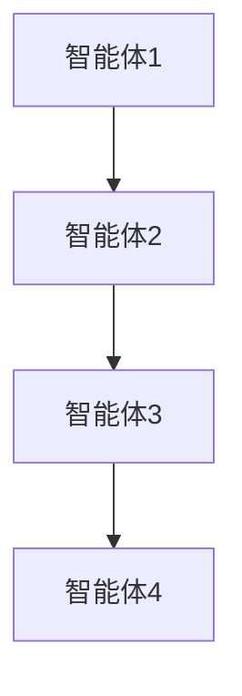
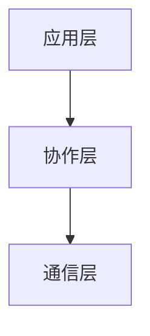
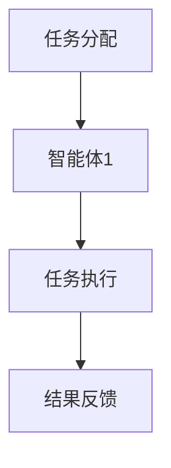
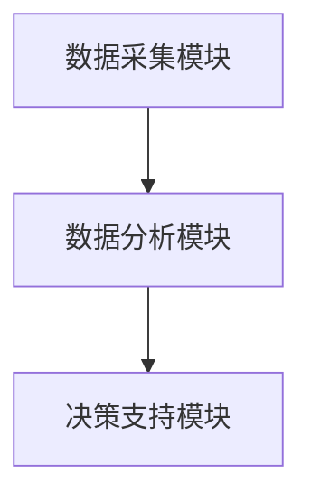
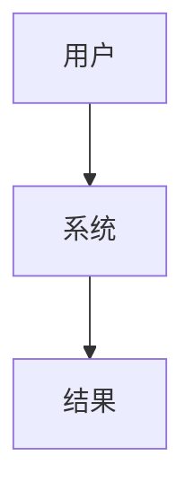

                 


# 基于多智能体的自动化财报分析系统

> 关键词：多智能体系统、自动化财报分析、智能协作、财务数据处理、分布式计算

> 摘要：本文深入探讨了基于多智能体的自动化财报分析系统的构建与应用。首先，介绍了多智能体系统的基本概念及其在自动化财报分析中的重要性。接着，详细分析了多智能体系统的协作机制和算法原理，提出了适合自动化财报分析的系统架构。最后，通过实际案例展示了系统的实现过程，并总结了该系统的优缺点及未来发展方向。

---

# 第1章: 多智能体系统与自动化财报分析概述

## 1.1 多智能体系统的基本概念

### 1.1.1 多智能体系统的定义

多智能体系统（Multi-Agent System, 简称MAS）是由多个智能体（Agent）组成的分布式系统。每个智能体都是一个能够感知环境、做出决策并执行动作的实体。智能体之间通过通信和协作完成复杂的任务。

图1-1展示了多智能体系统的基本组成：



### 1.1.2 多智能体系统的特征

多智能体系统具有以下特征：

- **分布性**：智能体独立运行，无中心控制节点。
- **协作性**：智能体之间通过协作完成共同目标。
- **反应性**：智能体能够实时感知环境并做出反应。
- **主动性**：智能体主动采取行动以实现目标。

### 1.1.3 多智能体系统与传统方法的区别

传统方法依赖于集中式计算，而多智能体系统采用分布式计算，能够更好地处理复杂任务。

| 对比维度 | 传统方法 | 多智能体系统 |
|----------|----------|-------------|
| 控制方式 | 集中式    | 分布式       |
| 效率     | 可能较低  | 可能较高     |
| 可扩展性 | 较差      | 较好         |

## 1.2 自动化财报分析的背景与意义

### 1.2.1 财务报告分析的传统方法

传统财务报告分析主要依赖人工阅读和手动计算。这种方式效率低下，容易出错。

### 1.2.2 自动化财报分析的需求

随着企业规模的扩大，对财务报告分析的需求日益增长。自动化分析能够提高效率、降低成本。

### 1.2.3 多智能体系统在财报分析中的应用前景

多智能体系统能够通过协作完成复杂任务，非常适合应用于财务报告分析。

## 1.3 多智能体系统与自动化财报分析的结合

### 1.3.1 多智能体系统在财报分析中的角色

智能体可以分别负责数据采集、数据分析和决策支持等任务。

### 1.3.2 自动化财报分析的核心任务

包括数据采集、数据清洗、数据分析和结果展示。

### 1.3.3 多智能体协作在财报分析中的实现方式

通过智能体之间的通信和协作，完成数据处理和分析任务。

## 1.4 本章小结

本章介绍了多智能体系统的基本概念及其在自动化财报分析中的应用，为后续内容奠定了基础。

---

# 第2章: 多智能体系统的核心概念与原理

## 2.1 多智能体系统的组成与结构

### 2.1.1 智能体的定义与分类

智能体可以分为简单反射型智能体、基于模型的反射型智能体和目标驱动型智能体。

### 2.1.2 多智能体系统的层次结构

多智能体系统通常分为应用层、协作层和通信层。

图2-1展示了多智能体系统的层次结构：



### 2.1.3 智能体之间的通信机制

智能体之间可以通过消息传递或共享数据库进行通信。

---

## 2.2 多智能体系统的协作机制

### 2.2.1 协作任务的分解与分配

将任务分解为多个子任务，分配给不同的智能体完成。

### 2.2.2 智能体之间的协调与冲突解决

通过协商和仲裁机制解决冲突。

### 2.2.3 协作效率的评估指标

包括任务完成时间、资源利用率和系统吞吐量。

---

## 2.3 多智能体系统的算法基础

### 2.3.1 分布式计算的基本原理

分布式计算通过将任务分配给多个节点完成。

### 2.3.2 多智能体协作算法的分类

包括基于规则的协作算法、基于模型的协作算法和基于市场的协作算法。

### 2.3.3 常见的协作算法介绍

以基于规则的协作算法为例，其流程图如下：



---

## 2.4 本章小结

本章详细介绍了多智能体系统的核心概念和协作机制，为后续的系统设计奠定了理论基础。

---

# 第3章: 自动化财报分析的核心任务与实现

## 3.1 财务报告的结构与内容

### 3.1.1 财务报表的基本构成

包括资产负债表、利润表和现金流量表。

### 3.1.2 财务报告分析的关键指标

如净利润率、毛利率和资产负债率等。

### 3.1.3 财务报告的语义理解

通过自然语言处理技术理解报告内容。

---

## 3.2 自动化财报分析的主要任务

### 3.2.1 数据采集与预处理

从多种来源采集财务数据并进行清洗。

### 3.2.2 财务数据的特征提取

提取关键特征用于后续分析。

### 3.2.3 财务报告的智能分析与决策

基于机器学习算法进行预测和决策。

---

## 3.3 多智能体系统在财报分析中的具体实现

### 3.3.1 数据采集智能体的设计

负责从多种来源采集数据。

### 3.3.2 数据分析智能体的设计

负责对数据进行分析并生成报告。

### 3.3.3 决策支持智能体的设计

基于分析结果提供决策建议。

---

## 3.4 本章小结

本章详细介绍了自动化财报分析的核心任务和多智能体系统的具体实现方式。

---

# 第4章: 基于多智能体的自动化财报分析系统架构设计

## 4.1 系统功能设计

### 4.1.1 系统功能模块划分

包括数据采集模块、数据分析模块和决策支持模块。

图4-1展示了系统功能模块划分：



### 4.1.2 系统功能流程设计

数据采集模块首先采集数据，然后传递给数据分析模块，最后由决策支持模块生成报告。

---

## 4.2 系统架构设计

### 4.2.1 系统架构的组成

包括前端界面、后端服务和数据库。

### 4.2.2 系统架构的优缺点

优点是高扩展性，缺点是初期开发成本较高。

---

## 4.3 系统接口设计

### 4.3.1 数据采集接口

用于从多种来源采集数据。

### 4.3.2 数据分析接口

用于对数据进行处理和分析。

### 4.3.3 决策支持接口

用于生成决策建议。

---

## 4.4 系统交互设计

### 4.4.1 系统交互流程设计

用户输入查询请求，系统接收后进行处理并返回结果。

图4-2展示了系统交互流程：



---

## 4.5 本章小结

本章详细介绍了基于多智能体的自动化财报分析系统的架构设计，包括功能模块、系统架构、接口设计和交互流程。

---

# 第5章: 项目实战与案例分析

## 5.1 项目环境安装

### 5.1.1 安装Python

需要安装Python 3.8及以上版本。

### 5.1.2 安装必要的库

如numpy、pandas和scikit-learn。

---

## 5.2 系统核心实现

### 5.2.1 数据采集模块实现

代码示例：

```python
import requests

def fetch_financial_data(symbol):
    response = requests.get(f'https://api.example.com/financial_data/{symbol}')
    return response.json()
```

### 5.2.2 数据分析模块实现

代码示例：

```python
import pandas as pd
import numpy as np

def analyze_data(df):
    df['moving_average'] = df['price'].rolling(10).mean()
    return df
```

### 5.2.3 决策支持模块实现

代码示例：

```python
def generate_recommendation(df):
    if df['moving_average'] > df['price']:
        return '买入'
    else:
        return '卖出'
```

---

## 5.3 实际案例分析

以某公司股票为例，分析其财务数据并生成投资建议。

---

## 5.4 本章小结

本章通过实际案例展示了基于多智能体的自动化财报分析系统的实现过程。

---

# 第6章: 系统优化与未来展望

## 6.1 系统优化建议

### 6.1.1 提高系统的可扩展性

通过增加智能体数量来提高处理能力。

### 6.1.2 优化智能体之间的通信机制

减少通信延迟，提高协作效率。

---

## 6.2 未来发展方向

### 6.2.1 引入更高级的机器学习算法

如深度学习和强化学习。

### 6.2.2 结合区块链技术

提高系统的安全性和透明性。

---

## 6.3 本章小结

本章提出了系统的优化建议，并展望了未来的发展方向。

---

# 作者

作者：AI天才研究院/AI Genius Institute & 禅与计算机程序设计艺术 /Zen And The Art of Computer Programming

---

通过以上内容，我们全面介绍了基于多智能体的自动化财报分析系统的构建与应用。从系统概述到项目实战，再到优化与展望，每一部分都进行了详细的分析与阐述。希望本文能够为相关领域的研究者和实践者提供有价值的参考和启发。

