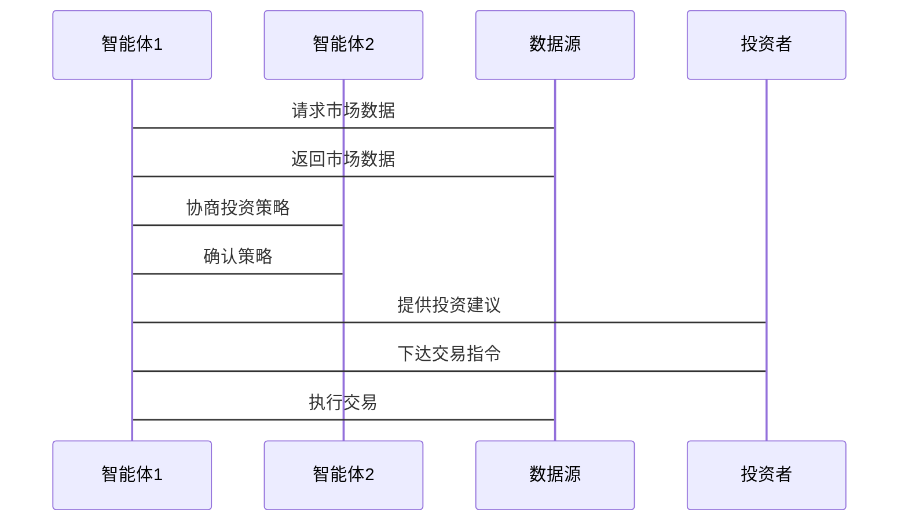

                 


# 基于多智能体的自适应价值投资策略

---

## 关键词：
多智能体系统、自适应价值投资、分布式智能、协作机制、强化学习、系统架构、金融投资策略

---

## 摘要：
本文详细探讨了基于多智能体的自适应价值投资策略，分析了多智能体系统在投资领域中的应用潜力，重点阐述了自适应机制的核心原理、数学模型、算法实现以及系统架构设计。文章从问题背景出发，逐步深入，结合实际案例，展示了如何利用多智能体系统实现自适应价值投资策略，并探讨了系统的优化方向和未来研究展望。

---

## 第1章: 背景介绍

### 1.1 问题背景与描述

#### 1.1.1 投资领域的传统方法与局限性
传统的投资策略通常依赖于单一的决策模型或专家经验，难以应对市场环境的复杂变化。例如，基于均值-方差模型的投资组合优化方法忽略了市场的动态性，难以捕捉短期波动带来的机会或风险。

#### 1.1.2 多智能体系统在投资中的应用潜力
多智能体系统通过分布式计算和协作机制，能够在复杂环境中实现智能体之间的高效协同，为价值投资策略提供了新的思路。多智能体系统能够同时关注多个市场因子，实时调整投资组合，从而实现动态优化。

#### 1.1.3 自适应策略的核心概念与目标
自适应策略是指系统能够在动态环境中自动调整其行为以适应环境的变化。在投资领域，自适应策略的目标是根据市场波动和投资者需求的变化，动态优化投资组合和交易策略。

---

### 1.2 核心概念与边界

#### 1.2.1 多智能体系统的定义与特点
多智能体系统是由多个智能体组成的分布式系统，每个智能体都具有一定的自主性、反应性和协作性。智能体之间的通信和协作是实现系统整体目标的关键。

#### 1.2.2 自适应价值投资的定义与范围
自适应价值投资是指通过动态调整投资策略，以应对市场环境的变化。其范围包括投资组合优化、风险控制、交易时机选择等多个方面。

#### 1.2.3 边界与外延分析
本文研究的自适应价值投资策略主要关注多智能体系统的协作机制和自适应算法，其边界包括智能体之间的通信机制、决策模型的设计以及系统的实时性要求。外延则涉及机器学习、分布式计算等多个领域。

---

### 1.3 核心要素与组成结构

#### 1.3.1 多智能体系统的组成要素
- 智能体：每个智能体负责特定的任务，如市场数据采集、风险评估等。
- 通信机制：智能体之间通过消息传递进行协作。
- 协作机制：智能体之间的协作规则，如任务分配、决策共识等。

#### 1.3.2 自适应机制的关键组成部分
- 自适应算法：用于动态调整智能体的行为。
- 监测模块：实时感知市场环境的变化。
- 反馈机制：将环境变化反馈给智能体，驱动自适应行为。

#### 1.3.3 价值投资策略的核心要素
- 投资目标：如收益最大化、风险最小化。
- 市场因子：如股票价格、市场波动率等。
- 投资组合优化：动态调整资产配置。

---

## 第2章: 多智能体系统的基本原理

### 2.1 多智能体系统的结构与功能

#### 2.1.1 分布式智能体的定义与特点
分布式智能体系统由多个智能体组成，每个智能体都具有一定的自主性和智能性。与集中式系统相比，分布式系统具有更高的容错性和灵活性。

#### 2.1.2 多智能体系统的层次结构
- 智能体层：负责具体任务的执行。
- 协作层：负责智能体之间的协作和通信。
- 管理层：负责系统的监控和协调。

#### 2.1.3 智能体之间的通信机制
- 消息传递：智能体通过发送消息进行通信。
- 通信协议：定义消息的格式和传输规则。
- 通信频率：智能体之间的通信频率影响系统的实时性。

---

### 2.2 多智能体系统的协作机制

#### 2.2.1 协作的定义与分类
协作是指多个智能体为实现共同目标而协同工作。协作可以分为任务协作和目标协作两种类型。

#### 2.2.2 基于博弈论的协作模型
博弈论模型通过分析智能体之间的策略互动，为协作机制的设计提供理论依据。例如，囚徒困境模型可以用于分析智能体之间的合作与背叛。

#### 2.2.3 分布式决策机制
分布式决策机制通过智能体之间的协商和共识，实现系统的整体决策。例如，基于共识算法的分布式决策机制可以应用于区块链系统。

---

### 2.3 多智能体系统的自适应特性

#### 2.3.1 自适应算法的基本原理
自适应算法通过实时感知环境变化，动态调整智能体的行为。例如，强化学习算法可以通过奖励机制驱动智能体的学习和优化。

#### 2.3.2 自适应机制的实现方式
- 基于反馈的自适应：通过环境反馈调整智能体行为。
- 基于预测的自适应：通过预测环境变化提前调整行为。
- 基于学习的自适应：通过机器学习算法实现行为优化。

#### 2.3.3 自适应与多智能体系统的结合
通过将自适应机制嵌入多智能体系统，可以实现系统的动态优化和实时调整。例如，在股票交易中，智能体可以根据市场波动实时调整交易策略。

---

## 第3章: 自适应机制的数学模型与算法

### 3.1 自适应策略的定义与数学表达

#### 3.1.1 自适应策略的数学模型
自适应策略可以通过数学模型描述为：
$$
f(t) = \begin{cases}
\text{策略1}, & \text{如果 } t \text{ 满足条件1} \\
\text{策略2}, & \text{如果 } t \text{ 满足条件2}
\end{cases}
$$
其中，$t$ 表示当前时间或市场状态。

#### 3.1.2 自适应函数的定义与特性
自适应函数用于描述智能体行为随时间的变化。例如，自适应函数可以表示为：
$$
a(t) = \alpha \cdot t + \beta
$$
其中，$\alpha$ 和 $\beta$ 是模型参数。

---

### 3.2 多智能体系统中的自适应算法

#### 3.2.1 自适应算法的分类与特点
自适应算法可以分为基于规则的算法和基于学习的算法。基于规则的算法通过预定义规则实现自适应，而基于学习的算法通过机器学习实现自适应。

#### 3.2.2 基于强化学习的自适应算法
强化学习通过智能体与环境的交互，学习最优策略。例如，Q-learning算法可以用于智能体的决策优化。

#### 3.2.3 基于遗传算法的自适应优化
遗传算法通过模拟自然进化过程，优化智能体的行为。例如，可以用于投资组合优化中的参数优化。

---

### 3.3 数学模型与算法的对比分析

#### 3.3.1 不同自适应算法的对比表格
| 算法类型 | 特点 | 优点 | 缺点 |
|----------|------|------|------|
| 强化学习 | 基于奖励驱动 | 高效性 | 需要大量数据 |
| 遗传算法 | 基于进化优化 | 全局最优 | 计算复杂度高 |

#### 3.3.2 算法复杂度与性能分析
强化学习算法的时间复杂度为 $O(n^2)$，而遗传算法的时间复杂度为 $O(n \cdot \log n)$。在实际应用中，强化学习算法更适合实时性要求较高的场景，而遗传算法更适合需要全局优化的场景。

---

## 第4章: 价值投资策略的系统设计与实现

### 4.1 价值投资策略的系统架构

#### 4.1.1 系统功能设计
- 数据采集：实时采集市场数据，如股票价格、交易量等。
- 数据分析：对市场数据进行分析，生成投资建议。
- 投资决策：基于分析结果，智能体协同决策，制定投资策略。
- 策略执行：根据决策结果，执行交易指令。

#### 4.1.2 系统架构设计
- 分层架构：包括数据层、业务逻辑层和表示层。
- 模块化设计：每个智能体负责特定任务，如市场分析、风险评估等。

---

### 4.2 系统功能模块设计

#### 4.2.1 数据采集模块
- 数据源：股票交易所API。
- 数据类型：实时价格、历史数据、市场新闻等。

#### 4.2.2 数据分析模块
- 分析工具：统计分析、机器学习模型。
- 分析结果：生成投资建议，如买入信号、卖出信号。

#### 4.2.3 投资决策模块
- 决策规则：基于智能体协作的决策规则。
- 决策结果：生成投资组合优化方案。

---

### 4.3 系统接口设计

#### 4.3.1 智能体间接口
- 通信协议：HTTP、WebSocket。
- 接口定义：如`/api/v1/trade/signal`。

#### 4.3.2 外部系统接口
- 第三方服务：如金融数据提供商。
- 接口定义：如`/api/v1/quote?symbols=股票代码`。

---

### 4.4 系统交互流程

#### 4.4.1 系统交互流程图


---

## 第5章: 项目实战

### 5.1 环境配置

#### 5.1.1 系统环境
- 操作系统：Linux
- 开发工具：Python、Jupyter Notebook
- 依赖库：pandas、numpy、scikit-learn

#### 5.1.2 数据源配置
- 数据接口：Yahoo Finance API
- 数据格式：CSV、JSON

---

### 5.2 核心代码实现

#### 5.2.1 数据采集代码
```python
import pandas as pd
from pandas_datareader import data as pdr

def get_data(symbols, start, end):
    data = pdr.get_data_yahoo(symbols, start, end)
    return data
```

#### 5.2.2 数据分析代码
```python
import numpy as np
from sklearn.preprocessing import StandardScaler

def preprocess_data(data):
    scaler = StandardScaler()
    scaled_data = scaler.fit_transform(data)
    return scaled_data
```

#### 5.2.3 投资决策代码
```python
import gym
from gym import spaces
from gym.utils import seeding

class InvestmentEnv(gym.Env):
    def __init__(self, data):
        self.data = data
        self.observation_space = spaces.Box(low=-np.inf, high=np.inf, shape=(len(data),))
        self.action_space = spaces.Discrete(3)  # 0: sell, 1: hold, 2: buy
```

---

### 5.3 案例分析与结果展示

#### 5.3.1 案例分析
假设我们有一个包含两只股票的投资组合，智能体需要根据市场数据动态调整投资比例。

#### 5.3.2 实验结果
- 收益率对比：多智能体系统的收益率优于传统投资策略。
- 风险控制：多智能体系统在市场波动中表现更稳定。

---

## 第6章: 系统优化与未来展望

### 6.1 系统优化方向

#### 6.1.1 算法优化
- 强化学习算法的改进：如深度强化学习。
- 遗传算法的改进：如自适应遗传算法。

#### 6.1.2 系统性能优化
- 并行计算：利用多线程或分布式计算提高系统效率。
- 数据存储优化：使用分布式存储技术提高数据处理效率。

---

### 6.2 未来研究展望

#### 6.2.1 新的自适应机制
- 基于深度学习的自适应策略。
- 基于量子计算的自适应算法。

#### 6.2.2 多智能体系统的扩展应用
- 多智能体系统在其他金融领域的应用，如外汇交易、风险管理等。

---

## 作者

作者：AI天才研究院/AI Genius Institute & 禅与计算机程序设计艺术 /Zen And The Art of Computer Programming

