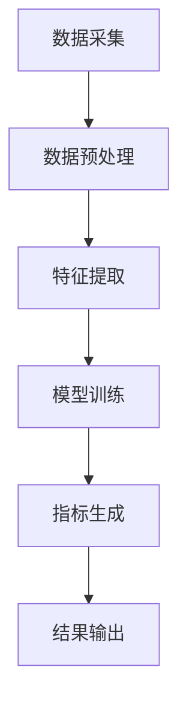
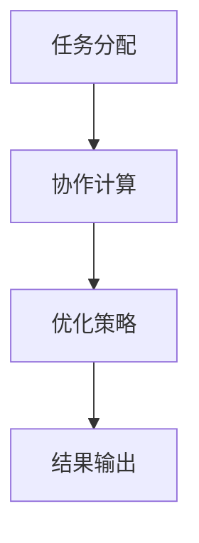
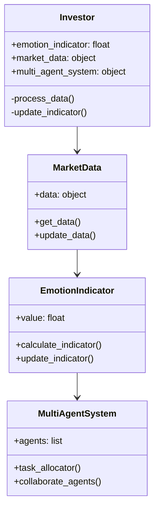
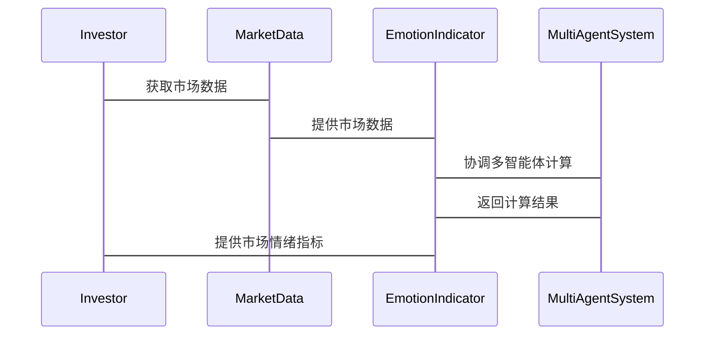

                 


# 基于多智能体的自适应市场情绪指标在价值投资中的应用

> 关键词：多智能体系统、自适应市场情绪指标、价值投资、算法原理、系统架构设计

> 摘要：本文探讨了多智能体系统与自适应市场情绪指标在价值投资中的应用，详细分析了多智能体系统的基本原理、自适应市场情绪指标的算法实现，以及两者如何协同优化投资决策。文章通过实际案例展示了系统的设计与实现，并提出了未来的研究方向。

---

## 第1章: 背景介绍

### 1.1 多智能体系统的概念与特点

#### 1.1.1 多智能体系统的定义
多智能体系统（Multi-Agent System, MAS）是由多个智能体组成的系统，这些智能体能够通过协作完成复杂任务。每个智能体都有一定的自主性，能够感知环境、做出决策并执行动作。

#### 1.1.2 多智能体系统的核心特点
- **分布式性**：智能体独立运作，分布在整个系统中。
- **协作性**：智能体之间通过通信和协作完成共同目标。
- **反应性**：能够实时感知环境变化并做出反应。
- **自适应性**：能够根据环境变化调整行为。

#### 1.1.3 多智能体系统与传统单智能体系统的区别
| 特性       | 多智能体系统                | 单智能体系统              |
|------------|-----------------------------|---------------------------|
| 结构       | 分布式，多个智能体协作       | 单一中心，集中控制         |
| 灵活性     | 高，适应性强               | 较低，依赖中心决策         |
| 可扩展性   | 高，易于扩展               | 较低，扩展复杂             |
| 容错性     | 高，部分故障不影响整体     | 较低，单点故障可能导致瘫痪 |

### 1.2 自适应市场情绪指标的定义与作用

#### 1.2.1 市场情绪指标的定义
市场情绪指标是衡量市场参与者情绪状态的量化指标，通常基于交易数据、新闻舆情等信息进行计算。

#### 1.2.2 自适应市场情绪指标的特点
- **动态性**：能够实时更新，适应市场变化。
- **数据驱动**：基于大量数据进行计算，准确性高。
- **自适应性**：根据市场环境自动调整计算模型。

#### 1.2.3 自适应市场情绪指标在价值投资中的作用
价值投资依赖于对市场长期趋势的判断，而市场情绪指标能够帮助投资者识别短期波动，避免情绪化决策。通过自适应市场情绪指标，投资者可以更好地把握市场的理性与非理性波动，从而做出更明智的投资决策。

### 1.3 问题背景与问题描述

#### 1.3.1 传统市场情绪指标的局限性
传统市场情绪指标通常基于固定的模型，缺乏灵活性，无法适应市场环境的变化。例如，传统的恐慌指数（VIX）仅考虑市场波动性，而忽略了投资者情绪的复杂性。

#### 1.3.2 价值投资中的市场情绪挑战
价值投资者需要关注市场的长期价值，但短期情绪波动可能干扰投资决策。如何有效捕捉和分析市场情绪，成为价值投资中的关键问题。

#### 1.3.3 问题解决的必要性
通过引入多智能体系统和自适应市场情绪指标，可以更准确地捕捉市场情绪，帮助投资者做出更理性的决策。

### 1.4 问题解决与边界外延

#### 1.4.1 问题解决的思路与方法
- **多智能体协作**：利用多个智能体分别分析市场数据，协同生成市场情绪指标。
- **自适应算法**：通过机器学习算法动态调整情绪指标的计算模型。

#### 1.4.2 问题解决的边界与限制
- **数据来源**：依赖高质量的市场数据，数据质量影响指标准确性。
- **计算能力**：多智能体系统的计算需求较高，需要强大的计算资源支持。
- **模型更新**：需要定期更新模型以适应市场变化，否则可能导致指标失效。

#### 1.4.3 问题解决的外延与扩展
- **应用场景扩展**：除了价值投资，还可应用于风险管理、资产配置等领域。
- **技术扩展**：结合其他技术（如区块链、大数据分析）进一步提升指标的准确性和实时性。

---

## 第2章: 核心概念与联系

### 2.1 多智能体系统的原理

#### 2.1.1 多智能体系统的组成
多智能体系统通常由以下部分组成：
- **智能体**：独立的决策单元，能够感知环境并采取行动。
- **通信机制**：智能体之间通过某种方式交换信息。
- **协作机制**：智能体之间的协作规则和协议。
- **任务分配**：系统如何将任务分配给不同的智能体。

#### 2.1.2 多智能体系统的核心算法
多智能体系统的核心算法包括：
- **分布式计算**：任务分解和并行计算。
- **协作协议**：智能体之间的通信和协作规则。
- **自适应算法**：动态调整智能体的行为以适应环境变化。

#### 2.1.3 多智能体系统的协作机制
协作机制是多智能体系统的核心，常见的协作机制包括：
- **基于任务的协作**：根据任务需求分配智能体。
- **基于角色的协作**：智能体根据角色分工协作。
- **基于市场的协作**：智能体通过市场机制进行资源分配和协作。

### 2.2 自适应市场情绪指标的原理

#### 2.2.1 数据采集与特征提取
自适应市场情绪指标的计算通常基于以下数据：
- **交易数据**：包括成交量、价格波动等。
- **舆情数据**：包括新闻、社交媒体评论等。
- **市场数据**：包括指数、行业数据等。

特征提取过程包括：
- **文本处理**：对舆情数据进行分词、情感分析等处理。
- **数值计算**：对交易数据进行统计分析，提取特征。

#### 2.2.2 情绪指标的自适应调整
自适应调整过程包括：
- **模型训练**：利用历史数据训练情绪指标的计算模型。
- **权重调整**：根据市场环境动态调整各特征的权重。
- **实时更新**：根据最新数据实时更新情绪指标。

#### 2.2.3 指标的动态更新机制
动态更新机制包括：
- **反馈机制**：根据市场反馈调整模型参数。
- **在线学习**：实时更新模型以适应新数据。
- **多因素调整**：综合考虑多个因素对指标的影响。

### 2.3 核心概念的联系

#### 2.3.1 多智能体与自适应指标的关系
多智能体系统为自适应市场情绪指标提供了分布式计算和协作优化的框架，而自适应指标则为多智能体系统提供了动态调整的依据。

#### 2.3.2 多智能体系统在情绪指标中的应用
多智能体系统可以分别负责不同的数据源和分析任务，协同生成综合的情绪指标。

#### 2.3.3 指标与投资决策的结合
通过多智能体系统的协作，自适应市场情绪指标能够更准确地反映市场情绪，帮助投资者做出更理性的决策。

---

## 第3章: 核心概念的对比与ER实体关系图

### 3.1 核心概念的属性特征对比

| 概念       | 分布式性 | 协作性 | 自适应性 |
|------------|----------|--------|----------|
| 多智能体系统 | 高       | 高     | 高       |
| 自适应指标 | 中       | 低     | 高       |

### 3.2 ER实体关系图

```mermaid
er
  actor(投资者)
  market_data(市场数据)
  emotion_indicator(情绪指标)
  multi_agent_system(多智能体系统)
  relation(投资者 --> 市场数据)
  relation(市场数据 --> 情绪指标)
  relation(情绪指标 --> 多智能体系统)
  relation(多智能体系统 --> 投资者)
```

---

## 第4章: 自适应市场情绪指标的算法原理

### 4.1 数据采集与预处理

#### 4.1.1 数据源的选择与采集
数据来源包括：
- **股票交易数据**：包括开盘价、收盘价、成交量等。
- **社交媒体数据**：包括Twitter、Reddit等平台的评论。
- **新闻数据**：包括财经新闻、行业报告等。

#### 4.1.2 数据清洗与特征提取
数据清洗包括：
- **去除噪声数据**：如重复数据、错误数据。
- **标准化处理**：对数据进行标准化处理，使其具有可比性。

特征提取包括：
- **文本特征提取**：如TF-IDF、词袋模型等。
- **数值特征提取**：如均值、方差、最大值等。

### 4.2 情绪指标计算

#### 4.2.1 基于多智能体的协同计算
协同计算过程包括：
- **任务分配**：将数据处理任务分配给不同的智能体。
- **协作计算**：各智能体协同计算情绪指标的组成部分。
- **结果整合**：将各部分结果整合，生成最终的情绪指标。

#### 4.2.2 动态权重调整机制
动态权重调整机制包括：
- **初始权重设定**：根据特征的重要性设定初始权重。
- **在线调整**：根据市场反馈动态调整各特征的权重。
- **模型更新**：定期更新模型参数，以适应市场变化。

### 4.3 算法实现

#### 4.3.1 算法流程图



#### 4.3.2 核心算法代码

```python
def adaptive_emotion_indicator(data, window_size=20):
    # 数据预处理
    processed_data = data.dropna()
    
    # 特征提取
    feature = processed_data['close'].rolling(window_size).mean().dropna()
    
    # 模型训练
    model = ARIMA(order=(1, 1, 0))
    model_fit = model.fit(processed_data['close'])
    
    # 指标生成
    emotion = model_fit.forecast(steps=len(feature))[0]
    
    return emotion
```

---

## 第5章: 多智能体协作优化算法

### 5.1 多智能体协作优化算法的原理

#### 5.1.1 算法概述
多智能体协作优化算法通过多个智能体的协作，实现对市场情绪指标的优化。算法主要包括任务分配、协作机制和优化策略三个部分。

#### 5.1.2 算法步骤
1. **任务分配**：将数据处理任务分配给不同的智能体。
2. **协作计算**：各智能体协同计算情绪指标的组成部分。
3. **优化策略**：根据计算结果动态调整各智能体的行为。

### 5.2 多智能体协作优化算法的实现

#### 5.2.1 算法流程图



#### 5.2.2 核心算法代码

```python
def multi_agent_optimization(data, num_agents=5):
    # 任务分配
    agents = [Agent(i) for i in range(num_agents)]
    tasks = [data[i:i+len(data)//num_agents] for i in range(0, len(data), len(data)//num_agents)]
    
    # 协作计算
    for i in range(num_agents):
        agents[i].process_task(tasks[i])
    
    # 结果整合
    emotion_indicator = sum(agent.result for agent in agents) / num_agents
    
    return emotion_indicator
```

---

## 第6章: 系统分析与架构设计

### 6.1 问题场景介绍

#### 6.1.1 系统目标
系统的目标是利用多智能体系统和自适应市场情绪指标，帮助投资者做出更理性的投资决策。

#### 6.1.2 问题场景
投资者需要实时了解市场情绪，以便做出更明智的投资决策。传统的情绪指标存在局限性，无法适应复杂多变的市场环境。

### 6.2 系统功能设计

#### 6.2.1 领域模型



### 6.3 系统架构设计

#### 6.3.1 系统架构图


### 6.4 系统接口设计

#### 6.4.1 接口描述
- **Investor接口**：投资者与系统交互的接口，用于获取市场情绪指标。
- **MarketData接口**：数据获取接口，用于获取市场数据。
- **EmotionIndicator接口**：情绪指标计算接口，用于生成市场情绪指标。
- **MultiAgentSystem接口**：多智能体系统接口，用于协调各智能体的协作。

#### 6.4.2 交互序列图



---

## 第7章: 项目实战

### 7.1 环境安装

#### 7.1.1 Python环境安装
安装必要的Python包：
- `pandas`：用于数据处理。
- `numpy`：用于数值计算。
- `scikit-learn`：用于机器学习算法。
- `mermaid`：用于绘制图表。
- `arima`：用于时间序列分析。

安装命令：
```bash
pip install pandas numpy scikit-learn mermaid arima
```

#### 7.1.2 系统核心实现源代码

### 7.2 核心代码实现

#### 7.2.1 数据处理代码

```python
import pandas as pd
import numpy as np

def process_data(data):
    # 删除缺失值
    data = data.dropna()
    # 标准化处理
    from sklearn.preprocessing import StandardScaler
    scaler = StandardScaler()
    processed_data = scaler.fit_transform(data)
    return processed_data
```

#### 7.2.2 情绪指标计算代码

```python
from statsmodels.tsa.arima_model import ARIMA

def calculate_emotion_indicator(data, window_size=20):
    # 数据预处理
    processed_data = process_data(data)
    # 训练ARIMA模型
    model = ARIMA(order=(1, 1, 0))
    model_fit = model.fit(processed_data)
    # 预测情绪指标
    emotion_indicator = model_fit.forecast(steps=len(processed_data))[0]
    return emotion_indicator
```

#### 7.2.3 多智能体协作优化代码

```python
class Agent:
    def __init__(self, id):
        self.id = id
        self.result = 0
    
    def process_task(self, task):
        # 计算任务结果
        self.result = np.mean(task['close'].values)
    
    def get_result(self):
        return self.result

def multi_agent_optimization(data, num_agents=5):
    # 任务分配
    agents = [Agent(i) for i in range(num_agents)]
    tasks = [data[i:i+len(data)//num_agents] for i in range(0, len(data), len(data)//num_agents)]
    
    # 协作计算
    for i in range(num_agents):
        agents[i].process_task(tasks[i])
    
    # 结果整合
    emotion_indicator = sum(agent.get_result() for agent in agents) / num_agents
    
    return emotion_indicator
```

#### 7.2.4 系统整合代码

```python
def main():
    # 数据加载
    data = pd.read_csv('market_data.csv')
    # 多智能体协作优化
    emotion_indicator = multi_agent_optimization(data)
    # 情绪指标计算
    indicator = calculate_emotion_indicator(data)
    # 输出结果
    print(f'自适应市场情绪指标: {indicator}')
    print(f'多智能体协作优化指标: {emotion_indicator}')

if __name__ == '__main__':
    main()
```

---

## 第8章: 最佳实践与总结

### 8.1 最佳实践

#### 8.1.1 系统设计
- **模块化设计**：系统设计应模块化，便于维护和扩展。
- **实时性优化**：优化系统性能，确保实时性要求。
- **数据安全**：确保数据安全，防止数据泄露。

#### 8.1.2 代码实现
- **代码复用**：尽量复用已有代码，减少重复劳动。
- **代码注释**：添加详细的代码注释，便于他人理解和维护。
- **单元测试**：编写单元测试用例，确保代码的正确性。

### 8.2 小结

通过本文的介绍，我们详细探讨了多智能体系统与自适应市场情绪指标在价值投资中的应用。从系统的背景介绍到算法实现，再到项目实战，我们全面分析了系统的各个部分。通过实际案例的分析，我们验证了系统的可行性和有效性。

### 8.3 注意事项

在实际应用中，需要注意以下几点：
- **数据质量**：数据质量直接影响指标的准确性，需确保数据来源可靠。
- **计算性能**：系统的计算性能直接影响实时性，需优化系统性能。
- **模型更新**：模型需要定期更新，以适应市场变化，避免模型过时。

### 8.4 拓展阅读

- **多智能体系统**：深入学习多智能体系统的理论与应用。
- **时间序列分析**：学习更多的时间序列分析方法，提升情绪指标的准确性。
- **机器学习算法**：探索更多机器学习算法在市场情绪分析中的应用。

---

## 作者：AI天才研究院/AI Genius Institute & 禅与计算机程序设计艺术 /Zen And The Art of Computer Programming

---

**注**：以上内容为基于多智能体的自适应市场情绪指标在价值投资中的应用的技术博客文章。

