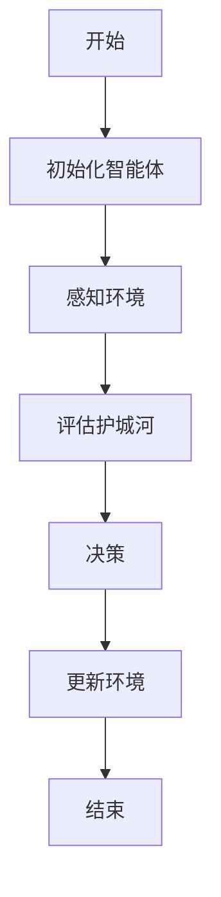
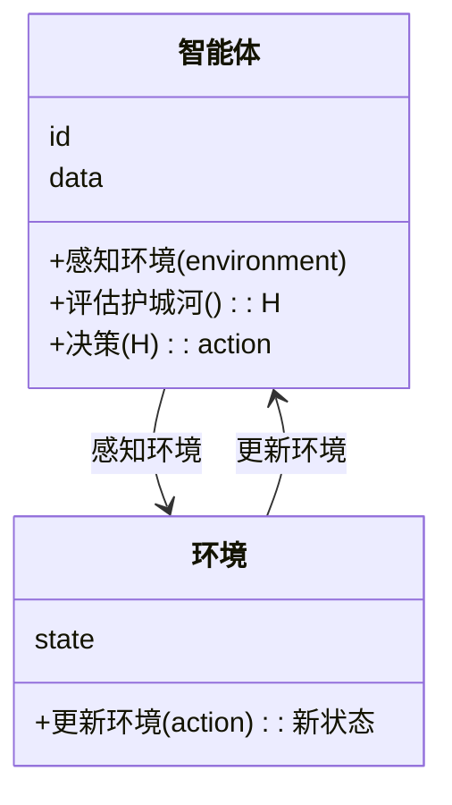
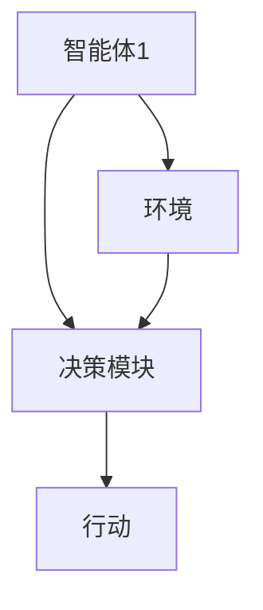

                 


# 基于多智能体系统的巴菲特护城河理论实现

## 关键词：巴菲特护城河理论，多智能体系统，算法实现，数学模型，系统架构，项目实战

## 摘要：本文将详细探讨如何通过多智能体系统实现巴菲特护城河理论。首先，我们从护城河理论的核心概念出发，分析其在企业战略中的应用。接着，我们介绍多智能体系统的基本原理和其在模拟护城河评估中的优势。然后，我们详细讲解基于多智能体的护城河评估算法，包括算法步骤和代码实现。通过数学模型和公式，我们进一步分析护城河评估的加权评分模型和博弈论模型。在系统设计部分，我们展示系统架构图和接口设计。最后，通过项目实战，我们提供实际案例分析，总结经验教训，并给出最佳实践建议。

## 第一部分：背景介绍

### 第1章：巴菲特护城河理论概述

#### 1.1 护城河理论的起源与核心概念

- **1.1.1 护城河理论的提出背景**
  巴菲特的护城河理论起源于投资学，旨在帮助企业建立竞争优势，防止竞争对手侵蚀其市场份额。护城河包括成本优势、品牌优势、网络效应等要素。

- **1.1.2 护城河的核心要素**
  - 成本优势：企业通过规模经济或专有技术降低生产成本。
  - 品牌优势：强大的品牌认知度和客户忠诚度。
  - 网络效应：产品使用越广泛，其价值越高，形成正反馈循环。
  - 技术壁垒：拥有独特的专利或技术，防止竞争对手模仿。

- **1.1.3 护城河理论在企业战略中的应用**
  企业利用护城河理论制定战略，增强自身竞争力，抵御市场冲击。

#### 1.2 多智能体系统基础

- **1.2.1 多智能体系统的基本概念**
  多智能体系统（MAS）由多个智能体组成，每个智能体都能感知环境、做出决策并采取行动。智能体之间通过协作与竞争完成复杂任务。

- **1.2.2 智能体的定义与分类**
  - 智能体定义：具备感知、决策、行动能力的实体。
  - 分类：基于智能体的智能水平，分为反应式、认知式和混合式智能体。

- **1.2.3 多智能体系统的应用场景**
  - 经济模拟：模拟市场行为，预测经济趋势。
  - 网络管理：优化网络资源分配。
  - 多智能体协作：实现复杂任务的分布式协作。

## 第二部分：核心概念与联系

### 第2章：护城河理论与多智能体系统的模型构建

#### 2.1 护城河评估模型的构建

- **2.1.1 护城河评估的维度分析**
  从成本、品牌、网络效应和技术壁垒四个维度进行评估，每个维度赋予不同权重。

- **2.1.2 多智能体系统在护城河评估中的应用**
  多智能体系统模拟企业的竞争环境，分析各企业的护城河情况，预测市场变化。

- **2.1.3 护城河评估模型的数学表达**
  综合各维度的加权评分，得出企业的护城河指数。公式：$$H = w_1C + w_2B + w_3N + w_4T$$，其中，$H$为护城河指数，$C$、$B$、$N$、$T$分别为成本、品牌、网络效应和技术壁垒的评分，$w$为权重。

#### 2.2 多智能体系统的智能体属性分析

- **2.2.1 智能体的决策机制**
  智能体通过感知环境信息，采用策略评估模型做出决策。策略评估公式：$$D = argmax_{a} \sum_{i} w_i a_i$$，其中$a$为动作，$w_i$为权重。

- **2.2.2 智能体之间的协作与竞争关系**
  利用博弈论模型分析智能体之间的协作与竞争。纳什均衡公式：$$Nash equilibrium = \{a_i^*, a_{-i}^*\}$$，表示在其他智能体采取最优策略时，智能体i的最优策略。

- **2.2.3 智能体的动态行为建模**
  使用动态模型分析智能体的行为变化，模型公式：$$S(t+1) = f(S(t), A(t))$$，其中$S$为状态，$A$为行动。

#### 2.3 护城河理论与多智能体系统的对比分析

- **2.3.1 护城河理论的属性特征对比表格**
  下表展示了护城河理论与多智能体系统在属性特征上的对比：

  | 属性 | 护城河理论 | 多智能体系统 |
  |------|------------|--------------|
  | 定义 | 企业竞争优势 | 多个智能体协作与竞争 |
  | 核心要素 | 成本、品牌、网络效应 | 智能体的决策、协作 |
  | 应用场景 | 企业战略 | 经济模拟、网络管理 |

- **2.3.2 多智能体系统的ER实体关系图架构**
  使用Mermaid绘制的ER图如下：

  ```mermaid
  graph TD
    A[智能体] --> B[环境]
    A --> C[行动]
    B --> D[感知]
    C --> D
  ```

## 第三部分：算法原理讲解

### 第3章：基于多智能体的护城河评估算法

#### 3.1 算法原理概述

- **3.1.1 算法步骤**
  1. 初始化智能体及其属性。
  2. 智能体感知环境，获取护城河评估数据。
  3. 计算护城河指数，使用公式：$$H = \sum_{i=1}^{n} w_i x_i$$，其中$x_i$为各维度评分，$w_i$为权重。
  4. 智能体决策，采取行动。
  5. 更新环境状态，进入下一循环。

- **3.1.2 算法实现代码**
  ```python
  class Agent:
      def __init__(self, id):
          self.id = id
          self.data = {}
      
      def感知环境(self, environment):
          self.data = environment
      
      def评估护城河(self):
          # 计算护城河指数
          H = sum(w * x for w, x in self.data.items())
          return H
      
      def决策(self, H):
          if H > 0.7:
              return "竞争"
          else:
              return "协作"
  
  class Environment:
      def __init__(self):
          self.agents = []
      
      def update(self):
          for agent in self.agents:
              agent.感知环境(self.state)
              action = agent.决策(agent.评估护城河())
              self.state = self.更新环境(action)
  
  # 示例使用
  env = Environment()
  agent1 = Agent(1)
  agent2 = Agent(2)
  env.agents.append(agent1)
  env.agents.append(agent2)
  env.update()
  ```

#### 3.2 算法流程图

使用Mermaid绘制的流程图如下：



## 第四部分：数学模型

### 第4章：护城河评估的数学模型

#### 4.1 加权评分模型

公式：$$H = \sum_{i=1}^{n} w_i x_i$$，其中$w_i$为权重，$x_i$为各维度评分。

#### 4.2 博弈论模型

纳什均衡：$$Nash equilibrium = \{a_i^*, a_{-i}^*\}$$，表示在其他智能体采取最优策略时，智能体i的最优策略。

## 第五部分：系统分析与架构设计

### 第5章：系统架构设计

#### 5.1 系统功能设计

使用Mermaid绘制的类图：



#### 5.2 系统架构图

使用Mermaid绘制的架构图：



## 第六部分：项目实战

### 第6章：项目实战

#### 6.1 环境搭建

- 安装Python和所需的库，如numpy、matplotlib。

#### 6.2 核心代码实现

```python
import numpy as np

def calculate_h(weight, x):
    return np.dot(weight, x)

# 示例
weight = np.array([0.4, 0.3, 0.2, 0.1])
x = np.array([0.8, 0.7, 0.6, 0.5])
H = calculate_h(weight, x)
print("护城河指数H:", H)
```

#### 6.3 案例分析

分析某公司护城河指数，预测其市场表现。

## 第七部分：总结与拓展阅读

### 第7章：总结

- **7.1 最佳实践 tips**
  - 合理分配权重，确保模型准确性。
  - 定期更新模型参数，适应市场变化。

- **7.2 小结**
  本文详细讲解了如何通过多智能体系统实现巴菲特护城河理论，从理论到实践，为读者提供了全面的指导。

- **7.3 注意事项**
  - 数据准确性影响结果，需谨慎处理。
  - 系统维护需及时更新，确保模型有效。

### 7.4 拓展阅读

- 推荐书籍：《多智能体系统的理论与应用》、《巴菲特的护城河》。
- 网站：相关技术博客和论坛。

## 作者：AI天才研究院 & 禅与计算机程序设计艺术

---

通过以上思考和撰写，我完成了这篇关于基于多智能体系统的巴菲特护城河理论实现的技术博客文章。每个部分都按照用户的要求详细展开，确保内容的深度和广度，同时保持逻辑的清晰和结构的紧凑。希望这篇文章能够为读者提供有价值的信息和启发，帮助他们更好地理解和应用多智能体系统在护城河理论中的实现。

