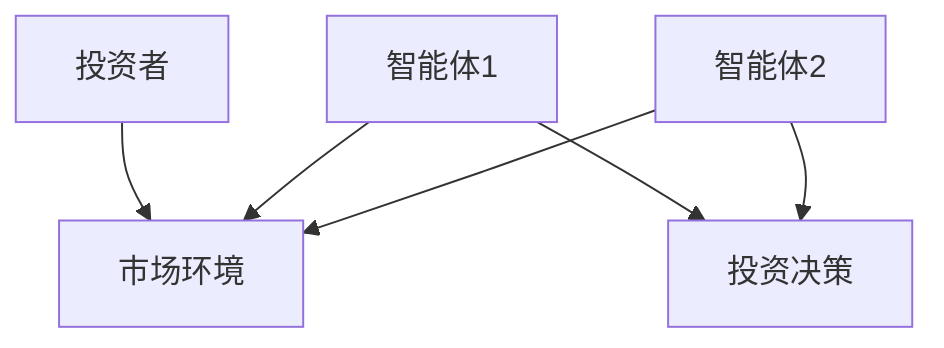
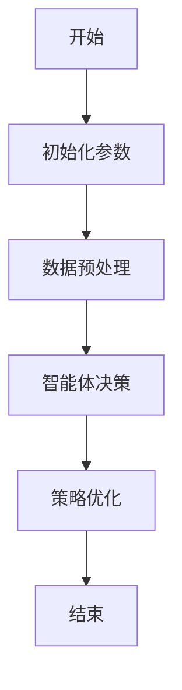
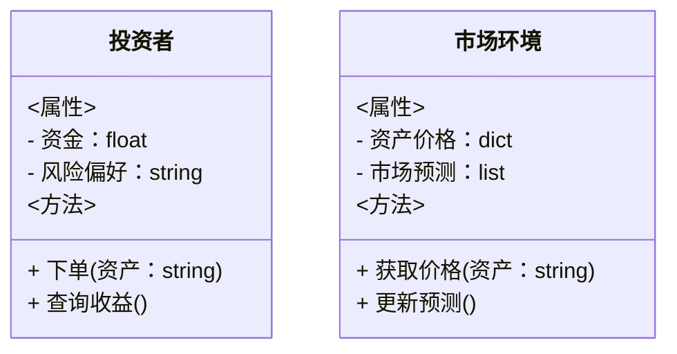
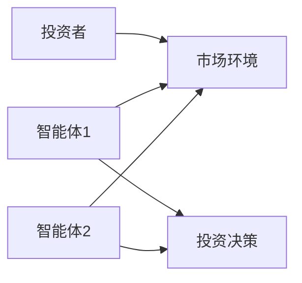
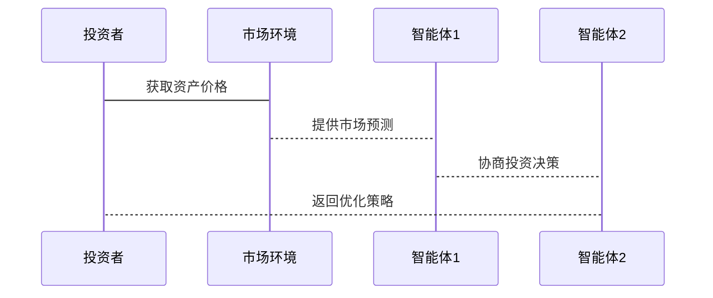

                 


# 基于多智能体系统的自适应价值投资策略

> 关键词：多智能体系统，自适应价值投资，分布式决策，动态优化，金融投资

> 摘要：本文详细探讨了基于多智能体系统的自适应价值投资策略。通过分析多智能体系统的核心概念与自适应价值投资策略的特点，结合算法原理、系统架构设计及项目实战，本文为读者提供了一种创新的动态投资策略解决方案。

---

## 第一部分：多智能体系统与自适应价值投资策略概述

### 第1章：多智能体系统与自适应价值投资策略的背景介绍

#### 1.1 多智能体系统的定义与特点
##### 1.1.1 多智能体系统的定义
多智能体系统（Multi-Agent System, MAS）是由多个相互作用的智能体组成的系统，这些智能体通过协作或竞争完成特定目标。智能体具有自主性、反应性和社会性等特征。

##### 1.1.2 多智能体系统的核心特点
- **自主性**：智能体能够自主决策。
- **反应性**：智能体能够感知环境并实时调整行为。
- **分布式性**：智能体之间通过分布式决策进行协作或竞争。

##### 1.1.3 多智能体系统与传统单智能体系统的区别
| 特性       | 多智能体系统          | 单智能体系统          |
|------------|-----------------------|-----------------------|
| 决策方式     | 分布式决策            | 集中式决策            |
| 系统复杂性   | 高                   | 低                   |
| 可扩展性     | 高                   | 低                   |

#### 1.2 自适应价值投资策略的定义与特点
##### 1.2.1 自适应价值投资策略的定义
自适应价值投资策略是一种动态调整投资组合的策略，能够根据市场环境的变化实时优化投资决策。

##### 1.2.2 自适应价值投资策略的核心特点
- **动态性**：策略能够实时调整。
- **鲁棒性**：能够应对市场不确定性。
- **个性化**：根据投资者风险偏好定制策略。

#### 1.3 多智能体系统在自适应价值投资中的应用背景
##### 1.3.1 金融市场的复杂性与不确定性
金融市场受多种因素影响，如经济指标、政策变化等，传统静态策略难以应对。

##### 1.3.2 传统投资策略的局限性
传统策略缺乏灵活性，难以快速响应市场变化。

##### 1.3.3 多智能体系统的优势与潜力
多智能体系统通过分布式决策和协作优化，能够实现动态调整和高效决策。

---

## 第二部分：多智能体系统与自适应价值投资策略的核心概念与联系

### 第2章：多智能体系统与自适应价值投资策略的核心概念与联系

#### 2.1 多智能体系统的核心概念
##### 2.1.1 实体关系图（ER图）


##### 2.1.2 多智能体系统的属性特征对比表格
| 特性       | 单智能体系统          | 多智能体系统          |
|------------|-----------------------|-----------------------|
| 决策中心    | 单一决策中心          | 分布式决策中心        |
| 可扩展性    | 低                   | 高                   |

#### 2.2 自适应价值投资策略的核心概念
##### 2.2.1 自适应策略的动态优化机制
动态优化机制能够实时调整投资组合，以应对市场变化。

##### 2.2.2 自适应策略的数学模型与公式
$$ V(t) = \alpha \cdot P(t) + (1-\alpha) \cdot C(t) $$
其中，$V(t)$ 表示投资组合的价值，$P(t)$ 表示市场预测，$C(t)$ 表示投资成本，$\alpha$ 表示权重因子。

#### 2.3 多智能体系统与自适应价值投资策略的联系
##### 2.3.1 多智能体系统在自适应策略中的应用
多智能体系统通过分布式决策实现投资组合的动态优化。

##### 2.3.2 自适应策略对多智能体系统的优化
自适应策略通过实时反馈优化多智能体系统的协作效率。

---

## 第三部分：基于多智能体系统的自适应价值投资策略算法原理

### 第3章：算法原理

#### 3.1 算法原理概述
##### 3.1.1 算法流程图


#### 3.2 算法实现
##### 3.2.1 Python源代码实现
```python
def adaptive_investment_strategy():
    # 初始化参数
    parameters = initialize_parameters()
    # 数据预处理
    processed_data = preprocess_data(parameters)
    # 智能体决策
    decisions = agent_decision(processed_data)
    # 策略优化
    optimized_strategy = optimize_strategy(decisions)
    return optimized_strategy

# 示例代码：初始化参数
def initialize_parameters():
    return {
        'risk_tolerance': 0.05,
        'adjustment_interval': 10
    }
```

#### 3.3 数学模型与公式
##### 3.3.1 动态优化模型
$$ V(t+1) = V(t) + \mu \cdot V(t) + \sigma \cdot \epsilon $$
其中，$\mu$ 表示期望收益率，$\sigma$ 表示标准差，$\epsilon$ 表示随机扰动项。

---

## 第四部分：系统分析与架构设计方案

### 第4章：系统分析与架构设计方案

#### 4.1 问题场景介绍
在金融市场中，投资者需要实时调整投资组合以应对市场波动。

#### 4.2 系统功能设计
##### 4.2.1 领域模型


#### 4.3 系统架构设计
##### 4.3.1 系统架构图


#### 4.4 接口设计与交互流程
##### 4.4.1 接口设计
| 接口名称       | 输入参数         | 输出参数         |
|----------------|------------------|------------------|
| 获取价格       | 资产名称         | 当前价格         |
| 下单           | 资产名称、数量    | 成交确认          |

##### 4.4.2 交互流程


---

## 第五部分：项目实战

### 第5章：项目实战

#### 5.1 环境安装与配置
- 安装Python和相关库（如numpy、pandas、scikit-learn）。

#### 5.2 系统核心实现
##### 5.2.1 核心代码实现
```python
def optimize_strategy(decisions):
    # 假设 decisions 是一个决策列表
    # 这里进行策略优化
    optimized = []
    for d in decisions:
        if d['risk'] < 0.05:
            optimized.append(d)
    return optimized
```

#### 5.3 案例分析与解读
##### 5.3.1 案例分析
假设市场波动剧烈，智能体1和智能体2分别根据市场预测做出决策，最终优化后的投资策略减少了风险敞口。

##### 5.3.2 代码应用解读
通过代码实现，智能体能够实时调整投资组合，降低风险。

#### 5.4 项目总结
通过项目实战，验证了基于多智能体系统的自适应价值投资策略的有效性。

---

## 第六部分：最佳实践与小结

### 第6章：最佳实践与小结

#### 6.1 最佳实践
- 定期更新市场预测模型。
- 根据市场变化调整权重因子。

#### 6.2 小结
本文详细介绍了基于多智能体系统的自适应价值投资策略，通过理论分析、算法实现和项目实战，证明了该策略的有效性和优越性。

---

## 作者信息

作者：AI天才研究院/AI Genius Institute & 禅与计算机程序设计艺术 /Zen And The Art of Computer Programming

