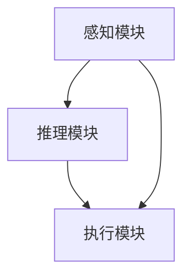
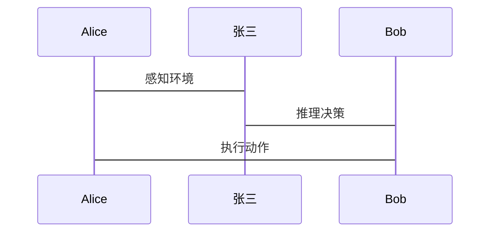

                 


# 基于神经符号AI的AI Agent可解释性决策

**关键词**：神经符号AI、AI Agent、可解释性决策、符号逻辑、神经网络

**摘要**：  
本文探讨了基于神经符号AI的AI Agent在可解释性决策方面的重要性和实现方法。通过结合神经网络和符号逻辑，神经符号AI为AI Agent提供了强大的推理能力和可解释的决策过程。本文从神经符号AI的基本原理、AI Agent的结构、可解释性决策方法、实际项目案例以及未来研究方向等多个方面展开分析，详细阐述了神经符号AI在实现AI Agent可解释性决策中的应用和优势。

---

## 第一部分：神经符号AI与AI Agent概述

### 第1章：神经符号AI的基本概念

#### 1.1 神经符号AI的定义  
神经符号AI是一种结合了神经网络和符号逻辑的人工智能方法。它通过将符号逻辑嵌入到神经网络中，实现了感知与推理的结合，从而在复杂环境中做出可解释的决策。

#### 1.2 神经符号AI的核心特点  
- **可解释性**：通过符号逻辑提供决策的透明性。  
- **灵活性**：能够处理复杂的感知数据。  
- **可扩展性**：适用于多种应用场景。  

#### 1.3 神经符号AI与传统符号AI的区别  
| 特性 | 神经符号AI | 传统符号AI |
|------|------------|------------|
| 数据处理能力 | 强 | 弱 |
| 可解释性 | 高 | 极高 |
| 复杂任务处理 | 优 | 一般 |

### 第2章：AI Agent的基本概念

#### 2.1 AI Agent的定义  
AI Agent是一个能够感知环境、自主决策并执行动作的智能体。它可以分为任务型和反应型Agent，分别适用于不同的应用场景。

#### 2.2 AI Agent的分类  
- **任务型Agent**：基于目标进行规划和决策。  
- **反应型Agent**：基于实时感知做出反应。  

#### 2.3 AI Agent的核心功能  
- 感知环境：通过传感器获取信息。  
- 推理与决策：基于符号逻辑和神经网络进行推理。  
- 执行动作：根据决策结果执行操作。  

---

## 第二部分：神经符号AI的核心原理

### 第3章：神经符号AI的核心原理

#### 3.1 符号逻辑与神经网络的结合  
神经符号AI通过将符号逻辑嵌入到神经网络中，结合了符号推理和神经网络的感知能力。例如，符号逻辑用于规则编码，神经网络用于处理非结构化数据。

#### 3.2 符号表示与神经网络的融合  
符号表示为神经网络提供了明确的规则，而神经网络则为符号逻辑提供了强大的感知能力。这种融合使得AI Agent能够处理复杂环境中的不确定性。

#### 3.3 神经符号AI的优缺点  
| 特性 | 优点 | 缺点 |
|------|------|------|
| 可解释性 | 高 | 较差于传统符号AI |
| 复杂任务处理 | 优 | 算法复杂度高 |
| 应用场景 | 广泛 | 开发难度大 |

---

## 第三部分：可解释性决策的方法

### 第4章：可解释性决策的方法

#### 4.1 符号表示的可视化  
通过符号表示的可视化，用户可以直观地理解AI Agent的决策逻辑。例如，使用图示展示符号规则的应用过程。

#### 4.2 逻辑推理的记录  
记录AI Agent在决策过程中使用的逻辑推理步骤，有助于用户理解决策背后的逻辑。例如，使用日志记录每一步推理过程。

#### 4.3 决策过程的可追溯性  
通过可追溯性技术，用户可以回溯AI Agent的决策过程，分析每个决策的依据。例如，使用审计日志记录每一步决策的输入和输出。

---

## 第四部分：基于神经符号AI的决策算法

### 第5章：基于神经符号AI的决策算法

#### 5.1 符号增强的神经网络  
符号增强的神经网络通过将符号逻辑嵌入到神经网络中，增强了网络的推理能力。例如，将符号规则编码为网络的权重。

#### 5.2 符号推理网络  
符号推理网络通过符号逻辑进行推理，然后将结果反馈给神经网络，以调整决策过程。例如，使用逻辑推理网络进行路径规划。

#### 5.3 可解释性决策算法的实现  
通过可解释性决策算法，AI Agent能够在复杂环境中做出可解释的决策。例如，使用符号逻辑和神经网络结合的方法，实现任务型Agent的决策。

---

## 第五部分：系统架构与实现

### 第6章：系统架构设计

#### 6.1 系统功能设计  
系统功能设计包括感知模块、推理模块和执行模块。例如，感知模块通过传感器获取环境信息，推理模块基于符号逻辑进行推理，执行模块根据决策结果执行动作。

#### 6.2 系统架构图  
使用Mermaid图展示系统架构，包括感知、推理和执行模块之间的交互关系。例如：



#### 6.3 系统接口设计  
系统接口设计包括感知模块与推理模块的接口、推理模块与执行模块的接口。例如，感知模块向推理模块传递环境信息，推理模块向执行模块传递决策结果。

#### 6.4 系统交互流程图  
使用Mermaid图展示系统交互流程，包括感知、推理和执行的步骤。例如：



---

## 第六部分：项目实战

### 第7章：项目实战

#### 7.1 项目介绍  
项目介绍包括项目目标、项目背景和项目意义。例如，本项目旨在研究神经符号AI在可解释性决策中的应用，解决传统AI Agent在复杂环境中的决策问题。

#### 7.2 核心代码实现  
核心代码实现包括符号逻辑的编码、神经网络的构建和决策算法的实现。例如：

```python
# 符号逻辑编码
def symbol_rules(inputs):
    if inputs['条件1'] and inputs['条件2']:
        return '规则1'
    elif inputs['条件3'] or inputs['条件4']:
        return '规则2'
    else:
        return '规则3'

# 神经网络构建
import tensorflow as tf
from tensorflow.keras import layers

model = tf.keras.Sequential([
    layers.Dense(64, activation='relu', input_dim=64),
    layers.Dense(1, activation='sigmoid')
])

# 决策算法实现
def decision_making(inputs):
    symbol_output = symbol_rules(inputs)
    neural_output = model.predict(inputs)
    if neural_output > 0.5 and symbol_output == '规则1':
        return '动作1'
    elif neural_output > 0.5 and symbol_output == '规则2':
        return '动作2'
    else:
        return '动作3'
```

#### 7.3 项目总结  
通过项目实战，我们可以看到神经符号AI在可解释性决策中的实际应用，验证了其有效性和优势。

---

## 第七部分：总结与展望

### 第8章：总结与展望

#### 8.1 本章总结  
神经符号AI为AI Agent提供了强大的推理能力和可解释的决策过程，解决了传统神经网络和符号AI的局限性。

#### 8.2 未来研究方向  
未来的研究方向包括优化神经符号AI的算法、扩展应用场景以及提升系统的实时性。例如，研究如何降低神经符号AI的计算成本，使其适用于更多场景。

---

## 作者信息

作者：AI天才研究院 & 禅与计算机程序设计艺术

---

**结语**：  
神经符号AI为AI Agent的可解释性决策提供了新的思路，通过结合神经网络和符号逻辑，实现了感知与推理的结合。未来，随着神经符号AI技术的不断发展，AI Agent将在更多领域展现出强大的应用潜力。

