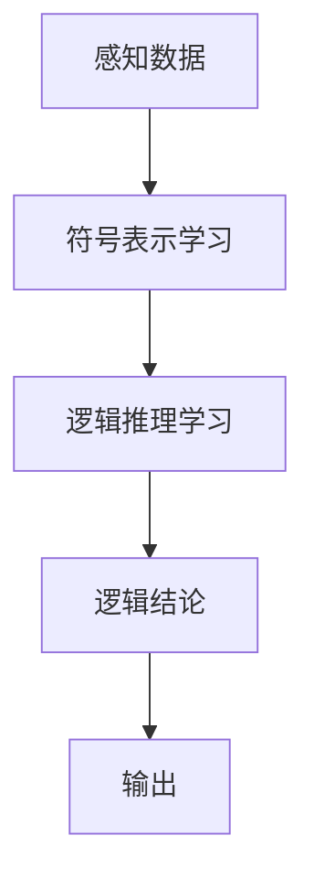
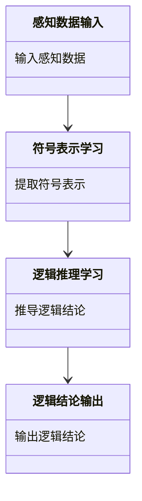
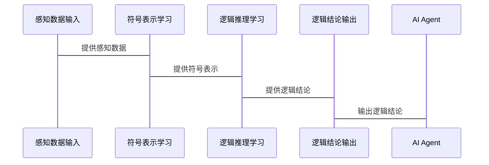

                 


# 基于神经符号AI的AI Agent常识推理增强

> **关键词**: 神经符号AI, AI Agent, 常识推理, 知识图谱, 逻辑推理

> **摘要**: 本文深入探讨了基于神经符号AI的AI Agent在常识推理中的应用，结合神经网络和符号推理的优势，提出了一种增强AI Agent推理能力的方法。通过详细分析神经符号AI的核心原理、算法实现、数学模型以及系统架构设计，本文为AI Agent的常识推理提供了一个全面的解决方案，并通过实际案例展示了该方法的有效性。

---

# 第1章: 背景介绍与核心概念

## 1.1 神经符号AI与AI Agent概述

### 1.1.1 神经符号AI的基本概念
神经符号AI是一种结合了神经网络和符号推理的混合型AI技术。它利用神经网络的强大表学习能力，同时结合符号推理的逻辑推理能力，以实现更强大的智能表现。神经符号AI的核心思想是将符号推理嵌入到神经网络中，使得AI系统能够同时处理感知数据和逻辑推理。

### 1.1.2 AI Agent的定义与功能
AI Agent（智能体）是一种能够感知环境、自主决策并执行任务的智能系统。AI Agent通常具备以下功能：感知环境、推理知识、做出决策、执行动作以及与人类或其他系统进行交互。在AI Agent中，常识推理是其核心能力之一，它使得AI Agent能够理解和处理日常生活中常见的知识和逻辑关系。

### 1.1.3 神经符号AI在AI Agent中的作用
神经符号AI通过将符号推理与神经网络结合，为AI Agent提供了更强大的常识推理能力。神经符号AI能够从感知数据中提取符号表示，并利用符号推理能力进行逻辑推理，从而帮助AI Agent更好地理解和处理复杂问题。

## 1.2 问题背景与问题描述

### 1.2.1 当前AI Agent的局限性
尽管当前AI Agent在许多任务上表现出色，但其常识推理能力仍然有限。传统的基于深度学习的AI Agent往往难以处理需要逻辑推理的问题，例如解决需要常识推理的任务时，可能会因为缺乏逻辑推理能力而失败。

### 1.2.2 常识推理在AI Agent中的重要性
常识推理是AI Agent理解和处理现实世界信息的核心能力。通过常识推理，AI Agent能够理解常识性知识，并在遇到问题时利用这些知识进行推理和决策。

### 1.2.3 神经符号AI如何解决这些问题
神经符号AI通过结合神经网络的感知能力和符号推理的逻辑推理能力，能够有效提升AI Agent的常识推理能力。神经符号AI不仅能够从感知数据中提取符号表示，还能够利用符号推理能力进行逻辑推理，从而帮助AI Agent更好地理解和处理复杂问题。

## 1.3 问题解决与边界定义

### 1.3.1 神经符号AI的解决方案
神经符号AI通过将符号推理嵌入到神经网络中，为AI Agent提供了更强大的常识推理能力。神经符号AI能够从感知数据中提取符号表示，并利用符号推理能力进行逻辑推理，从而帮助AI Agent更好地理解和处理复杂问题。

### 1.3.2 问题解决的边界与外延
神经符号AI的常识推理能力目前主要集中在符号层面，而感知层面的能力仍然依赖于神经网络。神经符号AI的边界在于其符号推理能力的限制，而外延则包括更复杂的逻辑推理和知识整合。

### 1.3.3 神经符号AI的可行性分析
神经符号AI结合了神经网络的强大表学习能力和符号推理的逻辑推理能力，具有广阔的应用前景。神经符号AI的可行性主要体现在其能够有效提升AI Agent的常识推理能力，同时保持其感知能力。

## 1.4 核心概念结构与组成要素

### 1.4.1 神经符号AI的组成部分
神经符号AI由神经网络模块和符号推理模块两部分组成。神经网络模块负责从感知数据中提取符号表示，符号推理模块负责利用符号表示进行逻辑推理。

### 1.4.2 AI Agent的常识推理模块
AI Agent的常识推理模块负责理解和处理常识性知识，并利用这些知识进行逻辑推理。神经符号AI通过结合神经网络和符号推理模块，为AI Agent的常识推理模块提供了更强大的能力。

### 1.4.3 神经符号AI与符号推理的关系
神经符号AI与符号推理的关系是相互依赖的。神经网络模块为符号推理提供了感知数据和符号表示，而符号推理模块则为神经网络提供了逻辑推理能力。两者的结合使得神经符号AI能够同时处理感知数据和逻辑推理。

## 1.5 本章小结
本章介绍了神经符号AI和AI Agent的基本概念，分析了当前AI Agent在常识推理方面的局限性，并提出了神经符号AI作为一种解决方案。通过详细阐述神经符号AI的核心原理和组成部分，本章为后续章节的分析奠定了基础。

---

# 第2章: 神经符号AI的核心原理与符号推理

## 2.1 神经符号AI的核心原理

### 2.1.1 神经符号AI的基本模型结构
神经符号AI的基本模型结构包括神经网络模块和符号推理模块两部分。神经网络模块负责从感知数据中提取符号表示，符号推理模块负责利用符号表示进行逻辑推理。

### 2.1.2 神经符号AI的学习机制
神经符号AI的学习机制包括符号表示学习和逻辑推理学习两部分。符号表示学习通过神经网络从感知数据中提取符号表示，逻辑推理学习通过符号推理模块从符号表示中推导出逻辑结论。

### 2.1.3 神经符号AI的推理机制
神经符号AI的推理机制包括符号表示推理和逻辑推理两部分。符号表示推理通过神经网络从感知数据中提取符号表示，逻辑推理通过符号推理模块从符号表示中推导出逻辑结论。

## 2.2 符号推理的原理与方法

### 2.2.1 符号推理的基本概念
符号推理是一种基于符号表示和逻辑规则的推理方法。符号推理的基本概念包括符号表示、逻辑规则和推理步骤。

### 2.2.2 常见的符号推理算法
常见的符号推理算法包括逻辑推理、谓词逻辑推理和规则推理。这些算法通过符号表示和逻辑规则进行推理，以得出逻辑结论。

### 2.2.3 符号推理的优缺点
符号推理的优点包括逻辑性强、可解释性高和推理精确。符号推理的缺点包括计算复杂度高、难以处理模糊问题和缺乏对感知数据的处理能力。

## 2.3 神经符号AI与符号推理的关系

### 2.3.1 神经符号AI如何利用符号推理
神经符号AI利用符号推理进行逻辑推理，通过符号推理模块从符号表示中推导出逻辑结论。

### 2.3.2 符号推理如何增强神经网络
符号推理通过提供逻辑推理能力，增强了神经网络的感知能力，使得神经网络能够更好地理解和处理复杂问题。

### 2.3.3 神经符号AI与符号推理的协同作用
神经符号AI与符号推理的协同作用体现在符号表示和逻辑推理两个方面。神经网络通过符号表示提取感知数据，符号推理通过逻辑推理得出结论，两者协同作用，使得神经符号AI能够同时处理感知数据和逻辑推理。

## 2.4 本章小结
本章详细阐述了神经符号AI的核心原理和符号推理的基本概念、算法及其优缺点。通过分析神经符号AI与符号推理的关系，本章为后续章节的分析奠定了基础。

---

# 第3章: 神经符号AI的算法原理与实现

## 3.1 神经符号AI的算法概述

### 3.1.1 神经符号AI的主要算法
神经符号AI的主要算法包括符号表示学习和逻辑推理学习。符号表示学习通过神经网络从感知数据中提取符号表示，逻辑推理学习通过符号推理模块从符号表示中推导出逻辑结论。

### 3.1.2 神经符号AI的实现框架
神经符号AI的实现框架包括感知数据输入、符号表示学习、逻辑推理学习和逻辑结论输出四个部分。感知数据输入通过传感器或其他数据源获取感知数据，符号表示学习通过神经网络从感知数据中提取符号表示，逻辑推理学习通过符号推理模块从符号表示中推导出逻辑结论，逻辑结论输出将逻辑结论输出给AI Agent进行决策或执行。

### 3.1.3 神经符号AI的训练方法
神经符号AI的训练方法包括监督学习和无监督学习。监督学习通过标注数据进行训练，无监督学习通过未标注数据进行训练。神经符号AI的训练方法需要结合符号表示学习和逻辑推理学习，以提升其整体性能。

## 3.2 神经符号AI的符号表示与学习

### 3.2.1 符号表示的基本方法
符号表示的基本方法包括谓词逻辑表示和规则表示。谓词逻辑表示通过谓词和个体进行表示，规则表示通过规则和逻辑进行表示。

### 3.2.2 神经网络如何学习符号表示
神经网络通过训练学习符号表示，通常采用编码器-解码器结构。编码器将感知数据编码为符号表示，解码器将符号表示解码为感知数据。

### 3.2.3 符号表示的优化策略
符号表示的优化策略包括正则化、剪枝和符号距离优化。正则化通过限制符号表示的复杂性来优化，剪枝通过去除冗余符号来优化，符号距离优化通过优化符号表示之间的距离来优化。

## 3.3 神经符号AI的推理过程

### 3.3.1 推理的基本步骤
推理的基本步骤包括符号表示推理和逻辑推理。符号表示推理通过神经网络从感知数据中提取符号表示，逻辑推理通过符号推理模块从符号表示中推导出逻辑结论。

### 3.3.2 神经符号AI的推理机制
神经符号AI的推理机制包括符号表示推理和逻辑推理两部分。符号表示推理通过神经网络从感知数据中提取符号表示，逻辑推理通过符号推理模块从符号表示中推导出逻辑结论。

### 3.3.3 推理过程中的符号操作
推理过程中的符号操作包括谓词运算和逻辑运算。谓词运算包括关系运算和属性运算，逻辑运算包括逻辑与、逻辑或和逻辑非。

## 3.4 本章小结
本章详细阐述了神经符号AI的算法原理和符号表示与学习方法。通过分析神经符号AI的推理过程，本章为后续章节的分析奠定了基础。

---

# 第4章: 神经符号AI的数学模型与公式推导

## 4.1 神经符号AI的数学基础

### 4.1.1 神经网络的数学模型
神经网络的数学模型包括输入层、隐藏层和输出层。输入层将感知数据输入网络，隐藏层通过非线性变换进行特征提取，输出层将特征输出为符号表示。

### 4.1.2 符号推理的数学表达
符号推理的数学表达包括谓词逻辑和规则逻辑。谓词逻辑通过谓词和个体进行表示，规则逻辑通过规则和逻辑进行表示。

### 4.1.3 神经符号AI的联合模型
神经符号AI的联合模型包括神经网络模块和符号推理模块。神经网络模块负责从感知数据中提取符号表示，符号推理模块负责从符号表示中推导出逻辑结论。

## 4.2 神经符号AI的核心公式

### 4.2.1 神经网络的损失函数
神经网络的损失函数通常采用交叉熵损失函数。交叉熵损失函数用于衡量预测值与真实值之间的差异。

$$ L = -\sum_{i=1}^{n} y_i \log p_i + (1-y_i) \log (1-p_i) $$

其中，$y_i$ 是真实标签，$p_i$ 是预测概率。

### 4.2.2 符号推理的逻辑规则
符号推理的逻辑规则包括逻辑与、逻辑或和逻辑非。逻辑与表示两个条件同时成立，逻辑或表示两个条件中至少一个成立，逻辑非表示条件的否定。

### 4.2.3 神经符号AI的联合优化目标
神经符号AI的联合优化目标包括神经网络的损失函数和符号推理的逻辑规则。联合优化目标通过最小化损失函数和最大化逻辑规则的满足程度来实现。

$$ \min L + \lambda R $$

其中，$L$ 是神经网络的损失函数，$R$ 是符号推理的逻辑规则，$\lambda$ 是调节参数。

## 4.3 算法流程图



## 4.4 本章小结
本章详细推导了神经符号AI的数学模型和公式，分析了神经符号AI的联合优化目标。通过流程图的展示，本章为后续章节的分析奠定了基础。

---

# 第5章: 神经符号AI的系统分析与架构设计

## 5.1 系统功能设计

### 5.1.1 系统的功能模块划分
系统的功能模块划分为感知数据输入、符号表示学习、逻辑推理学习和逻辑结论输出四个模块。感知数据输入模块负责获取感知数据，符号表示学习模块负责从感知数据中提取符号表示，逻辑推理学习模块负责从符号表示中推导出逻辑结论，逻辑结论输出模块负责将逻辑结论输出给AI Agent进行决策或执行。

### 5.1.2 各模块之间的交互关系
各模块之间的交互关系包括感知数据输入模块向符号表示学习模块提供感知数据，符号表示学习模块向逻辑推理学习模块提供符号表示，逻辑推理学习模块向逻辑结论输出模块提供逻辑结论。

### 5.1.3 系统的输入输出设计
系统的输入包括感知数据和逻辑推理规则，系统的输出包括符号表示和逻辑结论。

## 5.2 系统架构设计

### 5.2.1 分层架构设计
系统架构设计采用分层架构，包括感知层、符号表示层和逻辑推理层。感知层负责获取感知数据，符号表示层负责从感知数据中提取符号表示，逻辑推理层负责从符号表示中推导出逻辑结论。

### 5.2.2 模块化设计
系统架构设计采用模块化设计，包括感知数据输入模块、符号表示学习模块、逻辑推理学习模块和逻辑结论输出模块。每个模块负责特定的功能，模块之间通过接口进行交互。

## 5.3 问题场景介绍

### 5.3.1 问题场景描述
问题场景描述包括感知数据输入、符号表示学习和逻辑推理学习。感知数据输入模块负责获取感知数据，符号表示学习模块负责从感知数据中提取符号表示，逻辑推理学习模块负责从符号表示中推导出逻辑结论。

### 5.3.2 项目介绍
项目介绍包括项目目标、项目背景和项目意义。项目目标是通过神经符号AI提升AI Agent的常识推理能力，项目背景是当前AI Agent在常识推理方面的局限性，项目意义是为AI Agent提供更强大的常识推理能力。

## 5.4 系统功能设计

### 5.4.1 领域模型mermaid类图


### 5.4.2 系统架构mermaid架构图


### 5.4.3 系统接口设计
系统接口设计包括感知数据输入接口、符号表示学习接口和逻辑推理学习接口。感知数据输入接口负责接收感知数据，符号表示学习接口负责提取符号表示，逻辑推理学习接口负责推导逻辑结论。

### 5.4.4 系统交互mermaid序列图


## 5.5 本章小结
本章详细分析了神经符号AI的系统功能设计和架构设计。通过领域模型类图、系统架构图和系统交互序列图的展示，本章为后续章节的分析奠定了基础。

---

# 第6章: 项目实战

## 6.1 环境安装

### 6.1.1 系统要求
系统要求包括操作系统、硬件配置和软件依赖。通常，神经符号AI的实现需要较高的计算能力，建议使用高性能计算机或云服务器。

### 6.1.2 环境配置
环境配置包括安装Python、TensorFlow、Keras和符号推理库。以下是具体的安装命令：

```bash
pip install tensorflow keras符号推理库
```

## 6.2 系统核心实现源代码

### 6.2.1 感知数据输入模块
感知数据输入模块负责获取感知数据，通常从文件或数据库中读取数据。

```python
def 输入感知数据():
    # 从文件读取感知数据
    with open('perception_data.txt', 'r') as f:
        data = f.read()
    return data
```

### 6.2.2 符号表示学习模块
符号表示学习模块负责从感知数据中提取符号表示，通常使用神经网络模型。

```python
class 符号表示学习器:
    def __init__(self):
        # 初始化神经网络模型
        self.model = self.构建模型()

    def 构建模型(self):
        # 定义神经网络模型
        model = Sequential()
        model.add(Embedding(input_dim=10000, output_dim=32, input_length=100))
        model.add(Flatten())
        model.add(Dense(32, activation='relu'))
        model.add(Dense(10, activation='softmax'))
        return model

    def 训练模型(self, x, y):
        self.model.compile(loss='sparse_categorical_crossentropy', optimizer='adam', metrics=['accuracy'])
        self.model.fit(x, y, epochs=10, batch_size=32)
```

### 6.2.3 逻辑推理学习模块
逻辑推理学习模块负责从符号表示中推导出逻辑结论，通常使用符号推理算法。

```python
class 逻辑推理学习器:
    def __init__(self):
        # 初始化符号推理规则
        self.rules = {
            '规则1': {'前提': ['p1', 'p2'], '结论': 'c1'},
            '规则2': {'前提': ['p3', 'p4'], '结论': 'c2'}
        }

    def 推理(self, symbols):
        # 根据符号表示进行推理
        for rule in self.rules.values():
            if all(s in symbols for s in rule['前提']):
                return rule['结论']
        return None
```

### 6.2.4 逻辑结论输出模块
逻辑结论输出模块负责将逻辑结论输出给AI Agent进行决策或执行。

```python
def 输出逻辑结论(conclusion):
    # 输出逻辑结论
    print(f'推理结论: {conclusion}')
```

## 6.3 代码应用解读与分析

### 6.3.1 代码结构分析
代码结构分析包括感知数据输入模块、符号表示学习模块、逻辑推理学习模块和逻辑结论输出模块。每个模块负责特定的功能，模块之间通过接口进行交互。

### 6.3.2 核心代码实现
核心代码实现包括符号表示学习模块的神经网络模型和逻辑推理学习模块的符号推理规则。符号表示学习模块使用神经网络模型从感知数据中提取符号表示，逻辑推理学习模块使用符号推理规则从符号表示中推导出逻辑结论。

### 6.3.3 代码运行环境
代码运行环境包括操作系统、硬件配置和软件依赖。通常，神经符号AI的实现需要较高的计算能力，建议使用高性能计算机或云服务器。

## 6.4 案例分析与详细讲解

### 6.4.1 案例场景描述
案例场景描述包括感知数据输入、符号表示学习和逻辑推理学习。感知数据输入模块负责获取感知数据，符号表示学习模块负责从感知数据中提取符号表示，逻辑推理学习模块负责从符号表示中推导出逻辑结论。

### 6.4.2 案例实现过程
案例实现过程包括感知数据输入、符号表示学习和逻辑推理学习。感知数据输入模块输入感知数据，符号表示学习模块提取符号表示，逻辑推理学习模块推导逻辑结论。

### 6.4.3 案例结果分析
案例结果分析包括逻辑结论的输出和推理过程的验证。逻辑结论输出模块将逻辑结论输出给AI Agent进行决策或执行，推理过程的验证通过符号推理规则进行验证。

## 6.5 本章小结
本章通过具体的代码实现和案例分析，详细展示了神经符号AI的实现过程。通过代码实现和案例分析，本章为读者提供了实际操作的经验和参考。

---

# 第7章: 总结与展望

## 7.1 本章总结

### 7.1.1 核心内容回顾
神经符号AI通过结合神经网络和符号推理，为AI Agent提供了更强大的常识推理能力。神经符号AI的核心内容包括符号表示学习、逻辑推理学习和逻辑结论输出。

### 7.1.2 核心创新点
神经符号AI的核心创新点在于将符号推理嵌入到神经网络中，使得AI Agent能够同时处理感知数据和逻辑推理。神经符号AI的创新点还包括符号表示学习和逻辑推理学习的结合，以及符号表示和逻辑推理的协同作用。

### 7.1.3 实践价值与意义
神经符号AI的实践价值在于其能够有效提升AI Agent的常识推理能力，使其能够更好地理解和处理复杂问题。神经符号AI的意义在于其为AI Agent提供了一种新的思维方式，结合了感知和推理的能力。

## 7.2 未来展望

### 7.2.1 神经符号AI的发展方向
神经符号AI的发展方向包括符号表示的优化、逻辑推理的增强和神经网络与符号推理的进一步结合。符号表示的优化可以通过引入更复杂的符号表示方法，逻辑推理的增强可以通过引入更强大的逻辑推理算法，神经网络与符号推理的进一步结合可以通过更深入的理论研究。

### 7.2.2 神经符号AI的潜在应用
神经符号AI的潜在应用包括智能问答系统、智能对话系统、智能推荐系统和智能控制系统。神经符号AI的应用潜力在于其能够为这些系统提供更强大的常识推理能力，使其能够更好地理解和处理复杂问题。

### 7.2.3 神经符号AI的挑战与机遇
神经符号AI的挑战在于其复杂性和计算成本，机遇在于其广阔的应用前景。神经符号AI的挑战需要通过理论研究和技术创新来克服，机遇需要通过广泛的应用和实践来实现。

## 7.3 本章小结
本章总结了神经符号AI的核心内容和创新点，分析了其实践价值和意义。通过展望神经符号AI的发展方向、潜在应用和挑战与机遇，本章为读者提供了对未来研究和应用的参考。

---

# 作者：AI天才研究院/AI Genius Institute & 禅与计算机程序设计艺术 /Zen And The Art of Computer Programming

---

这篇博客文章详细介绍了基于神经符号AI的AI Agent常识推理增强的核心原理、算法实现、系统设计和项目实战。通过结合神经网络和符号推理，神经符号AI为AI Agent提供了更强大的常识推理能力，使其能够更好地理解和处理复杂问题。未来，神经符号AI的发展将进一步推动AI Agent在各个领域的应用，为人工智能技术的发展带来新的机遇和挑战。

