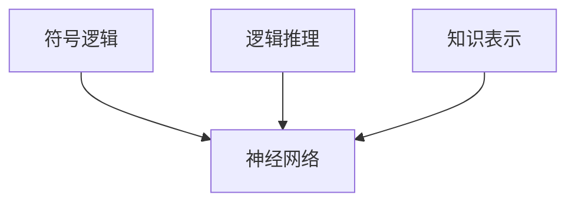
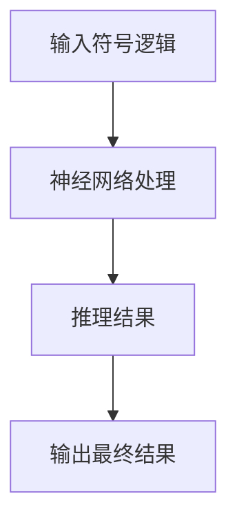
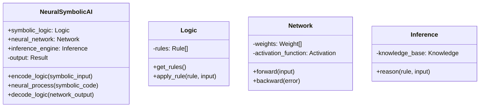
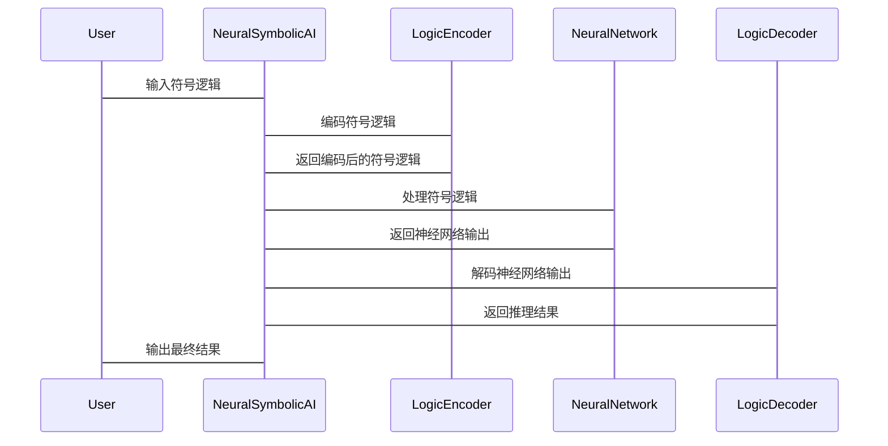

                 


# 基于神经符号AI的AI Agent逻辑推理

> 关键词：神经符号AI, AI Agent, 逻辑推理, 算法原理, 系统架构, 项目实战

> 摘要：本文详细探讨了基于神经符号AI的AI Agent逻辑推理技术。从神经符号AI的基本概念和AI Agent的定义入手，分析了神经符号AI在逻辑推理中的核心作用，重点讲解了神经符号AI的算法原理、系统架构设计、项目实战案例，最后总结了神经符号AI在AI Agent逻辑推理中的应用前景和未来发展方向。

---

# 第1章 神经符号AI与AI Agent的背景介绍

## 1.1 神经符号AI的基本概念

### 1.1.1 神经符号AI的定义
神经符号AI是一种结合了符号逻辑和神经网络的AI范式，旨在通过符号表示和神经网络的深度学习能力，实现更强大的逻辑推理和知识表示能力。

### 1.1.2 神经符号AI的核心要素
神经符号AI的核心要素包括符号逻辑、神经网络、逻辑推理和知识表示。这些要素的结合使得神经符号AI在复杂问题的解决中更具优势。

### 1.1.3 神经符号AI与传统符号AI的区别
神经符号AI与传统符号AI的主要区别在于其引入了神经网络的深度学习能力，能够处理非结构化数据并自动生成符号表示，而传统符号AI依赖于人工定义的规则和符号。

## 1.2 AI Agent的基本概念

### 1.2.1 AI Agent的定义
AI Agent是指在特定环境中能够感知环境、自主决策并执行任务的智能体。AI Agent的核心功能包括感知、推理、决策和执行。

### 1.2.2 AI Agent的核心功能
AI Agent的核心功能包括环境感知、逻辑推理、决策制定和任务执行。这些功能共同构成了AI Agent的智能行为。

### 1.2.3 AI Agent的应用场景
AI Agent广泛应用于自动驾驶、智能助手、机器人控制、游戏AI等领域，特别是在需要复杂逻辑推理和自主决策的任务中表现出色。

## 1.3 神经符号AI在AI Agent中的作用

### 1.3.1 神经符号AI的优势
神经符号AI结合了符号逻辑的精确性和神经网络的鲁棒性，能够处理复杂环境中的不确定性问题，同时具备强大的知识表示和推理能力。

### 1.3.2 神经符号AI在AI Agent逻辑推理中的应用
神经符号AI在AI Agent中的应用主要体现在复杂环境下的逻辑推理、知识表示和动态决策制定。

### 1.3.3 神经符号AI的未来发展趋势
神经符号AI的未来发展趋势包括与强化学习的结合、跨模态推理能力的提升，以及在复杂动态环境中的应用拓展。

---

# 第2章 神经符号AI的核心概念与联系

## 2.1 神经符号AI的核心原理

### 2.1.1 符号逻辑与神经网络的结合
神经符号AI通过将符号逻辑与神经网络结合，实现了符号表示与深度学习的统一，能够处理结构化和非结构化的数据。

### 2.1.2 神经符号AI的数学模型
神经符号AI的数学模型结合了符号逻辑的规则表示和神经网络的参数优化，通过联合优化实现逻辑推理和深度学习的结合。

### 2.1.3 神经符号AI的算法框架
神经符号AI的算法框架通常包括符号逻辑的编码、神经网络的特征提取、逻辑推理的优化和结果的解码。

## 2.2 核心概念对比分析

### 2.2.1 符号逻辑与神经网络的对比
符号逻辑注重精确性和可解释性，而神经网络注重数据驱动的模式识别和鲁棒性。

### 2.2.2 神经符号AI与其他AI范式的对比
神经符号AI在逻辑推理能力和知识表示能力方面优于传统符号AI，同时在数据处理能力方面优于传统神经网络。

### 2.2.3 神经符号AI在逻辑推理中的优势
神经符号AI在逻辑推理中的优势体现在其能够结合符号逻辑的精确性和神经网络的深度学习能力，实现更强大的推理能力。

## 2.3 神经符号AI的实体关系图



---

# 第3章 神经符号AI的算法原理

## 3.1 神经符号AI的算法框架

### 3.1.1 神经符号AI的基本流程
神经符号AI的基本流程包括符号逻辑的编码、神经网络的特征提取、逻辑推理的优化和结果的解码。

### 3.1.2 神经符号AI的核心算法
神经符号AI的核心算法包括符号逻辑编码算法、神经网络推理算法和联合优化算法。

### 3.1.3 神经符号AI的实现步骤
神经符号AI的实现步骤包括符号逻辑的定义、神经网络的构建、逻辑推理的优化和结果的输出。

## 3.2 神经符号AI的数学模型

### 3.2.1 符号逻辑的数学表示
符号逻辑的数学表示包括命题逻辑、谓词逻辑和规则逻辑，通过符号表示和逻辑运算实现知识表示。

### 3.2.2 神经网络的数学模型
神经网络的数学模型包括感知机、多层感知机和图神经网络，通过权重和激活函数实现数据处理和特征提取。

### 3.2.3 神经符号AI的联合优化模型
神经符号AI的联合优化模型通过符号逻辑和神经网络的联合优化，实现逻辑推理和深度学习的结合。

## 3.3 神经符号AI的算法流程图



## 3.4 神经符号AI的Python实现示例

```python
def neural_symbolic_inference(symbolic_input):
    # 符号逻辑编码
    symbolic_code = encode_logic(symbolic_input)
    # 神经网络处理
    output = neural_network(symbolic_code)
    # 推理结果解码
    result = decode_logic(output)
    return result
```

---

# 第4章 系统分析与架构设计方案

## 4.1 系统功能设计

### 4.1.1 系统功能模块
系统功能模块包括符号逻辑编码、神经网络处理、逻辑推理优化和结果解码。

### 4.1.2 系统功能流程
系统功能流程包括输入符号逻辑、神经网络处理、逻辑推理优化和结果输出。

### 4.1.3 系统功能的类图



## 4.2 系统架构设计

### 4.2.1 系统架构图


### 4.2.2 系统架构设计的优缺点
系统架构设计的优点包括模块化设计、可扩展性和可维护性，缺点包括复杂性和开发成本。

## 4.3 系统接口设计

### 4.3.1 系统接口的定义
系统接口包括符号逻辑编码接口、神经网络处理接口、逻辑推理优化接口和结果解码接口。

### 4.3.2 系统接口的交互流程
系统接口的交互流程包括输入符号逻辑、调用神经网络处理、进行逻辑推理优化和输出结果解码。

## 4.4 系统交互设计

### 4.4.1 系统交互的序列图



---

# 第5章 项目实战

## 5.1 环境安装与配置

### 5.1.1 环境要求
项目实战需要安装Python、TensorFlow、Keras、Mermaid等工具。

### 5.1.2 环境配置步骤
1. 安装Python和相关库
2. 配置Mermaid环境
3. 安装深度学习框架

## 5.2 系统核心实现

### 5.2.1 符号逻辑编码实现
```python
def encode_logic(symbolic_input):
    # 实现符号逻辑编码
    pass
```

### 5.2.2 神经网络实现
```python
def neural_network(input):
    # 实现神经网络处理
    pass
```

### 5.2.3 逻辑推理优化实现
```python
def optimize_logic(network_output):
    # 实现逻辑推理优化
    pass
```

### 5.2.4 结果解码实现
```python
def decode_logic(output):
    # 实现结果解码
    pass
```

## 5.3 代码应用解读与分析

### 5.3.1 代码结构分析
代码结构包括符号逻辑编码模块、神经网络处理模块、逻辑推理优化模块和结果解码模块。

### 5.3.2 代码实现细节
代码实现细节包括符号逻辑的表示、神经网络的构建、逻辑推理的优化和结果的解码。

## 5.4 实际案例分析

### 5.4.1 案例描述
案例描述包括一个简单的逻辑推理任务，例如基于符号逻辑和神经网络的图像分类任务。

### 5.4.2 案例实现
案例实现包括符号逻辑编码、神经网络处理、逻辑推理优化和结果解码。

### 5.4.3 案例分析
案例分析包括对实现结果的讨论，以及对神经符号AI在逻辑推理中的优势的总结。

## 5.5 项目小结

### 5.5.1 项目总结
项目总结包括对神经符号AI在逻辑推理中的优势的总结，以及对项目实现过程中的经验和教训的总结。

### 5.5.2 项目扩展
项目扩展包括对神经符号AI的进一步研究和应用，例如与强化学习的结合。

---

# 第6章 总结与展望

## 6.1 神经符号AI在AI Agent逻辑推理中的应用

### 6.1.1 神经符号AI的优势
神经符号AI在AI Agent逻辑推理中的优势包括符号逻辑的精确性和神经网络的深度学习能力。

### 6.1.2 神经符号AI的挑战
神经符号AI的挑战包括复杂环境下的推理能力、符号表示的动态性和神经网络的可解释性。

## 6.2 未来发展趋势

### 6.2.1 神经符号AI的优化方向
神经符号AI的优化方向包括符号逻辑的动态表示、神经网络的可解释性和多模态推理能力。

### 6.2.2 神经符号AI的应用拓展
神经符号AI的应用拓展包括在复杂环境下的自主决策、多智能体协作和人机交互中的应用。

## 6.3 最佳实践

### 6.3.1 神经符号AI的实践建议
神经符号AI的实践建议包括结合具体应用场景、注重符号逻辑的动态表示和神经网络的可解释性。

### 6.3.2 神经符号AI的未来展望
神经符号AI的未来展望包括与强化学习的结合、多模态推理能力和动态环境中的应用拓展。

## 6.4 小结

### 6.4.1 神经符号AI的核心价值
神经符号AI的核心价值在于其结合了符号逻辑的精确性和神经网络的深度学习能力，能够在复杂环境中实现更强大的逻辑推理和知识表示。

### 6.4.2 神经符号AI的未来发展
神经符号AI的未来发展将更加注重符号逻辑的动态表示、神经网络的可解释性和多模态推理能力，同时在复杂环境下的自主决策和人机交互中的应用将更加广泛。

---

作者：AI天才研究院/AI Genius Institute & 禅与计算机程序设计艺术 /Zen And The Art of Computer Programming

