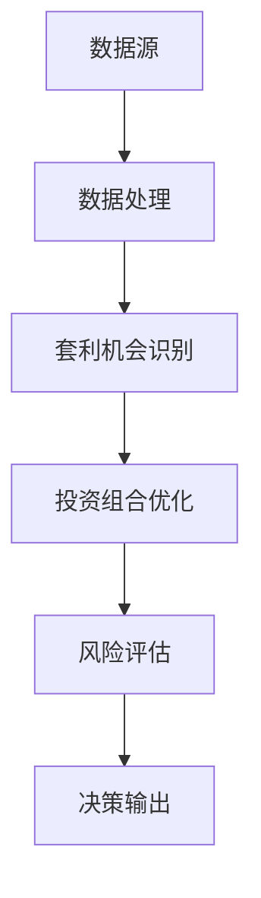

                 

# 塞思·克拉曼的特殊情况套利：价值投资的另一面

> 关键词：特殊情况套利、价值投资、塞思·克拉曼、套利定价理论、数学模型、系统架构

> 摘要：本文详细探讨了塞思·克拉曼的特殊情况套利策略，结合价值投资的核心理念，通过数学模型和系统架构设计，分析了套利机会识别、投资组合优化及风险控制的关键步骤。文章结合实际案例，展示了特殊情况套利在金融市场中的应用，并提出了最佳实践建议。

---

## 第一部分: 特殊情况套利与价值投资的背景

### 第1章: 特殊情况套利与价值投资概述

#### 1.1 套利的基本概念与分类
##### 1.1.1 套利的定义与基本原理
套利是指利用不同市场或资产之间的价格差异，通过同时买入低价资产和卖出高价资产来获利的交易策略。套利的基本原理是市场存在价格差异，而这种差异会因套利者的参与而缩小或消失。

##### 1.1.2 套利的主要分类
套利可以分为以下几类：
1. **跨市场套利**：利用不同市场之间的价格差异进行交易。
2. **跨期套利**：利用同一资产在不同时间点的价格差异进行交易。
3. **统计套利**：通过统计学方法发现市场中的异常价格关系。
4. **特殊套利**：针对特定市场、公司或情境的套利策略。

##### 1.1.3 套利在金融市场中的作用
套利有助于提高市场效率，减少价格差异，促进资产价格的合理化。同时，套利也为投资者提供了在市场中获利的机会。

#### 1.2 价值投资的核心理念
##### 1.2.1 价值投资的定义与特点
价值投资是一种投资策略，旨在以低于资产内在价值的价格买入资产，等待其价格回归合理水平后卖出。其核心理念是寻找市场中的低估资产。

##### 1.2.2 价值投资的主要策略
1. **基本面分析**：通过分析公司的财务状况、行业地位、竞争优势等因素，评估其内在价值。
2. **安全边际**：买入价格低于内在价值的资产，以确保投资的安全性。
3. **长期投资**：价值投资者通常采取长期持有策略，等待市场对其价值的重新评估。

##### 1.2.3 价值投资与套利的联系与区别
- **联系**：两者都强调资产的内在价值，套利通常在价值投资的基础上寻找市场定价错误的机会。
- **区别**：价值投资注重长期持有和资产的内在价值，而套利更注重短期价格差异和交易机会。

#### 1.3 塞思·克拉曼的特殊套利策略
##### 1.3.1 克拉曼的特殊套利定义
克拉曼的特殊套利策略是指在特定市场环境下，利用公司或市场的特殊状况，寻找定价错误的机会进行套利。

##### 1.3.2 克拉曼套利策略的核心要素
1. **市场无效性**：利用市场中的定价错误，寻找低估资产。
2. **公司特殊状况**：如困境公司、杠杆收购等，这些情况可能引发价格波动，创造套利机会。
3. **风险控制**：通过严格的风险评估和对冲策略，降低套利交易的风险。

##### 1.3.3 克拉曼套利与传统套利的对比
- **传统套利**：通常基于市场价差的直接套利，风险较低但收益有限。
- **克拉曼套利**：结合价值投资理念，注重市场特殊状况下的套利机会，风险较高但收益潜力更大。

#### 1.4 本章小结
本章介绍了套利和价值投资的基本概念，分析了克拉曼特殊套利策略的核心要素及其与传统套利的区别。

---

## 第二部分: 特殊情况套利的核心概念与数学模型

### 第2章: 特殊情况套利的数学模型与算法

#### 2.1 套利定价理论（APT）的核心原理
##### 2.1.1 APT的基本假设
套利定价理论假设市场中存在多种风险因子，资产的预期收益与这些因子相关。

##### 2.1.2 APT的数学公式与推导
套利定价理论的核心公式为：
$$ E(r_i) = \alpha + \beta_1F_1 + \beta_2F_2 + \dots + \beta_nF_n $$
其中，\( E(r_i) \) 是资产 \( i \) 的预期收益率，\( \alpha \) 是无风险利率，\( \beta_j \) 是资产 \( i \) 对因子 \( F_j \) 的敏感性。

##### 2.1.3 APT的实际应用
通过APT模型，投资者可以评估资产的预期收益，并发现定价错误的资产。

#### 2.2 价值投资中的套利模型
##### 2.2.1 价值投资中的套利策略模型
价值投资者通过分析公司的基本面，计算其内在价值，并与市场价格进行比较，寻找低估资产。

##### 2.2.2 克拉曼特殊套利的数学公式
克拉曼的特殊套利策略可以通过以下公式表示：
$$ \text{内在价值} = \frac{\text{现金流}}{\text{折现率}} $$
其中，现金流是公司未来产生的现金流，折现率是基于市场风险的无风险利率加风险溢价。

#### 2.3 套利与风险的数学关系
##### 2.3.1 风险与收益的数学模型
套利交易的风险与收益可以通过夏普比率来衡量：
$$ \text{夏普比率} = \frac{\text{超额收益}}{\text{收益标准差}} $$

##### 2.3.2 套利中的风险调整收益模型
在套利交易中，风险调整后的收益可以通过以下公式计算：
$$ \text{风险调整收益} = \text{预期收益} - \text{无风险利率} $$

#### 2.4 本章小结
本章通过数学模型和公式，详细阐述了套利定价理论和价值投资中的套利策略，为后续的系统设计和案例分析奠定了理论基础。

---

## 第三部分: 特殊情况套利的系统分析与架构设计

### 第3章: 特殊情况套利的系统架构

#### 3.1 投资决策系统的模块划分
##### 3.1.1 数据采集模块
数据采集模块负责收集市场数据，包括股票价格、财务报表等。

##### 3.1.2 模型计算模块
模型计算模块基于套利定价理论和价值投资模型，计算资产的内在价值和预期收益。

##### 3.1.3 风险评估模块
风险评估模块通过夏普比率等指标，评估套利交易的风险。

#### 3.2 系统功能设计
##### 3.2.1 数据处理流程
1. 数据采集模块获取市场数据。
2. 数据清洗模块处理缺失或异常数据。
3. 数据分析模块计算资产的内在价值和预期收益。
4. 风险评估模块评估套利交易的风险。

##### 3.2.2 套利机会识别算法
套利机会识别算法包括以下步骤：
1. 数据采集与清洗。
2. 计算资产的内在价值。
3. 对比市场价格与内在价值，识别低估资产。

##### 3.2.3 投资组合优化模型
投资组合优化模型基于风险调整后的收益，选择最优的套利组合。

#### 3.3 系统架构图
以下是系统架构的Mermaid图：

#### 3.4 本章小结
本章详细描述了特殊情况套利系统的模块划分和功能设计，为实际操作提供了系统架构支持。

---

## 第四部分: 特殊情况套利的项目实战

### 第4章: 特殊情况套利的实战案例分析

#### 4.1 理论与实践的结合
##### 4.1.1 理论基础回顾
回顾套利定价理论和价值投资的核心理念。

##### 4.1.2 实践中的问题分析
分析实际市场中可能遇到的问题，如市场波动、信息不对称等。

##### 4.1.3 实战案例的选择标准
选择具有典型市场无效性的公司或市场环境作为案例。

#### 4.2 具体案例分析
##### 4.2.1 某公司困境中的套利机会
以某困境公司为例，分析其市场定价与内在价值的差异，识别套利机会。

##### 4.2.2 杠杆收购中的套利策略
分析杠杆收购中的套利机会，计算收购前后资产价值的变化。

##### 4.2.3 其他特殊情况的套利分析
如重组、破产等特殊情况下的套利机会分析。

#### 4.3 案例分析的数学模型应用
##### 4.3.1 案例中的套利模型应用
通过现金流折现模型计算公司内在价值。

##### 4.3.2 模型参数的调整与优化
根据实际情况调整折现率、现金流预测等参数。

##### 4.3.3 实战中的风险控制
通过分散投资、对冲策略等方法控制风险。

#### 4.4 本章小结
本章通过具体案例分析，展示了特殊情况套利策略的实际应用。

---

## 第五部分: 特殊情况套利的最佳实践与小结

### 第5章: 特殊情况套利的最佳实践

#### 5.1 投资策略的优化与调整
##### 5.1.1 策略优化的原则
根据市场环境和资产特性，动态调整套利策略。

##### 5.1.2 

---

## 作者信息

作者：AI天才研究院/AI Genius Institute & 禅与计算机程序设计艺术 /Zen And The Art of Computer Programming

---

以上是文章的完整目录和部分章节内容。文章详细探讨了塞思·克拉曼的特殊情况套利策略，结合了价值投资的核心理念，通过数学模型和系统架构设计，分析了套利机会识别、投资组合优化及风险控制的关键步骤。通过具体案例分析，展示了特殊情况套利策略的实际应用，并提出了最佳实践建议。

