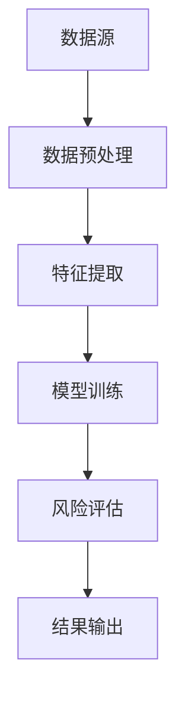

                 

# 塞思·克拉曼的风险套利：特殊情况下的价值发现

> **关键词**：风险套利, 特殊情况, 价值发现, 投资策略, 金融市场, 人工智能, 数学模型

> **摘要**：  
本文深入探讨了塞思·克拉曼的风险套利策略，特别是在特殊情况下的价值发现方法。通过结合金融理论、数学模型和实际案例分析，本文详细讲解了如何在市场波动和特殊情境中发现投资机会。文章从风险套利的定义和背景出发，分析其核心概念、算法原理和系统架构，最后通过项目实战和最佳实践，为读者提供了一套完整的风险套利解决方案。

---

## 第一部分: 风险套利与特殊情况下的价值发现基础

### 第1章: 风险套利的定义与背景

#### 1.1 风险套利的核心概念
- **1.1.1 风险套利的定义**  
  风险套利是一种通过利用资产价格差异或市场 inefficiency 来获利的投资策略。它通常涉及对冲风险，以确保在市场变化中保持稳定的收益。

- **1.1.2 风险套利的基本原理**  
  风险套利的核心在于识别市场中的定价错误，并通过同时买入低估资产和卖出高估资产来获利。这种方法依赖于市场回归均衡的假设。

- **1.1.3 风险套利与传统投资的区别**  
  - 传统投资：基于基本面分析，长期持有资产以获得收益。  
  - 风险套利：基于短期价格差异，通过套利机会快速获利。

#### 1.2 风险套利的历史与发展
- **1.2.1 风险套利的起源**  
  套利交易的历史可以追溯到古代，但现代风险套利的发展始于20世纪60年代，随着金融市场的全球化和电子化交易的普及，风险套利变得更加高效和复杂。

- **1.2.2 风险套利在现代金融中的应用**  
  随着技术的进步，风险套利从传统的场内交易扩展到场外市场、衍生品市场和算法交易。

- **1.2.3 风险套利的现状与趋势**  
  随着算法交易和高频交易的兴起，风险套利正在变得更加技术化和数据驱动。

---

### 第2章: 特殊情况下的价值发现

#### 2.1 特殊情况的定义与分类
- **2.1.1 特殊情况的类型**  
  - 公司重组或并购  
  - 破产重整  
  - 重大诉讼或法律纠纷  
  - 市场突发事件（如黑天鹅事件）  

- **2.1.2 特殊情况的特征分析**  
  - 突发性：通常是不可预见的事件。  
  - 影响性：对市场或公司产生重大影响。  
  - 时间敏感性：套利机会往往短暂，需要快速反应。  

- **2.1.3 特殊情况与风险套利的关系**  
  在特殊情况下，资产价格可能出现短期大幅波动，为风险套利提供了机会。

#### 2.2 价值发现的核心要素
- **2.2.1 价值发现的定义**  
  价值发现是指通过分析市场信息，识别出被低估或被高估的资产，并据此进行投资决策。

- **2.2.2 价值发现的关键因素**  
  - 资产的基本面分析  
  - 市场情绪分析  
  - 套利机会的识别  

- **2.2.3 价值发现的步骤与方法**  
  - 数据收集与整理  
  - 市场分析与建模  
  - 投资决策与风险控制  

---

### 第3章: 风险套利的数学模型与算法

#### 3.1 套利定价定理（APT）
- **3.1.1 APT的基本原理**  
  套利定价定理认为，资产的预期回报可以通过一组因素和它们的beta系数来解释。APT提供了一个框架，用于评估资产的合理价格。

- **3.1.2 APT的数学公式**  
  $$ E(r_i) = \beta_i (E(r_m) - r_f) + r_f $$  
  其中，$E(r_i)$ 是资产 i 的预期回报率，$\beta_i$ 是资产 i 的beta系数，$E(r_m)$ 是市场预期回报率，$r_f$ 是无风险利率。

- **3.1.3 APT的应用与局限性**  
  - 应用：用于评估资产的合理价格。  
  - 局限性：需要假设多个因素能够解释资产回报，且这些因素之间的关系难以确定。

#### 3.2 资本资产定价模型（CAPM）
- **3.2.1 CAPM的基本原理**  
  CAPM是一种用于评估资产预期回报的模型，基于市场风险和无风险利率。

- **3.2.2 CAPM的数学公式**  
  $$ E(r_i) = \beta_i E(r_m) + (r_f - \beta_i r_f) $$  
  其中，$E(r_i)$ 是资产 i 的预期回报率，$\beta_i$ 是资产 i 的beta系数，$E(r_m)$ 是市场预期回报率，$r_f$ 是无风险利率。

- **3.2.3 CAPM在风险套利中的应用**  
  CAPM可以帮助投资者评估资产的预期回报，从而识别套利机会。

---

### 第4章: 风险套利的系统分析与架构设计

#### 4.1 风险套利系统的功能设计
- **4.1.1 数据收集模块**  
  - 从多个数据源（如股票交易所、新闻网站）收集实时数据。  
  - 数据清洗与预处理。  

- **4.1.2 模型分析模块**  
  - 使用数学模型（如APT、CAPM）对资产进行定价。  
  - 识别套利机会。  

- **4.1.3 风险评估模块**  
  - 评估套利交易的风险。  
  - 制定风险管理策略。  

#### 4.2 系统架构设计
- **4.2.1 系统架构图（Mermaid）**  

---

### 第5章: 风险套利的项目实战

#### 5.1 项目背景与目标
- **5.1.1 项目背景**  
  本项目旨在通过分析杠杆收购事件，识别潜在的套利机会。  

- **5.1.2 项目目标**  
  - 收集相关数据。  
  - 构建套利模型。  
  - 实施套利交易并监控风险。  

#### 5.2 项目实施步骤
- **5.2.1 数据收集与清洗**  
  - 从股票交易所收集目标公司的历史价格数据。  
  - 从新闻网站收集与公司相关的新闻和公告。  

- **5.2.2 模型训练与优化**  
  - 使用APT模型对资产进行定价。  
  - 根据历史数据调整模型参数。  

- **5.2.3 交易执行与风险管理**  
  - 根据模型预测执行套利交易。  
  - 使用风险管理策略控制交易风险。  

---

### 第6章: 最佳实践与小结

#### 6.1 投资策略的注意事项
- **市场风险**：套利交易依赖于市场回归均衡的假设，但在极端情况下，市场可能长期偏离均衡。  
- **模型风险**：数学模型基于假设，可能无法完全反映现实情况。  
- **交易成本**：高频交易和大额交易可能产生较高的交易成本。  

#### 6.2 未来趋势与拓展阅读
- **人工智能在风险套利中的应用**：AI可以帮助识别更复杂的套利机会。  
- **区块链技术的影响**：区块链可能改变交易的透明度和效率。  

---

## 作者信息

作者：AI天才研究院/AI Genius Institute & 禅与计算机程序设计艺术 /Zen And The Art of Computer Programming

