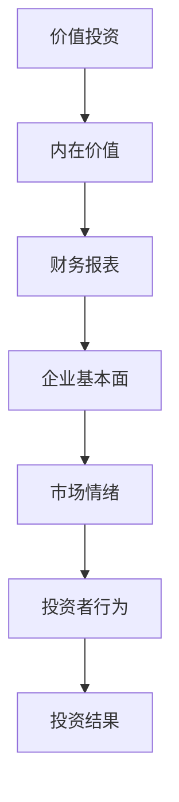
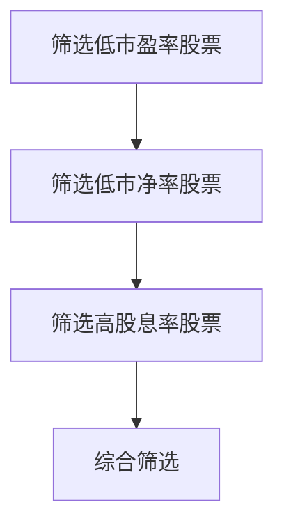
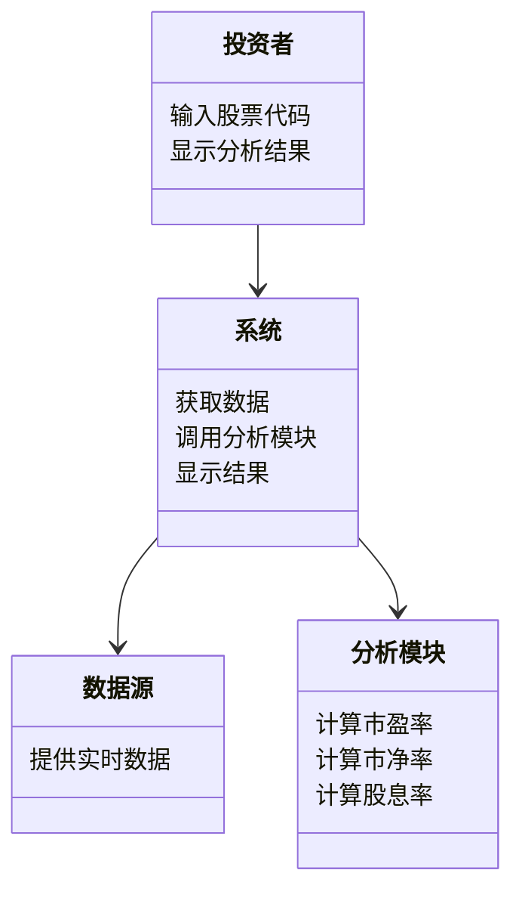
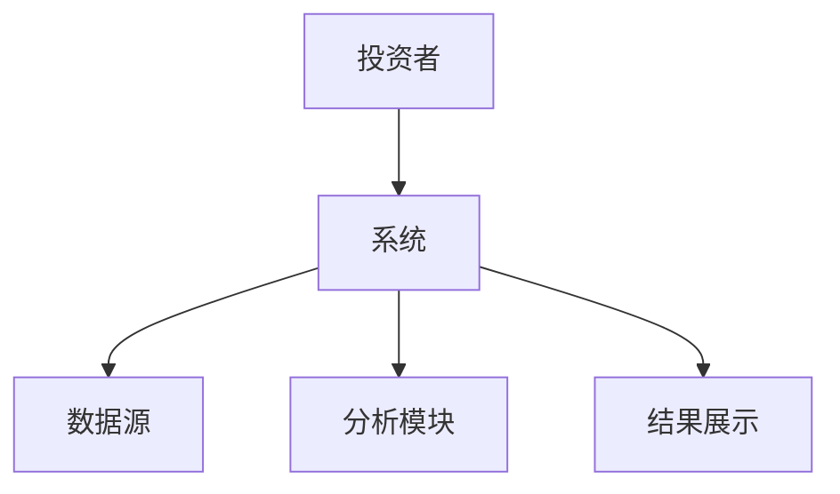

                 


# 塞思·卡拉曼的价值投资陷阱及如何避免

## 关键词：
价值投资，塞思·卡拉曼，投资陷阱，安全边际，基本面分析，市盈率，市净率

## 摘要：
本文深入分析了塞思·卡拉曼的价值投资策略中存在的常见陷阱，并提出了如何避免这些陷阱的方法。通过详细探讨价值投资的核心概念、算法原理和系统设计，本文为投资者提供了实用的建议，帮助他们在投资过程中规避风险，实现稳健收益。

---

## 第一部分：价值投资陷阱的背景与概述

### 第1章：价值投资的基本概念

#### 1.1 价值投资的定义与核心理念

- **1.1.1 价值投资的起源与发展**
  价值投资是一种长期投资策略，起源于20世纪初。本杰明·格雷厄姆和戴维·多德是这一理念的先驱。他们强调购买被市场低估的股票，通过长期持有实现收益。

- **1.1.2 价值投资的核心原则**
  价值投资的核心在于寻找市场价低于内在价值的股票。内在价值是基于企业基本面分析得出的企业合理估值。投资者应关注企业的盈利能力、财务状况和行业地位。

- **1.1.3 价值投资与成长投资的区别**
  价值投资侧重于低估值，而成长投资侧重于高增长潜力。价值投资者寻找被市场忽视的股票，而成长投资者则寻找高增长的公司。

#### 1.2 塞思·卡拉曼的投资理念

- **1.2.1 卡拉曼的投资哲学**
  塞思·卡拉曼是价值投资的践行者，他强调安全边际的重要性。他认为，投资者应以低于内在价值的价格购买股票，以降低风险并确保收益。

- **1.2.2 卡拉曼的选股标准**
  卡拉曼倾向于投资具有稳定收益、低市盈率和低市净率的公司。他认为，这些指标能够反映企业的内在价值，帮助投资者避免过高估值的风险。

- **1.2.3 卡拉曼的经典投资案例**
  卡拉曼的投资案例包括购买被市场低估的制造业和服务业公司。他通过深入分析财务报表，识别出具有长期竞争优势的企业。

#### 1.3 价值投资中的常见陷阱

- **1.3.1 过度关注低市盈率**
  仅仅关注低市盈率的股票并不意味着安全。一些低市盈率的公司可能面临财务困境或行业衰退，投资者应结合其他因素进行综合评估。

- **1.3.2 忽视企业基本面**
  市场价格可能因短期情绪波动而偏离基本面。投资者必须深入分析企业的财务状况、盈利能力和发展前景，避免被表面现象迷惑。

- **1.3.3 过度依赖历史表现**
  过去的表现不代表未来的表现。投资者不应仅仅依赖历史数据，而应关注企业的未来增长潜力和行业趋势。

---

## 第二部分：价值投资陷阱的核心概念与联系

### 第2章：价值投资的核心原理

#### 2.1 价值投资的原理分析

- **2.1.1 股票的内在价值计算**
  内在价值是基于企业未来现金流的现值。使用DCF模型（现金流贴现法）进行计算：
  $$ \text{内在价值} = \frac{\text{未来现金流}}{(1 + r)^t} $$
  其中，r为贴现率，t为时间。

- **2.1.2 股东权益与企业价值的关系**
  股东权益是企业资产减去负债后的净值。高股东权益意味着企业具有较强的抗风险能力。

- **2.1.3 财务报表分析在价值投资中的应用**
  通过分析利润表、资产负债表和现金流量表，投资者可以评估企业的盈利能力、财务健康状况和现金流情况。

#### 2.2 价值投资与成长投资的对比

| **对比维度** | **价值投资**               | **成长投资**               |
|--------------|---------------------------|---------------------------|
| 核心目标     | 寻找被低估的股票           | 寻找高增长潜力的股票       |
| 投资策略     | 低市盈率、低市净率         | 高市盈率、高市净率         |
| 风险承受     | 较低                      | 较高                      |

#### 2.3 价值投资陷阱的实体关系图



---

## 第三部分：价值投资陷阱的算法原理

### 第3章：卡拉曼投资策略的算法分析

#### 3.1 卡拉曼投资策略的核心算法

- **3.1.1 基于市盈率的筛选算法**
  市盈率（P/E）=股价/每股收益。卡拉曼建议选择P/E低于行业平均水平的股票。

- **3.1.2 基于市净率的筛选算法**
  市净率（P/B）=股价/每股净资产。卡拉曼偏好P/B低于1的股票。

- **3.1.3 基于股息率的筛选算法**
  股息率=股息/股价。卡拉曼认为高股息率的股票具有较高的投资价值。

#### 3.2 基于DCF模型的内在价值计算

使用DCF模型计算股票的内在价值：

$$ \text{内在价值} = \frac{\text{FCF}}{(1 + r)^n} $$

其中，FCF为自由现金流，r为折现率，n为年数。

#### 3.3 基于财务指标的多重筛选算法



---

## 第四部分：系统分析与架构设计方案

### 第4章：投资分析系统的设计

#### 4.1 项目介绍

设计一个基于价值投资策略的投资分析系统，帮助投资者识别潜在的投资机会。

#### 4.2 系统功能设计



#### 4.3 系统架构设计



---

## 第五部分：项目实战

### 第5章：价值投资陷阱的系统实现

#### 5.1 环境安装

- 安装Python和相关库（pandas, numpy, matplotlib）

#### 5.2 核心代码实现

```python
import pandas as pd
import numpy as np

def calculate_pe_ratio(df):
    df['PE'] = df['股价'] / df['每股收益']
    return df

def calculate_pb_ratio(df):
    df['PB'] = df['股价'] / df['每股净资产']
    return df

def calculate_dividend_yield(df):
    df['股息率'] = df['股息'] / df['股价']
    return df

# 示例数据
data = {
    '股票代码': ['A', 'B', 'C'],
    '股价': [10, 15, 20],
    '每股收益': [5, 5, 5],
    '每股净资产': [10, 15, 20],
    '股息': [1, 2, 3]
}

df = pd.DataFrame(data)
df = calculate_pe_ratio(df)
df = calculate_pb_ratio(df)
df = calculate_dividend_yield(df)
print(df)
```

#### 5.3 案例分析

假设某公司股票代码为A，股价为10元，每股收益为5元，每股净资产为10元，股息为1元。计算其市盈率、市净率和股息率：

- PE = 10 / 5 = 2
- PB = 10 / 10 = 1
- 股息率 = 1 / 10 = 0.1

---

## 第六部分：最佳实践、小结、注意事项和拓展阅读

### 6.1 最佳实践

- **多元化投资**：不要将所有资金投入单一股票，分散投资以降低风险。
- **持续学习**：市场变化莫测，投资者需不断学习新知识，更新投资策略。
- **耐心持有**：价值投资需要时间，耐心持有优质股票才能实现收益。

### 6.2 小结

本文分析了塞思·卡拉曼的价值投资策略中存在的常见陷阱，并提供了避免这些陷阱的方法。通过系统设计和项目实战，投资者可以更好地识别潜在风险，做出明智的投资决策。

### 6.3 注意事项

- **市场风险**：市场波动可能影响股票价格，投资者需具备风险承受能力。
- **数据准确性**：投资决策依赖于准确的数据，确保数据来源可靠。
- **监管环境**：了解相关法规，避免因不了解法规而产生的风险。

### 6.4 拓展阅读

- 格雷厄姆的《证券分析》
- 巴菲特的股东大会演讲
- 现代投资组合理论的相关书籍

---

## 作者信息

作者：AI天才研究院/AI Genius Institute & 禅与计算机程序设计艺术 /Zen And The Art of Computer Programming

---

本文通过系统分析和详细讲解，帮助投资者识别和避免价值投资中的陷阱，为实现稳健投资提供了实用的建议。希望本文对您的投资决策有所帮助！

