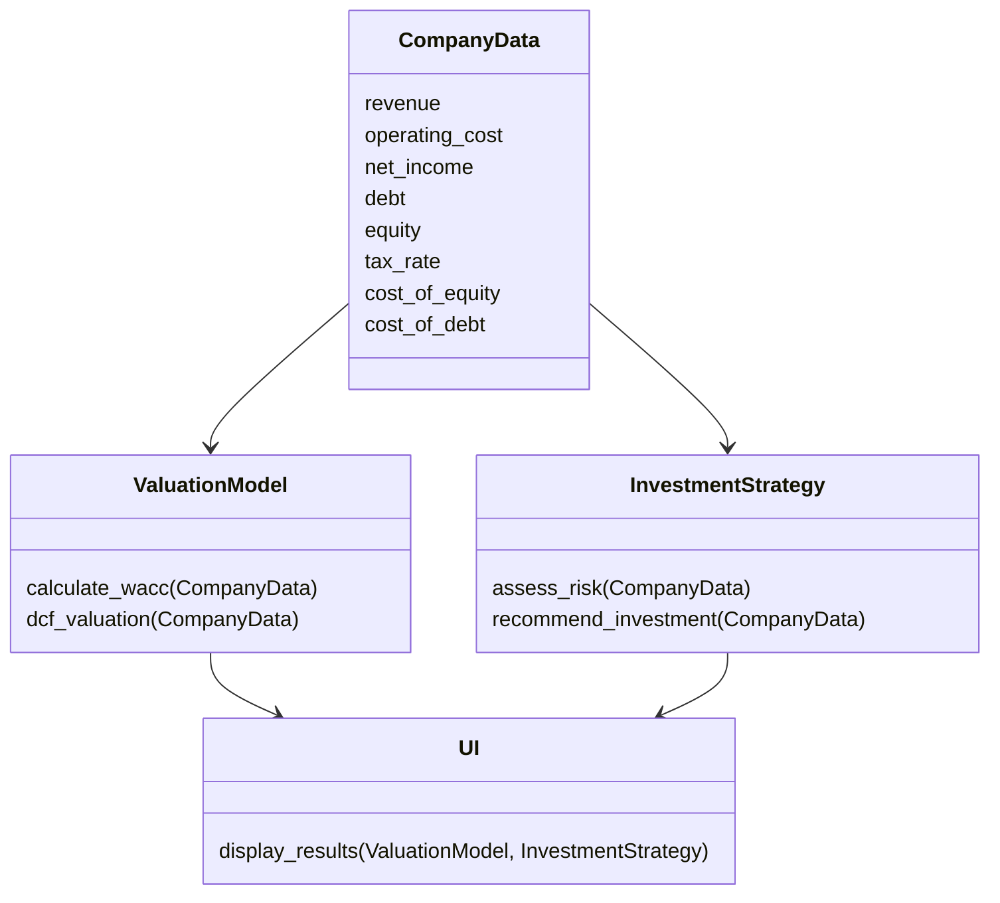

                 


# 塞思·卡拉曼的价值陷阱避免策略

> 关键词：价值陷阱，塞思·卡拉曼，投资策略，风险管理，防御性投资

> 摘要：本文深入探讨了塞思·卡拉曼的价值陷阱避免策略，从价值陷阱的定义、识别方法到卡拉曼的防御性投资策略，结合系统化的方法和数学模型，提供详细的分析和实战案例。通过本文，读者可以掌握如何识别和避免价值陷阱，提升投资决策的准确性。

---

## 第1章：价值陷阱的基本概念

### 1.1 价值陷阱的定义

价值陷阱是指在金融市场中，某些股票或资产看似价格低廉，但实际上存在隐藏的问题或风险，导致其无法真正低估。投资者如果未能识别这些陷阱，可能会以过高的价格买入，最终遭受损失。

#### 核心特征
- **表面低估**：市盈率、市净率等指标看似低于行业平均水平。
- **隐藏风险**：公司财务状况恶化、行业衰退或管理问题。
- **短期诱饵**：短期内股价可能上涨，但长期来看并不具备投资价值。

### 1.2 塞思·卡拉曼的背景与投资哲学

塞思·卡拉曼是美国著名投资者，以其防御性投资策略闻名。他主张通过深入研究和严格估值，避免价值陷阱，投资于具有强大护城河和稳定现金流的企业。

#### 投资哲学
- **价值投资**：寻找市场低估的优质企业。
- **风险管理**：优先考虑资本安全，避免重大损失。
- **防御性策略**：投资于具有稳定收益和抗衰退能力的公司。

---

## 第2章：价值陷阱的识别与分析

### 2.1 价值陷阱的识别方法

识别价值陷阱需要结合定量分析和定性研究，从财务报表、行业环境等多个维度进行评估。

#### 财务报表分析
- **收入质量**：检查收入来源是否可持续。
- **盈利能力**：关注净利润率和ROE。
- **资产负债表**：评估公司偿债能力和财务健康状况。

#### 行业分析
- **行业周期**：选择处于上升周期的行业。
- **竞争格局**：避免进入衰退期或高度竞争的行业。
- **政策影响**：考虑政策变化对行业的影响。

### 2.2 价值陷阱的类型

价值陷阱可以分为三类：财务造假型、业绩下滑型和行业衰退型。

#### 财务造假型
- **虚构收入**：通过虚增收入粉饰报表。
- **隐藏负债**：未公开的债务或担保。
- **资产虚增**：高估资产价值。

#### 业绩下滑型
- **收入下降**：连续几个季度收入下降。
- **利润率压缩**：成本上升导致利润减少。
- **管理问题**：管理层变动或内部腐败。

#### 行业衰退型
- **需求减少**：行业整体需求下降。
- **技术变革**：行业面临技术替代风险。
- **政策冲击**：政策变化导致行业萎缩。

---

## 第3章：塞思·卡拉曼的价值评估策略

### 3.1 卡拉曼的价值评估框架

卡拉曼使用现金流折现模型（DCF）进行估值，结合市盈率和市净率等指标，评估企业内在价值。

#### 现金流折现模型（DCF）
- **现金流预测**：预测未来自由现金流。
- **贴现率计算**：使用WACC（加权平均资本成本）作为贴现率。
- **终值估算**：假设终值增长率，计算终值。

#### 市盈率与市净率分析
- **市盈率（P/E）**：股价与每股收益的比率。
- **市净率（P/B）**：股价与每股净资产的比率。
- **合理估值区间**：根据行业平均值确定合理估值范围。

### 3.2 卡拉曼的防御性投资策略

卡拉曼强调防御性投资，通过分散投资、严格选股和长期持有，降低投资风险。

#### 分散投资
- **资产配置**：将资金分配到不同行业和资产类别。
- **个股集中**：避免过度分散，选择少数优质股。

#### 严格选股
- **深入研究**：对公司基本面进行详细分析。
- **管理层评估**：考察管理层能力和诚信。
- **竞争优势分析**：寻找具有强大护城河的企业。

---

## 第4章：避免价值陷阱的系统化方法

### 4.1 系统化投资策略

系统化方法通过建立严格的筛选标准和量化指标，减少人为情绪干扰，提高投资决策的科学性。

#### 筛选标准
- **财务指标**：ROE、ROA、净利率等。
- **估值指标**：PE、PB、EV/EBITDA等。
- **质量指标**：管理层质量、企业治理结构。

### 4.2 风险管理

有效的风险管理可以减少投资组合的波动性，避免重大损失。

#### 风险评估
- **市场风险**：通过波动率和Beta系数衡量。
- **流动性风险**：评估资产的流动性。
- **信用风险**：评估债券或贷款的违约风险。

#### 风险控制
- **止损策略**：设定止损点，避免损失扩大。
- **分散投资**：通过多元化降低特定风险。
- **定期再平衡**：定期调整投资组合，保持目标配置。

---

## 第5章：数学模型与算法实现

### 5.1 价值评估的数学模型

#### 现金流折现模型（DCF）
- **公式**：
  $$
  V = \sum_{t=1}^{n} \frac{CF_t}{(1 + r)^t} + \frac{TV}{(1 + r)^n}
  $$
  其中，$CF_t$ 是第t年的自由现金流，$r$ 是贴现率，$TV$ 是终值。

- **步骤**：
  1. 预测未来5年现金流。
  2. 计算终值，假设终值增长率g为3%。
  3. 计算加权平均资本成本（WACC）作为贴现率。
  4. 现金流折现求和，得到企业价值。

#### 估值比较
- **步骤**：
  1. 计算DCF估值。
  2. 比较市场价与DCF值。
  3. 如果市场价低于DCF值，考虑买入。

### 5.2 算法实现

#### Python代码示例

```python
def calculate_wacc(company_info):
    # company_info 包含 revenue, operating_cost, net_income, debt, equity, cost_of_equity, cost_of_debt, tax_rate
    tax_adjusted_debt = company_info['debt'] * (1 - company_info['tax_rate'])
    wacc = (company_info['cost_of_equity'] * company_info['equity'] + company_info['cost_of_debt'] * tax_adjusted_debt) / (company_info['debt'] + company_info['equity'])
    return wacc

def dcf_valuation(company_info, years=5, growth_rate=0.03):
    # 假设未来5年的现金流增长率
    cash_flows = []
    for t in range(years):
        cf = company_info['net_income'] * (1 + growth_rate) ** t
        cash_flows.append(cf)
    # 终值
    tv = cash_flows[-1] * (1 + growth_rate)
    # 计算DCF价值
    wacc = calculate_wacc(company_info)
    dcf_value = sum([cf / (1 + wacc) ** t for t, cf in enumerate(cash_flows)]) + tv / (1 + wacc) ** years
    return dcf_value
```

---

## 第6章：系统架构设计与实现

### 6.1 系统功能设计

#### 功能模块
- **数据采集**：收集公司财务数据和市场数据。
- **估值计算**：运行DCF模型和估值比较。
- **风险评估**：计算市场风险和信用风险。
- **结果展示**：显示估值结果和投资建议。

#### 类图设计



### 6.2 系统架构设计

#### 架构图

```mermaid
client --> HTTP API: 发送公司数据请求
HTTP API --> DataCollector: 收集数据
DataCollector --> ValuationEngine: 运行DCF模型
ValuationEngine --> InvestmentStrategy: 风险评估
InvestmentStrategy --> UI: 显示结果
```

---

## 第7章：项目实战与案例分析

### 7.1 环境安装

安装Python和相关库：

```bash
pip install numpy pandas matplotlib
```

### 7.2 核心代码实现

#### DCF模型实现

```python
import numpy as np

def calculate_wacc(finance_data):
    tax_adjusted_debt = finance_data['debt'] * (1 - finance_data['tax_rate'])
    wacc = (finance_data['cost_of_equity'] * finance_data['equity'] +
            finance_data['cost_of_debt'] * tax_adjusted_debt) / (finance_data['debt'] + finance_data['equity'])
    return wacc

def dcf_valuation(finance_data, periods=5, growth_rate=0.03):
    cash_flows = []
    for t in range(periods):
        cf = finance_data['net_income'] * (1 + growth_rate) ** t
        cash_flows.append(cf)
    tv = cash_flows[-1] * (1 + growth_rate)
    wacc = calculate_wacc(finance_data)
    dcf_value = sum([cf / (1 + wacc) ** t for t, cf in enumerate(cash_flows)]) + tv / (1 + wacc) ** periods
    return dcf_value

# 示例数据
finance_data = {
    'revenue': 1000,
    'operating_cost': 600,
    'net_income': 300,
    'debt': 500,
    'equity': 1000,
    'tax_rate': 0.2,
    'cost_of_equity': 0.1,
    'cost_of_debt': 0.05
}

dcf_value = dcf_valuation(finance_data)
print(f"DCF Value: {dcf_value:.2f}")
```

### 7.3 案例分析

#### 案例：某制造公司

- **DCF估值**：计算得到DCF价值为1500万。
- **市场价**：当前股价为每股20元，总市值800万。
- **结论**：DCF价值高于市场价，具有投资价值。

---

## 第8章：最佳实践与小结

### 8.1 小结

价值陷阱的识别和避免需要结合定量分析和定性研究，通过系统化的策略和严格的风险管理，投资者可以有效降低投资风险，提升投资收益。

### 8.2 注意事项

- **持续学习**：市场环境不断变化，需持续更新知识和策略。
- **避免过度自信**：认识到自身的局限性，及时调整策略。
- **分散投资**：避免将所有资金投入到单一资产或行业。

### 8.3 拓展阅读

- 卡拉曼的《安全边际》。
- 《投资最重要的事情》。
- 现代投资组合理论（MPT）。

---

## 附录

### 附录A：工具与库

- **Python库**：pandas、numpy、scipy。
- **可视化工具**：Matplotlib、Seaborn。
- **数据源**：Yahoo Finance、Morningstar。

### 附录B：参考文献

- 卡拉曼，S. (1994). *The Portfolio Selection Problem*.
- 格雷厄姆，B. (1974). *The Intelligent Investor*.

---

## 作者

作者：AI天才研究院/AI Genius Institute  
联系邮箱：contact@ai-genius.com

