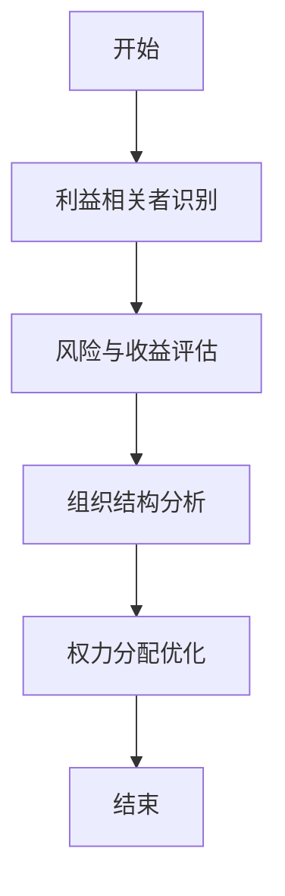
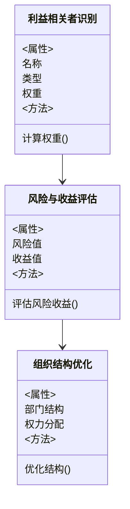

                 


# 塞思·卡拉曼的公司治理分析方法

## 关键词：公司治理, 卡拉曼方法, 利益相关者, 风险收益平衡, 组织架构

## 摘要：  
本文深入分析了塞思·卡拉曼的公司治理分析方法，探讨了其核心理论、算法原理、系统架构及实际应用。通过详细阐述利益相关者分析、风险收益平衡、组织结构优化等关键概念，并结合实际案例，展示了卡拉曼方法在现代公司治理中的应用价值。

---

# 第一部分：公司治理的基本概念与问题背景

## 第1章：公司治理的基本概念与问题背景

### 1.1 公司治理的定义与核心要素

#### 1.1.1 公司治理的定义  
公司治理是关于公司如何有效管理其资源、权力分配、利益相关者关系以及合规性的一套规则和机制。其核心目标是确保公司长期稳定发展，实现利益相关者的共赢。

#### 1.1.2 公司治理的核心要素  
1. **治理结构**：董事会、监事会、管理层的职责划分。
2. **利益相关者**：股东、董事、高管、员工、客户、供应商等。
3. **治理机制**：决策机制、监督机制、激励机制、信息披露机制。
4. **合规性**：遵循法律法规和行业规范。

#### 1.1.3 公司治理的目标与作用  
目标：实现公司价值最大化，平衡各方利益，确保合规性。  
作用：提升公司透明度，增强信任，优化资源配置，降低风险。

---

### 1.2 公司治理问题的背景与挑战

#### 1.2.1 传统公司治理的局限性  
1. **股东中心主义**：过度关注股东利益，忽视其他利益相关者。
2. **监督不足**：董事会和监事会作用发挥不够。
3. **信息不对称**：利益相关者之间信息不透明，导致信任缺失。

#### 1.2.2 现代公司治理的复杂性  
1. **全球化**：跨国公司面临不同法律和文化环境的挑战。
2. **利益相关者多样化**：员工、客户、供应商等利益需求各不相同。
3. **技术驱动**：数字化转型对治理提出新要求。

#### 1.2.3 全球化背景下的公司治理挑战  
1. **跨国经营**：需要协调不同国家的法律和政策。
2. **社会责任**：企业需要承担更多的环境保护、社会责任。
3. **风险管理**：全球化带来的供应链风险和合规风险增加。

---

## 第2章：塞思·卡拉曼的公司治理分析方法

### 2.1 卡拉曼分析方法的理论基础

#### 2.1.1 卡拉曼理论的核心思想  
卡拉曼认为，公司治理的核心在于平衡利益相关者的利益，通过科学的分析方法优化公司结构和决策过程。

#### 2.1.2 卡拉曼分析方法的哲学基础  
卡拉曼的方法受到系统论、权变理论和博弈论的影响，强调动态调整和利益平衡。

#### 2.1.3 卡拉曼方法与现代公司治理的结合  
通过引入数学模型和算法，卡拉曼方法将传统治理理论转化为可操作的分析工具。

---

### 2.2 卡拉曼分析方法的框架与步骤

#### 2.2.1 分析框架的构成  
1. **利益相关者识别**：列出所有关键利益相关者。
2. **风险与收益评估**：量化各利益相关者的收益和风险。
3. **组织结构分析**：优化公司组织结构和权力分配。
4. **决策优化**：基于分析结果调整公司战略和政策。

#### 2.2.2 分析步骤的详细说明  
1. 利益相关者识别：通过问卷、访谈等方式收集信息。
2. 风险与收益评估：使用数学模型计算各利益相关者的权重。
3. 组织结构分析：绘制组织架构图，分析权力分配的合理性。
4. 决策优化：根据分析结果调整公司治理策略。

#### 2.2.3 分析方法的适用场景  
适用于跨国公司、上市公司、初创企业等不同规模和类型的公司。

---

## 第3章：卡拉曼分析方法的核心概念与联系

### 3.1 卡拉曼分析方法的核心概念

#### 3.1.1 利益相关者分析  
利益相关者分析是卡拉曼方法的核心，通过识别和评估各利益相关者的影响力和贡献，制定合理的治理策略。

#### 3.1.2 风险与收益平衡  
在公司治理中，需要平衡不同利益相关者的收益与风险，避免某一方利益过度受损。

#### 3.1.3 组织结构与权力分配  
通过优化组织结构和权力分配，确保公司治理机制的有效运行。

---

### 3.2 核心概念的属性特征对比

| **属性**         | **利益相关者**       | **风险与收益平衡**   | **组织结构与权力分配** |
|-------------------|----------------------|----------------------|------------------------|
| **核心目标**      | 确定关键利益相关者   | 实现利益平衡         | 优化权力分配           |
| **方法工具**      | 问卷、访谈           | 数学模型             | 组织架构图             |
| **应用场景**      | 利益相关者识别阶段   | 决策阶段             | 组织结构调整阶段       |

---

### 3.3 ER实体关系图架构

```mermaid
er
actor 利益相关者 {
  role: 股东, 董监高, 员工, 客户, 供应商
}
actor 利益相关者 --> entity 公司 {
  role: 所有者, 管理者, 员工, 服务对象, 合作伙伴
}
```

---

## 第4章：卡拉曼分析方法的算法原理

### 4.1 算法原理概述

#### 4.1.1 卡拉曼分析方法的数学模型  
卡拉曼方法通过构建数学模型，量化各利益相关者的权重和影响。例如，利益相关者权重计算公式为：
$$ w_i = \frac{v_i}{\sum_{j=1}^{n} v_j} $$
其中，\( w_i \) 是第 \( i \) 个利益相关者的权重，\( v_i \) 是第 \( i \) 个利益相关者的价值贡献。

#### 4.1.2 算法的输入与输出  
- **输入**：利益相关者列表、各利益相关者的价值贡献。
- **输出**：各利益相关者的权重、风险与收益平衡方案、组织结构优化建议。

#### 4.1.3 算法的步骤与流程  
1. 识别利益相关者。
2. 计算各利益相关者的权重。
3. 分析风险与收益平衡。
4. 优化组织结构和权力分配。

---

### 4.2 算法流程图



---

### 4.3 算法的数学模型与公式

#### 4.3.1 利益相关者权重计算公式  
$$ w_i = \frac{v_i}{\sum_{j=1}^{n} v_j} $$

#### 4.3.2 风险与收益平衡公式  
$$ R = \sum_{i=1}^{m} (r_i \times w_i) $$
其中，\( R \) 是总风险，\( r_i \) 是第 \( i \) 个利益相关者的风险，\( w_i \) 是权重。

---

## 第5章：系统分析与架构设计方案

### 5.1 问题场景介绍  
我们以一家跨国公司为例，分析其在全球化背景下面临的公司治理问题。

### 5.2 系统功能设计

#### 5.2.1 领域模型  


#### 5.2.2 系统架构设计  


---

## 第6章：项目实战

### 6.1 环境安装  
安装Python和相关库（如numpy、pandas）。

### 6.2 系统核心实现源代码  
```python
def calculate_weights(values):
    total = sum(values)
    weights = [v / total for v in values]
    return weights

def assess_risk收益(balance_weights, risks):
    total_risk = 0
    for i in range(len(balance_weights)):
        total_risk += balance_weights[i] * risks[i]
    return total_risk

# 示例
values = [10, 20, 30]
weights = calculate_weights(values)
risks = [0.2, 0.3, 0.5]
total_risk = assess_risk收益(weights, risks)
print("权重：", weights)
print("总风险：", total_risk)
```

---

## 第7章：总结与展望

### 7.1 总结  
卡拉曼分析方法通过量化利益相关者的权重和风险，优化公司治理结构，为企业提供了科学的决策工具。

### 7.2 展望  
未来，随着人工智能和大数据技术的发展，卡拉曼方法将更加智能化和精准化，为公司治理提供更强大的支持。

---

## 作者信息

作者：AI天才研究院（AI Genius Institute） & 禅与计算机程序设计艺术（Zen And The Art of Computer Programming）

---

感谢您的阅读！如果对塞思·卡拉曼的公司治理分析方法感兴趣，可以进一步研究其数学模型和实际应用案例。

