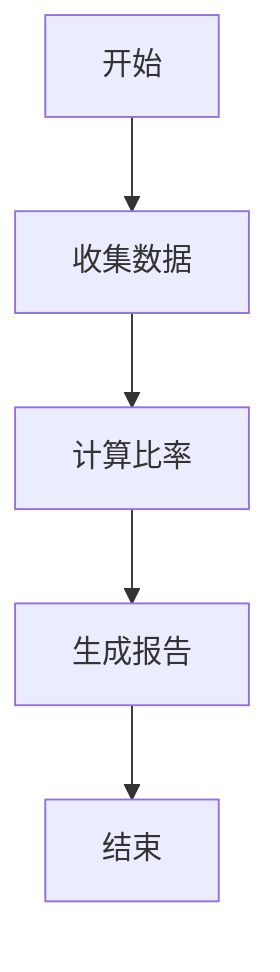
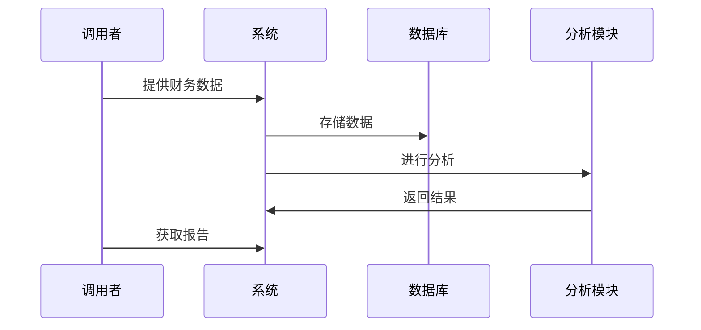
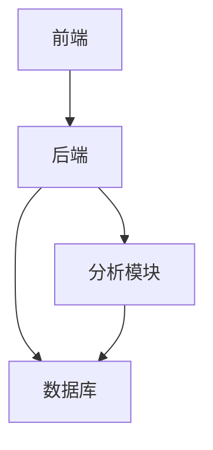

                 


# 塞思·卡拉曼的公司财务报表深度解析

## 关键词：财务报表分析、财务比率、现金流、资产、负债、利润

## 摘要：本文将深入解析公司财务报表的核心内容，包括资产负债表、利润表和现金流量表，通过详细的数学模型和实际案例，讲解如何通过财务比率分析评估公司的财务健康状况。文章还提供了一个完整的系统架构设计方案，帮助读者从整体上理解和分析公司财务报表。

---

## 第一部分：公司财务报表深度解析基础

### 第1章：财务报表概述与背景

#### 1.1 财务报表的基本概念

##### 1.1.1 财务报表的定义
财务报表是企业在一定会计期间内，通过会计记录和报告，反映企业财务状况、经营成果和现金流量的文件。它是企业内外部利益相关者（如投资者、债权人、管理层等）了解企业财务状况的重要工具。

##### 1.1.2 财务报表的重要性
财务报表的重要性体现在以下几个方面：
- **评估企业偿债能力**：通过分析资产负债表和现金流量表，可以判断企业是否能够偿还债务。
- **评估企业盈利能力**：通过利润表，可以了解企业在一定时期内的盈利情况。
- **支持投资决策**：投资者可以通过财务报表评估企业的投资价值。
- **支持信贷决策**：债权人可以通过财务报表评估企业的信用风险。

##### 1.1.3 财务报表的使用者
财务报表的主要使用者包括：
- **投资者**：评估企业的投资价值。
- **债权人**：评估企业的信用风险。
- **管理层**：用于内部管理决策。
- **监管机构**：监督企业合规性。

#### 1.2 财务报表的分类与结构

##### 1.2.1 资产负债表
资产负债表反映企业在某一特定日期的资产、负债和所有者权益的状况。其基本结构如下：
- **资产**：企业拥有的资源，包括流动资产（如现金、应收账款）和非流动资产（如固定资产、无形资产）。
- **负债**：企业需要偿还的债务，包括流动负债（如应付账款、短期借款）和非流动负债（如长期借款）。
- **所有者权益**：企业资产减去负债后的剩余部分，代表所有者对企业净资产的权益。

##### 1.2.2 利润表
利润表反映企业在一定会计期间内的收入和费用情况，以及最终的净利润。其基本结构如下：
- **收入**：企业在一定期间内通过销售商品或提供服务所获得的收入。
- **费用**：企业在经营过程中发生的各项支出，包括销售费用、管理费用、研发费用等。
- **利润**：收入减去费用后的净收益，包括营业利润、净利润等。

##### 1.2.3 现金流量表
现金流量表反映企业在一定会计期间内的现金流入和流出情况，分为经营活动、投资活动和筹资活动的现金流量。其基本结构如下：
- **经营活动现金流**：企业日常经营活动中产生的现金流。
- **投资活动现金流**：企业投资活动（如购买固定资产）产生的现金流。
- **筹资活动现金流**：企业通过借款或发行股票等方式筹集资金产生的现金流。

#### 1.3 财务报表的核心概念与联系

##### 1.3.1 财务报表的核心要素
- **资产**：企业拥有的资源，能够为企业带来经济利益。
- **负债**：企业需要偿还的债务，通常会影响企业的偿债能力。
- **所有者权益**：所有者对企业净资产的权益，反映了企业的资本实力。

##### 1.3.2 财务报表的相互关系
财务报表之间的关系可以用以下公式表示：
$$ \text{资产} = \text{负债} + \text{所有者权益} $$
$$ \text{收入} - \text{费用} = \text{净利润} $$
$$ \text{现金流入} - \text{现金流出} = \text{净现金流量} $$

这些公式展示了财务报表之间的内在联系，帮助企业从不同角度分析企业的财务状况。

---

### 第2章：财务报表的核心概念与联系

#### 2.1 财务报表的核心要素

##### 2.1.1 资产、负债、所有者权益
- **资产**：企业的资源，包括流动资产和非流动资产。
- **负债**：企业的债务，包括流动负债和非流动负债。
- **所有者权益**：资产减去负债后的剩余部分，反映了企业的资本实力。

##### 2.1.2 收入、费用、利润
- **收入**：企业在一定期间内通过销售商品或提供服务所获得的收入。
- **费用**：企业在经营过程中发生的各项支出。
- **利润**：收入减去费用后的净收益，包括营业利润、净利润等。

#### 2.2 财务报表的比率分析

##### 2.2.1 流动比率
流动比率是衡量企业短期偿债能力的重要指标，计算公式为：
$$ \text{流动比率} = \frac{\text{流动资产}}{\text{流动负债}} $$
流动比率越高，说明企业的短期偿债能力越强。

##### 2.2.2 速动比率
速动比率是流动比率的进一步细化，计算公式为：
$$ \text{速动比率} = \frac{\text{速动资产}}{\text{流动负债}} $$
速动资产包括现金、应收账款、存货等，速动比率越高，说明企业的短期偿债能力越强。

##### 2.2.3 净资产收益率
净资产收益率是衡量企业盈利能力的重要指标，计算公式为：
$$ \text{净资产收益率} = \frac{\text{净利润}}{\text{所有者权益}} $$
净资产收益率越高，说明企业的盈利能力越强。

---

### 第3章：财务报表分析的数学模型与公式

#### 3.1 常见财务比率的计算公式

##### 3.1.1 流动比率
$$ \text{流动比率} = \frac{\text{流动资产}}{\text{流动负债}} $$
- **分子**：流动资产包括现金、应收账款、存货等。
- **分母**：流动负债包括应付账款、短期借款等。

##### 3.1.2 速动比率
$$ \text{速动比率} = \frac{\text{速动资产}}{\text{流动负债}} $$
- **分子**：速动资产包括现金、应收账款、存货等。
- **分母**：流动负债包括应付账款、短期借款等。

##### 3.1.3 净资产收益率
$$ \text{净资产收益率} = \frac{\text{净利润}}{\text{所有者权益}} $$
- **分子**：净利润是企业一定期间内的净收益。
- **分母**：所有者权益是资产减去负债后的剩余部分。

#### 3.2 财务分析的流程图


---

### 第4章：系统架构与接口设计

#### 4.1 系统架构设计

##### 4.1.1 系统功能设计
- **数据收集**：从企业财务系统中收集财务数据。
- **数据处理**：对收集到的财务数据进行清洗和整理。
- **数据分析**：计算各项财务比率，生成分析报告。
- **结果呈现**：将分析结果以可视化的方式呈现给用户。

##### 4.1.2 系统架构图


#### 4.2 系统接口设计

##### 4.2.1 系统接口设计


---

### 第5章：项目实战与案例分析

#### 5.1 环境安装与数据收集

##### 5.1.1 安装Python与Pandas库
```bash
pip install pandas
```

##### 5.1.2 数据收集方法
- **数据来源**：从企业财务系统中导出财务报表数据。
- **数据格式**：通常为Excel或CSV格式。

#### 5.2 数据分析与实现

##### 5.2.1 编写Python代码进行数据分析
```python
import pandas as pd

# 假设df是财务数据 dataframe
def calculate_ratios(df):
    df['流动比率'] = df['流动资产'] / df['流动负债']
    df['速动比率'] = df['速动资产'] / df['流动负债']
    df['净资产收益率'] = df['净利润'] / df['所有者权益']
    return df

# 示例数据
data = {
    '流动资产': [100000, 150000],
    '流动负债': [50000, 75000],
    '速动资产': [80000, 120000],
    '净利润': [50000, 75000],
    '所有者权益': [200000, 300000]
}

df = pd.DataFrame(data)
result = calculate_ratios(df)
print(result)
```

##### 5.2.2 代码应用解读与分析
上述代码展示了如何使用Python和Pandas库进行财务比率分析。通过计算流动比率、速动比率和净资产收益率，可以帮助我们更好地理解企业的财务状况。

#### 5.3 案例分析与结果解读

##### 5.3.1 案例选

---

## 第二部分：系统架构与接口设计

### 第6章：系统架构设计方案

#### 6.1 系统功能设计

##### 6.1.1 领域模型mermaid类图


#### 6.2 系统架构设计

##### 6.2.1 系统架构图


#### 6.3 系统接口设计

##### 6.3.1 系统接口设计


---

## 第三部分：项目实战与案例分析

### 第7章：项目实战与案例分析

#### 7.1 环境安装与数据收集

##### 7.1.1 安装Python与Pandas库
```bash
pip install pandas
```

##### 7.1.2 数据收集方法
- **数据来源**：从企业财务系统中导出财务报表数据。
- **数据格式**：通常为Excel或CSV格式。

#### 7.2 数据分析与实现

##### 7.2.1 编写Python代码进行数据分析
```python
import pandas as pd

# 假设df是财务数据 dataframe
def calculate_ratios(df):
    df['流动比率'] = df['流动资产'] / df['流动负债']
    df['速动比率'] = df['速动资产'] / df['流动负债']
    df['净资产收益率'] = df['净利润'] / df['所有者权益']
    return df

# 示例数据
data = {
    '流动资产': [100000, 150000],
    '流动负债': [50000, 75000],
    '速动资产': [80000, 120000],
    '净利润': [50000, 75000],
    '所有者权益': [200000, 300000]
}

df = pd.DataFrame(data)
result = calculate_ratios(df)
print(result)
```

##### 7.2.2 代码应用解读与分析
上述代码展示了如何使用Python和Pandas库进行财务比率分析。通过计算流动比率、速动比率和净资产收益率，可以帮助我们更好地理解企业的财务状况。

#### 7.3 案例分析与结果解读

##### 7.3.1 案例选

---

## 第四部分：总结与展望

### 第8章：总结与展望

#### 8.1 最佳实践 tips
- **数据准确性**：确保财务数据的准确性是财务分析的基础。
- **模型选择**：选择合适的财务分析模型可以提高分析的准确性。
- **持续学习**：财务分析需要不断学习新的知识和技能。

#### 8.2 小结
通过本文的深入分析，我们了解了公司财务报表的核心内容，掌握了财务比率分析的方法，并通过实际案例展示了如何应用这些方法进行财务分析。

#### 8.3 注意事项
- **数据的及时性**：财务数据的及时性会影响分析结果的准确性。
- **模型的适用性**：不同的企业可能需要不同的财务分析模型。
- **结果的解释**：财务分析的结果需要结合企业的实际情况进行解释。

#### 8.4 拓展阅读
- **财务报表分析的高级方法**：如杜邦分析法、趋势分析法等。
- **数据可视化工具**：如Tableau、Power BI等，可以帮助更好地展示分析结果。

---

## 作者：AI天才研究院/AI Genius Institute & 禅与计算机程序设计艺术/Zen And The Art of Computer Programming

---

以上是《塞思·卡拉曼的公司财务报表深度解析》的完整大纲和内容，涵盖了从基础概念到系统架构设计再到项目实战的全过程。

