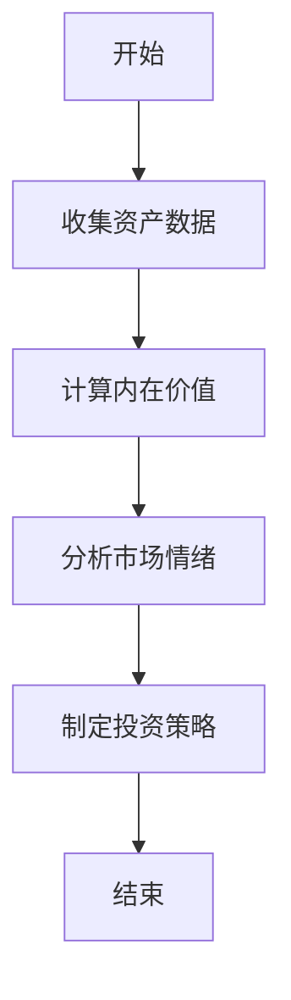
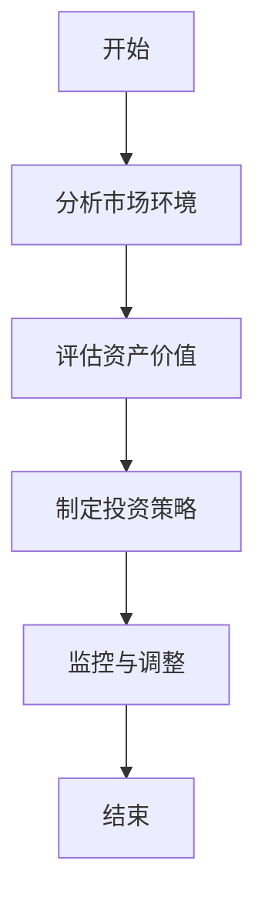
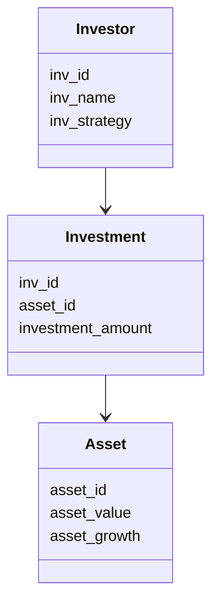

                 


```markdown
# 塞思·卡拉曼的特殊情况投资

> 关键词：塞思·卡拉曼, 特殊情况投资, 投资策略, 价值评估, 投资决策

> 摘要：本文深入分析了塞思·卡拉曼的特殊情况投资方法，探讨了其核心理念、数学模型以及实际应用。通过详细讲解投资决策的算法原理和系统架构，结合实际案例，展示了如何在复杂市场中制定有效的投资策略。

---

## 第一部分: 特殊情况投资的背景与核心理念

### 第1章: 特殊情况投资的定义与背景

#### 1.1 什么是特殊情况投资
- 1.1.1 定义：特殊情况投资是指在特定市场条件下，基于独特的价值评估和风险分析，寻找被市场低估的投资机会。
- 1.1.2 核心特征：
  - 低效市场环境
  - 非常规投资机会
  - 高度个性化分析

#### 1.2 塞思·卡拉曼投资方法的核心要素
- 1.2.1 投资决策的核心要素：
  - 市场情绪分析
  - 价值评估模型
  - 风险控制策略

### 第2章: 特殊情况投资的理论基础

#### 2.1 投资学基础
- 2.1.1 现代投资组合理论
- 2.1.2 市场有效性的假说
- 2.1.3 价值投资与成长投资的对比

#### 2.2 塞思·卡拉曼投资方法的哲学基础
- 2.2.1 市场波动与投资者心理
- 2.2.2 投资决策中的认知偏差
- 2.2.3 投资的长期视角

## 第二部分: 特殊情况投资的核心概念与联系

### 第3章: 核心概念的原理

#### 3.1 价值评估的数学模型
- 3.1.1 内在价值的计算公式
$$
\text{内在价值} = \frac{\text{现金流}}{\text{折现率}}
$$

#### 3.2 市场情绪的量化方法
- 3.2.1 市场情绪系数的计算
$$
\text{市场情绪系数} = \frac{\text{市场价}}{\text{内在价值}}
$$

#### 3.3 投资组合的优化策略
- 3.3.1 投资组合优化的数学模型
$$
\text{收益最大化} = \sum_{i=1}^{n} w_i \times r_i
$$
其中，$w_i$ 是投资比例，$r_i$ 是资产的预期收益。

### 第4章: 核心概念的属性特征对比

#### 4.1 不同投资方法的对比表格
| 投资方法       | 核心理念             | 适用场景             |
|----------------|----------------------|----------------------|
| 价值投资       | 买入低于内在价值的资产 | 市场低估时期         |
| 成长投资       | 投资高增长潜力的资产   | 高增长预期时期       |
| 特殊情况投资   | 利用市场低效寻找机会   | 非常规市场环境       |

#### 4.2 投资模型的ER实体关系图
```mermaid
erDiagram
    investor {
        inv_id
        inv_name
        inv_strategy
    }
    investment {
        inv_id
        asset_id
        investment_amount
    }
    asset {
        asset_id
        asset_value
        asset_growth
    }
```

## 第三部分: 投资模型的算法与数学模型

### 第5章: 投资模型的算法原理

#### 5.1 价值评估的算法流程


#### 5.2 投资决策的算法流程


### 第6章: 投资模型的数学公式与案例分析

#### 6.1 内在价值计算公式
$$
\text{内在价值} = \frac{\text{现金流}}{\text{折现率}}
$$

#### 6.2 投资组合优化的数学模型
$$
\text{收益最大化} = \sum_{i=1}^{n} w_i \times r_i
$$
其中，$w_i$ 是投资比例，$r_i$ 是资产的预期收益。

## 第四部分: 系统分析与架构设计

### 第7章: 系统功能设计

#### 7.1 系统功能模块
- 数据采集模块
- 价值评估模块
- 市场情绪分析模块
- 投资策略制定模块

#### 7.2 系统功能设计的ER类图


## 第五部分: 项目实战与最佳实践

### 第8章: 项目实战

#### 8.1 投资案例分析
- 案例1：可口可乐的投资分析
- 案例2：苹果的投资分析

#### 8.2 投资策略的制定与调整
- 数据收集与分析
- 价值评估与市场情绪分析
- 投资决策与风险控制

### 第9章: 最佳实践

#### 9.1 投资策略的小结
- 保持长期视角
- 灵活调整策略
- 严格控制风险

#### 9.2 投资决策的注意事项
- 避免过度自信
- 定期复盘与调整
- 保持独立思考

#### 9.3 拓展阅读
- 塞思·卡拉曼的经典著作
- 相关投资策略的深入研究
- 市场情绪分析的最新进展

---

# 结语

塞思·卡拉曼的特殊情况投资方法为我们提供了一种独特的视角，帮助我们在复杂多变的市场中找到投资机会。通过本文的详细分析，读者可以更好地理解这一方法的核心理念和实际应用。

---

# 作者：AI天才研究院/AI Genius Institute & 禅与计算机程序设计艺术 /Zen And The Art of Computer Programming
```

