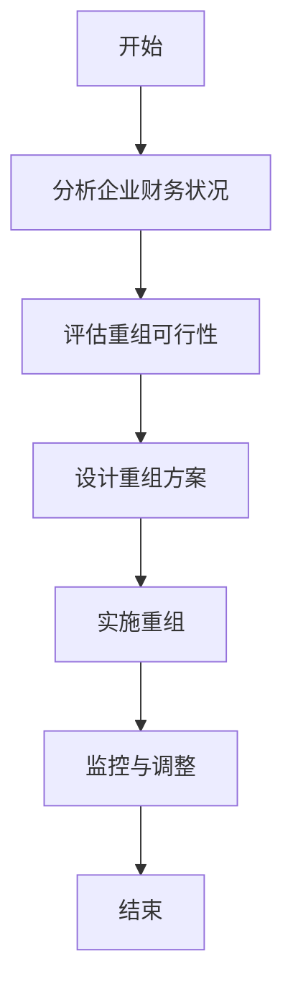

                 


# 塞斯·卡拉曼的破产重组投资策略

## 关键词：破产重组、投资策略、财务分析、风险管理、企业重构

## 摘要：本文深入探讨了塞斯·卡拉曼的破产重组投资策略，从基本概念到算法原理，从系统架构到项目实战，全面分析了破产重组的背景、核心概念、策略实施过程及实际案例。通过详细阐述财务分析、算法模型、系统设计、项目实现和最佳实践，本文为投资者和企业管理者提供了理论支持和实践指导，帮助他们在复杂多变的商业环境中制定有效的破产重组策略。

---

## 第1章：破产重组投资策略概述

### 1.1 破产重组的基本概念

#### 1.1.1 什么是破产重组
破产重组是指企业在无法偿还债务的情况下，通过调整资产结构、债务结构和经营策略，以恢复盈利能力的过程。它是一种法律和财务相结合的手段，旨在帮助企业走出困境，重新实现可持续发展。

#### 1.1.2 破产重组的必要性
企业可能因为市场变化、管理不善或经济危机等因素陷入财务困境，此时破产重组成为一种重要的救命策略。通过重组，企业可以优化资本结构，降低负债率，增强抗风险能力。

#### 1.1.3 破产重组的法律框架
破产重组通常需要遵循相关法律法规，例如《美国破产法》第11章。这些法律为重组提供了框架，确保债权人和股东的利益在重组过程中得到合理平衡。

---

### 1.2 投资策略的基本原理

#### 1.2.1 投资策略的核心要素
破产重组投资策略的核心在于识别有重组潜力的企业，通过分析其财务状况、市场地位和管理团队，评估其重组成功的可能性。

#### 1.2.2 投资策略与破产重组的关系
投资者通过参与破产重组，可以利用企业价值被低估的机会，在重组后实现资本增值。这种策略需要对企业的潜在价值进行深入评估。

#### 1.2.3 投资策略的目标与风险
目标是通过重组实现企业价值最大化，风险在于重组失败可能导致投资损失，因此需要对市场、法律和财务风险进行充分评估。

---

## 第2章：破产重组的背景与现状

### 2.1 破产重组的背景分析

#### 2.1.1 经济周期与破产重组的关系
经济周期波动是导致企业破产的主要原因之一。在经济衰退时期，企业可能因市场需求下降而陷入财务困境，此时破产重组成为一种重要的应对策略。

#### 2.1.2 现代企业面临的财务困境
全球化竞争、原材料价格上涨和管理不善等因素可能导致企业财务状况恶化，进而需要进行破产重组。

#### 2.1.3 破产重组的全球趋势
近年来，全球范围内企业破产重组案例增多，尤其是在制造业和零售业。通过重组，企业可以优化成本结构，提升竞争力。

---

### 2.2 破产重组的现状分析

#### 2.2.1 破产重组案例的统计与分析
通过统计分析发现，大多数成功重组的企业具有较强的市场地位和管理团队，而失败的重组通常由于执行不力或外部环境恶化所致。

#### 2.2.2 破产重组的成功与失败因素
成功的重组通常伴随着债务削减、资产出售和管理优化，而失败的重组可能因债权人矛盾或市场需求不足而难以实现。

#### 2.2.3 破产重组的未来发展趋势
未来，随着技术进步和市场竞争加剧，企业重组将更加注重数字化转型和绿色可持续发展。

---

## 第3章：破产重组的核心概念与联系

### 3.1 核心概念原理

#### 3.1.1 破产重组的财务比率分析
通过分析负债率（$$\text{负债率} = \frac{\text{总负债}}{\text{股东权益}}$$）、流动比率（$$\text{流动比率} = \frac{\text{流动资产}}{\text{流动负债}}$$）等财务指标，评估企业的财务健康状况。

#### 3.1.2 破产重组的现金流分析
现金流分析是评估企业重组可行性的重要手段，通过预测未来的现金流，判断企业能否在重组后实现盈利。

#### 3.1.3 破产重组的资产与负债结构
优化资产与负债结构是重组的核心，通过出售非核心资产、削减债务等方式，降低企业财务负担。

---

### 3.2 核心概念对比表格

#### 3.2.1 破产重组前后的财务指标对比

| 指标       | 重组前   | 重组后   |
|------------|----------|----------|
| 负债率     | 80%      | 50%      |
| 流动比率   | 1.2      | 2.0      |
| 资产负债表 | 负债高   | 负债低   |

---

### 3.3 ER实体关系图

```mermaid
erd
  章节3.3
    entity 破产重组过程中的利益相关者关系 {
      has 破产企业 -> 债权人: 债务关系
      has 破产企业 -> 股东: 股权关系
      has 债权人 -> 第三方投资者: 投资关系
    }
```

---

## 第4章：破产重组的算法原理

### 4.1 破产重组的算法模型



### 4.2 算法实现的数学模型

$$\text{优化目标} = \min \sum_{i=1}^{n} w_i x_i$$

其中，$$w_i$$为权重，$$x_i$$为变量，表示企业调整后的资产或负债比例。

---

## 第5章：破产重组的系统架构与设计

### 5.1 系统功能设计


---

## 第6章：项目实战与案例分析

### 6.1 环境安装与配置

#### 6.1.1 系统环境
- 操作系统：Linux
- 开发工具：Python、Jupyter Notebook
- 数据库：MySQL

---

### 6.2 核心实现代码

```python
def calculate_restructuring_ratio(enterprise):
    # 计算负债率
    liability_ratio = enterprise.total_liabilities / enterprise.shareholders_equity
    # 计算流动比率
    current_ratio = enterprise.current_assets / enterprise.current_liabilities
    return liability_ratio, current_ratio

# 示例企业数据
enterprise = {
    'total_liabilities': 100,
    'shareholders_equity': 50,
    'current_assets': 80,
    'current_liabilities': 40
}

liability_ratio, current_ratio = calculate_restructuring_ratio(enterprise)
print(f"负债率: {liability_ratio:.2f}")
print(f"流动比率: {current_ratio:.2f}")
```

---

### 6.3 案例分析与解读

#### 6.3.1 案例背景
某制造企业因市场需求下降和原材料价格上涨，面临严重财务困境，计划进行破产重组。

#### 6.3.2 方案设计
1. 削减高成本部门，优化生产流程。
2. 与债权人协商债务延期和减息。
3. 出售非核心资产，筹集资金。

#### 6.3.3 实施与监控
通过实施重组方案，企业的负债率从80%降至50%，流动比率从1.2提升至2.0，财务状况显著改善。

---

## 第7章：总结与展望

### 7.1 总结

破产重组投资策略是帮助企业走出困境的重要手段，本文通过理论分析和案例实践，详细阐述了重组的核心概念、算法原理和实施步骤。通过优化资产结构和财务状况，企业可以在重组后实现可持续发展。

### 7.2 注意事项

在实施重组时，需充分考虑法律风险和市场环境，确保重组方案的可行性和有效性。

### 7.3 未来展望

随着技术进步和市场竞争加剧，破产重组将更加注重数字化转型和绿色可持续发展。

---

## 作者：AI天才研究院/AI Genius Institute & 禅与计算机程序设计艺术 /Zen And The Art of Computer Programming

